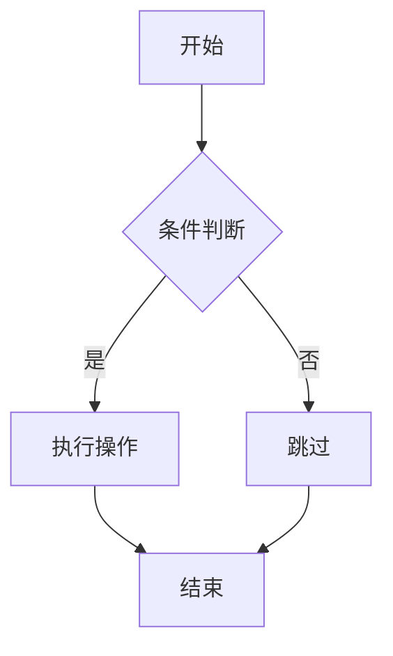

# 文档规则

本文件定义文档组织、图表和说明规范。

## 渐进式披露原则

AI 助手应按以下层级组织信息：

```text
层级 1: 项目概述
    |-- 层级 2: 模块概述
        |-- 层级 3: 类概述
            |-- 层级 4: 方法详情
                |-- 层级 5: 实现细节
```

规则：

1. 先提供整体架构，不过早深入细节。
2. 用户询问时再展开细节。
3. 复杂概念优先用示例说明。
4. 文档中的关系、流程和架构图使用 Mermaid。

## 文档图表规范

所有项目文档中的图表必须使用 Mermaid 格式。

核心规则：

1. 终端输出用 ASCII，文档用 Mermaid。
2. 节点数不超过 15，层级不超过 4。
3. 使用中文标签，添加 `subgraph` 分组。
4. 节点文本用双引号包裹，防止括号、空格等特殊字符被误解析。

示例：



## 图表类型选择

### 常用类型
| 场景 | 类型 |
|------|------|
| 流程、架构、关系 | `flowchart` |
| 系统交互、API 调用 | `sequenceDiagram` |
| 状态流转 | `stateDiagram-v2` |
| UML 类结构 | `classDiagram` |
| 数据库 ER 图 | `erDiagram` |
| 层级结构 | `mindmap` |
| 项目进度 | `gantt` |
| 占比分布 | `pie` |

### 扩展类型

| 场景 | 类型 |
|------|------|
| 用户旅程/体验流程 | `journey` |
| Git分支流程 | `gitGraph` |
| 软件架构(C4模型) | `C4Context` / `C4Container` / `C4Component` |
| 历史事件/里程碑 | `timeline` |
| 集合关系/交集 | `venn` |
| 需求管理/追溯 | `requirementDiagram` |
| 流量流向/能量传递 | `sankey` |
| 折线图/柱状图 | `xychart` |
| 矩阵分析/优先级 | `quadrantChart` |
| 系统模块关系 | `block` |
| 多维度对比/能力评估 | `radar` |
| 层级占比/空间分布 | `treemap` |

### 不建议使用的类型

以下 Mermaid 类型渲染兼容性较差，建议使用 ASCII 替代：

| 场景 | 类型 | 替代方案 |
|------|------|----------|
| 网络协议/数据帧 | ~~`packet`~~ | ASCII 表格 |

### 参考资料

- 官方文档: https://mermaid.js.org/intro/
- 在线编辑: https://mermaid.live/

## 文档语言

团队主要使用中文协作。注释、文档和提交信息优先使用中文，除非涉及 API 名称、标准术语或外部英文原文。
