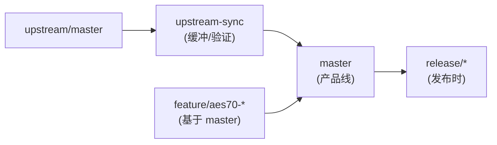

# Fork 维护规则

本文件定义本仓库作为上游 `bondagit/aes67-linux-daemon` 长期产品 fork 的分支、上游同步、回上游与结构维护规范。目标是保持 AES70 控制协议工作的同时，上游同步始终可行。

## 分支规则

按职责分离使用不同分支：

- `master`（或 `main`）：本 fork 的稳定产品线。
- `upstream-sync`：上游合并或 rebase 的临时集成分支。
- `feature/aes70-*`：AES70 控制协议的特性分支。
- `release/*`：已交付版本的稳定化分支。

分支关系：



规则：

1. 特性分支必须基于 `master` 切出，**不得**从 `upstream-sync` 切出，避免把未验证的上游内容带入特性。
2. **不得**将上游直接合并进产品线。先在 `upstream-sync` 合并或 rebase 上游，解冲突，跑无硬件构建路径验证，再把验证后的结果合并进 `master`。
3. `upstream-sync` 是临时分支，同步完成并入 `master` 后即可删除；下次同步时重新创建。

## 上游同步规则

同步时机：上游活跃时、每次产品发布前、大型 AES70 集成工作前。上游安静时，发布期同步通常足够。

前置：必须先配置上游 remote（一次性）：

```bash
git remote add upstream https://github.com/bondagit/aes67-linux-daemon.git
git fetch upstream
```

同步流程：

```bash
git checkout -B upstream-sync master      # 从产品线切出集成分支
git merge upstream/master                 # 或 git rebase upstream/master
# 解冲突
./buildfake.sh                            # 无硬件构建验证
# 跑 daemon Boost.Test 套件（当前构建状态允许时）
git checkout master && git merge upstream-sync  # 验证通过后并入产品线
```

每次同步保留一条简短笔记，记录：上游 commit、冲突点、本地决策、验证命令。

## 回上游贡献规则

若缺陷对原始项目通用，准备一个最小化的上游 issue 或 PR。补丁保持最小，**不得**包含 AES70 产品行为、客户特定集成、本地目录或构建重构。

产品特定、AES70 特定、客户特定、或与本地打包部署强耦合的改动，仅保留在本 fork。

## 结构规则

本 fork 可调整目录布局和构建脚本，但上游拥有的区域应保持可识别，除非有充分理由迁移。优先新增模块、CMake 选项和包装脚本，而非重写上游布局。

AES70 工作使用模块化选项 `WITH_OCA`（默认 `OFF`），实现隔离在独立源文件（`daemon/oca/`）。这使上游同步更小、回上游无关修复更容易。

> 注：`WITH_OCA` 与 `WITH_AES70` 指同一件事（AES70 是标准，OCA 是其控制协议），本仓库统一使用 `WITH_OCA`。

当结构或构建行为变化时，更新构建文档、源码分发说明和 `LICENSE_NOTICES.MD`，使 GPL/LGPL 源码交付义务保持清晰。
