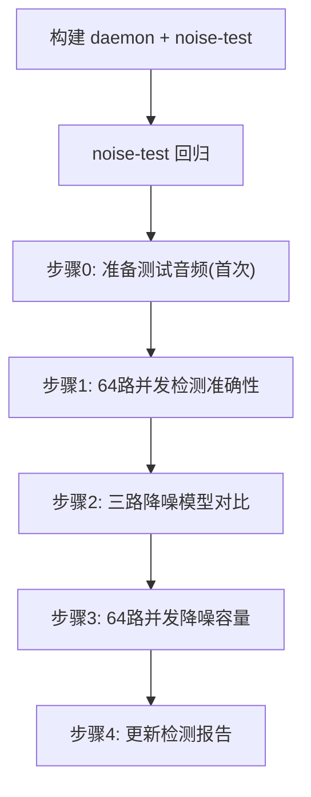

# 噪声模块准确性与性能验证流程

完整跑一遍噪声模块（L1 规则式 + L2 Bark 模板 + L3 YAMNet）的准确性验证与
并发性能测试，结果同步到 `docs/noise-test-report/noise-detection-report.md`。

所有测试数据与脚本持久化在 `noise-testset/`（已在 `.gitignore`，本地复用），
不依赖音频硬件或内核模块（FAKE_DRIVER 模式）。

## 前置条件

- 已 worktree checkout `feature/noise` 分支（含 `daemon/noise/` 源码）
- 子模块已 init：`git submodule update --init --recursive`
- 构建依赖：`./debian-packages.sh`（含 onnxruntime、speexdsp、faac）
- YAMNet 模型：`noise_models/yamnet/{yamnet_3s.onnx, yamnet_class_map.csv}`
- ESC-50 数据集（仅首次需要，见步骤 0）

## 构建镜像说明

测试涉及两个二进制，构建配置：

- **生产 daemon**（FAKE_DRIVER，链 session_manager.cpp）：
  `cmake -B daemon/build -DFAKE_DRIVER=ON -DWITH_NOISE=ON -DWITH_STREAMER=ON -DWITH_AVAHI=OFF -DENABLE_TESTS=ON -DCMAKE_EXPORT_COMPILE_COMMANDS=ON daemon`
  `cmake --build daemon/build -j2 --target aes67-daemon`
- **noise-test**（单元测试，不链 session_manager.cpp）：
  `cmake --build daemon/build -j2 --target noise-test`

> 编译并行度限 `-j2`，避免 ONNX/Boost 大文件全核并行爆内存。

## 流程总览



## 步骤 0：准备测试音频（仅首次）

ESC-50 经 git clone 下载（GitHub 直连/zip 常截断，用 ghfast.top 代理）。

```bash
cd noise-testset
# ESC-50 clone（若 ESC-50-clone/ 不存在）
[ -d ESC-50-clone ] || git clone --depth 1 \
  https://ghfast.top/https://github.com/karolpiczak/ESC-50.git ESC-50-clone
# 选 64 文件转 48kHz mono s16（满足 parse_wav_pcm16_48k_mono 硬约束）
cd concurrent64 && bash prepare_audio.sh
```

产出：`concurrent64/audio/ch00..ch63.wav` + `manifest.csv`（channel→ESC-50
类别 ground truth）。

三路降噪对比音频（首次生成）：

```bash
cd noise-testset/denoise_compare
ffmpeg -f lavfi -i "anoisesrc=color=white:duration=10:sample_rate=48000:amplitude=0.3" -ac 1 -sample_fmt s16 white_10s.wav
ffmpeg -i ../VoiceBank-DEMAND/noisy_testset_wav/p232_023.wav -ar 48000 -ac 1 -sample_fmt s16 noisy_speech_10s.wav
```

## 步骤 1：64 路并发检测准确性

验证 channel_map 解复用 + L1/L2/L3 全链路，ESC-50 ground truth 对比。

```bash
cd noise-testset/concurrent64
bash run_verify.sh runall
```

`runall` = 启 daemon → 建 source + 64 sink（各 `map:[N]`）+ 64 sensor →
等 L3 累积（~12s）→ 批量查询 → 汇总统计。

**验证标准**：
- 64/64 路 score 完全独立（不同 score 数 = 64）
- L3 覆盖 21+ 种类型，与 ESC-50 ground truth 吻合
  （rain→Water, siren→Siren, vacuum_cleaner→Jet engine 等）
- 无崩溃，3 轮查询稳定

**独立子命令**：`run_verify.sh {start|setup|query|summarize|stop}`
（start/stop 控 daemon，setup 建 sink/sensor，query 采集，summarize 统计）。

## 步骤 2：三路降噪模型对比

同一含噪音频，3 个 sensor 各配 rnnoise/dtln/deepfilternet，对比降噪量+L1+L3。

```bash
cd noise-testset/denoise_compare
bash run_compare.sh white_10s.wav white        # 白噪
bash run_compare.sh noisy_speech_10s.wav "含噪语音"  # 含噪语音
```

**验证标准**：
- 白噪：RNNoise 41-44dB > DTLN 30-39dB > DFN 12-13dB
- 三路 L3 相同（L3 分析原始音频，与 plugin 无关——预期行为）
- `plugin_degraded=false`

## 步骤 3：64 路并发降噪容量

在同一 64 路检测基础上，全部切同一 plugin，测 CPU/RSS/degraded 上限。

```bash
cd noise-testset/concurrent64
bash run_denoise_capacity.sh rnnoise      # 最轻
bash run_denoise_capacity.sh dtln
bash run_denoise_capacity.sh deepfilternet # 最重
```

逐档 N=4→8→16→32→48→64 递增，每档测 CPU%/RSS/`plugin_degraded`/xrun。

**验证标准**（16 核环境实测）：

| 模式 | CPU | RSS | degraded |
|------|-----|-----|----------|
| 仅检测 | ~383%（24%） | ~278MB | 0 |
| +RNNoise 64路 | ~652%（41%） | ~298MB | 0 |
| +DTLN 64路 | ~747%（47%） | ~661MB | 0 |
| +DeepFilterNet 64路 | ~855%（53%） | ~1157MB | 0 |

三 plugin 64 路全开均 0 degraded、0 xrun。瓶颈是内存（DFN 每路 ~14MB
ONNX session）而非 CPU。

## 步骤 4：更新检测报告

将实测数据同步到 `docs/noise-test-report/noise-detection-report.md`，各章节
对应关系：

| 报告章节 | 对应步骤 |
|----------|----------|
| §1 测试环境 | 环境/CPU/模型路径 |
| §2 三路降噪对比 | 步骤 2 |
| §4 64 路并发验证 | 步骤 1 |
| §5 L3 YAMNet 性能基准 | 步骤 1 中的 classify 耗时 |
| §6 并发能力总结 | 步骤 3 |

提交规范：`docs(noise): 检测报告 §X ... 更新`，scope 用 `docs`。

## 注意事项

- daemon 用的端口：并发检测 9999，降噪对比 9998。跑前 `pkill -x aes67-daemon`
  确保无残留实例（端口冲突会 fatal "bind: Address already in use"）。
- `run_verify.sh` 的 sink 创建用 `use_sdp:true` + 内嵌 source 0 的 SDP（FAKE
  模式不实际接收 RTP，仅需 sink 存在以使 `get_sink_channel_map` 查到 map）。
- L3 每 3s 触发一次（300 帧中 1 帧），需等 ~12s 才能覆盖 64 路首次触发。
- 真实硬件验证需加载 LKM + 设 `interface_name` 为真实网卡，本 skill 仅覆盖
  FAKE_DRIVER 路径（控制平面验证，与真实场景行为一致）。
