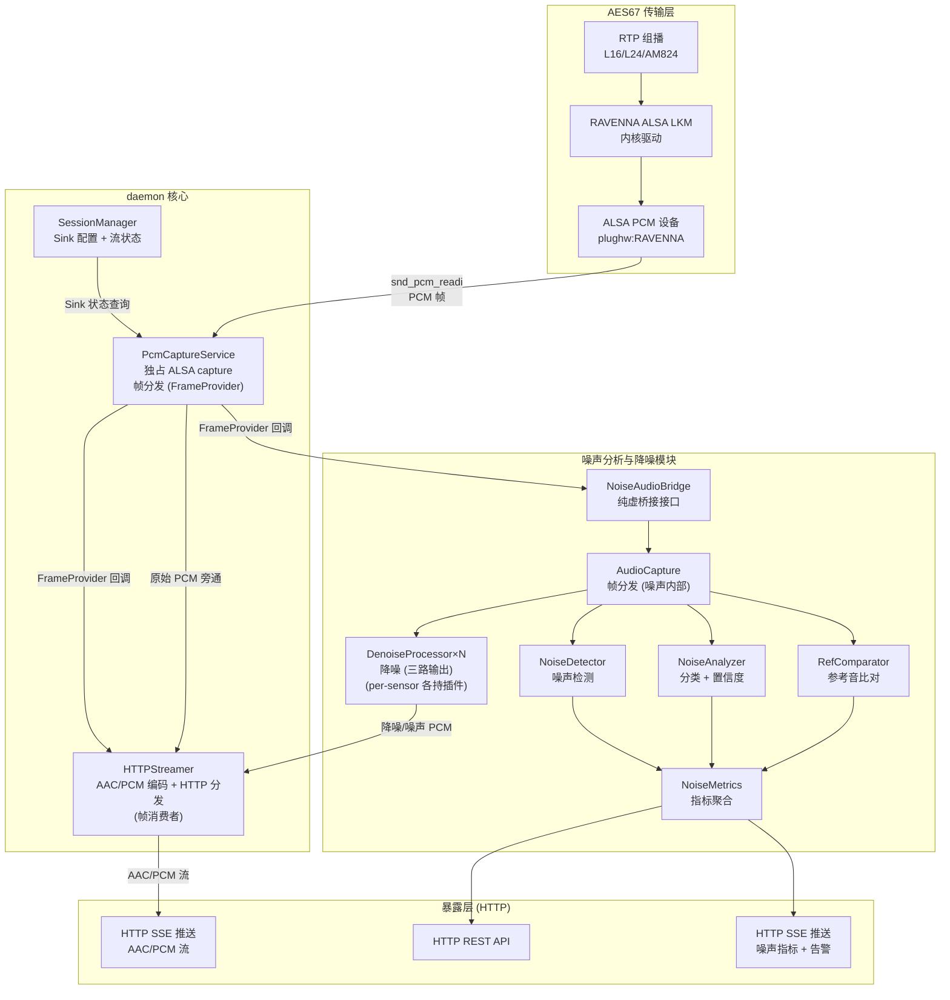
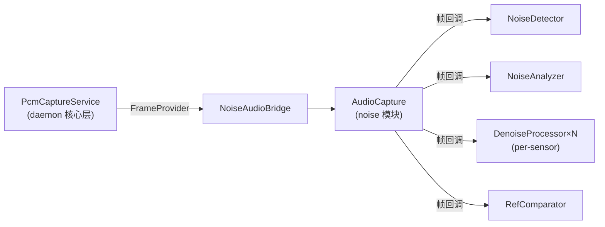
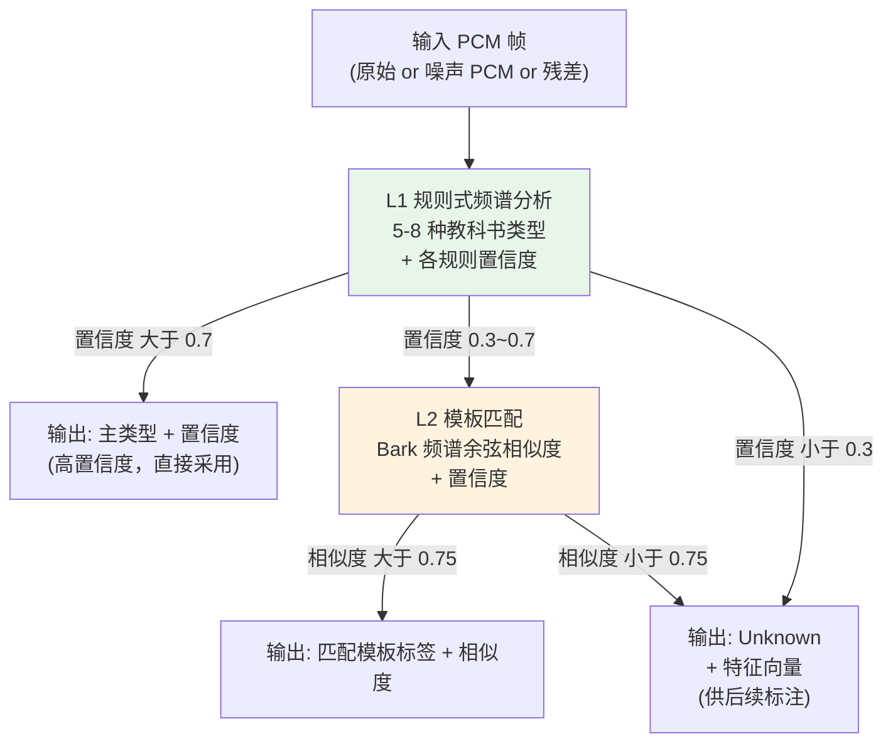
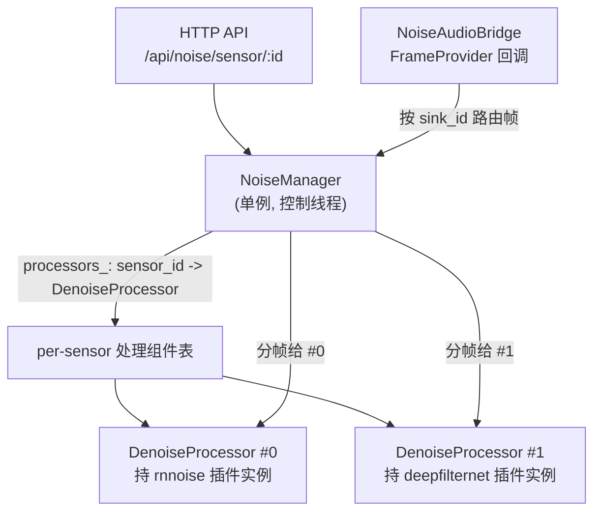
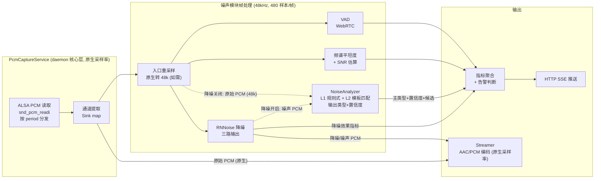

# 噪声分析与降噪系统 — 架构设计

> **版本**: v0.1-draft
> **日期**: 2026-07-14
> **状态**: 初稿，待团队讨论
> **基于**: aes67-linux-daemon (feature/noise 分支，HTTP-only，不扩展 OCA) + RNNoise

---

## 0. 术语与概念

> 本节汇总系统设计中涉及的专业术语、常见噪声类型和应用场景，供团队成员快速建立共识。

### 0.1 核心术语

| 术语 | 全称 | 通俗解释 |
|------|------|---------|
| **FFT** | Fast Fourier Transform | 快速傅里叶变换。将时域音频信号转换为频域频谱，是所有频谱分析的基础操作。本系统用 512 点 FFT，将 480 个采样点分解为 257 个频率分量的能量分布 |
| **PCM** | Pulse Code Modulation | 脉冲编码调制，即原始数字音频的表示方式（如 16-bit 整数序列）。ALSA 设备输出、RNNoise 输入均为 PCM |
| **AAC** | Advanced Audio Coding | 高级音频编码，一种有损压缩音频格式，MP3 的继任者，同等码率下音质更优。本 daemon 的 Streamer 模块通过 faac 库将采集的 PCM 编码为 MPEG-4 AAC-LC，以 ADTS 帧形式经 HTTP 分发（`audio/aac`），用于低带宽下的实时音频监听 |
| **VAD** | Voice Activity Detection | 语音活动检测。判断当前音频帧是"有人在说话"还是"静音/纯噪声"。VAD=1 表示语音，VAD=0 表示非语音。非语音段是噪声分析的重点区间 |
| **SNR** | Signal-to-Noise Ratio | 信噪比，信号功率与噪声功率的比值，单位 dB。SNR 越高音质越好：>30dB 几乎无感知噪声，20~30dB 轻微噪声，<20dB 噪声明显，<10dB 严重影响可懂度 |
| **dBFS** | Decibels Relative to Full Scale | 相对于数字满幅的分贝值。0 dBFS = 最大不失真电平，-60 dBFS = 很小的信号。广播正常节目电平约 -20 dBFS，噪声底约 -60~-80 dBFS |
| **LUFS** | Loudness Units Relative to Full Scale | EBU R128 定义的响度单位，考虑人耳对不同频率的感知加权。与 dBFS 的区别：LUFS 是"听起来多响"，dBFS 是"电平多高" |
| **MFCC** | Mel-Frequency Cepstral Coefficients | 梅尔频率倒谱系数。一种从音频中提取的特征向量（通常 13 维），广泛用于语音识别。对噪声鲁棒，本系统用于参考比对算法的时间对齐 |
| **Bark 频带** | Bark Scale Critical Bands | 人耳听觉的临界频带划分，将 0~20kHz 分为约 24 个频带（低频窄、高频宽），符合人耳频率分辨率特性。本系统用 32 频带做噪声频谱分析 |
| **频谱平坦度** | Spectral Flatness (Wiener Entropy) | 频域能量分布的"平坦程度"，值域 [0, 1]。接近 1 = 能量均匀分布 = 白噪声；接近 0 = 能量集中在少数频率 = 纯音/语音。是区分噪声和语音的关键指标 |
| **频谱质心** | Spectral Centroid | 频谱能量加权平均频率，表征声音的"亮度"。白噪声质心偏高（~8kHz），工频哼声质心偏低（~150Hz） |
| **自适应滤波器** | Adaptive Filter (LMS/NLMS) | 一种能自动调整系数的数字滤波器，用于"学习"信号经过的传输信道特性。本系统用它从比对音中分离出参考音分量（线性失真）和残差（加性噪声） |
| **GRU** | Gated Recurrent Unit | 门控循环单元，一种循环神经网络结构。RNNoise 内部使用 3 层 GRU 处理时序音频特征，输出每频带的降噪增益和 VAD 概率 |
| **ONNX** | Open Neural Network Exchange | 开放神经网络交换格式。将 PyTorch/TensorFlow 训练的模型导出为标准中间格式（.onnx 文件），与训练框架解耦，可用 ONNX Runtime 在 C++ 中高效推理。本系统两处用到：降噪插件加载 DTLN（model_1/2.onnx）和 DeepFilterNet（enc/df_dec/erb_dec.onnx）；Phase 2 ML 噪声分类加载 PANNs/VGGish。两个原本是 Python 的降噪模型经此格式可在 C++ daemon 直接运行，无需 Python 运行时 |
| **TFLite** | TensorFlow Lite | TensorFlow 的轻量推理引擎，面向移动/嵌入式。DTLN 仓库除 ONNX 外还导出了 `.tflite` 模型（含量化版 `model_quant_*.tflite`，体积更小、推理更快但精度略降）。作为 DTLN 的备选推理后端，资源受限场景可替代 ONNX Runtime |
| **Rust libDF** | libDF (DeepFilterNet library) | DeepFilterNet 用 Rust 实现的原生推理库，封装了 STFT + 三子图协作 + ISTFT 全流程，对外暴露 `process_frame(input, output)` 高层 API，C++ 经 cbindgen 生成的 C 头调用。相比走 ONNX 自行编排三子图，libDF 性能更好、逻辑现成，但需 Rust 工具链或预编译库。本系统默认走 ONNX 路径统一后端，libDF 作为 DeepFilterNet 的备选优化路径 |
| **SSE** | Server-Sent Events | 服务器发送事件，基于 HTTP 的服务器到客户端单向数据流推送。客户端通过 `EventSource` 建立 HTTP 长连接，服务器持续推送数据块。本系统用它实时推送噪声指标快照和降噪后 PCM 音频流到 Web UI，相比轮询更省资源，适合实时监测场景 |
| **Sink / Source** | - | AES67 术语。Source = 发送端（Talker），向外发送 RTP 组播音频；Sink = 接收端（Listener），接收远端 RTP 音频。本系统对 Sink 接收的音频做噪声分析 |
| **PESQ** | Perceptual Evaluation of Speech Quality | ITU-T P.862 定义的语音质量客观评估指标，范围 -0.5~4.5（映射到 MOS 主观评分）。需**有干净参考音**做对比，全段离线处理，**不适合实时**。本系统用于 A/B 对比实验阶段离线评估各降噪插件的语音质量（见降噪插件文档 §7.2） |
| **STOI** | Short-Time Objective Intelligibility | 短时客观可懂度，范围 0~1，衡量降噪后语音的可懂程度。同样需参考音、离线计算。本系统实验阶段用于评估降噪是否过度损伤了语音可懂度（过度降噪反而听不清） |
| **SI-SDR** | Scale-Invariant Signal-to-Distortion Ratio | 尺度不变信号失真比，单位 dB，衡量降噪输出相对于干净参考的失真量（含残留噪声和语音失真两部分）。需参考音。本系统实验阶段用于综合量化降噪质量，SI-SDR 越高失真越小 |

### 0.2 关键数值常识

| 数值 | 含义 |
|------|------|
| 48 kHz | 本系统基准采样率（RNNoise 固定要求），每秒 48000 个采样点 |
| 480 样本/帧 | RNNoise 帧长 = 48000 Hz × 10 ms = 480，即每 10 毫秒处理一帧 |
| 10 ms | 一帧时长，也是降噪模式引入的额外延迟 |
| 32 频带 | Bark 频带数量，用于频谱分析和模板匹配 |
| 2 s | 噪声特征分析窗口，足够捕捉噪声的统计特性 |
| -60 dBFS | 典型良好音频链路的噪声底 |
| -30 dBFS | 噪声告警阈值（超过此值噪声可闻） |

### 0.3 常见噪声类型

| 噪声类型 | 听感描述 | 频谱特征 | 典型来源 | 检测方法 |
|---------|---------|---------|---------|---------|
| **白噪声** | "沙沙"声，类似空台收音机 | 频谱平坦，各频率能量近似均匀 | 热噪声、DAC 底噪、量化噪声 | 频谱平坦度 > 0.7 |
| **粉红噪声** | 比"沙沙"更闷，低频更丰富 | 能量按 1/f 衰减，频谱斜率约 -3dB/oct | 模拟电路 1/f 噪声、电子管底噪 | 频谱斜率 ≈ -3dB/oct |
| **50Hz 工频哼声** | 低沉的"嗡嗡"声 | 50Hz 及其倍频（100/150/200Hz…）有明显窄带峰值 | 接地环路、电源滤波不良、线缆屏蔽不足 | 50Hz 倍频峰值检测 |
| **60Hz 工频哼声** | 同上，频率为 60Hz 倍频 | 60Hz 及其倍频有峰值 | 北美 60Hz 电力系统同上 | 60Hz 倍频峰值检测 |
| **脉冲噪声** | 短促的"咔嗒"声或"噼啪"声 | 宽带瞬态，时域能量突变 | 继电器切换、静电放电、数字时钟跳变 | 短时能量突变 > 6σ |
| **宽带噪声** | 介于白噪声和语音之间的"嘶嘶"声 | 频谱部分平坦但非完全均匀 | 风扇气流、空调出风、多个噪声源叠加 | 频谱平坦度 0.3~0.7 |
| **数字时钟抖动** | 高频细碎噪声 | 高频段（>8kHz）有周期性毛刺 | 时钟 PLL 锁相不稳、采样时钟抖动 | 高频段周期性检测 |
| **射频干扰 (RFI)** | 可能为嗡声或周期性噪声 | 特定频段有窄带干扰 | 附近无线电发射、EMI 拾取 | 频段窄带能量异常 |
| **削波失真** | 声音发劈、发硬 | 信号达到满幅，波形被截平 | 增益过高、数字溢出 | 采样值触及 ±max 的比例 |
| **空调/风扇机械噪声** | 低频隆隆声或呼呼声 | 低频有宽峰 + 宽带底噪 | 机房空调、设备风扇 | 频谱模板匹配 |
| **串扰 (Crosstalk)** | 隐约听到另一通道的内容 | 相邻通道信号泄漏到当前通道 | 线缆间电容/电感耦合、PCB 布线 | 通道间相关性分析 |

### 0.4 典型应用场景

```mermaid
flowchart TB
    subgraph 场景1["场景 1：广播主备链路噪声监测"]
        S1_M["主链路 Sink<br/>(参考音)"]
        S1_B["备链路 Sink<br/>(比对音)"]
        S1_R["RefComparator<br/>参考比对"]
        S1_M --> S1_R
        S1_B --> S1_R
        S1_R -->|噪声级 + 相似度| S1_ALERT["告警：备链路噪声过高<br/>或主备内容不一致"]
    end

    subgraph 场景2["场景 2：单链路接收噪声检测"]
        S2_S["远端 AES67 Source"]
        S2_K["本地 Sink"]
        S2_D["NoiseDetector + Analyzer<br/>盲检测"]
        S2_S -->|RTP| S2_K
        S2_K --> S2_D
        S2_D -->|噪声类型 + 量级| S2_UI["Web UI<br/>实时显示噪声状况"]
    end

    subgraph 场景3["场景 3：实时降噪输出"]
        S3_IN["含噪音频 Sink"]
        S3_RNN["RNNoise 降噪"]
        S3_OUT["干净音频输出"]
        S3_IN --> S3_RNN --> S3_OUT
    end

    subgraph 场景4["场景 4：自定义噪声录入与识别"]
        S4_REC["运维录入噪声示例<br/>（空调/风扇/电源…）"]
        S4_DB["模板库"]
        S4_MATCH["实时模板匹配"]
        S4_REC --> S4_DB
        S4_DB --> S4_MATCH
        S4_MATCH -->|识别结果| S4_R["自动识别噪声来源<br/>并给出处置建议"]
    end
```



| 场景 | 输入 | 处理方式 | 输出 | 典型用户 |
|------|------|---------|------|---------|
| **1. 主备链路噪声监测** | 两路音频（主+备） | 参考比对算法（MFCC + 自适应滤波） | 噪声级 (dB)、相似度、延时差 | 广播电台值班工程师 |
| **2. 单链路噪声检测** | 单路接收音频 | 盲检测（VAD + 频谱分析 + 模板匹配） | 噪声类型、噪声级、SNR | 远端站点无人值守监测 |
| **3. 实时降噪** | 含噪音频 | RNNoise 神经网络降噪 | 干净音频流 | 需要干净输出的监听/录音场景 |
| **4. 自定义噪声录入识别** | 运维上传噪声示例 | 频谱模板匹配 | 自动识别噪声来源 | 现场调试工程师 |

**场景 1** 是已有算法的核心场景，本系统增加噪声类型识别能力（对残差做频谱分析）。

**场景 2** 是新增能力——无需参考音，仅凭单路信号就能检测噪声并分类。适用于远端接收站点无人值守监测。

**场景 3** 降噪是可选功能，仅在明确需要干净输出时开启（会引入 10ms 延迟）。

**场景 4** 是本系统相比商业产品的差异化能力——运维人员可录入实际环境中遇到的噪声，系统自动学习识别，无需重训练模型。

---

## 1. 背景与目标

### 1.1 现有基础

本项目已具备：

- **AES67 音频传输**：RTP 组播音频流，最多 64 路 Source/Sink，支持 L16/L24/AM824 编码，48kHz/96kHz 等采样率
- **Streamer 模块**：已实现从 ALSA 设备实时采集 PCM → AAC 编码 → HTTP 流式分发，可作为音频截取的参考实现
- **噪声比对算法**：已有成熟的参考音比对 + 自适应滤波噪声估计算法（详见 `噪声比对监测实现说明.docx`），用于广播主备链路噪声检测

### 1.2 目标

在 AES67 daemon 基础上，构建**实时噪声分析与降噪处理系统**，实现：

| # | 能力 | 说明 |
|---|------|------|
| R1 | 切换音频接收 | 通过 HTTP API 配置 Sink 接收指定远端 AES67 Source（复用既有 `/api/sink` 接口） |
| R2 | 实时噪声检测 | 对接收音频实时分析，检测噪声存在、类型和量级 |
| R3 | 噪声特征分析 | 频谱分析、噪声分类（白噪声/工频哼声/脉冲噪声等）、SNR 估算 |
| R4 | 实时降噪处理 | 基于 RNNoise 神经网络降噪，输出干净音频 |
| R5 | 噪声指标上报 | 通过 HTTP REST API（含 SSE 实时推送）暴露噪声指标 |
| R6 | 参考音比对噪声检测 | 复用已有算法，对主备链路做参考音比对式噪声估计 |

### 1.2.1 并发能力指标

系统对多个 Sink 同时做噪声监测与降噪，单路处理开销小（见[插件架构文档 §7.4](denoise-plugin-architecture.md)），并发数主要受 CPU 核数约束：

| 模式 | 单路单帧开销 (x86) | 并发上限（参考） | 说明 |
|------|------------------|----------------|------|
| **仅检测/分析**（无降噪） | <0.5 ms | **≥ 16 路** | 仅 VAD + FFT + 频谱特征，CPU 占用低 |
| **检测 + RNNoise 降噪** | ~0.7 ms | **≥ 8 路** | 加 RNNoise 推理 ~0.2ms |
| **检测 + DeepFilterNet 降噪** | ~1.5 ms | **≥ 4 路** | 三子图推理较重 |

> 并发上限按"单帧 10ms 预算 / 单路开销 × 保守系数 0.7"估算，留余量给采集、聚合、IO。实际受 Sink 采样率、通道数、CPU 主频影响。多 Sink 按路分核并行（见 §6.2 风险 6）。
>
> 系统硬限制：受 AES67 Sink 上限（64）约束，**默认软上限 16 路**（CPU 预算约束，见上表），可通过配置 `noise_max_sensors` 调整。超出时拒绝新建传感器并告警，避免 CPU 过载导致音频 xrun。

### 1.3 非目标（初版不含）

- 扩展 AES70/OCA 控制协议（噪声参数设置与结果上报统一走 HTTP REST API，不新增 OCA 对象）
- 噪声样本数据集训练与匹配（Phase 2）
- 降噪后音频回注 ALSA 播放（需改驱动层，Phase 2）
- 多节点分布式噪声监测（Phase 3）

---

## 2. 总体架构

### 2.1 架构总览



> **统一 PCM 分发架构**：`PcmCaptureService` 位于 daemon 核心层，**独占** ALSA capture 设备（`plughw:RAVENNA`），是 PCM 帧的唯一读取者和分发者。所有帧消费者（Streamer、噪声模块）均通过 `FrameProvider` 回调获取帧，不再各自打开 ALSA 设备。
>
> **RAVENNA ALSA LKM 只创建一个 PCM 设备**（`snd_pcm_new` 参数 1 playback + 1 capture），内核只存一个 `capture_substream` 指针，同一 capture stream 不允许多次打开。因此 Streamer 和 Noise 模块不能各自 `snd_pcm_open()`——由 `PcmCaptureService` 统一管理是唯一可行方案。
>
> **Streamer 重构**：Streamer 不再持有 `capture_handle_`，不再调用 `snd_pcm_open()`/`snd_pcm_readi()`，改为从 `PcmCaptureService` 注册 FrameProvider 拿帧。Streamer 支持 **AAC 编码**和 **PCM 直通**两种输出模式，可选择编码原始 PCM、降噪 PCM 或噪声 PCM（= 原始 - 降噪）三路之一。
>
> **AudioCapture 分层**：`PcmCaptureService` 是核心层的帧生产者/分发者；noise 模块内的 `AudioCapture` 是噪声模块的帧分发入口，从 `NoiseAudioBridge` 接收回调后分发给 NoiseDetector/Analyzer/DenoiseProcessor/RefComparator。两者职责不同，不在同一抽象层次。
>
> **DenoiseProcessor 三路输出**：对每帧同时输出原始 PCM（旁通）、降噪后 PCM、噪声 PCM（= original - denoised），供 Streamer 和 SSE 按需选用。

### 2.2 设计原则

| 原则 | 说明 |
|------|------|
| **模块化隔离** | 噪声模块由 `WITH_NOISE` CMake 选项控制（默认 OFF），关闭时 daemon 行为零变化，代码隔离在 `daemon/noise/` |
| **桥接解耦** | 噪声模块经纯虚接口 `NoiseAudioBridge` 接入 daemon 核心，不直接依赖 SessionManager/Config |
| **统一 PCM 分发** | Bridge 实现类独占 ALSA capture 设备，所有帧消费者（AudioCapture、Streamer）通过 FrameProvider 回调获取帧，避免设备冲突和重复读取 |
| **帧式处理** | 所有分析/降噪以固定帧长（RNNoise = 480 样本 @48kHz = 10ms）为处理单元，保证实时性 |
| **零拷贝优先** | 音频截取尽量共享缓冲区，避免额外内存拷贝 |
| **HTTP 可控** | 噪声检测/降噪的启停、参数调整均通过 HTTP REST API 暴露，供 Web UI 或外部脚本操作 |

### 2.3 目录结构

```
daemon/
├── pcm_capture_service.hpp/cpp         # PCM 分发基础设施（daemon 核心层）
│                                        # 独占 ALSA capture (snd_pcm_open + snd_pcm_readi)
│                                        # FrameProvider 回调分发给所有消费者
│                                        # 编译条件: WITH_STREAMER=ON ∨ WITH_NOISE=ON
├── streamer.hpp/cpp                    # Streamer（重构为帧消费者）
│                                        # 不再持有 capture_handle_，从 PcmCaptureService 拿帧
│                                        # AAC/PCM 双模式编码 + HTTP 分发
│                                        # 可选编码原始/降噪/噪声三路
├── noise/                              # 噪声分析与降噪模块
│   ├── audio_capture.hpp/cpp           # 帧分发（noise 模块内部入口，不持有 ALSA 句柄）
│   ├── noise_detector.hpp/cpp          # 噪声检测 (VAD + 频谱平坦度 + SNR)
│   ├── noise_analyzer.hpp/cpp          # 噪声特征分析 (L1 规则式 + L2 模板 + 置信度)
│   ├── denoise_processor.hpp/cpp       # 降噪处理器（三路输出: 原始/降噪/噪声）
│   │                                    # 持有 IDenoisePlugin 实例，管理插件生命周期
│   │                                    # 准热切换（原子指针 + 冷启动静音窗口）
│   ├── denoise_plugin.hpp              # IDenoisePlugin 纯虚接口 + PluginConfig + DenoiseResult
│   ├── denoise_plugin_factory.hpp      # DenoisePluginRegistry 单例（注册/创建插件）
│   ├── resampler.hpp/cpp               # 入口重采样 native↔48k（libsamplerate/SpeexDSP）；AudioCapture 入口调用，Phase ≥2 非原生 48kHz 时启用；与 adapter 内部 48k↔16k（DTLN 自包含）区分
│   ├── model-adapters/                       # 降噪插件适配器（每个模型一个子目录）
│   │   ├── rnnoise/                    # RNNoise 适配器
│   │   │   ├── rnnoise_adapter.hpp     # RnnoiseAdapter : IDenoisePlugin
│   │   │   └── rnnoise_adapter.cpp     # 原生 C 后端，frame=hop=480，无 overlap-add
│   │   │                                # 编译条件: NOISE_PLUGIN_RNNOISE=ON（默认 ON）
│   │   ├── dtln/                       # DTLN 适配器
│   │   │   ├── dtln_adapter.hpp        # DtlnAdapter : IDenoisePlugin
│   │   │   └── dtln_adapter.cpp        # ONNX 后端，双模型串联 + LSTM 状态传递
│   │   │                                # 48k↔16k 重采样 + overlap-add（hop=128, frame=512）
│   │   │                                # 编译条件: NOISE_PLUGIN_DTLN=ON（默认 OFF）
│   │   └── deepfilternet/             # DeepFilterNet 适配器
│   │       ├── deepfilternet_adapter.hpp  # DeepFilterNetAdapter : IDenoisePlugin
│   │       └── deepfilternet_adapter.cpp  # ONNX 三子图编排 (enc/df_dec/erb_dec)
│   │                                       # 或 Rust libDF 路径（cbindgen C 头调用）
│   │                                       # STFT 重叠 + lookahead=2（flush 补零）
│   │                                       # 编译条件: NOISE_PLUGIN_DEEPFILTER=ON（默认 OFF）
│   ├── ref_comparator.hpp/cpp          # 参考音比对噪声检测
│   ├── noise_metrics.hpp/cpp           # 指标聚合与告警
│   ├── noise_audio_bridge.hpp          # 桥接纯虚接口
│   ├── noise_manager.hpp/cpp           # 模块总管（生命周期 + 配置）
│   └── tests/                          # 模块测试
│       ├── noise_test.cpp              # Boost.Test 套件
│       └── test_data/                  # 测试音频文件
├── noise_session_manager_bridge.hpp/cpp # Bridge 实现（daemon 根）
│                                        # 持有 PcmCaptureService shared_ptr
│                                        # register_frame_provider 委托 PcmCaptureService
│                                        # Sink 状态查询委托 SessionManager
└── ...
```

> **插件目录设计要点**：
>
> - `model-adapters/` 下每个降噪模型独占一个子目录（`rnnoise/`、`dtln/`、`deepfilternet/`），各自包含 `.hpp` + `.cpp`，实现 `IDenoisePlugin` 接口。
> - 各 adapter 子目录**自包含**——模型特有的重采样、overlap-add、状态管理、多模型编排逻辑全部封装在 adapter 内部，不泄漏到公共接口。
> - CMake 通过 `NOISE_PLUGIN_*` 选项按需编译 adapter 子目录，默认仅 RNNoise 开启，DTLN/DeepFilterNet 需显式开启（引入 ONNX Runtime / Rust libDF 依赖）。
> - 新增降噪模型只需在 `model-adapters/` 下新建子目录 + 实现 `IDenoisePlugin` + 在 `.cpp` 中静态注册到 `DenoisePluginRegistry`，无需改动 `denoise_processor.hpp` 或公共接口。
> - `denoise_plugin.hpp`（纯虚接口）和 `denoise_plugin_factory.hpp`（注册/创建）位于 `noise/` 根目录，是所有 adapter 的公共依赖。
>
> 详细的插件接口、各 adapter 实现逻辑、准热切换时序、CMake 集成见 [降噪模块插件化架构设计](denoise-plugin-architecture.md)。

---

## 3. 模块详细设计

### 3.1 AudioCapture — 噪声模块帧分发

**职责**：从 `NoiseAudioBridge` 的 `FrameProvider` 回调接收 PCM 帧，分发给下游噪声分析/降噪模块。AudioCapture 是噪声模块内部的帧分发入口，不直接打开 ALSA 设备——ALSA capture 由核心层的 `PcmCaptureService` 负责。



**分层说明**：

| 层次 | 组件 | 职责 |
|------|------|------|
| **daemon 核心层** | `PcmCaptureService` | 独占 ALSA capture，读取帧，推送给所有 FrameProvider 消费者 |
| **noise 桥接层** | `NoiseAudioBridge` / `NoiseSessionManagerBridge` | 适配接口，将 PcmCaptureService 的帧桥接到噪声模块 |
| **noise 模块层** | `AudioCapture` | 噪声模块内部帧分发，按 Sink 分发给各处理器 |

**关键设计**：

- **帧来源**：`PcmCaptureService`（核心层）独占 ALSA 设备 `plughw:RAVENNA`，读取帧后推送给所有注册的 FrameProvider。AudioCapture 通过 NoiseAudioBridge 间接收帧
- **帧格式**：float（与 RNNoise 输入一致），48kHz 采样率（RNNoise 固定要求，AudioCapture 入口重采样后的下游格式）
- **帧长**：480 样本/帧（10ms @48kHz），与 RNNoise `FRAME_SIZE` 一致
- **通道选择**：由 `PcmCaptureService` 按 Sink 的 channel map 从 ALSA 交错缓冲区提取，AudioCapture 收到的已是目标通道的连续帧
- **分发机制**：观察者模式，注册帧回调；多个消费者共享同一帧缓冲（零拷贝读）
- **采样率适配**：`PcmCaptureService` 始终以 daemon 配置的**原生采样率**分发帧（Streamer 的 faac 按原生采样率打开）。噪声模块在入口（`AudioCapture`）用 `noise/resampler.hpp` 将原生采样率转 48kHz（RNNoise 固定要求）再分发下游；Phase 1 限定 48kHz，原生即 48kHz，重采样为直通。详见 §10 风险 1

**接口**：

```cpp
// daemon/noise/audio_capture.hpp
class AudioCapture {
public:
  using FrameCallback = std::function<void(const float* frames, size_t frame_size,
                                            uint8_t channel_count)>;

  // 启动截取：向 Bridge 注册 FrameProvider，开始接收 PCM 帧
  bool start(uint8_t sink_id, NoiseAudioBridge& bridge);
  bool stop();
  void register_callback(FrameCallback cb);
  bool is_running() const;

private:
  // Bridge 回调入口（Bridge 的 capture 线程调用）
  // 读 per-sensor 处理组件走 NoiseManager 的 RCU 快照（周期顶部 pin，见 §3.7），
  // 本身不持锁、不查可变 map。
  void on_frame(uint8_t sink_id, const float* frames, size_t frame_size,
                uint8_t channels);
  // 帧分发（调用各 FrameCallback）
};
```

### 3.2 NoiseDetector — 噪声检测

**职责**：实时判断当前帧是否包含噪声，输出布尔检测结果 + 置信度。

**检测方法**（三层递进）：

| 层 | 方法 | 原理 | 延迟 | 计算量 |
|----|------|------|------|--------|
| L1 | **VAD（语音活动检测）** | 非语音段视为潜在噪声段 | ~1ms | 极低 |
| L2 | **噪声门限 + 频谱平坦度** | 噪声频谱平坦，语音频谱有谐波结构 | ~10ms | 低（FFT） |
| L3 | **SNR 估算** | 噪声底估计 → 信号能量/噪声能量 | ~100ms | 中 |

**L1 — VAD 实现**：

推荐使用 **WebRTC VAD**（C 语言，BSD 许可）：
- 帧长：10ms/20ms/30ms（与 RNNoise 10ms 帧对齐）
- 输出：0=静音，1=语音
- 非语音段 → 标记为噪声候选段，更新噪声底估计

替代方案：SpeexDSP 内置 VAD（已有预处理 API，可同时做噪声抑制）。

**RNNoise VAD 复用**：当降噪启用时，RNNoise 每帧输出 VAD 概率（float，0=噪声 1=语音），可直接作为 NoiseDetector L1 层的 VAD 输入，替代或补充 WebRTC VAD。优势：减少一个外部依赖；RNNoise VAD 与其降噪增益协同训练，在含噪环境下比 WebRTC VAD 更稳定。Phase 1 仍以 WebRTC VAD 为主，RNNoise VAD 复用作为 Phase 2 优化项。

**L2 — 频谱平坦度（Spectral Flatness）**：

```
SF = geometric_mean(|X(k)|²) / arithmetic_mean(|X(k)|²)
```

- SF → 1：白噪声（频谱平坦）
- SF → 0：纯音/语音（频谱有峰）
- 阈值：SF > 0.6 判为噪声帧

**L3 — SNR 估算**：

- 噪声底估计：在 VAD 判为非语音的帧中，逐频带更新噪声底（最小统计法或 MMSE 法）
- SNR = 10·log10(信号能量 / 噪声底能量)
- SNR < 20dB 判为噪声显著

**接口**：

```cpp
// daemon/noise/noise_detector.hpp
struct NoiseDetectionResult {
  bool is_noisy;              // 当前帧是否含噪声
  float confidence;           // 置信度 [0, 1]
  float spectral_flatness;    // 频谱平坦度
  float estimated_snr_db;     // 估算 SNR (dB)
  bool is_speech;             // VAD 结果
};

class NoiseDetector {
public:
  NoiseDetectionResult process_frame(const float* frames, size_t frame_size);
  void set_sensitivity(float level);  // 检测灵敏度 [0, 1]
  void reset();
private:
  // WebRTC VAD 实例
  // 噪声底估计器
  // FFT (kiss_fft 或 pffft)
};
```

### 3.3 NoiseAnalyzer — 噪声特征分析

**职责**：对检测到噪声的帧做深入频谱分析，输出噪声类型、置信度和特征。采用**分层组合架构**（L1 规则式 + L2 模板匹配），每层均输出连续置信度，支持混合噪声场景。

#### 3.3.1 分析输入源选择

NoiseAnalyzer 的输入源根据运行模式自动选择，确保分析精度最优：

| 运行模式 | 分析输入 | 原理 | 精度 |
|---------|---------|------|------|
| **降噪开启** | 噪声 PCM（= original - denoised） | 纯噪声信号，不含语音分量，频谱分析不受语音干扰 | **最高** |
| **降噪关闭** | 原始 PCM + VAD 辅助 | 需 VAD 过滤语音段，仅在非语音段做频谱分析 | 中（语音段跳过） |
| **参考比对模式** | 自适应滤波残差 | 已分离线性失真，残差为纯加性噪声 | 最高 |

> **为什么噪声 PCM 更准**：原始 PCM = 语音 + 噪声，语音的谐波结构会严重干扰频谱分析——哼声检测会被语音谐波误导，频谱平坦度会被语音拉低。噪声 PCM（= original - denoised）已去除语音分量，频谱反映纯噪声特征，分类更准确。这与参考比对模式中"对残差做分析比直接对原始信号做分析更准确"（见 [噪声识别调研](noise-identification-research.md) §7.1）原理一致。

> **降噪模型自身不能做噪声识别**：RNNoise/DTLN/DeepFilterNet 的输出只有降噪后音频帧 + VAD 概率，不输出噪声类型、频谱特征等识别信息。其内部隐状态虽隐含噪声特征，但不可直接访问、无法解释为语义标签、且训练目标是降噪增益而非分类（详见 [噪声识别调研](noise-identification-research.md) §0）。噪声识别/分类必须由独立的 NoiseAnalyzer 完成。

#### 3.3.2 分层组合架构



| 层 | 方案 | 延迟 | 依赖 | Phase | 说明 |
|----|------|------|------|-------|------|
| **L1** | 规则式频谱分析 | <0.5ms | 零（仅需 FFT） | **Phase 1** | 必做。覆盖白/粉红/哼声/脉冲等常见类型 |
| **L2** | 噪声样本模板匹配 | <0.1ms | 零（FFT + 余弦相似度） | **Phase 1** | 支持自定义录入，弥补规则式无法识别具体噪声源 |

#### 3.3.3 分析维度

| 指标 | 计算方法 | 用途 |
|------|---------|------|
| 噪声类型 + 置信度 | L1 规则式 + L2 模板匹配 | 区分噪声种类并量化可信程度 |
| 噪声级 (dBFS) | RMS 能量 | 量化噪声大小 |
| 频谱质心 | 加权平均频率 | 表征噪声"亮度" |
| 频谱平坦度 | 几何均值/算术均值 | 区分噪声与语音的关键指标，暴露给 UI |
| 工频哼声检测 | 50Hz/100Hz 倍频能量 | 电力线干扰 |
| 脉冲检测 | 短时能量突变 | 电磁脉冲/开关噪声 |
| 频带能量分布 | 1/3 倍频程分析 | 噪声频段定位；L2 模板匹配的特征向量 |

#### 3.3.4 L1 规则式分类与置信度

规则式分类的**核心问题**是边界模糊——规则阈值附近（如 SF=0.65 是宽带还是白噪声？）和混合噪声（如哼声+白噪声同时存在）。解决方案：每条规则输出**连续置信度**而非布尔判定，取置信度最高的候选为主类型，次高置信度接近时标记为混合噪声。

**噪声分类规则与置信度计算**：

| 噪声类型 | 规则条件 | 置信度计算 | 示例 |
|---------|---------|----------|------|
| 白噪声 | SF > 0.7 | `clamp((SF - 0.7) / 0.3, 0, 1)` | SF=0.85→0.50, SF=0.95→0.83 |
| 粉红噪声 | 频谱斜率 ≈ -3dB/oct | `1 - |slope + 3| / 1.5` | slope=-3.0→1.0, slope=-2.5→0.67 |
| 工频哼声 | 50/100Hz 倍频峰值超周围 | `clamp((peak_db - 10) / 20, 0, 1)` | 峰值超 30dB→1.0, 超 15dB→0.25 |
| 脉冲噪声 | 短时能量突变 > 6σ | `clamp((sigma - 6) / 6, 0, 1)` | 12σ→1.0, 7σ→0.17 |
| 宽带噪声 | SF 0.3~0.7 | `1 - 2 × |SF - 0.5| / 0.2` | SF=0.5→1.0, SF=0.35→0.25 |
| 数字噪声 | 高频(>8kHz)能量异常高 | `clamp((hf_ratio - 0.5) / 0.3, 0, 1)` | hf_ratio=0.8→1.0 |

**混合噪声判定**：当第二高置信度 > 0.3 时，标记 `is_mixed = true`。UI 可展示"主要：工频哼声(0.72)，混合：白噪声(0.45)"。

**边界模糊处理**：置信度在阈值附近连续过渡，避免类型跳变。例如 SF 从 0.69→0.71 时，白噪声置信度从 0→0.03 平滑过渡，而非突然切换类型。

#### 3.3.5 L2 模板匹配（Phase 3）

L1 规则式只能识别 5-8 种教科书噪声类型，无法区分具体噪声源（如"空调噪声" vs "风扇噪声"）。L2 模板匹配弥补此局限：

1. **建库**：运维人员通过 HTTP API 上传噪声示例 WAV → 自动提取 32 维 Bark 频带能量 → 归一化存为模板
2. **匹配**：对实时音频提取同种特征，与模板库逐一计算余弦相似度
3. **判定**：最高相似度 > 阈值(0.75) → 判为该模板的噪声类型，置信度 = 相似度；否则归为 Unknown

详细设计见 [噪声识别调研](noise-identification-research.md) §6。

#### 3.3.6 接口

```cpp
// daemon/noise/noise_analyzer.hpp
enum class NoiseType { Clean, White, Pink, Hum50Hz, Hum60Hz, Impulse, Broadband, Digital, Unknown };

// 分析输入源
enum class AnalysisSource { OriginalPCM, NoisePCM, ResidualPCM };

// 候选噪声类型 + 置信度
struct NoiseTypeCandidate {
  NoiseType type;        // 候选噪声类型
  float confidence;      // 置信度 [0, 1]
};

struct NoiseAnalysisResult {
  // 主结果（最高置信度候选）
  NoiseType primary_type;
  float primary_confidence;    // 主类型置信度 [0, 1]

  // top-N 候选（按置信度降序），用于混合噪声场景
  // 最多 3 个，仅包含 confidence > 0.1 的候选
  std::vector<NoiseTypeCandidate> candidates;

  // 是否为混合噪声（多个候选置信度接近）
  // 判定条件：candidates.size() >= 2 && candidates[1].confidence > 0.3
  bool is_mixed;

  // 量化指标
  float noise_level_dbfs;     // 噪声级 (dBFS)
  float spectral_centroid_hz; // 频谱质心
  float spectral_flatness;    // 频谱平坦度 [0, 1]，暴露给 UI
  float hum_strength_db;      // 工频哼声强度 (dB)
  float impulse_count;        // 脉冲计数/秒
  std::array<float, 32> band_energy; // 1/3 倍频程能量（L2 模板匹配特征向量）
};

class NoiseAnalyzer {
public:
  NoiseAnalysisResult analyze(const float* frames, size_t frame_size,
                               const NoiseDetectionResult& detection);
  void set_analysis_window_ms(uint32_t ms);  // 分析窗口（默认 2000ms）
  void set_analysis_source(AnalysisSource source);  // 输入源选择
private:
  // L1: 规则式分类（各规则输出置信度）
  std::vector<NoiseTypeCandidate> classify_rule_based(const float* power_spectrum, int N,
                                                       float sample_rate);
  // L2: 模板匹配（Phase 3）
  NoiseTypeCandidate match_template(const std::array<float, 32>& bark_spectrum);
  // 滑动窗口缓冲
  // kiss_fft / pffft
  // 频带能量计算
};
```

### 3.4 DenoiseProcessor - 可插拔降噪（三路输出）

**职责**：对含噪音频实时降噪，**同时输出三路 PCM**：原始（旁通）、降噪后、噪声分量。降噪算法以**插件**形式可插拔，前期支持 RNNoise / DeepFilterNet / DTLN 三种模型按场景切换。

> **per-sensor 实例**：DenoiseProcessor 是 per-sensor 的--每个传感器对应一个独立 DenoiseProcessor 实例，**各自持有自己的 `IDenoisePlugin` 实例**，互不共享。插件选择可逐路自定义（sink A 用 rnnoise、sink B 用 deepfilternet）。有状态插件（RNNoise 的 `DenoiseState`、DTLN 的 LSTM 隐状态）非线程安全，per-sensor 独立实例是 Phase 3 per-sink 线程池并行的正确性前提。所有权与生命周期由 `NoiseManager` 统管（见 §3.7）。

**三路输出**：

| 输出 | 计算 | 用途 |
|------|------|------|
| **原始 PCM** | 直通旁通（零计算） | SSE 推送原始波形 + 分析基准；Streamer 原始 AAC 另取 `PcmCaptureService` 原生帧编码（兼容现有 `/api/streamer/stream/`，`WITH_NOISE=OFF` 也可用） |
| **降噪 PCM** | 插件处理后的干净音频 | Streamer 编码降噪 AAC 流（`/api/streamer/stream/:id/denoised`） |
| **噪声 PCM** | `original - denoised`（逐样本相减） | Streamer 编码噪声 AAC 流（`/api/streamer/stream/:id/noise`）；SSE 推送噪声波形 |

> 噪声 PCM 的计算开销极低（逐样本减法），且对调试和运维极具价值——可以**听到**被去除的噪声长什么样，判断降噪是否过度或不足。

**三路输出缓冲所有权与跨线程同步**：`IDenoisePlugin::process()` 仅输出降噪 PCM 到一个 `float* out`。DenoiseProcessor 预分配三个缓冲（`original_buf_`/`denoised_buf_`/`noise_buf_`，构造时按最大帧长分配，运行时零堆分配），对外暴露 `DenoiseOutput` 结构体（三路只读指针 + 有效帧数）。

> **跨线程同步**：DenoiseProcessor 在 capture 线程写入三路缓冲，Streamer 在自身线程读取——两者访问同一缓冲区需同步。采用**双缓冲 + period 边界 swap** 方案：DenoiseProcessor 持 front/back 两套三路缓冲；capture 线程每 period 写 back 缓冲，period 结束时原子 swap front/back 指针（`std::atomic<DenoiseOutput*>`，release 序）；Streamer 在自身线程读 front 缓冲（acquire 序）。swap 发生在 `on_period_end()`，与 RCU epoch 推进同一静止点，保证 Streamer 读到完整 period 数据而非半写状态。front/back 缓冲构造时分配，运行时零堆分配。

```cpp
struct DenoiseOutput {
  const float* original;   // 原始 PCM（输入副本）
  const float* denoised;   // 降噪 PCM（插件输出）
  const float* noise;      // 噪声 PCM（原始 - 降噪）
  size_t frame_count;      // 有效帧数
};
```

**插件化设计要点**（详细设计见 [降噪模块插件化架构设计](denoise-plugin-architecture.md)）：

| 主题 | 概述 | 详见 |
|------|------|------|
| 插件接口 | `IDenoisePlugin` 纯虚接口，样本流式 `process(in, n_in, out, n_out_max, result)`，屏蔽帧长/采样率/后端差异 | 插件文档 §2 |
| Adapter 实现 | RnnoiseAdapter（原生 C）、DtlnAdapter（ONNX 双模型 + 重采样 + overlap-add）、DeepFilterNetAdapter（ONNX 三子图 or libDF） | 插件文档 §3 |
| 插件工厂 | `DenoisePluginRegistry` 单例 + 静态注册，CMake `NOISE_PLUGIN_*` 按需编译 | 插件文档 §4.1 |
| 准热切换 | 原子指针交换 + 冷启动静音窗口（~50-90ms），不做 crossfade | 插件文档 §4.2 |
| dry/wet 混合 | `output = dry_wet × denoised + (1 - dry_wet) × input`，统一降噪强度控制 | 插件文档 §4.3 |
| 插件特有参数 | 经 `set_param(key, value)` 通用键值表传入，不污染公共接口 | 插件文档 §4.4 |

### 3.5 RefComparator — 参考音比对噪声检测

**职责**：复用已有噪声比对算法，对主备链路做参考音比对式噪声估计。

**已有算法核心**（来自 `噪声比对监测实现说明.docx`）：

1. **时间对齐**：MFCC 特征 + 互相关搜索，精度 ≤1ms
2. **信道估计**：自适应滤波器（LMS/NLMS），分离线性失真与加性噪声
3. **噪声估计**：自适应滤波器残差 = 加性噪声分量

**集成方式**：

- 参考音来自另一个 Sink（主链路），比对音来自当前 Sink（备链路）
- 或参考音来自本地 Source（干净信号），比对音来自远端 Sink（传输后信号）
- 算法以滑动窗口（~2s）运行，输出噪声值 (dB)

**接口**：

```cpp
// daemon/noise/ref_comparator.hpp
struct RefCompareResult {
  float delay_ms;           // 两路信号延时差 (ms)
  float similarity;         // 相似度 [0, 1]
  float noise_db;           // 加性噪声估计 (dB)
  float channel_distortion; // 信道线性失真度
};

class RefComparator {
public:
  // 输入参考音帧和比对音帧
  RefCompareResult process(const float* ref_frames, const float* cmp_frames,
                            size_t frame_size);
  void set_ref_source(uint8_t sink_id);  // 设置参考音 Sink
  void set_cmp_source(uint8_t sink_id);  // 设置比对音 Sink
private:
  // MFCC 特征提取
  // 自适应滤波器 (NLMS)
  // 延时搜索
};
```

### 3.6 NoiseMetrics — 指标聚合

**职责**：聚合各模块输出，维护时间序列，触发告警并通过 HTTP SSE 推送。

**指标集**：

```cpp
// daemon/noise/noise_metrics.hpp
struct NoiseMetricsSnapshot {
  // 时间戳
  uint64_t timestamp_ms;

  // 检测结果
  bool is_noisy;
  float noise_confidence;

  // 分析结果
  NoiseType primary_type;           // 主噪声类型（最高置信度）
  float primary_confidence;         // 主类型置信度 [0, 1]
  bool is_mixed;                    // 是否为混合噪声
  float noise_level_dbfs;
  float estimated_snr_db;
  float spectral_centroid_hz;
  float spectral_flatness;          // 频谱平坦度，暴露给 UI
  float hum_strength_db;

  // 参考比对结果（如有）
  float ref_similarity;
  float ref_noise_db;
  float ref_delay_ms;

  // 降噪效果
  float input_level_dbfs;
  float output_level_dbfs;
  float noise_reduction_db;  // = input - output
};
```

**告警规则**：

| 条件 | 告警级别 | 说明 |
|------|---------|------|
| noise_level_dbfs > -30 | Warning | 噪声级过高 |
| noise_level_dbfs > -20 | Critical | 噪声严重 |
| estimated_snr_db < 10 | Warning | SNR 过低 |
| ref_similarity < 0.8 | Warning | 参考比对相似度低 |
| hum_strength_db > -40 | Info | 检测到工频哼声 |

---

### 3.7 NoiseManager - 模块总管（生命周期 + 配置）

**职责**：噪声模块的顶层协调者，持有所有 per-sensor 处理资源，统一管理传感器的创建/删除、PTP 状态联动与配置分发。是 HTTP API（§5）与内部处理组件之间的唯一入口。

**所有权模型（关键）**：



- **每个传感器独立持有处理组件**：`NoiseManager` 内部维护 `std::map<uint8_t, SensorContext>`，`SensorContext` 聚合该 sensor 的 DenoiseProcessor / NoiseDetector / NoiseAnalyzer / NoiseMetrics。各 DenoiseProcessor **各自持有自己的 `IDenoisePlugin` 实例**，互不共享。
- **全局唯一的只有工厂**：`DenoisePluginRegistry`（注册/创建插件）是进程级单例；插件**实例**是 per-sensor 的。多个传感器可分别用不同插件（sink A 用 rnnoise、sink B 用 deepfilternet），也可用相同插件的不同实例。
- **有状态插件不可共享**：RNNoise 的 `DenoiseState`、DTLN 的 LSTM 隐状态、DeepFilterNet 的 STFT 缓冲均为有状态且非线程安全。Phase 3 per-sink 线程池并行时，共享实例即数据竞争--per-sensor 独立实例是并行正确性的前提，而非仅配置偏好。
- **插件切换的作用域**：`switch_plugin(name)` 是 DenoiseProcessor 的实例方法，由 NoiseManager 按 `sensor_id` 路由到对应实例（§3.4 / 降噪插件文档 §4.2）。切换某一路只静音该路 ~50-90ms，不碰其它路。
- **内存代价**：每实例带状态缓冲（RNNoise 约几百 KB）。8 路独立实例的内存开销可接受，且是 per-sink 处理的固有成本（每路必须有独立降噪状态）。

**生命周期联动**：

| 事件 | NoiseManager 动作 |
|------|-----------------|
| `PUT /api/noise/sensor/:id`（新建） | 创建该 sensor 的 DenoiseProcessor + 初始插件实例，向 Bridge 注册 FrameProvider |
| `DELETE /api/noise/sensor/:id` | 停止该 sensor，释放其 DenoiseProcessor 及插件实例，注销 FrameProvider |
| `PUT /api/noise/sensor/:id/plugin` | 路由到该 sensor 的 DenoiseProcessor.switch_plugin()，准热切换 |
| Sink 删除 / PTP 失锁 | 置 `ptp_locked_=false`+`reset_pending_=true`（atomic）；process 跳过；capture 线程静止后由 housekeeper 执行 plugin flush/reset（见下方 PTP 失锁联动），见 §10 风险 9/11 |

**接口**：

```cpp
// daemon/noise/noise_manager.hpp
class NoiseManager {
 public:
  explicit NoiseManager(NoiseAudioBridge& bridge);

  // 传感器生命周期（控制线程调用）
  bool add_sensor(uint8_t sensor_id, uint8_t sink_id, const NoiseSensorConfig& cfg);
  bool remove_sensor(uint8_t sensor_id);
  bool enable_sensor(uint8_t sensor_id, bool enabled);

  // 降噪配置路由到对应 sensor 的 processor（控制线程调用）
  bool switch_plugin(uint8_t sensor_id, const std::string& name);
  bool set_dry_wet(uint8_t sensor_id, float dry_wet);
  bool set_param(uint8_t sensor_id, const std::string& key, const std::string& value);

  // 帧回调入口（Bridge 的 capture 线程调用，按 sink_id 路由到对应 sensor）
  // 读路径全程无锁：周期顶部 load 一次 sensor_table 快照，整周期复用。
  void on_frame(uint8_t sink_id, const float* frames, size_t frame_size);

  // PTP 失锁联动：不直接 reset 插件（会与 RT process() 竞态）。
  void on_ptp_unlocked();

 private:
  // per-sensor 处理上下文。成员用 shared_ptr 以便 SensorTable 被
  // shared_ptr<const> 廉价 COW 共享（原子换表时无需深拷贝每个 sensor）。
  struct SensorContext {
    uint8_t sink_id;
    std::shared_ptr<NoiseDetector> detector;
    std::shared_ptr<NoiseAnalyzer> analyzer;
    std::shared_ptr<DenoiseProcessor> denoise;  // 各自持有自己的 IDenoisePlugin
    std::shared_ptr<NoiseMetrics> metrics;
  };
  // 不可变 sensor 表：控制线程建新表原子换，RT 线程周期顶部 load 快照。
  // 与 §4.2 DenoiseProcessor 的 RcuPtr 同一思路（自实现 RcuTable<T>）。
  using SensorTable = std::map<uint8_t, SensorContext>;
  RcuPtr<const SensorTable> sensor_table_;  // 原子插槽 + 静止点回收
  NoiseAudioBridge& bridge_;
  std::mutex ctrl_mutex_;  // 仅保护控制线程的建表/换表操作；帧回调走 RCU 读，绝不持此锁
  std::atomic<bool> ptp_locked_{false};  // process() 周期入口检查（无锁），见 on_ptp_unlocked
  std::atomic<bool> reset_pending_{false};  // 失锁后置位，静止点后由 housekeeper 执行 reset
};
```

> **帧回调线程安全（读路径无锁）**：`on_frame` 在 Bridge 的 capture 线程高频调用，不能持 `ctrl_mutex_` 阻塞，也不能对 `sensor_table_` 并发读写（map 重平衡中途遍历 = UB）。机制：`sensor_table_` 是 `RcuPtr<const SensorTable>`，RT 线程在每个 ALSA period 顶部 load 一次快照（`pinned_table_ = sensor_table_.load()`），整 period 内所有 480 样本帧按 `sink_id` 路由复用该快照，不每帧原子操作。控制线程 add/remove 时：复制当前表 -> 改副本 -> 原子换发布，旧表推入 retire 队列，由 housekeeper 在 RT 穿越 ≥2 静止点后释放。`SensorContext` 成员用 `shared_ptr`（非 `unique_ptr`），使表 COW 共享时无需深拷贝每个 sensor。与 §4.2 DenoiseProcessor 的 `RcuPtr` / 降噪插件文档 §4.2 同一同步原语。
>
> **PTP 失锁联动（不与 process 竞态）**：`on_ptp_unlocked()` **不直接调用 `plugin->reset()`**--那会与 RT 线程 `process()` 读写同一有状态成员（RNNoise DenoiseState、DTLN LSTM 张量、DeepFilterNet STFT 缓冲）竞态。正确机制：①置 `ptp_locked_=false`、`reset_pending_=true`（均 atomic，无锁）；②`process()` 周期入口检查 `ptp_locked_`，false 时跳过本次处理（直通/静音）；③仅当 capture 线程已停止（`PcmCaptureService` 在 PTP unlock 时 join capture 线程，§4.3）或 housekeeper 确认无 `process()` 在飞后，才由控制线程执行 `plugin->reset()` 并清 `reset_pending_`。PTP observer 顺序问题（`PcmCaptureService` 与 `NoiseManager` 是两个独立 observer，无顺序保证）由此消解：reset 永远在 capture 线程静止后执行。

---

### 3.8 RcuPtr<T> — RT 路径无锁读同步原语

`RcuPtr<T>` 是本模块自实现的 RCU（Read-Copy-Update）指针，用于 RT 音频线程无锁读取控制线程发布的可变数据。DenoiseProcessor（§3.4）和 NoiseManager（§3.7）均依赖此原语。

**接口**：

```cpp
// daemon/noise/rcu_ptr.hpp
template <typename T>
class RcuPtr {
 public:
  RcuPtr() = default;
  explicit RcuPtr(std::shared_ptr<T> init);

  // ── 控制线程（发布端）──
  // 发布新值，返回旧值（推入 retire 队列延迟释放）。
  // 内存序：release（保证新值写入对 RT 线程可见）。
  std::shared_ptr<T> publish(std::shared_ptr<T> new_val);

  // ── RT 线程（读取端）──
  // 在 period 顶部调用，获取当前值的 shared_ptr（引用计数 +1）。
  // 内存序：acquire（与 publish 的 release 配对）。
  // 返回的 shared_ptr 在 on_period_end() 前（或 reset() 前）保持有效。
  std::shared_ptr<T> load() const;

  // 通知 RT 线程已穿越一个静止点（在 on_period_end() 中调用）。
  // 推进单调 epoch 计数，供 housekeeper 判断旧值可安全释放。
  void advance_epoch();

  // 当前 epoch（供 housekeeper 查询）
  uint64_t epoch() const;

 private:
  std::atomic<T*> ptr_{nullptr};         // 原子裸指针（核心）
  std::atomic<uint64_t> epoch_{0};       // 单调递增 epoch
  // shared_ptr 引用计数由 load() 返回的 shared_ptr 自身管理
};
```

**同步协议**：

| 角色 | 操作 | 时机 | 内存序 |
|------|------|------|--------|
| 控制线程 | `publish(new_val)` | switch_plugin / add_sensor / remove_sensor | release |
| RT 线程 | `load()` → `pinned_` | `on_period_begin()`（period 顶部，整 period 复用） | acquire |
| RT 线程 | `pinned_.reset()` + `advance_epoch()` | `on_period_end()`（period 结尾） | release |
| 控制线程 | `reclaim_older_than(epoch - 1)` | housekeeper 定期驱动 | — |

**关键约束**：

1. **RT 线程不每帧做原子操作**：`load()` 仅在 period 顶部调用一次，整 period 内所有帧复用 `pinned_`，零开销。
2. **旧值延迟释放**：publish 返回的旧 `shared_ptr<T>` 推入 retire 队列，由 housekeeper 在确认 RT 线程已穿越 ≥2 个静止点（epoch 差 ≥ 2）后释放。保证 RT 线程读到的旧值在释放时已无引用。
3. **永不为空**：DenoiseProcessor 构造时即 publish `PassthroughPlugin`，`load()` 永不返回 nullptr。
4. **COW 廉价共享**：`SensorContext` 成员用 `shared_ptr`（非 `unique_ptr`），使 NoiseManager 的 `RcuPtr<const SensorTable>` 在 COW 建新表时无需深拷贝每个 sensor——未改动的 sensor 共享同一 `shared_ptr` 引用。

**与 `std::atomic<std::shared_ptr<T>>` 的关系**：C++20 的 `std::atomic<std::shared_ptr<T>>` 保证无锁，但本项目用 C++17。C++17 的 `std::atomic_load/store(&shared_ptr)` 已废弃且**非无锁**（libstdc++/libc++ 内部用自旋锁），RT 线程访问会优先级反转致 xrun。因此自实现 `RcuPtr<T>`，核心用 `std::atomic<T*>`（裸指针原子操作，所有平台 lock-free）+ `shared_ptr` 引用计数管理生命周期。

---

## 4. daemon 核心桥接

噪声模块不直接依赖 `SessionManager`/`Config` 等 daemon 核心类，经纯虚接口 `NoiseAudioBridge` 接入，保证模块可独立编译与单元测试（`WITH_NOISE` 关闭时 daemon 行为零变化）。实现位于 daemon 根目录 `noise_session_manager_bridge.hpp/cpp`。

**统一 PCM 分发**：Bridge 实现类**独占** ALSA capture 设备，是 PCM 帧的唯一读取者。所有帧消费者（AudioCapture、Streamer）均通过 `FrameProvider` 回调获取帧。这解决了 RAVENNA ALSA LKM 只允许一次 capture open 的限制，同时让 Streamer 能获取降噪后和噪声 PCM 流。

### 4.1 NoiseAudioBridge — 纯虚接口

噪声模块与 daemon 核心的桥接接口，提供两类能力：

| 能力 | 方法 | 实际来源 |
|------|------|---------|
| **Sink 状态查询** | `is_sink_receiving()`, `get_sample_rate()`, `get_sink_channel_count()` | 委托给 SessionManager（配置/驱动流状态） |
| **PCM 帧获取** | `register_frame_provider()` / `unregister_frame_provider()` | Bridge 实现类独占 ALSA 设备 `plughw:RAVENNA`，在独立线程 `snd_pcm_readi()` 读取 PCM 帧，推送给所有注册的回调 |

**帧消费者**：

| 消费者 | 注册时机 | 用途 |
|--------|---------|------|
| AudioCapture | 噪声传感器启动时 | 分发给 NoiseDetector/Analyzer/DenoiseProcessor/RefComparator |
| Streamer | PTP locked 时（与当前行为一致） | AAC 编码 + HTTP 分发（原始/降噪/噪声三路可选） |

> **关键区分**：SessionManager 管理 Sink 配置和驱动流生命周期（通过 netlink 向内核注册/注销 RTP 流），**不直接提供 PCM 帧数据**。PCM 帧由 Bridge 实现类独占读取。Streamer 不再自己 `snd_pcm_open("plughw:RAVENNA")`，改为从 Bridge 注册 FrameProvider 拿帧。

```cpp
// daemon/noise/noise_audio_bridge.hpp
namespace noise {

class NoiseAudioBridge {
public:
  virtual ~NoiseAudioBridge() = default;

  // Sink PCM 帧获取
  // 噪声模块调用 register_frame_provider() 注册回调，
  // Bridge 实现类在 ALSA capture 线程中每读满一帧即调用 provider 推送
  using FrameProvider = std::function<void(uint8_t sink_id, const float* frames,
                                            size_t frame_size, uint8_t channels)>;
  virtual void register_frame_provider(uint8_t sink_id, FrameProvider provider) = 0;
  virtual void unregister_frame_provider(uint8_t sink_id) = 0;

  // Sink 状态查询（委托给 SessionManager）
  virtual bool is_sink_receiving(uint8_t sink_id) const = 0;
  virtual uint32_t get_sample_rate() const = 0;
  virtual uint8_t get_sink_channel_count(uint8_t sink_id) const = 0;

  // 事件观察者（噪声模块需及时响应，不宜轮询）
  // PTP 状态变化：locked/unlocked/locking
  using PtpStatusCallback = std::function<void(const std::string& status)>;
  virtual void set_ptp_status_callback(PtpStatusCallback cb) = 0;
  // Sink 增删：噪声模块需为新 Sink 创建处理器、为删除 Sink 清理状态
  using SinkChangeCallback = std::function<void(uint8_t sink_id)>;
  virtual void set_sink_add_callback(SinkChangeCallback cb) = 0;
  virtual void set_sink_remove_callback(SinkChangeCallback cb) = 0;
};

}  // namespace noise
```

> **事件通知 vs 轮询**：噪声模块需要及时响应 PTP 失锁（停止处理、flush 插件状态）和 Sink 增删（创建/清理 per-sink 处理器）。轮询 `is_sink_receiving()` 在实时音频线程中浪费 CPU，在控制线程中延迟过高。观察者回调与 SessionManager 现有的 observer 模式一致。

### 4.2 NoiseSessionManagerBridge — 实现类

位于 daemon 根目录 `noise_session_manager_bridge.hpp/cpp`，持有 `PcmCaptureService` 的 `shared_ptr`，将 `NoiseAudioBridge` 的调用委托给它：

**格式转换与通道解复用职责**：

`PcmCaptureService` 推送的是全局帧回调（`uint8_t*` 全通道交错 PCM），而 `NoiseAudioBridge` 的消费者按 `sink_id` 注册、接收 `float*` 单通道帧。Bridge 实现类承担以下两个关键转换：

1. **格式转换**（`uint8_t*` → `float*`）：PcmCaptureService 的 `interleaved_pcm` 是 ALSA 原始字节（16-bit signed LE 交错），Bridge 实现类在收到帧回调后，先将其解码为 `float` 并归一化到 [-1, 1] 范围。
2. **通道解复用**（全局帧 → per-sink 帧）：Bridge 实现类内部维护 `sink_id → {channel_map, FrameProvider}` 映射表。收到 PcmCaptureService 的全局帧后，按每个已注册 sink 的 channel map 从交错缓冲区中提取对应通道的连续帧，调用该 sink 的 FrameProvider。

```cpp
// daemon/noise_session_manager_bridge.hpp
class NoiseSessionManagerBridge : public noise::NoiseAudioBridge {
public:
  NoiseSessionManagerBridge(std::shared_ptr<PcmCaptureService> pcm_capture);
  ~NoiseSessionManagerBridge() override;

  // NoiseAudioBridge 实现
  void register_frame_provider(uint8_t sink_id, FrameProvider provider) override;
  void unregister_frame_provider(uint8_t sink_id) override;
  bool is_sink_receiving(uint8_t sink_id) const override;
  uint32_t get_sample_rate() const override;
  uint8_t get_sink_channel_count(uint8_t sink_id) const override;

private:
  // PcmCaptureService 全局帧回调（注册为 provider）
  void on_pcm_frame(const uint8_t* interleaved_pcm, size_t frame_count,
                    uint8_t channels, uint32_t sample_rate);

  std::shared_ptr<PcmCaptureService> pcm_capture_;
  // per-sink 注册表：sink_id → {channel_map, FrameProvider}
  // 收到 PcmCaptureService 全局帧后，按 sink 的 channel_map 提取通道，
  // 转为 float 并调用对应 FrameProvider
  struct SinkEntry {
    std::vector<uint8_t> channel_map;  // 该 sink 使用的通道索引
    FrameProvider provider;
  };
  // 线程安全：register/unregister（控制线程）与 on_pcm_frame（capture 线程）
  // 并发访问此表。用与 §3.7 NoiseManager 相同的 RCU 原子换表（RcuPtr<const>）：
  // 控制线程 COW 建新表原子换，capture 线程周期顶部 load 快照复用，绝不在
  // on_pcm_frame 持锁或边遍历边改（否则 map 重平衡中途遍历 = UB）。
  using SinkEntryTable = std::map<uint8_t, SinkEntry>;
  RcuPtr<const SinkEntryTable> sink_entries_;
  float* convert_buffer_;  // uint8_t→float 中间缓冲（复用，避免每帧分配）
};
```

### 4.3 PcmCaptureService — PCM 分发基础设施

**问题**：当 `WITH_NOISE=OFF` 时，Streamer 仍需从某个地方获取 PCM 帧。PCM 分发基础设施不能只在 noise 模块里，否则 Streamer 在无噪声模块时无法工作。

**解决方案**：将 ALSA capture + FrameProvider 分发机制提升为 daemon 核心基础设施 `PcmCaptureService`，独立于 noise 模块。

**生命周期**：PcmCaptureService **独占 PTP/ALSA 管理**——注册为 SessionManager 的 PTP observer，PTP locked 时自动启动 ALSA capture 线程，unlocked 时停止。消费者只需 `register_provider()`/`unregister_provider()`，不关心 PTP 状态——帧只在 PTP locked 时到达。

> **Streamer 重构过渡**：当前 Streamer 自行注册 PTP observer 并调用 `snd_pcm_open()`/`snd_pcm_readi()`。引入 PcmCaptureService 后，Streamer 必须**移除** PTP observer 注册和 ALSA 设备操作，改为从 PcmCaptureService 注册 FrameProvider 拿帧。过渡步骤（Phase 1.2）：
> 1. 新增 PcmCaptureService（PTP observer + ALSA capture 线程）
> 2. Streamer 删除 `capture_handle_`、`snd_pcm_open()`、`snd_pcm_readi()`、PTP observer 注册
> 3. Streamer 改为 `pcm_capture_->register_provider(...)` 拿帧
> 4. 回归测试：`WITH_STREAMER=ON, WITH_NOISE=OFF` 时 Streamer 功能不变
>
> **关键**：PcmCaptureService 是 ALSA capture 的**唯一管理者**。任何组件不得再直接 `snd_pcm_open("plughw:RAVENNA")`，否则 RAVENNA LKM 会拒绝第二次 open。

**帧粒度**：按 ALSA period 大小分发（当前 period = 6144 样本），不做帧化。消费者收到的是原始 ALSA chunk（全通道交错），各自负责拆帧：
- Streamer：按 AAC 编码帧长拆分
- Noise AudioCapture：拆成 480 样本帧给 NoiseDetector/DenoiseProcessor

**FAKE_DRIVER 模式**：fake driver 的 PTP 永远 UNLOCKED，PcmCaptureService 无法从真实 ALSA 设备读取。此时 **PcmCaptureService 忽略 PTP 状态**，直接启动 `fake_capture_loop()` 从 WAV 文件循环读取 PCM 帧作为替代数据源。这样 FAKE_DRIVER 模式下帧始终可达，消费者无需关心 PTP 状态——与真实模式下"PTP locked 才有帧"的行为对齐（区别仅在于帧来源）。可通过配置 `fake_pcm_source` 指定 WAV 文件路径；未指定时使用内置静音帧。

```cpp
// daemon/pcm_capture_service.hpp
// 编译条件: WITH_STREAMER=ON OR WITH_NOISE=ON
class PcmCaptureService {
public:
  // 帧消费者回调：收到一个 ALSA period 的全通道交错 PCM
  using FrameProvider = std::function<void(const uint8_t* interleaved_pcm,
                                            size_t frame_count,
                                            uint8_t channels,
                                            uint32_t sample_rate)>;

  static std::shared_ptr<PcmCaptureService> create(
      std::shared_ptr<SessionManager> session_manager,
      std::shared_ptr<Config> config);

  bool init();    // 注册 PTP observer，注册 Sink observer
  bool terminate();

  // 帧消费者注册/注销（Streamer、NoiseAudioBridge 等调用）
  // register_provider 返回 provider token，注销时需传回同一 token
  using ProviderToken = uint32_t;
  ProviderToken register_provider(FrameProvider provider);
  void unregister_provider(ProviderToken token);

  // Sink 状态查询（委托 SessionManager）
  bool is_sink_receiving(uint8_t sink_id) const;
  uint32_t get_sample_rate() const;
  uint8_t get_sink_channel_count(uint8_t sink_id) const;

  // 运行状态
  bool is_capturing() const;  // PTP locked 且 ALSA capture 线程在运行

private:
  // PTP 状态变化回调（注册为 SessionManager observer）
  void on_ptp_status_change(const std::string& status);
  // Sink 增删回调
  void on_sink_add(uint8_t id);
  void on_sink_remove(uint8_t id);

  // ALSA capture 线程（PTP locked 时运行）
  void capture_loop();
  // FAKE_DRIVER: 从 WAV 文件读取的替代 capture 线程
  void fake_capture_loop();

  snd_pcm_t* capture_handle_{nullptr};
  std::shared_ptr<SessionManager> session_manager_;
  std::shared_ptr<Config> config_;
  // 线程安全：register/unregister（控制线程）与 capture_loop（capture 线程）
  // 并发访问。用 RCU 原子换表（RcuPtr<const std::vector<FrameProvider>>）：
  // 控制线程 COW 建新 vector 原子换，capture 线程周期顶部 load 快照复用，
  // 旧 vector 在静止点后释放。避免裸 vector 边遍历边改（迭代器失效/realloc 中途读 = UB）。
  RcuPtr<const std::vector<FrameProvider>> providers_;
  std::string fake_pcm_source_;           // FAKE_DRIVER WAV 文件路径
  // ...
};
```

**与 NoiseAudioBridge 的关系**：

- `PcmCaptureService` 是 PCM 帧的**生产者**（独占 ALSA，读取帧，推送给所有 provider）
- `NoiseAudioBridge` 是噪声模块与 `PcmCaptureService` 之间的**适配接口**，让噪声模块不直接依赖 `PcmCaptureService`
- `NoiseSessionManagerBridge` 实现类内部持有 `PcmCaptureService` 的 `shared_ptr`，将 `register_frame_provider()` 委托给 `PcmCaptureService::register_provider()`

**编译依赖**：

| 组件 | 编译条件 | 说明 |
|------|---------|------|
| `PcmCaptureService` | `WITH_STREAMER=ON` ∨ `WITH_NOISE=ON` | ALSA capture 基础设施 |
| `Streamer` | `WITH_STREAMER=ON` | 帧消费者 + AAC 编码 + HTTP 分发 |
| `NoiseAudioBridge` | `WITH_NOISE=ON` | 噪声模块桥接接口 |
| `NoiseSessionManagerBridge` | `WITH_NOISE=ON` | 桥接 NoiseAudioBridge → PcmCaptureService |

**组合行为**：

| WITH_STREAMER | WITH_NOISE | PcmCaptureService | Streamer | 噪声模块 |
|---------------|-----------|-------------------|----------|---------|
| ON | OFF | ✅ 编译，Streamer 拿帧 | ✅ 原始 AAC 流 | ❌ |
| ON | ON | ✅ 编译，同时推帧给两者 | ✅ 原始/降噪/噪声三路 AAC | ✅ 完整功能 |
| OFF | ON | ✅ 编译，仅推帧给噪声模块 | ❌ | ✅ 检测+降噪（无 AAC 流） |
| OFF | OFF | ❌ 不编译 | ❌ | ❌ |

---

## 5. HTTP REST API

### 5.1 噪声检测 API

| URL | Method | 说明 |
|-----|--------|------|
| `/api/noise/sensors` | GET | 列出所有噪声传感器 |
| `/api/noise/sensor/:id` | GET | 获取传感器状态和指标 |
| `/api/noise/sensor/:id` | PUT | 创建/更新传感器配置 |
| `/api/noise/sensor/:id` | DELETE | 删除传感器 |
| `/api/noise/sensor/:id/metrics` | GET | 获取最新指标快照 |
| `/api/noise/sensor/:id/history` | GET | 获取指标历史（可选 `?duration=60&interval=1`） |
| `/api/noise/sensor/:id/denoised` | GET | SSE 流，实时推送降噪后 PCM 音频 |
| `/api/noise/sensor/:id/noise` | GET | SSE 流，实时推送噪声分量 PCM 音频（= 原始 - 降噪） |

> **SSE PCM 流效率权衡**：SSE 基于 HTTP 文本协议，PCM 帧需 base64 编码（+33% 开销）+ SSE 事件帧（`data: ...\n\n`）。48kHz 单声道 float32 = 1920 bytes/10ms 帧，base64 后 ≈2600 bytes，总带宽 ~260 KB/s/路。多路并发时带宽显著。Phase 1 采用 SSE（实现简单、浏览器原生 `EventSource` 支持）；Phase 2 考虑 WebSocket binary frame 替代（零编码开销，带宽降至 ~192 KB/s/路），需 Web UI 同步升级。

### 5.2 Streamer 扩展 API（三路 × 双模式）

Streamer 重构后支持三路（原始/降噪/噪声）× 双模式（AAC 编码/PCM 直通）输出，通过 URL 路径和 Accept 头区分：

**AAC 编码流**（`Accept: audio/aac`，默认）：

| URL | Method | 说明 |
|-----|--------|------|
| `/api/streamer/stream/:sinkId` | GET | 原始 AAC live 流（兼容现有 API） |
| `/api/streamer/stream/:sinkId/denoised` | GET | 降噪后 AAC live 流 |
| `/api/streamer/stream/:sinkId/noise` | GET | 噪声分量 AAC live 流 |
| `/api/streamer/stream/:sinkId/:fileId` | GET | 原始 AAC 文件（兼容现有 API） |
| `/api/streamer/stream/:sinkId/:fileId/denoised` | GET | 降噪后 AAC 文件 |
| `/api/streamer/stream/:sinkId/:fileId/noise` | GET | 噪声分量 AAC 文件 |

**PCM 直通流**（`Accept: audio/pcm` 或 URL 后缀 `?format=pcm`）：

| URL | Method | 说明 |
|-----|--------|------|
| `/api/streamer/stream/:sinkId?format=pcm` | GET | 原始 PCM live 流（16-bit LE, 48kHz） |
| `/api/streamer/stream/:sinkId/denoised?format=pcm` | GET | 降噪后 PCM live 流 |
| `/api/streamer/stream/:sinkId/noise?format=pcm` | GET | 噪声分量 PCM live 流 |

> PCM 直通模式跳过 AAC 编码，延迟更低（省去 faacEncEncode ~1ms），适合低延迟监听和波形分析。响应 Content-Type 为 `audio/pcm`，格式为 16-bit signed LE interleaved。
>
> 降噪/噪声流仅在对应 Sink 已启用噪声传感器且降噪开启时可用，否则返回 HTTP 404。

### 5.3 响应示例

> **字段名与序列化约定**（与 OpenAPI 契约 `docs/contracts/http/openapi.yaml` 对齐）：
> - `NoiseType` 枚举值在 JSON 中序列化为**小写蛇形**（`clean`/`white`/`pink`/`hum_50hz`/`hum_60hz`/`impulse`/`broadband`/`digital`/`unknown`）；C++ enum 名为 CamelCase（`Hum50Hz`），由序列化层映射。
> - 干湿比字段名为 `denoise_dry_wet`（非 `denoise_level`）；C++ 方法 `set_dry_wet()` 与 JSON 字段名可不同。
> - 类型分类置信度字段为 `noise_type_confidence`（分类置信度），与 `noise_confidence`（检测置信度，是否含噪声）区分。

```json
// GET /api/noise/sensor/0
{
  "id": 0,
  "sink_id": 3,
  "enabled": true,
  "noise_level_dbfs": -42.3,
  "noise_type": "white",
  "noise_type_confidence": 0.83,
  "is_mixed": false,
  "estimated_snr_db": 28.5,
  "denoise_enabled": true,
  "denoise_dry_wet": 0.8,
  "noise_reduction_db": 18.2,
  "alert_threshold_dbfs": -30.0,
  "is_alerting": false,
  "ref_source_id": 255,
  "spectral_centroid_hz": 3200.0,
  "spectral_flatness": 0.85,
  "hum_strength_db": -65.0
}
```

混合噪声示例：

```json
// GET /api/noise/sensor/1 — 混合噪声场景
{
  "id": 1,
  "sink_id": 5,
  "enabled": true,
  "noise_level_dbfs": -35.1,
  "noise_type": "hum_50hz",
  "noise_type_confidence": 0.72,
  "is_mixed": true,
  "noise_candidates": [
    { "type": "hum_50hz", "confidence": 0.72 },
    { "type": "white", "confidence": 0.45 }
  ],
  "estimated_snr_db": 18.2,
  "denoise_enabled": true,
  "denoise_dry_wet": 0.8,
  "noise_reduction_db": 12.5,
  "alert_threshold_dbfs": -30.0,
  "is_alerting": true,
  "ref_source_id": 255,
  "spectral_centroid_hz": 850.0,
  "spectral_flatness": 0.52,
  "hum_strength_db": -28.0
}
```

---

## 6. 数据流与处理管线

### 6.1 实时处理管线



> **NoiseAnalyzer 输入源选择**（虚线表示按运行模式择一）：降噪开启时分析噪声 PCM（更准，已去语音分量），降噪关闭时分析原始 PCM（需 VAD 过滤语音段）。详见 [§3.3.1](#331-分析输入源选择)。

> **重采样位置**：`RESAMPLE` 在噪声模块入口（`AudioCapture`）将原生采样率转 48kHz，`PcmCaptureService` 保持原生分发。Streamer 原始 AAC 取 `CH_EXTRACT` 原生帧（`WITH_NOISE=OFF` 也可用）；降噪/噪声 PCM 为 48kHz，非原生 48kHz 时需回采到原生再喂 faac。Phase 1 限定 48kHz，无重采样（直通）。详见 §10 风险 1。

### 6.2 帧处理时序

```
PcmCaptureService (ALSA period, 原生采样率; 图示为 48kHz 即 Phase 1: 6144 样本 ≈ 128ms)
──┬──────────────────────────────────────────────
  │ ALSA period 读取 (全通道交错, 原生采样率)
  │  ↓
  │ 分发给所有 FrameProvider 消费者:
  │
  │ → Streamer: 按 AAC 帧长拆分, 编码, HTTP 分发 (原生采样率)
  │
  │ → NoiseAudioBridge → AudioCapture:
  │     [原生 ≠ 48k 时] 入口重采样 原生转 48k (resampler.hpp)
  │     拆成 480 样本帧 (48k 下 6144/480 = 12.8 帧/period)
  │     ──┬──────┬──────┬── ... ──┬──────┬──
  │       │ 帧0  │ 帧1  │         │ 帧11 │ 帧12(部分)
  │       │ VAD  │ VAD  │         │ VAD  │
  │       │ RNN  │ RNN  │         │ RNN  │
  │       │ ANA  │ ANA  │         │ ANA  │
  │       │  ↓   │  ↓   │         │  ↓   │
  │       │ 聚合 │ 聚合 │         │ 聚合 │
```

> ANA = NoiseAnalyzer。降噪开启时，ANA 在 RNN 之后执行（输入为噪声 PCM，更准）；降噪关闭时，ANA 与 RNN 并行（输入为原始 PCM，需 VAD 过滤语音段）。ANA 的 L1 规则式分类每帧执行，L2 模板匹配按分析窗口（2s）执行。

单帧处理延迟预算（@48kHz, 480 样本/帧）：

| 步骤 | 延迟 | 说明 |
|------|------|------|
| PcmCaptureService: ALSA period 读取 | ~128ms | 6144 样本等待（ALSA period） |
| AudioCapture: 拆帧 + 通道提取 | <0.01ms | 指针运算 |
| VAD | <0.1ms | WebRTC VAD 极快 |
| RNNoise 降噪 | <1ms | RNN 推理（AVX2 下 <0.5ms） |
| NoiseAnalyzer: FFT + L1 分类 | <0.5ms | 512 点 FFT + 规则置信度计算 |
| NoiseAnalyzer: L2 模板匹配 | <0.1ms | 32 维余弦相似度（按 2s 窗口摊薄） |
| 指标聚合 | <0.1ms | 简单算术 |
| **单帧处理** | **<2ms** | 远低于 10ms 帧预算，实时性充足 |

> ALSA period 延迟（~128ms）是采集侧的固有等待，不影响帧处理实时性——PcmCaptureService 读满一个 period 后，AudioCapture 在 <2ms 内处理完该 period 内的所有 480 样本帧。

---

## 7. 依赖与构建

### 7.1 新增依赖

| 依赖 | 版本 | 许可 | 用途 | 集成方式 | 编译条件 |
|------|------|------|------|---------|---------|
| RNNoise | master | BSD-3 | RNNoise 降噪插件 | CMake FetchContent | `NOISE_PLUGIN_RNNOISE=ON` |
| WebRTC VAD | (from webrtc) | BSD-3 | VAD | 源码内嵌（~500 行 C） | `WITH_NOISE=ON` |
| SpeexDSP | 1.2.1 | BSD-3 | 重采样（DTLN 48k↔16k）+ 备选 VAD | 系统包 or FetchContent | `NOISE_PLUGIN_DTLN=ON` |
| ONNX Runtime | ≥1.16 | MIT | DTLN / DeepFilterNet 推理后端 | 系统包 or FetchContent | `NOISE_PLUGIN_DTLN=ON` ∨ `NOISE_PLUGIN_DEEPFILTER=ON` |
| kiss_fft | (from rnnoise) | BSD-3 | FFT | 复用 RNNoise 内嵌版本 | `WITH_NOISE=ON` |
| pffft | (可选) | BSD-3 | 高性能 FFT | 替代 kiss_fft | `WITH_NOISE=ON` |

### 7.2 CMake 集成

```cmake
# daemon/CMakeLists.txt 新增

# PCM 分发基础设施（Streamer 和 Noise 模块共享）
option(WITH_NOISE "Enable noise analysis and denoise module" OFF)

if(WITH_STREAMER OR WITH_NOISE)
  # PcmCaptureService: 独占 ALSA capture + FrameProvider 分发
  list(APPEND SOURCES pcm_capture_service.cpp)
  find_library(ALSA_LIBRARY NAMES asound)
  target_link_libraries(aes67-daemon ${ALSA_LIBRARY})
endif()

if(WITH_STREAMER)
  # Streamer: 帧消费者 + AAC 编码 + HTTP 分发（不再直接开 ALSA）
  add_definitions(-D_USE_STREAMER_)
  list(APPEND SOURCES streamer.cpp)
  find_library(AAC_LIBRARY NAMES faac)
  target_link_libraries(aes67-daemon ${AAC_LIBRARY})
  # 注: ALSA_LIBRARY 已由 PcmCaptureService 引入，此处不重复
endif()

if(WITH_NOISE)
  add_subdirectory(noise)
  target_link_libraries(aes67-daemon PRIVATE noise)
endif()
```

`daemon/noise/CMakeLists.txt` 负责编译噪声模块核心源码和按需引入各降噪插件 adapter：

```cmake
# daemon/noise/CMakeLists.txt

# 噪声模块核心源码（始终编译）
set(NOISE_SOURCES
  audio_capture.cpp
  noise_detector.cpp
  noise_analyzer.cpp
  denoise_processor.cpp
  denoise_plugin_factory.cpp
  ref_comparator.cpp
  noise_metrics.cpp
  noise_manager.cpp)

# ── 降噪插件：按需编译 ──
option(NOISE_PLUGIN_RNNOISE     "Build RNNoise denoise plugin"     ON)
option(NOISE_PLUGIN_DTLN         "Build DTLN denoise plugin"        OFF)
option(NOISE_PLUGIN_DEEPFILTER   "Build DeepFilterNet denoise plugin" OFF)

if(NOISE_PLUGIN_RNNOISE)
  list(APPEND NOISE_SOURCES model-adapters/rnnoise/rnnoise_adapter.cpp)
  FetchContent_Declare(rnnoise
    GIT_REPOSITORY https://gitlab.xiph.org/xiph/rnnoise.git
    GIT_TAG        master)
  FetchContent_MakeAvailable(rnnoise)
  list(APPEND NOISE_LIBS rnnoise)
endif()

if(NOISE_PLUGIN_DTLN)
  list(APPEND NOISE_SOURCES model-adapters/dtln/dtln_adapter.cpp)
  # 需引入 ONNX Runtime（系统包 or FetchContent）
  find_package(OnnxRuntime REQUIRED)
  list(APPEND NOISE_LIBS onnxruntime)
  # SpeexDSP 重采样（48k↔16k）
  find_package(SpeexDSP REQUIRED)
  list(APPEND NOISE_LIBS speexdsp)
endif()

if(NOISE_PLUGIN_DEEPFILTER)
  list(APPEND NOISE_SOURCES model-adapters/deepfilternet/deepfilternet_adapter.cpp)
  # 路径 A: ONNX Runtime（三子图编排）
  find_package(OnnxRuntime REQUIRED)
  list(APPEND NOISE_LIBS onnxruntime)
  # 路径 B: Rust libDF（备选，需 cbindgen + Rust 工具链）
  # find_library(LIBDF_LIBRARY NAMES deep_filter)
  # list(APPEND NOISE_LIBS ${LIBDF_LIBRARY})
endif()

add_library(noise STATIC ${NOISE_SOURCES})
target_include_directories(noise PUBLIC ${CMAKE_CURRENT_SOURCE_DIR})
target_link_libraries(noise PRIVATE ${NOISE_LIBS})
```

### 7.3 构建验证

噪声模块的编译验证统一使用 `noise-dev.sh`（out-of-source 构建到 `daemon/build/`，导出 `compile_commands.json` 供 clangd，详见 `.claude/rules/build.md`）。脚本封装 FAKE_DRIVER=ON + WITH_AVAHI=ON + WITH_STREAMER=OFF、不传 WITH_OCA（本分支不接入 OCA）。注意 `WITH_AVAHI=ON` 与标准 CI 路径 `buildfake.sh`（`WITH_AVAHI=OFF`）不同——noise 开发环境需要 mDNS 向局域网发布 daemon 服务，以便 Web UI 或 Fitcan 控制器发现和连接。

```bash
# 无硬件构建（开发/验证主路径）
./noise-dev.sh build            # 构建 daemon（FAKE_DRIVER，仅 HTTP 控制平面）
./noise-dev.sh run -i ens160    # 生成临时配置并后台启动，mDNS 发布到 LAN
./noise-dev.sh status           # 查看运行状态
./noise-dev.sh stop             # 停止后台 daemon
./noise-dev.sh clean            # 温和清理（仅删构建产物，保留子模块）
```

> **WITH_NOISE 接入说明**：`WITH_NOISE` 选项与 `add_subdirectory(noise)` 属于 Phase 1 落地内容，当前 `noise-dev.sh` 尚未传该参数（模块代码未实现）。Phase 1 在 `daemon/CMakeLists.txt` 增加 §7.2 的 option 后，同步在 `noise-dev.sh` build 流程中加上 `-DWITH_NOISE=ON`，使 `./noise-dev.sh build` 默认开启噪声模块。关闭模块（恢复 daemon 默认行为）时用 `cmake -DFAKE_DRIVER=ON -DWITH_NOISE=OFF ..` 手动构建，或临时改脚本开关。

**降噪插件构建组合**：

| 构建命令 | 含义 |
|---------|------|
| `cmake -DWITH_NOISE=ON .` | 噪声模块 + RNNoise 插件（默认最小集） |
| `cmake -DWITH_NOISE=ON -DNOISE_PLUGIN_DTLN=ON .` | + DTLN 插件（引入 ONNX Runtime + SpeexDSP） |
| `cmake -DWITH_NOISE=ON -DNOISE_PLUGIN_DEEPFILTER=ON .` | + DeepFilterNet 插件（引入 ONNX Runtime） |
| `cmake -DWITH_NOISE=ON -DNOISE_PLUGIN_RNNOISE=OFF .` | 不编译 RNNoise（仅用其他插件） |

实验期可全开（`-DNOISE_PLUGIN_RNNOISE=ON -DNOISE_PLUGIN_DTLN=ON -DNOISE_PLUGIN_DEEPFILTER=ON`）做 A/B 对比；生产期按场景只开需要的，减少二进制体积和依赖。

真实音频硬件验证改用 `./noise-dev.sh build --real`（构建真实驱动二进制 + LKM）+ `./noise-dev.sh run-real -i <iface>`（加载模块 + ptp4l + daemon 整体验证），委托 `noise-daemonctl.sh`。

---

## 8. 噪声检测技术选型对比

### 8.1 VAD 方案对比

| 方案 | 语言 | 帧长 | 延迟 | 精度 | 许可 | 推荐度 |
|------|------|------|------|------|------|--------|
| **WebRTC VAD** | C | 10/20/30ms | <0.1ms | 高 | BSD-3 | ★★★★★ |
| SpeexDSP VAD | C | 任意 | <0.1ms | 中 | BSD-3 | ★★★★ |
| RNNoise VAD 概率 | C | 10ms | <1ms | 高 | BSD-3 | ★★★★ |
| Energy-based VAD | 自实现 | 任意 | <0.01ms | 低 | - | ★★ |

**推荐**：WebRTC VAD 作为主 VAD，RNNoise 返回的 VAD 概率作为辅助交叉验证。

### 8.2 噪声估计方案对比

| 方案 | 原理 | 优势 | 劣势 | 适用场景 |
|------|------|------|------|---------|
| **频谱平坦度** | 噪声频谱平坦 | 计算简单，实时 | 无法区分噪声类型 | 快速噪声检测 |
| **最小统计法** | 追踪频带最小能量 | 无需 VAD | 收敛慢（~2s） | 噪声底估计 |
| **MMSE 估计** | 最小均方误差 | 理论最优 | 计算较重 | 精确 SNR 估算 |
| **自适应滤波** | LMS/NLMS 信道估计 | 分离线性失真与加性噪声 | 需参考音 | 主备链路比对 |
| **RNNoise 内部特征** | RNN 隐层特征 | 已有，零额外计算 | 不直观 | 辅助判断 |

**推荐**：频谱平坦度（快速检测）+ 最小统计法（噪声底估计）+ 自适应滤波（参考比对）组合使用。

### 8.3 降噪方案对比

| 方案 | 原理 | 延迟 | 音质 | 计算量 | 许可 |
|------|------|------|------|--------|------|
| **RNNoise** | RNN | 10ms | 优 | 中 | BSD-3 |
| SpeexDSP preprocessor | 传统 DSP | 可变 | 中 | 低 | BSD-3 |
| Noise Gate | 能量门限 | 0ms | 差（截断） | 极低 | - |
| Spectral Subtraction | 频谱减 | FFT 帧 | 中（音乐噪声） | 低 | - |
| Wiener Filter | 频域维纳 | FFT 帧 | 中 | 低 | - |

**推荐**：RNNoise 作为主降噪，SpeexDSP 作为降级备选（RNNoise 模型加载失败时）。

---

## 9. 实施阶段

### Phase 1 — 最小可用（MVP）

**目标**：多 Sink 噪声检测 + 噪声分类（L1 规则式 + L2 模板匹配）+ RNNoise 降噪 + HTTP API（单 capture 线程逐帧处理，并发数受 CPU 约束，见 §1.2.1）

| 步骤 | 内容 | 验证 |
|------|------|------|
| 1.1 | NoiseSessionManagerBridge：独占 ALSA capture + FrameProvider 分发 | 单元测试：帧回调触发 |
| 1.2 | Streamer 重构：从 Bridge 拿帧，删除 snd_pcm_open/readi | 回归测试：AAC 流功能不变 |
| 1.3 | NoiseManager（多 sensor map + per-sensor 生命周期）+ AudioCapture：从 Bridge FrameProvider 接收帧，按 sink_id 路由分发到对应 sensor 的处理组件 | 单元测试：帧回调触发；多 sensor 路由 |
| 1.4 | NoiseDetector：WebRTC VAD + 频谱平坦度 | 单元测试：白噪声/语音/静音 |
| 1.5 | NoiseAnalyzer：L1 规则式分类 + 置信度 + 混合噪声判定 + L2 模板匹配（噪声样本录入与余弦相似度匹配） | 单元测试：白噪声/哼声/脉冲分类；模板录入+匹配 |
| 1.6 | DenoiseProcessor：RNNoise 集成 + 三路输出（原始/降噪/噪声） | 单元测试：降噪量 > 10dB；噪声 = 原始 - 降噪 |
| 1.7 | NoiseMetrics：指标聚合 + HTTP API | 集成测试：API 响应 |
| 1.8 | Streamer 三路 AAC 流 API | 集成测试：原始/降噪/噪声流可访问 |
| 1.9 | CMake WITH_NOISE 选项 + 构建验证 | buildfake.sh 通过 |

**预计工期**：2-3 周

### Phase 2 — 完整功能

**目标**：参考比对 + 告警 + HTTP SSE 实时推送 + 传感器配置完善

| 步骤 | 内容 |
|------|------|
| 2.1 | RefComparator：参考音比对噪声检测 |
| 2.2 | 噪声传感器 HTTP 配置 API 完善（PUT/DELETE /api/noise/sensor/:id 参数校验、持久化到 status_file） |
| 2.3 | HTTP SSE 实时推送噪声指标与告警 |
| 2.4 | 告警规则引擎 + HTTP SSE 推送 |

### Phase 3 — 生产增强

**目标**：性能优化 + 自定义模型 + 监听回放 + ML 噪声分类

| 步骤 | 内容 |
|------|------|
| 3.1 | 自定义 RNNoise 模型加载（针对广播噪声训练） |
| 3.2 | 降噪后音频回注 ALSA 播放 |
| 3.3 | L3 ML 噪声分类（PANNs/VGGish 嵌入，ONNX Runtime，处理 L1/L2 无法识别的未知噪声） |
| 3.4 | 指标持久化 + 历史查询 |
| 3.5 | 多 Sink 并行处理优化 |

---

## 10. 风险与待决事项

| # | 风险/待决 | 影响 | 缓解 |
|---|----------|------|------|
| 1 | RNNoise 仅支持 48kHz，daemon 可能运行在 44.1kHz/96kHz | 需重采样（增加延迟/计算量）；降噪/噪声 PCM 为 48kHz，喂 Streamer faac（原生）前需回采 | Phase 1 限定 48kHz（无重采样）；Phase ≥2 在噪声模块入口 `resampler.hpp`（native↔48k）重采样，`PcmCaptureService` 保持原生分发，Streamer 原始路径吃原生帧，降噪/噪声路径回采到原生 |
| 2 | ~~ALSA PCM 截取与 Streamer 共享设备，可能冲突~~ | **已解决**：统一 PCM 分发架构，Bridge 独占 ALSA capture，Streamer 改为帧消费者 | — |
| 3 | WebRTC VAD 源码提取和许可合规 | 需从 Chromium 树提取，BSD 许可需标注 | 使用独立提取版本（如 `webrtc-vad` C 封装） |
| 4 | 参考比对算法的 C++ 实现量 | 已有算法为成熟产品代码，可能需重新实现 | 评估是否可直接移植，或先以简化版实现 |
| 5 | 多 Sink 并行处理的 CPU 占用 | 每增加 1 Sink，RNNoise + FFT + VAD 增加约 5% CPU（单核） | 限制最大并行数；考虑线程池 |
| 6 | RNNoise 对非语音音频（音乐）的降噪效果 | RNNoise 训练数据以语音为主，对音乐可能过度抑制 | 提供降噪强度参数；音乐场景建议仅检测不降噪 |
| 7 | Streamer 重构回归风险 | 删除 ALSA capture 逻辑改为从 PcmCaptureService 拿帧，可能引入回归 | Phase 1 步骤 1.2 专做 Streamer 重构 + 回归测试 |
| ~~8~~ | ~~WITH_NOISE=OFF 时 Streamer 如何获取 PCM 帧~~ | ~~PCM 分发基础设施不能只在 noise 模块里~~ | **已解决**：PcmCaptureService 独立于 noise 模块，编译条件 `WITH_STREAMER=ON ∨ WITH_NOISE=ON`。详见 §4.3 |
| 9 | PcmCaptureService 帧回调内联执行，慢消费者阻塞全局 | 任一 FrameProvider 回调阻塞（如 Streamer 文件 I/O）会拖慢整个 capture 线程，导致 ALSA xrun | Phase 1 帧回调必须快速返回（只做内存拷贝 + 环形缓冲写入），重操作（AAC 编码、文件写入）延后到消费者自身线程 |
| 10 | Phase 1 多 Sink 帧处理在单 capture 线程内逐帧执行 | 8 路 Sink × RNNoise ~0.7ms = ~5.6ms/period，在 10ms 预算内但无 per-sink 并行。§1.2.1 的"≥8 路"基于单线程逐帧处理的保守估计 | Phase 1 单线程逐帧处理（各 Sink 交替处理，非串行等待）；Phase 3 步骤 3.5 引入 per-sink 线程池做真正并行 |
| 11 | RT 路径同步原语非无锁 | `std::atomic_load/store(shared_ptr)`（C++17 废弃自由函数）内部用自旋锁，每帧调用致优先级反转/xrun；旧插件析构（ONNX teardown）若在 RT 线程触发同样致 xrun | **不采用** `atomic_load/store(shared_ptr)`。DenoiseProcessor / NoiseManager 统一用 `RcuPtr<T>`：`atomic<T*>` 原子发布 + period 顶部 pin（整 period 复用，不每帧原子操作）+ retire 队列延迟回收（旧插件析构由控制线程 housekeeper 在静止点后完成，绝不在 RT 线程）。`SensorContext` 用 `shared_ptr` 成员使 sensor 表 COW 廉价共享。详见 §3.7 帧回调线程安全 / 降噪插件文档 §4.2 |
| 12 | RefComparator 需两路 Sink 同时输入但 AudioCapture 按 per-sink 分发 | 两路 Sink 的帧回调时机和帧数可能不同，参考音和比对音需缓冲对齐后才能处理 | RefComparator 内部维护双路环形缓冲 + 时间戳对齐。设计要点：①两路 Sink 在同一 PTP 域下，帧对齐精度取决于 PTP 同步精度（通常 <1ms），帧回调时机差 ≤1 个 ALSA period；②环形缓冲容量 = 2 × period 样本数（~128ms @48kHz），溢出时丢弃最旧帧并计数告警；③时间戳对齐：按帧序号（PTP 时间戳换算）或按帧到达时间插值，精度要求 ≤1ms（与已有算法 MFCC 互相关对齐精度一致）；④延时差超过 10ms 时标记 `delay_anomaly = true`，不丢弃数据但上报告警供运维排查 |
| 13 | CPU 过载无主动降级机制 | 多路 DeepFilterNet 或超出 §1.2.1 并发上限时 CPU 预算超限 → ALSA xrun → 音频中断 | Phase 1 由 `noise_max_sensors` 软上限拒绝新建传感器预防过载；Phase 3 增加 xrun 计数监控 + 自动降级策略：连续 N 个 period 内 xrun 计数超阈值 → NoiseManager 对占用最高 CPU 的 sensor 切换到 RNNoise（或 bypass），并上报 HTTP 告警 |

---

## 附录 A：RNNoise API 速查

```c
// 初始化
DenoiseState* rnnoise_create(RNNModel *model);  // NULL = 默认模型
int rnnoise_get_frame_size(void);  // 返回 480

// 处理一帧
float rnnoise_process_frame(DenoiseState *st, float *out, const float *in);
// 返回值: VAD 概率 [0, 1], 0=噪声 1=语音
// in/out: float 数组, 长度 >= 480, 范围 [-1, 1]

// 自定义模型
RNNModel* rnnoise_model_from_filename(const char *filename);
void rnnoise_model_free(RNNModel *model);

// 销毁
void rnnoise_destroy(DenoiseState *st);
```

## 附录 B：WebRTC VAD API 速查

```c
// 初始化
VadInst* vad = WebRtcVad_Create();
WebRtcVad_Init(vad);
WebRtcVad_set_mode(vad, 2);  // 0=最不激进 3=最激进

// 处理一帧
int result = WebRtcVad_Process(vad, 48000, samples, frame_length);
// result: 0=非语音(噪声), 1=语音
// frame_length: 480(10ms), 960(20ms), 1440(30ms) @48kHz

// 销毁
WebRtcVad_Free(vad);
```

## 附录 C：已有噪声比对算法摘要

来自 `噪声比对监测实现说明.docx`：

1. **时间对齐**：MFCC 特征 + 互相关搜索，精度 ≤1ms
   - 利用短时谱平稳特性（语音 ~10ms，音乐 ~1ms）
   - MFCC 对噪声鲁棒

2. **信道估计 + 噪声估计**：自适应滤波器（LMS/NLMS）
   - 分离线性失真（信道滤波）与加性噪声
   - 自适应滤波器残差 = 加性噪声分量
   - 前提：加性噪声与信号不相关（广播噪声通常满足）
   - 群时延可精确到 1 个采样周期

3. **两种噪声分析路径**：
   - 路径 1：主备链路比对（需两路信号）
   - 路径 2：噪声样本数据集比对（128 维嵌入向量匹配，Phase 2）

---

## 附录 D：技术调研补充

> 以下内容来自对开源项目和学术文献的调研，补充正文中的技术选型。

### D.1 VAD 方案深度对比

| 方案 | 原理 | 帧长 | 延迟 | 精度 | 许可 | 备注 |
|------|------|------|------|------|------|------|
| **WebRTC VAD** | GMM 6 子带能量 | 10/20/30ms | <0.1ms | 高 | BSD-3 | ~2KB 代码，<1 MIPS |
| **Silero VAD** | DNN (~30K 参数) | 30ms | ~2ms | 极高 | MIT | 需 ONNX Runtime；Mozilla 生产使用 |
| **SpeexDSP VAD** | 能量阈值 | 任意 | <0.1ms | 中 | BSD-3 | 内嵌于 speex_preprocess_run() |
| **RNNoise VAD** | RNN 隐层输出 | 10ms | <1ms | 高 | BSD-3 | process_frame() 返回值 |
| **FireRedVAD** | SOTA DNN | - | - | 最高 | - | Python only，不适合 C++ 嵌入 |

**统一 VAD 接口**：[android-vad](https://github.com/gkonovalov/android-vad) (498★) 提供 C 接口统一封装 WebRTC GMM、Silero DNN、YamNet 三种模型，可考虑直接集成。

**推荐策略**：
- Phase 1：WebRTC VAD（零额外依赖，极低延迟）
- Phase 2：可选切换到 Silero VAD（需引入 ONNX Runtime 依赖，精度更高）
- 始终用 RNNoise 返回的 VAD 概率做交叉验证

### D.2 降噪方案深度对比

| 方案 | 原理 | 帧长 | x86 延迟 | 音质 | 内存 | 许可 |
|------|------|------|----------|------|------|------|
| **RNNoise** | GRU + per-band gain | 10ms | ~0.2ms | 优 | ~250KB | BSD-3 |
| **DeepFilterNet** | RNN + complex STFT filter | 10-20ms | ~0.5ms | 极优 | ~2MB | MIT |
| **WebRTC NS** | MMSE Wiener per-bin | 10ms | ~0.02ms | 中 | ~50KB | BSD |
| **SpeexDSP** | Ephraim-Malah | 10-30ms | ~0.01ms | 中 | ~20KB | BSD-3 |
| **Spectral Subtraction** | 频谱减 | FFT 帧 | ~0.01ms | 差 | ~10KB | - |

**DeepFilterNet** ([GitHub](https://github.com/Rikorose/DeepFilterNet), 4451★) 在非平稳噪声（交通、键盘、嘈杂人声）上优于 RNNoise，但计算量约 4 倍、模型约 8 倍。其 Rust/C 实时推理库 `deepfilter-lib` 可作为 Phase 3 的高质量备选。

**推荐策略**：
- Phase 1：RNNoise（最佳质量/计算比）
- Phase 2：WebRTC NS 作为降级备选（RNNoise 模型加载失败时）
- Phase 3：可选 DeepFilterNet（高质量场景，需更多资源）

### D.3 噪声底估计算法

**最小统计法 (Martin, 2001)** — 无需 VAD，鲁棒性好：

```
对每帧:
  1. P(k) = |FFT(x)|²                    // 功率谱
  2. P_smooth(k) = α_s × P_smooth(k) + (1-α_s) × P(k)   // 递归平滑
     (α_s = 0.92, ~100ms 时间常数 @48kHz/10ms帧)
  3. P_min(k) = min(P_min(k), P_smooth(k))  // 滑动窗口最小值
     窗口 D = 60-80 帧 (0.6-0.8s)
  4. P_noise(k) = B_min × P_min(k)       // 偏差校正
     (B_min ≈ 1.5-2.0)
  5. SNR(k) = P_smooth(k) / P_noise(k) - 1  // 逐频带 SNR
```

**VAD 辅助递归平均** — 更简单，需 VAD 配合：

```
若 VAD == 0 (非语音):
  P_noise(k) = α_n × P_noise(k) + (1-α_n) × P(k)
  (α_n = 0.95, ~200ms 时间常数)
```

**推荐**：最小统计法做初始噪声底估计（无需 VAD），VAD 辅助递归平均做精细更新。

### D.4 计算资源预算

每帧可用时间 @48kHz/10ms = 10ms。各模块计算量：

| 模块 | x86 延迟 | ARM 延迟 | MIPS |
|------|----------|----------|------|
| 512-pt FFT | ~0.01ms | ~0.05ms | ~2.5K |
| WebRTC VAD | ~0.005ms | ~0.02ms | ~1K |
| 噪声底追踪 | ~0.002ms | ~0.01ms | ~0.5K |
| 频谱特征 | ~0.005ms | ~0.02ms | ~1K |
| RNNoise 全量 | ~0.2ms | ~1.0ms | ~50K |
| **完整管线** | **~0.25ms** | **~1.1ms** | **~55K** |

**结论**：完整管线仅占 10ms 帧预算的 2.5%（x86）或 11%（ARM），实时性充裕。

### D.5 延迟策略建议

对于专业音频/广播场景，10ms 额外延迟可能不可接受。建议分离两种模式：

| 模式 | 延迟 | 适用 | 实现 |
|------|------|------|------|
| **仅检测/监测** | 0ms（不影响音频通路） | 常驻运行 | 并行线程分析，音频通路不经过降噪 |
| **检测 + 降噪** | +10ms（帧缓冲） | 按需开启 | 音频通路经过降噪处理 |

这与 Streamer 模块的设计一致：Streamer 也是旁路采集，不影响主音频通路。

### D.6 关键开源项目索引

| 项目 | Stars | 语言 | 用途 |
|------|-------|------|------|
| [RNNoise](https://github.com/xiph/rnnoise) | 5,709 | C | 神经降噪 + VAD |
| [NoiseTorch](https://github.com/noisetorch/NoiseTorch) | 10,285 | Go | Linux 虚拟麦克风 + RNNoise |
| [DeepFilterNet](https://github.com/Rikorose/DeepFilterNet) | 4,451 | Python/Rust | 高质量神经降噪 |
| [SpeexDSP](https://github.com/xiph/speexdsp) | 711 | C | 经典降噪 + VAD + AEC |
| [WebRTC APM](https://github.com/shichaog/WebRTC-audio-processing) | 425 | C++ | 完整 WebRTC 音频管线 |
| [android-vad](https://github.com/gkonovalov/android-vad) | 498 | C | 统一 VAD 接口 (WebRTC+Silero+YamNet) |
| [PESQ](https://github.com/ludlows/PESQ) | 631 | C | 感知质量评估（仅离线） |
