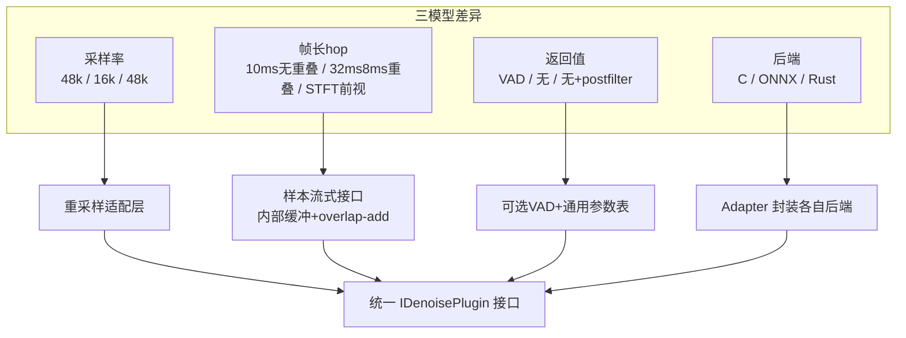
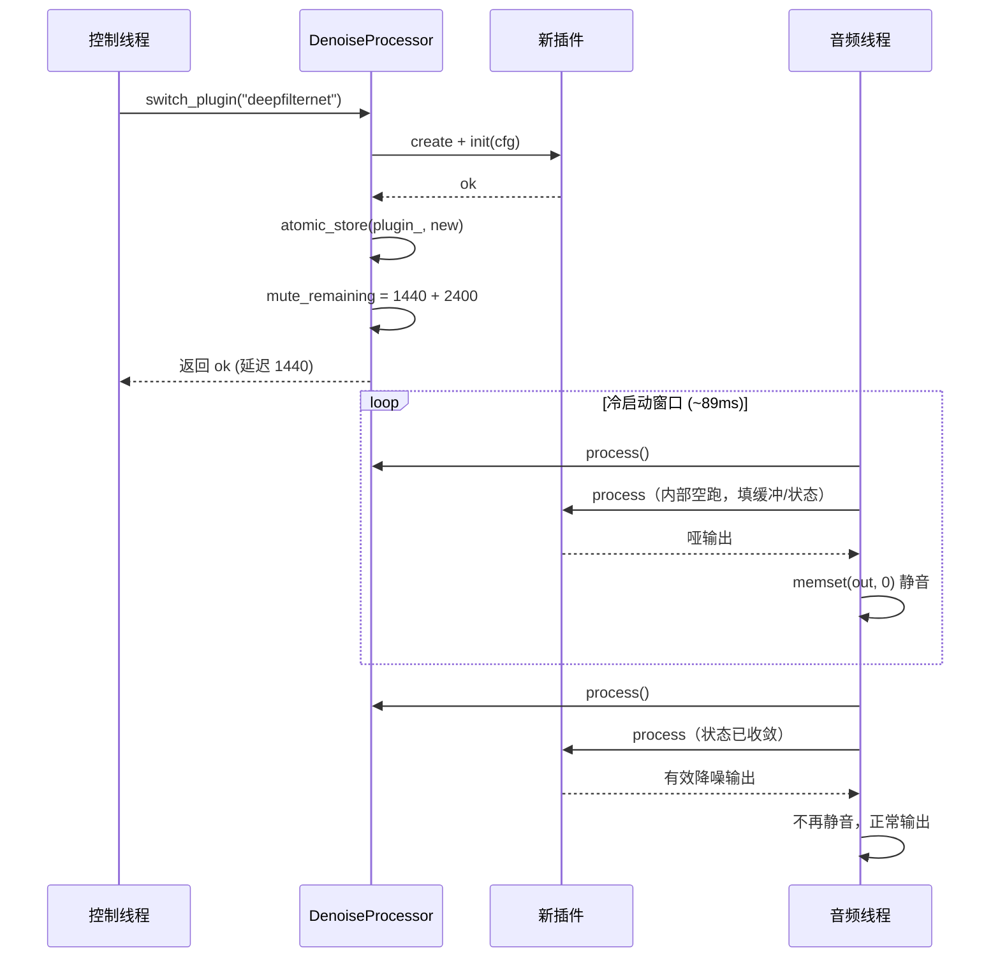
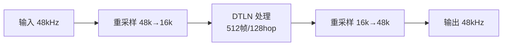
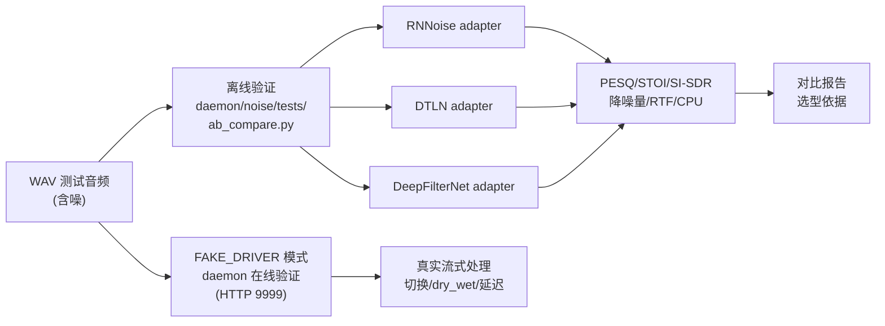

# 降噪模块插件化架构设计

> **版本**: v0.2-draft
> **日期**: 2026-07-15
> **状态**: 初稿，供团队讨论
> **关联**: [架构设计](architecture-design.md) §3.4 DenoiseProcessor、[噪声识别调研](noise-identification-research.md)

---

## 0. 背景与目标

架构设计 §3.4 原方案将降噪硬绑定为 RNNoise。但常见开源降噪模型有多种，各有适用场景：

| 模型 | 擅长场景 | 弱点 |
|------|---------|------|
| RNNoise | 语音降噪，低延迟，零依赖 | 音乐过度抑制，仅 48kHz |
| DeepFilterNet | 非平稳噪声（键盘/交通/嘈杂），全频带 | 延迟较高，依赖重 |
| DTLN | 嵌入式低算力，可移植性好 | 仅 16kHz，音质中等 |

**目标**：将降噪模块设计为**可插拔插件架构**，运行时按场景切换不同降噪模型，且接口对多模型透明兼容。

> **说明**：以下分析基于三个模型仓库的**实际克隆源码与模型文件**（已克隆到 `/home/Share/GitHub/noise-model/`），非文档推测。

### 0.1 关键结论：Python 仓库可用，无需 Python 运行时

三个仓库的语言分布：

| 仓库 | 主语言 | 是否含可直接加载的模型文件 |
|------|--------|----------------------|
| `xiph/rnnoise` | **C** | ✅ 模型编译进二进制 + 可外挂 .bin |
| `breizhn/DTLN` | **Python**（TF2） | ✅ **已导出 ONNX + TFLite**（见下） |
| `Rikorose/DeepFilterNet` | **Rust + Python** | ✅ **已导出 ONNX** + Rust libDF 原生实现 |

**两个 Python 仓库都已导出 ONNX 模型**，C++ daemon 经 ONNX Runtime 加载即可推理，**不需要 Python 环境、不需要 TensorFlow/PyTorch**。仓库里的 Python 代码仅是训练和转换脚本，运行时用不到。

实际核实的模型文件：

```text
noise-model/DTLN/pretrained_model/
├── model_1.onnx      1.4 MB   ← 双网络第 1 级（STFT 幅度掩蔽）
├── model_2.onnx      2.5 MB   ← 双网络第 2 级（时域 LSTM）
├── model_1.tflite / model_2.tflite      ← TFLite 备选
└── model_quant_*.tflite                  ← 量化版

noise-model/DeepFilterNet/models/
├── DeepFilterNet3_onnx.tar.gz   ← 解压出 3 个子图 ONNX
├── DeepFilterNet2_onnx.tar.gz
└── ...
# 解压后:
├── enc.onnx       编码器（特征 -> embedding）
├── df_dec.onnx    深度滤波解码器
└── erb_dec.onnx    ERB 掩蔽解码器
```

**三种集成路径**（按推荐度）：

| 路径 | 模型 | 后端 | 依赖 | 说明 |
|------|------|------|------|------|
| **A（推荐）** | RNNoise | 原生 C | 零 | 编译进二进制，AVX2 加速 |
| **B（推荐）** | DTLN | ONNX Runtime | ONNX RT ~30MB | 加载 model_1/2.onnx |
| **C1（推荐）** | DeepFilterNet | ONNX Runtime | ONNX RT ~30MB | 加载 enc/df_dec/erb_dec.onnx |
| C2（备选） | DeepFilterNet | Rust libDF | Rust 工具链 | 原生最高性能，但需 cbindgen 编译 |

---

## 1. 三种模型的参数对比

这是设计兼容接口的基础--先搞清每个模型**到底需要哪些输入参数**。

### 1.1 核心参数对照表

> 以下参数**经源码/模型文件实测确认**（DeepFilterNet 来自 `config.ini`，DTLN 来自 `real_time_processing_onnx.py`，RNNoise 来自 `rnnoise.h`），非文档推测。

| 参数 | RNNoise | DTLN | DeepFilterNet | 说明 |
|------|---------|------|---------------|------|
| **采样率** | 48kHz（固定） | **16kHz（固定）** | 48kHz（全频带） | DTLN 与系统 48kHz 不匹配，需重采样 |
| **帧长 frame** | 480 样本（10ms） | 512 样本（32ms@16k） | **960 样本（fft_size，20ms@48k）** | 三者帧长各不相同 |
| **hop 间隔** | 480（=帧长，无重叠） | **128（=帧长 1/4，75% 重叠）** | **480（50% 重叠）** | hop < frame 时需 overlap-add |
| **前视 lookahead** | 无 | 无 | **2 帧（df_lookahead=2）** | DeepFilterNet 需未来样本，flush 需补零 |
| **输入格式** | float[-1,1] mono | float[-1,1] mono | float, 多通道 | 通道数不同 |
| **输出格式** | float[-1,1] mono | float[-1,1] mono | float, 多通道 | - |
| **返回值** | **VAD 概率[0,1]** | 无（仅降噪输出） | 无；含 lsnr 估计 | 仅 RNNoise 产出 VAD |
| **算法延迟** | 10ms（1 帧） | ~32ms（1 帧） | ~30ms（hop+lookahead） | DeepFilterNet 有前视 |
| **模型大小** | ~250KB（编译进二进制） | **1.4+2.5 MB（双 ONNX）** | ~3 MB（三子图 ONNX） | - |
| **推理后端** | 原生 C（无引擎依赖） | ONNX Runtime | ONNX Runtime / Rust libDF | 后端异构是关键差异 |
| **许可** | BSD-3 | MIT | MIT / Apache-2.0 双许可 | 均可商用 |
| **模型文件** | 编译进二进制 + .bin | model_1.onnx + model_2.onnx | enc/df_dec/erb_dec.onnx | 均已随仓库提供 |

### 1.2 模型签名实测

从克隆的 ONNX 文件提取的真实输入输出签名（用于 adapter 实现时绑定 I/O 张量）：

**DTLN（双网络串联）** - 推理逻辑见 `real_time_processing_onnx.py`：

```text
model_1.onnx（第 1 级：STFT 幅度掩蔽）
  IN  input_0:  [1, 1, 257]   归一化幅度谱 (rfft of 512 样本 = 257 频点)
  IN  input_1:  [state]       LSTM 隐状态（跨帧传递）
  OUT output_0: [1, 1, 257]   估计掩蔽
  OUT output_1: [state]       更新后的 LSTM 状态

model_2.onnx（第 2 级：时域增强）
  IN  input_0:  [1, 1, 512]   第 1 级输出经 IFFT 还原的时域块
  IN  input_1:  [state]       LSTM 隐状态
  OUT output_0: [1, 1, 512]   增强后的时域块
  OUT output_1: [state]       更新后的 LSTM 状态
```

关键：DTLN 有**两个 ONNX 模型串联**，且每个都有**跨帧 LSTM 状态**需在调用间显式传递（喂回去）。adapter 必须维护这两个状态张量。

**DeepFilterNet3（三子图协作）** - 参数来自 `config.ini`（sr=48000, fft_size=960, hop_size=480, nb_erb=32, nb_df=96, df_order=5, df_lookahead=2）：

```text
enc.onnx（编码器）
  IN  feat_erb:  [1, 1, S, 32]    ERB 频带特征（32 带）
  IN  feat_spec: [1, 2, S, 96]    复谱特征（实/虚 2×96）
  OUT e0~e3:     [1, 64, S, *]    4 级编码特征
  OUT emb:       [1, S, 512]      embedding
  OUT c0:        [1, 64, S, 96]   深度滤波输入
  OUT lsnr:      [S, 1]           局部 SNR 估计（可复用为 SNR 指标！）

df_dec.onnx（深度滤波解码器）
  IN  emb: [1, S, 512]            共享 embedding
  IN  c0:  [1, 64, S, 96]         复谱系数
  OUT coefs: [?, S, ?, 10]        深度滤波系数（df_order=5 → 2×5）
  OUT 235:   [?, ?, 1]            增益

erb_dec.onnx（ERB 掩蔽解码器）
  IN  emb, e0~e3                  编码器各级输出
  OUT m: [1, S, ?, 32]            ERB 掩蔽
```

关键：DeepFilterNet 是**三子图协作**（enc → {df_dec, erb_dec}），encoder 输出要喂给两个 decoder。且 `lsnr` 输出可直接复用为本系统的 SNR 指标（无需额外估算）。前视 `df_lookahead=2` 意味着需要 2 个未来 hop 才能产出当前帧。

**适配启示**：DTLN 和 DeepFilterNet 的 ONNX 调用都不是"一个模型一次性 in/out"那么简单，adapter 需正确编排多模型串联和状态传递。这正是 adapter 层存在的价值--把这些复杂性封装在内部，对外仍是简单的 `process(in, n_in, out)`。

### 1.3 接口兼容的三大挑战

从参数表归纳出设计必须解决的三个问题：

**挑战 1：采样率不一致**
- 系统运行在 48kHz，DTLN 只支持 16kHz
- 若强行用 DTLN 处理 48kHz 音频会降频，丢失高频
- **对策**：插件层内置重采样，对调用方透明

**挑战 2：帧长与 hop 不一致**
- RNNoise：frame=hop=480（无重叠，喂 480 出 480）
- DTLN：frame=512, hop=128（喂 128，内部累计到 512 处理，出 512 但只有前 128 是新的，需 overlap-add）；且双模型串联 + LSTM 状态跨帧传递
- DeepFilterNet：fft_size=960, hop=480, lookahead=2（有未来帧依赖，三子图协作）
- **对策**：接口采用**样本流式**而非帧式，每个插件内部自行缓冲 + 帧化 + overlap-add + 状态维护

**挑战 3：返回值与后端不一致**
- 仅 RNNoise 返回 VAD；DeepFilterNet 返回 lsnr（可复用为 SNR）；DTLN 不返回附加值
- 后端分三类：原生 C / ONNX / Rust
- **对策**：VAD/SNR 设为可选输出（`DenoiseResult`）；推理后端封装在各 adapter 内部，接口层不暴露



---

## 2. 插件接口设计

### 2.1 核心原则

**接口面向样本流，不面向帧。** 调用方按任意长度（如 daemon 的 ALSA tick 48 样本）喂数据，插件内部自行处理帧化、重采样、overlap-add。这样无论模型用 10ms 帧还是 32ms 帧，调用代码完全一致。

### 2.2 IDenoisePlugin 接口

```cpp
// daemon/noise/denoise_plugin.hpp
#pragma once
#include <cstddef>
#include <cstdint>
#include <memory>
#include <string>
#include <unordered_map>

namespace noise {

// 降噪处理附加结果（可选）
struct DenoiseResult {
  bool has_vad{false};      // 该插件是否产出 VAD
  float vad_probability{0}; // VAD 概率 [0,1]，仅 RNNoise 等填充
};

// 插件配置（初始化时传入）
struct PluginConfig {
  std::string model_path;            // 模型文件路径（空=默认模型）
  uint32_t sample_rate_in{48000};    // 输入音频采样率
  uint32_t channels{1};               // 通道数
  float dry_wet{1.0f};                // 干湿比 0=原音 1=全降噪
  // 通用键值参数，各插件自定义（如 postfilter=true）
  std::unordered_map<std::string, std::string> params;
};

// 降噪插件统一接口
class IDenoisePlugin {
 public:
  virtual ~IDenoisePlugin() = default;

  // ── 生命周期 ──
  virtual bool init(const PluginConfig& cfg) = 0;
  virtual void reset() = 0;  // 清空内部状态（切换源时调用）

  // ── 元信息（init 后有效）──
  virtual const char* name() const = 0;
  virtual uint32_t native_sample_rate() const = 0;       // 模型原生采样率
  virtual uint32_t algorithmic_latency_samples() const = 0; // 算法引入的固定延迟
  virtual bool supports_vad() const = 0;                   // 是否产出 VAD

  // ── 流式处理（核心）──
  // 输入任意长度样本，输出降噪样本，返回实际输出样本数。
  // out 容量需 >= n_in + latency。result 可选。
  // 注意：首帧可能因算法延迟不立即产出，输出数 <= 输入数是正常的。
  virtual size_t process(const float* in, size_t n_in,
                         float* out, size_t n_out_max,
                         DenoiseResult* result = nullptr) = 0;

  // ── 排空缓冲（停止时调用，取出残余样本）──
  virtual size_t flush(float* out, size_t n_out_max) = 0;

  // ── 动态参数（运行时可调）──
  virtual void set_dry_wet(float ratio) = 0;              // 0~1
  virtual void set_param(const std::string& key,
                         const std::string& value) = 0;
  virtual std::string get_param(const std::string& key) const = 0;
};

}  // namespace noise
```

### 2.3 设计要点说明

| 设计决策 | 理由 |
|---------|------|
| `process()` 接收任意长度样本 | 屏蔽帧长差异，调用方无需关心模型用 10ms 还是 32ms 帧 |
| 内部缓冲 + overlap-add 在 adapter 实现 | DTLN 的 75% 重叠、DeepFilterNet 的 STFT 重叠由各 adapter 自行处理 |
| `algorithmic_latency_samples()` 暴露延迟 | 调用方需知道延迟以对齐音视频、补偿时间戳 |
| `supports_vad()` + 可选 `DenoiseResult` | 仅 RNNoise 产 VAD，其他插件 has_vad=false，调用方据此决定 VAD 来源 |
| `native_sample_rate()` | 暴露模型原生采样率，供重采样层判断 |
| `set_param()` 通用键值表 | postfilter 等 model-specific 参数不污染接口，各插件自定义 key |
| `dry_wet` 干湿混合 | 统一的降噪强度控制，所有插件共用（详见 §4.3） |

---

## 3. Adapter 设计

每个模型一个 Adapter，实现 `IDenoisePlugin`，封装各自后端 + 帧化 + 重采样。

### 3.1 RnnoiseAdapter

最简单：frame=hop，无重叠，无需 overlap-add。

```cpp
// daemon/noise/adapters/rnnoise_adapter.hpp
class RnnoiseAdapter : public IDenoisePlugin {
 public:
  bool init(const PluginConfig& cfg) override {
    // 1. 加载模型（cfg.model_path 空=内置默认模型）
    model_ = cfg.model_path.empty()
        ? rnnoise_create(nullptr)
        : rnnoise_create(rnnoise_model_from_filename(cfg.model_path.c_str()));
    // 2. native_sample_rate_ = 48000（固定）
    // 3. 重采样器：若 cfg.sample_rate_in != 48000 则建
  }

  size_t process(const float* in, size_t n_in, float* out, size_t n_out_max,
                 DenoiseResult* result) override {
    // 1. 若需要，将输入重采样到 48kHz
    // 2. 累积到内部 buffer，凑满 480 样本就处理一帧
    // 3. rnnoise_process_frame(state_, frame_out, frame_in)
    //    -> 返回 VAD 概率，填入 result->vad_probability
    // 4. dry_wet 混合：out = dry_wet*denoised + (1-dry_wet)*in
    // 5. 若重采样过，将输出重采样回原始采样率
  }

 private:
  DenoiseState* state_{nullptr};
  RNNModel* model_{nullptr};
  // 重采样器（如需）
  float in_buffer_[480];  // 输入累积
  // ...
};
```

**特性**：无 overlap-add；VAD 直接填充；延迟 = 480 样本。

### 3.2 DtlnAdapter

复杂点：hop=128 < frame=512，需 overlap-add；16kHz 需重采样；**双模型串联 + LSTM 状态跨帧传递**。

> 实测：DTLN 用两个 ONNX（model_1 + model_2）。每帧先跑 model_1（输入归一化幅度谱 + 上轮 LSTM 状态），输出掩蔽 + 新状态；掩蔽应用后 IFFT 还原时域块，喂给 model_2（输入时域块 + 上轮 LSTM 状态），输出增强时域块 + 新状态。两个状态张量都要存下来下帧喂回。完整逻辑见仓库 `real_time_processing_onnx.py`。

```cpp
// daemon/noise/adapters/dtln_adapter.hpp
class DtlnAdapter : public IDenoisePlugin {
 public:
  bool init(const PluginConfig& cfg) override {
    // 1. 加载两个 ONNX 模型（cfg.model_path 指向 model_1.onnx）
    //    model_2 路径从 model_1 推导（同目录 model_2.onnx）
    sess1_ = CreateOnnxSession(cfg.model_path);           // model_1.onnx
    sess2_ = CreateOnnxSession(cfg.model_path_model2);   // model_2.onnx
    // 2. 初始化两个模型的 LSTM 状态张量（按签名 §1.2 预分配）
    state1_ = AllocStateTensor(sess1_);   // input_1
    state2_ = AllocStateTensor(sess2_);   // input_1
    // 3. native_sample_rate_ = 16000
    // 4. 重采样器：cfg.sample_rate_in(48k) <-> 16000 双向
  }

  size_t process(const float* in, size_t n_in, float* out, size_t n_out_max,
                 DenoiseResult* result) override {
    // 1. 输入 48k -> 16k 重采样
    // 2. 累积到 16k buffer
    // 3. 每凑满 hop=128 样本：
    //    a. 取 frame=512 样本窗口（滑动含历史）
    //    b. rfft -> 幅度谱[257] 归一化
    //    c. sess1.run(in=[mag, state1_]) -> [mask, new_state1_]
    //    d. 应用掩蔽 + 相位 -> irfft -> 时域块[512]
    //    e. sess2.run(in=[time_block, state2_]) -> [enhanced, new_state2_]
    //    f. state1_/state2_ = new_state1_/new_state2_  (状态喂回！)
    //    g. overlap-add: out_buf 平移 + enhanced 累加 -> 取前 128
    // 4. result->has_vad = false（DTLN 不产 VAD）
    // 5. 输出 16k -> 48k 重采样
  }

 private:
  Ort::Session* sess1_{nullptr};   // model_1.onnx
  Ort::Session* sess2_{nullptr};   // model_2.onnx
  Ort::Value state1_, state2_;      // 跨帧 LSTM 状态（核心）
  float frame_buffer_[512];         // STFT 滑动窗口
  float out_buffer_[512];           // overlap-add 累积
  // 重采样器 48k<->16k
};
```

**特性**：需 overlap-add + 双模型串联 + LSTM 状态管理；无 VAD；延迟 = 512 样本 @16k ≈ 32ms（+ 重采样延迟）。

### 3.3 DeepFilterNetAdapter

最复杂：三子图协作 + STFT + lookahead（未来帧依赖）+ postfilter 选项。

> 实测：DeepFilterNet3 是三个 ONNX 协作（enc/df_dec/erb_dec，签名见 §1.2）。每 hop=480 样本：① 算 ERB(32) + 复谱(2×96) 特征喂 enc.onnx，得到 embedding + c0 + 各级编码特征 + lsnr；② df_dec 用 emb+c0 算深度滤波系数；③ erb_dec 用 emb+编码特征算 ERB 掩蔽；④ 系数和掩蔽应用回 STFT，ISTFT 还原。`df_lookahead=2` 意味着要缓冲 2 个未来 hop。
>
> **简化路径**：可直接用 Rust libDF（仓库 `libDF/src/lib.rs` 有 `process_frame(input, output)` 高层 API），它内部封装了三子图编排，C++ 经 cbindgen 生成的 C 头调用。若不想引入 Rust 工具链，则走 ONNX 路径自行编排三子图。

```cpp
// daemon/noise/adapters/deepfilternet_adapter.hpp
class DeepFilterNetAdapter : public IDenoisePlugin {
 public:
  bool init(const PluginConfig& cfg) override {
    // 路径 A（ONNX，推荐）：加载 3 个子图
    enc_    = CreateOnnxSession(dir + "enc.onnx");
    df_dec_ = CreateOnnxSession(dir + "df_dec.onnx");
    erb_dec_= CreateOnnxSession(dir + "erb_dec.onnx");
    // 路径 B（libDF）：cbindgen 调 df_create() / df_process_frame()
    // native_sample_rate_ = 48000（全频带，无需重采样）
    // postfilter = cfg.params.count("postfilter")
  }

  size_t process(const float* in, size_t n_in, float* out, size_t n_out_max,
                 DenoiseResult* result) override {
    // 1. 累积样本，每 hop=480 调用一次（需先攒够 lookahead=2 帧）
    // 2. [ONNX 路径] 三子图编排:
    //    a. STFT(960 窗) -> feat_erb[32], feat_spec[2,96]
    //    b. enc.run(feat_erb, feat_spec) -> {e0-e3, emb, c0, lsnr}
    //    c. df_dec.run(emb, c0) -> {coefs, gain}   深度滤波
    //    d. erb_dec.run(emb, e0-e3) -> {m}          ERB 掩蔽
    //    e. 应用 coefs + m 到复谱 -> ISTFT(960) -> 时域
    // 3. dry_wet 混合
    // 4. result->has_vad = false, 但可填 lsnr 作 SNR 辅助
    // 注意：lookahead=2 -> flush() 时补 2 hop 的零触发残余输出
  }

  size_t flush(float* out, size_t n_out_max) override {
    // 补 df_lookahead=2 帧 0 样本，触发 enc/df_dec/erb_dec 产出最后 2 帧
  }

  uint32_t algorithmic_latency_samples() const override {
    // hop(480) + lookahead*hop(960) = 1440 样本 @48k = 30ms（实测确认）
    return 480 * (1 + 2);  // 1440
  }
};
```

**特性**：无重采样（48k 原生）；三子图编排或 libDF 封装；有 lookahead（flush 补零）；支持多通道；`lsnr` 可复用为 SNR 指标；延迟 = hop + lookahead×hop = 1440 样本 @48k ≈ 30ms。

### 3.4 Adapter 对照

| 维度 | RnnoiseAdapter | DtlnAdapter | DeepFilterNetAdapter |
|------|---------------|-------------|---------------------|
| 后端 | 原生 C | ONNX Runtime | Rust libDF / ONNX |
| 重采样 | 输入≠48k 时需 | **必需** 48k↔16k | 不需要 |
| overlap-add | 不需要 | **需要**（75%重叠） | 需要（STFT 重叠） |
| lookahead | 无 | 无 | **有**（flush 需补零） |
| VAD 输出 | ✅ 填充 | ❌ has_vad=false | ❌ has_vad=false |
| 多通道 | ❌ mono | ❌ mono | ✅ |
| 实现复杂度 | 低 | 中 | 高 |

---

## 4. 插件管理与选型

### 4.1 插件工厂与注册

```cpp
// daemon/noise/denoise_plugin_factory.hpp
namespace noise {

// 插件创建函数类型
using PluginCreator = std::unique_ptr<IDenoisePlugin>(*)();

class DenoisePluginRegistry {
 public:
  static DenoisePluginRegistry& instance();

  // 注册插件（静态初始化时调用）
  void register_plugin(const std::string& name, PluginCreator creator);
  bool has(const std::string& name) const;

  // 创建插件实例
  std::unique_ptr<IDenoisePlugin> create(const std::string& name) const;

  // 列出所有已注册插件
  std::vector<std::string> list() const;

 private:
  std::map<std::string, PluginCreator> creators_;
};

// 各 adapter 在 cpp 中静态注册
// rnnoise_adapter.cpp:
static bool registered = [] {
  DenoisePluginRegistry::instance().register_plugin("rnnoise", [] {
    return std::make_unique<RnnoiseAdapter>();
  });
  return true;
}();

}  // namespace noise
```

**CMake 按需编译**：

```cmake
# daemon/noise/CMakeLists.txt
option(NOISE_PLUGIN_RNNOISE     "Build RNNoise denoise plugin"     ON)
option(NOISE_PLUGIN_DTLN         "Build DTLN denoise plugin"        OFF)
option(NOISE_PLUGIN_DEEPFILTER   "Build DeepFilterNet denoise plugin" OFF)

if(NOISE_PLUGIN_RNNOISE)
  target_sources(noise PRIVATE adapters/rnnoise_adapter.cpp)
  target_link_libraries(noise PRIVATE rnnoise)
endif()

if(NOISE_PLUGIN_DTLN)
  target_sources(noise PRIVATE adapters/dtln_adapter.cpp)
  # 需引入 ONNX Runtime
  target_link_libraries(noise PRIVATE onnxruntime)
endif()

if(NOISE_PLUGIN_DEEPFILTER)
  target_sources(noise PRIVATE adapters/deepfilternet_adapter.cpp)
  # 需引入 libDF 或 ONNX Runtime
endif()
```

实验期三种都开（`-DNOISE_PLUGIN_RNNOISE=ON -DNOISE_PLUGIN_DTLN=ON -DNOISE_PLUGIN_DEEPFILTER=ON`），生产期按场景只开需要的。

### 4.2 运行时切换（准热切换）

通过 HTTP 指定插件名，`DenoiseProcessor` 切换活动插件。采用**准热切换**方案：原子指针交换保证线程安全，切换瞬间静音一个冷启动窗口，不追求无缝过渡。

**设计要点**：

1. **原子指针交换**：`plugin_` 用 `std::atomic<std::shared_ptr<IDenoisePlugin>>` 持有（C++20），控制线程替换、音频线程读取，无锁且无 UAF。旧插件引用计数归零后自然释放。
2. **静音过渡**：新插件从冷态启动，DeepFilterNet 需 `df_lookahead=2` 帧（~30ms）、DTLN LSTM 需数帧才收敛。这期间若直接输出新插件结果会出哑音/错音。对策是切换后静音一个 `mute_duration_ms`（默认 50ms，按新插件延迟上限 + 收敛余量取值），输出 0 样本，让新插件"空跑"填满内部缓冲与状态，再开声。
3. **不做 crossfade**：不并行运行新旧插件。代价是切换瞬间有 ~50ms 静音；收益是实现简单、CPU 不翻倍、无两路对齐问题。
4. **延迟跳变上报**：切换后通过事件通知下游 `algorithmic_latency_samples()` 变化（如 RNNoise 480 -> DeepFilterNet 1440），便于音视频对齐。

```cpp
// daemon/noise/denoise_processor.hpp（重构后）
class DenoiseProcessor {
 public:
  // 切换插件（准热切换：原子替换 + 静音冷启动窗口）
  bool switch_plugin(const std::string& name) {
    auto new_plugin = DenoisePluginRegistry::instance().create(name);
    if (!new_plugin) return false;
    // 保留公共配置（dry_wet、采样率、通道）传给新插件
    PluginConfig cfg = current_config_;
    if (!new_plugin->init(cfg)) return false;
    // 原子替换：音频线程下次 process 读到的就是新插件，无锁无 UAF
    std::atomic_store(&plugin_, std::shared_ptr<IDenoisePlugin>(std::move(new_plugin)));
    // 计算并设置静音窗口 = 新插件算法延迟 + 收敛余量
    uint32_t latency = plugin_atomic_load()->algorithmic_latency_samples();
    mute_samples_remaining_ = latency + kConvergenceMargin;  // 默认 +50ms 样本
    // 通知下游延迟变化
    if (latency_change_cb_) latency_change_cb_(latency);
    return true;
  }

  // 音频线程调用（高频，必须无锁）
  size_t process(const float* in, size_t n_in, float* out, size_t n_out_max,
                 DenoiseResult* result) {
    auto plugin = std::atomic_load(&plugin_);  // 拿到本次调用的稳定快照
    size_t n = plugin->process(in, n_in, out, n_out_max, result);
    // 静音过渡：切换后前若干样本输出 0
    if (mute_samples_remaining_ > 0) {
      size_t mute = std::min(mute_samples_remaining_.load(), n);
      std::memset(out, 0, mute * sizeof(float));
      mute_samples_remaining_ -= mute;
    }
    return n;
  }

  std::vector<std::string> list_plugins() const {
    return DenoisePluginRegistry::instance().list();
  }
  using LatencyChangeCb = std::function<void(uint32_t)>;
  void set_latency_change_cb(LatencyChangeCb cb) { latency_change_cb_ = std::move(cb); }

 private:
  std::shared_ptr<IDenoisePlugin> plugin_;       // 经 atomic_load/store 访问
  PluginConfig current_config_;
  std::atomic<size_t> mute_samples_remaining_{0};
  LatencyChangeCb latency_change_cb_;
  static constexpr size_t kConvergenceMargin = 2400;  // 50ms @48k 状态收敛余量
};
```

**准热切换的时序**：



**适用与代价**：

| 维度 | 准热切换（本方案） | 无缝热切换（未采用） |
|------|------------------|--------------------|
| 切换瞬间 | **~50-90ms 静音** | 无间断 |
| 实现复杂度 | 低（原子指针 + 静音计数） | 高（新旧并行 + crossfade 对齐） |
| CPU 切换期 | 单倍 | 短暂双倍 |
| 音频线程锁 | 无 | 需协调双路 |
| 适用场景 | 噪声监测、参数调优、A/B 实验 | 实时直播监听输出 |
| 缺点 | 短暂静音可闻 | 实现重、易出 bug |

对噪声**监测**主用途，~50ms 静音完全可接受（人耳对短暂静音不敏感，且仅在主动切换时发生一次）。实时直播监听场景如需无间断，后续再升级为无缝方案。

> **前提确认**：`std::atomic<std::shared_ptr>` 的原子操作在 C++20 才保证无锁；C++17 需用 `std::atomic_load(&shared_ptr)`（已废弃但可用）或外层读写锁。本项目 daemon 用 C++17，实际实现用专用 `RcuPtr`/双缓冲或细粒度读写锁（切换低频，读高频）替代，对外接口不变。


### 4.3 通用参数：dry_wet 干湿混合

三种模型都没有原生"降噪强度"参数。统一用 dry/wet 混合实现：

```
output = dry_wet × denoised + (1 - dry_wet) × input
```

- `dry_wet = 0`：完全旁通原音（关闭降噪）
- `dry_wet = 1`：完全降噪（默认）
- `dry_wet = 0.5`：半降噪（保留部分环境感，适合音乐场景）

所有 adapter 在 `process()` 末尾统一应用，接口层 `set_dry_wet()` 统一设置。

### 4.4 各插件特有参数（set_param 键值表）

| 插件 | key | value | 说明 |
|------|-----|-------|------|
| rnnoise | `model` | 文件路径 | 切换 .bin 模型 |
| dtln | `model` | ONNX 文件路径 | 切换模型 |
| dtln | `quantized` | `true`/`false` | 用量化模型（更快） |
| deepfilternet | `postfilter` | `true`/`false` | 启用后置滤波（`--pf`） |
| deepfilternet | `model` | .tar.gz 路径 | 切换 DeepFilterNet2/3 |
| deepfilternet | `compensate_delay` | `true`/`false` | 补偿 STFT 前视延迟 |

这些参数经通用 `set_param()` 传入，各 adapter 自行解析，不污染公共接口。

---

## 5. 重采样策略

DTLN 是唯一需要重采样的（16kHz）。重采样设计：



- **库选型**：libsamplerate（高质）或 SpeexDSP resampler（低延迟、嵌入式友好）
- **重采样延迟**：16k→48k 重采样器引入额外 ~1-2ms 延迟，计入 `algorithmic_latency_samples()`
- **质量权衡**：DTLN 原生 16kHz 上限 ~8kHz 带宽，48k 音频降频处理后高频信息已丢失，回采到 48k 只是插值，音质上限为 16k 等价
- **建议**：DTLN 仅用于语音/通讯场景；音乐场景禁用 DTLN（带宽不足）

---

## 6. HTTP 暴露

降噪相关配置统一通过 HTTP REST API 暴露，不扩展 OCA 对象。各传感器（`/api/noise/sensor/:id`）的降噪配置字段如下：

### 6.1 降噪配置 HTTP 参数

| 字段 | 类型 | 说明 |
|------|------|------|
| denoise_plugin | string | 当前插件名（`rnnoise`/`dtln`/`deepfilternet`） |
| available_plugins | string[] | 编译期可用的插件列表（只读） |
| denoise_dry_wet | float | 干湿比 [0,1] |
| denoise_latency_ms | float | 当前插件算法延迟（只读） |
| plugin_params | map\<string,string\> | 插件特有参数键值表 |

### 6.2 HTTP API

| URL | Method | 说明 |
|-----|--------|------|
| `/api/noise/plugins` | GET | 列出可用降噪插件及其元信息 |
| `/api/noise/sensor/:id/plugin` | PUT | 切换插件 `{name: "dtln"}` |
| `/api/noise/sensor/:id/plugin/params` | GET/PUT | 读写插件特有参数 |
| `/api/noise/sensor/:id/denoise` | GET | 当前降噪配置（dry_wet、plugin、latency） |

### 6.3 插件切换响应示例

```json
// GET /api/noise/plugins
{
  "plugins": [
    {
      "name": "rnnoise",
      "native_sample_rate": 48000,
      "supports_vad": true,
      "algorithmic_latency_ms": 10.0,
      "params": ["model"]
    },
    {
      "name": "dtln",
      "native_sample_rate": 16000,
      "supports_vad": false,
      "algorithmic_latency_ms": 34.0,
      "params": ["model", "quantized"]
    },
    {
      "name": "deepfilternet",
      "native_sample_rate": 48000,
      "supports_vad": false,
      "algorithmic_latency_ms": 50.0,
      "params": ["postfilter", "model", "compensate_delay"]
    }
  ]
}
```

---

## 7. 实验验证方案

前期用三种模型做 A/B 对比实验：

### 7.1 测试集

| 类型 | 内容 | 来源 |
|------|------|------|
| 语音 + 白噪声 | 干净语音叠加可调白噪声 | TIMIT + 自生成 |
| 语音 + 非平稳噪声 | 键盘/交通/嘈杂人声 | DeepFilterNet 样本集 |
| 音乐 + 哼声 | 音乐叠加 50Hz 工频 | 自录制 |
| 真实广播噪声 | 现场采集 | 实际链路录音 |

### 7.2 评估指标

| 指标 | 方法 | 用途 |
|------|------|------|
| PESQ | 离线对比降噪前后与干净参考 | 客观音质（语音） |
| STOI | 离线 | 可懂度 |
| SI-SDR | 离线 | 信号失真比 |
| 降噪量 (dB) | 输入 RMS - 输出 RMS（静音段） | 噪声抑制能力 |
| 语音失真度 | 语音段输入输出差异 | 是否过度抑制 |
| 实时 RTF | 处理耗时 / 音频时长 | 实时性（需 <1.0） |
| CPU 占用 | 各插件单核占比 | 部署成本 |
| 主观 MOS | 人工听音评分 | 最终质量 |

### 7.3 预期结论矩阵

| 场景 | 推荐插件 | 理由 |
|------|---------|------|
| 语音通讯，低延迟优先 | RNNoise | 10ms 延迟，VAD 附赠 |
| 语音，非平稳噪声重 | DeepFilterNet | 非平稳噪声最强 |
| 嵌入式/低算力 | DTLN | <1M 参数，可跑树莓派 |
| 音乐场景 | RNNoise（dry_wet 调低）或不禁用 | DTLN 带宽不足，DFN 可能过度抑制 |
| 广播主备链路 | 参考比对（不依赖插件降噪） | 已有算法更精确 |

### 7.4 系统资源需求

> 以下数据基于克隆仓库的**实测模型文件大小**和**官方执行时间表**（DTLN README），非文档推测。三者均为 **CPU 推理，不需要 GPU**。

#### 7.4.1 资源需求对照

| 资源 | RNNoise | DTLN | DeepFilterNet |
|------|---------|------|---------------|
| **模型文件** | 编译进二进制（源码 348KB / 16 个 .c） | 3.8 MB（model_1+2.onnx） | 8.2 MB（enc+df_dec+erb_dec.onnx） |
| **运行时内存** | ~300 KB（模型+状态） | ~4 MB（模型）+ 状态 | ~10 MB（三子图）+ 状态 |
| **推理后端** | 原生 C，零依赖 | ONNX Runtime（~30 MB） | ONNX Runtime 或 Rust libDF |
| **参数量** | ~50K（GRU） | <1M（README 声明） | DeepFilterNet2 面向嵌入式 |
| **GPU 要求** | 无 | 无 | 无 |
| **SIMD 依赖** | AVX2/SSE4.1 可选加速 | ONNX RT 内部优化 | ONNX RT 内部优化 |

#### 7.4.2 实测执行时间（DTLN 官方表，源自仓库 README）

DTLN 帧预算 = hop 128 样本 @16kHz = **8ms**（执行时间须 < 8ms 才实时）：

| 系统 | CPU | 核数 | SavedModel | TFLite | TFLite 量化 |
|------|-----|------|-----------|--------|------------|
| Ubuntu 18.04 | i5-6600k @3.5GHz | 4 | 0.65 ms | 0.36 ms | 0.27 ms |
| MacBook Air 2012 | i7-3667U @2.0GHz | 2 | 1.4 ms | 0.6 ms | 0.4 ms |
| 树莓派 3B+ | ARM A53 @1.4GHz | 4 | 15.54 ms | 9.6 ms | **2.2 ms** |

**推论**：DTLN 在树莓派这类弱设备上需量化版才实时；在 x86 桌面级 CPU 上，ONNX 推理预计 **<0.5ms/帧**，远低于 8ms 预算。RNNoise（更轻量）和 DeepFilterNet（"Low Complexity" 论文，面向嵌入式）同量级或更优。

#### 7.4.3 最低配置建议

| 配置项 | 最低 | 推荐 |
|--------|------|------|
| CPU | 双核 x86-64，支持 SSE4.1 | 4 核+，支持 AVX2 |
| 内存 | 1 GB（单插件） | 2 GB（多 Sink + ONNX RT） |
| 磁盘 | RNNoise: ~1 MB / ONNX 插件: +40 MB | +模型文件 ~12 MB |
| GPU | 不需要 | 不需要 |
| 依赖 | RNNoise 无 / DTLN/DFN 需 ONNX Runtime | 同左 |

### 7.5 验证环境：Ubuntu 虚拟机可行性

**结论：当前 VMware 虚拟机即可验证全部三种模型，无需物理机或 GPU。**

实测当前验证环境：

| 项 | 值 | 评估 |
|----|----|------|
| 平台 | VMware Virtual Platform（hypervisor flag 确认） | 虚拟机 |
| CPU | Intel i7-14700，8 逻辑核 | 远超 DTLN 测试用的 i5-6600k |
| SIMD | **AVX2 ✅ / SSE4.1 ✅** / AVX-512 ❌ | RNNoise AVX2 加速可用；ONNX RT 优化可用 |
| 内存 | 7.7 GB（可用 2.7 GB） | 充足（三模型峰值 ~15 MB） |
| 磁盘 | 187 GB 可用 | 充足 |
| ffmpeg | 6.1.1 已装 | WAV 测试音频处理就绪 |
| numpy | 2.5.1 已装 | A/B 评估脚本就绪 |
| ONNX Runtime | **未装** | 需 `pip install onnxruntime`（~30 MB） |

**三种模型在虚拟机中的验证路径**（均不依赖真实 AES67 音频硬件）：



**分两步验证**：

1. **离线验证（先做，零硬件）**：用 WAV 文件喂各 adapter，对比降噪质量与性能。验证 adapter 正确性（overlap-add、状态传递、三子图编排）和 A/B 选型。当前虚拟机完全胜任。
2. **在线验证（FAKE_DRIVER）**：daemon 用 `FAKE_DRIVER=ON` 启动（HTTP 9999），走 streamer 截取路径喂降噪插件，验证流式处理、插件切换、dry_wet 调节、延迟上报。同样不需真实硬件。

#### 7.5.1 虚拟机验证的注意事项

| # | 事项 | 影响 | 对策 |
|---|------|------|------|
| 1 | **实时音频时序抖动** | VM 调度抖动可能导致 ALSA 帧超时（xrun） | 设计阶段验证算法正确性与性能基准足够；硬实时音频验证留到物理机 |
| 2 | **真实 RAVENNA LKM 不可用** | 无法验证真实 AES67 网络音频流降噪 | 用 FAKE_DRIVER + WAV 文件模拟；真实链路验证在目标部署机做 |
| 3 | **AVX2 已透传** | RNNoise/ONNX RT 的 SIMD 加速生效 | 当前虚拟机已确认 AVX2 可用，无需额外配置 |
| 4 | **ONNX Runtime 待装** | DTLN/DFN 无法推理 | `pip install onnxruntime`（实验期 Python 验证）；C++ 集成后从系统包或 FetchContent 引入 |
| 5 | **多核利用** | 单插件单帧推理 <1ms，无需并行 | 单核足够；多 Sink 时按 Sink 分核 |

**关键结论**：设计阶段的所有验证--算法正确性、性能基准、A/B 选型、插件切换、流式处理--都能在当前 VMware 虚拟机完成。真正需要物理机的只有"真实 AES67 音频硬件 + 硬实时 ALSA 时序"这一项，那是部署验证而非设计验证。

---

## 8. 目录结构

```
daemon/noise/
├── denoise_plugin.hpp              # IDenoisePlugin 接口 + PluginConfig
├── denoise_plugin_factory.hpp/cpp # 插件注册与工厂
├── denoise_processor.hpp/cpp       # 持有插件实例，对外暴露（重构 §3.4）
├── resampler.hpp/cpp               # 重采样封装（libsamplerate/SpeexDSP）
├── adapters/                       # 各模型 adapter
│   ├── rnnoise_adapter.hpp/cpp
│   ├── dtln_adapter.hpp/cpp
│   └── deepfilternet_adapter.hpp/cpp
└── tests/
    ├── plugin_test.cpp             # 接口一致性测试
    └── ab_compare.py               # A/B 对比实验脚本
```

---

## 9. 风险与待决事项

| # | 事项 | 影响 | 建议 |
|---|------|------|------|
| 1 | ONNX Runtime 引入增加 ~30MB 依赖 | DTLN/DeepFilterNet(ONNX路径)需要 | RNNoise 走原生 C 无此依赖；实验期可接受 |
| 2 | DeepFilterNet Rust libDF 集成复杂度 | 需 Rust 工具链或预编译库 | 优先走 ONNX 路径，规避 Rust 依赖 |
| 3 | DTLN 重采样引入额外延迟与音质损失 | 16k 带宽上限 | DTLN 仅限语音场景，文档明确标注 |
| 4 | overlap-add 实现正确性 | DTLN/DFN 降噪质量直接依赖 | 写单元测试验证重建信号完整性 |
| 5 | lookahead 模型 flush 处理 | DeepFilterNet 末尾丢帧 | flush() 补 df_lookahead=2 帧 0 样本触发残余输出 |
| 6 | 插件切换瞬态噪声 | 新插件冷启动期输出哑音/错音 | 准热切换：切换后静音 `延迟+50ms` 窗口（§4.2） |
| 7 | 切换线程安全 / UAF | 控制线程换指针时音频线程用后释放 | `std::atomic<shared_ptr>` 原子交换（§4.2 前提确认段） |
| 8 | 切换延迟跳变 | RNNoise↔DeepFilterNet 延迟差 960 样本致音视频错位 | 切换后上报新 `algorithmic_latency_samples()`，下游补偿 |
| 7 | DTLN 双模型状态管理 | 状态张量喂回错误导致降噪失效 | 按 §3.2 流程，单测验证状态传递 |
| 8 | DeepFilterNet 三子图编排 | ONNX 调用顺序错误导致无输出 | 按 §3.3 流程，先复跑仓库 Python 参考验证 |
| 9 | 多通道 vs 单通道接口 | DeepFilterNet 多通道，RNNoise/DTLN 单 | 接口支持 channels，单通道插件内部循环 |

> **可行性结论**：三个模型的集成路径（原生 C / ONNX / ONNX 或 libDF）均已通过克隆仓库的**实际源码和模型文件验证**，不存在阻塞性技术障碍。主要工作量在 DTLN/DeepFilterNet 的状态管理和子图编排，属实现复杂度而非可行性问题。

---

## 10. 待团队讨论决策

| # | 问题 | 选项 | 建议 |
|---|------|------|------|
| 1 | 实验期三个插件全开还是分阶段？ | A: 全开对比 B: 先 RNNoise 再加 | **A**，实验目的是对比选型 |
| 2 | DeepFilterNet 走 Rust libDF 还是 ONNX？ | A: libDF（原生） B: ONNX（统一） | **B**，与 DTLN 统一后端，规避 Rust 工具链 |
| 3 | 重采样库选型？ | A: libsamplerate B: SpeexDSP | **B**，低延迟嵌入式友好 |
| 4 | VAD 缺失如何补？ | DTLN/DFN 无 VAD | 独立 WebRTC VAD 模块，不依赖降噪插件；DFN 的 lsnr 可复用为 SNR |
| 5 | 切换方式？ | A: 准热切换（静音过渡） B: 无缝热切换（crossfade） | **A**，监测场景够用，实现简单；实时直播监听再升级 B |
