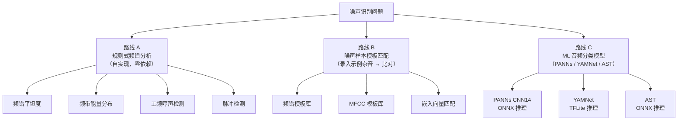
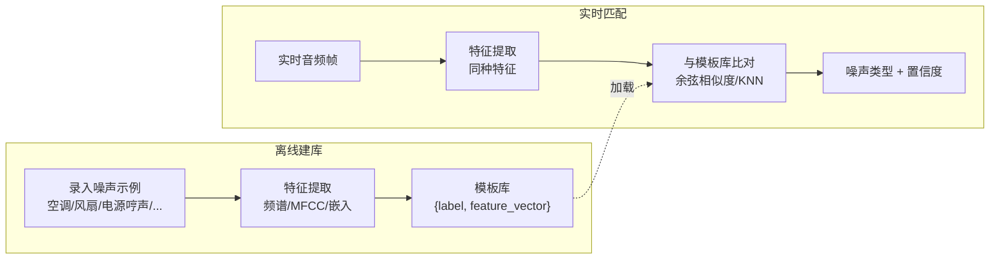
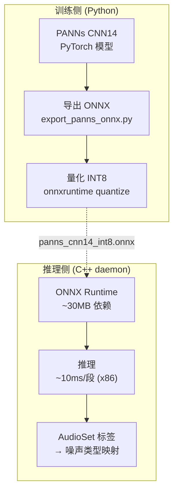
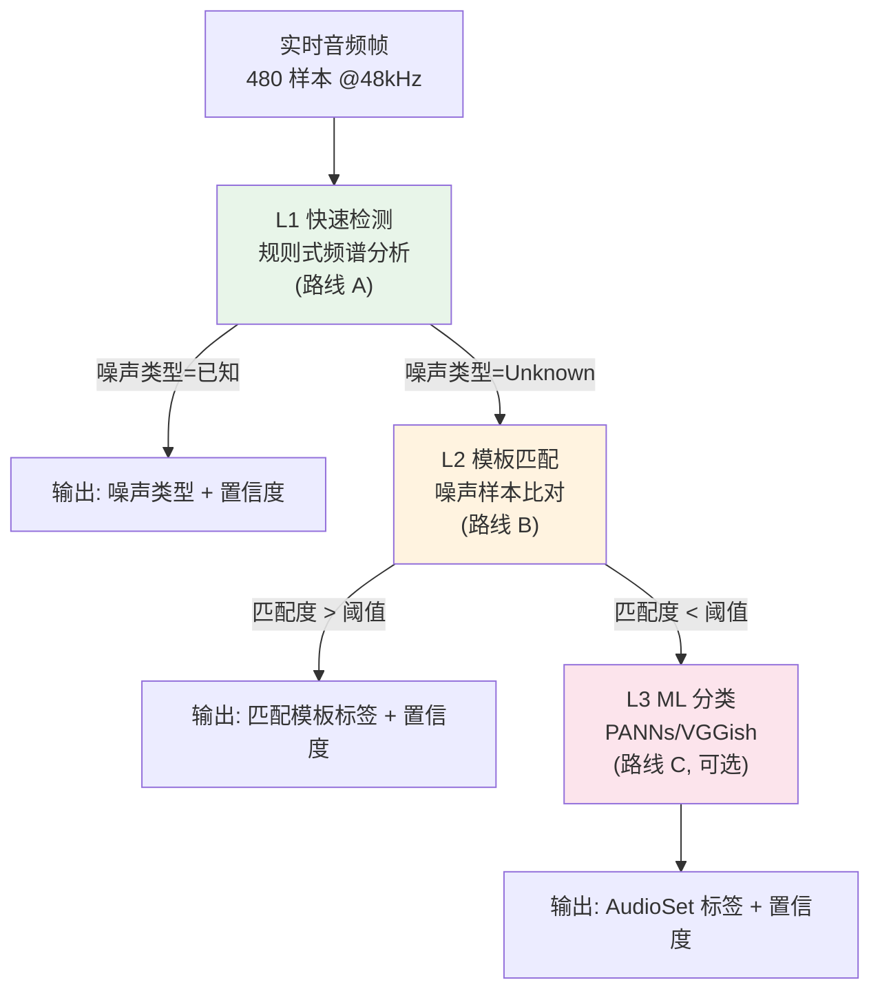
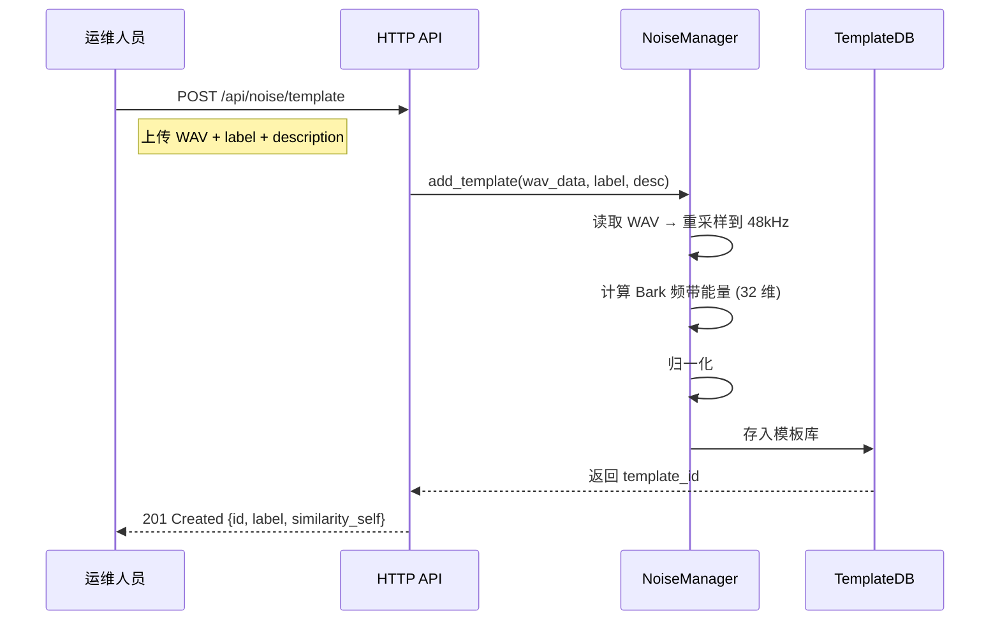
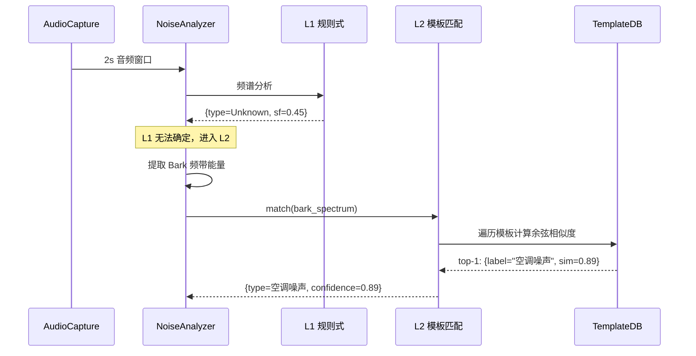
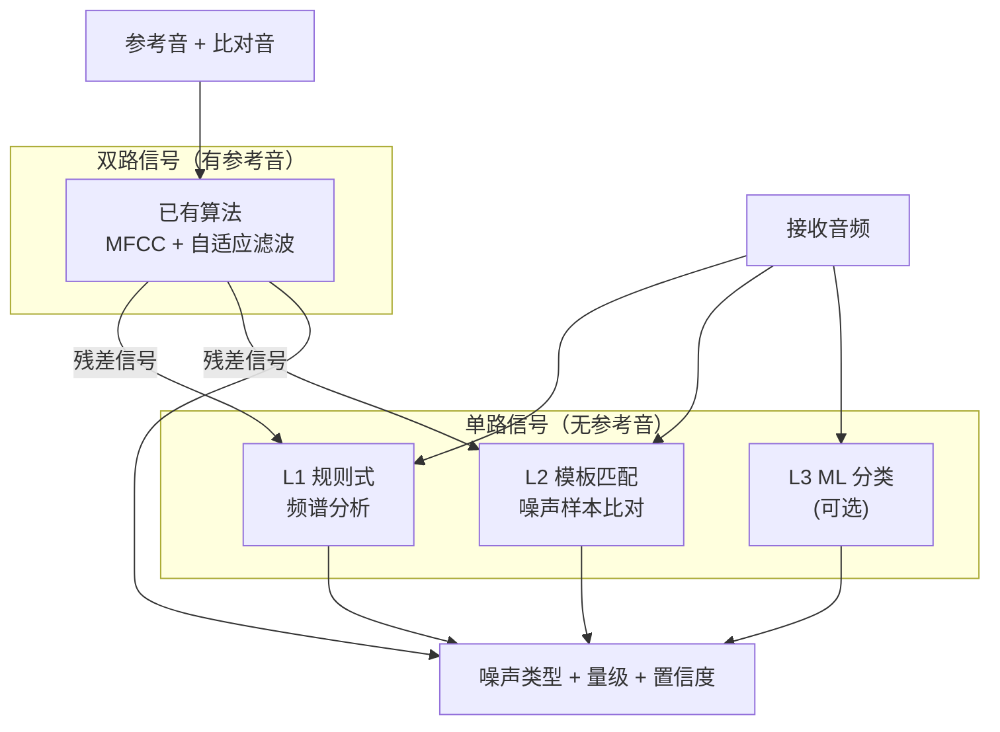

# 噪声识别方案对比 — 技术调研

> **版本**: v0.1-draft
> **日期**: 2026-07-14
> **状态**: 初稿，供团队讨论选型
> **关联**: [架构设计](architecture-design.md) §3.2 NoiseAnalyzer、§3.5 RefComparator

---

## 0. 问题澄清

### RNNoise 能做噪声识别吗？

**不能。** RNNoise 是纯降噪工具，其内部机制：

```
输入 480 样本 → FFT → 22 频带特征 → GRU 网络 → 22 个频带增益 + 1 个 VAD 概率 → 频域乘增益 → IFFT → 降噪输出
```

RNNoise 的输出只有：
- **降噪后的音频帧**（float[480]）
- **VAD 概率**（float，0=噪声 1=语音）

它**不输出**噪声类型、噪声级、频谱特征等识别信息。其内部 GRU 隐状态虽然隐含了噪声特征，但：
1. 隐状态不可直接访问（封装在 `DenoiseState` 内部）
2. 隐状态是高维抽象向量，无法直接解释为"白噪声"/"工频哼声"等语义标签
3. 模型训练目标是降噪增益，不是噪声分类，隐状态不保证包含足够的噪声区分信息

**结论**：RNNoise 仅负责降噪。噪声识别/分类需要独立模块。

### 已有算法（噪声比对监测实现说明.docx）能做到什么程度？

已有算法的核心能力：

| 能力 | 支持程度 | 说明 |
|------|---------|------|
| 噪声**存在**检测 | ✅ 完全支持 | 自适应滤波残差能量 > 阈值 → 有噪声 |
| 噪声**量级**估计 | ✅ 完全支持 | 残差 RMS → 噪声级 (dB) |
| 加性噪声 vs 线性失真分离 | ✅ 完全支持 | 自适应滤波器天然分离 |
| 延时异常检测 | ✅ 完全支持 | 互相关搜索 → 延时差 (ms) |
| 相似度评估 | ✅ 完全支持 | MFCC 特征比对 → 相似度分数 |
| 噪声**类型**识别 | ❌ 不支持 | 算法输出只有"残差"，不区分白噪声/哼声/脉冲等 |
| 噪声**频谱**特征 | ⚠️ 间接支持 | 残差本身是噪声信号，可对其做频谱分析，但算法本身不做 |
| 单路信号噪声检测 | ❌ 不支持 | 算法需要**两路**信号（参考+比对），无法对单路信号做盲检测 |

**关键局限**：已有算法是**参考比对式**（需要干净参考音），不能做**盲检测**（单路信号无参考）。在广播主备链路场景有参考音可用，但在单链路接收场景（只有一路远端信号）无法使用。

---

## 1. 噪声识别的三种技术路线



### 路线对比总览

| 维度 | A. 规则式频谱分析 | B. 噪声样本模板匹配 | C. ML 音频分类模型 |
|------|------------------|--------------------|--------------------|
| **原理** | 频谱形状规则 → 噪声类型 | 输入频谱 vs 已知噪声频谱 → 最近匹配 | DNN 对 log-mel 频谱图 → 527 类概率 |
| **噪声类型识别** | 5-8 种常见类型 | 取决于模板库大小 | 527 类 AudioSet 标签 |
| **自定义噪声录入** | ❌ 不可 | ✅ 核心能力 | ⚠️ 需微调/重训练 |
| **实时性** | ✅ <0.5ms/帧 | ✅ <0.1ms/帧 | ⚠️ 5-20ms/段（1s 窗口） |
| **依赖** | 零（仅需 FFT） | 零（FFT + 余弦相似度） | 重（ONNX Runtime ~30MB） |
| **实现量** | ~300 行 C++ | ~500 行 C++ + 模板管理 | ~200 行 C++ + ONNX 集成 |
| **盲检测**（无参考音） | ✅ | ✅ | ✅ |
| **准确度** | 中（规则有边界） | 高（匹配已知类型） | 极高（527 类训练数据） |
| **未知噪声处理** | 归为 "Unknown" | 归为 "Unknown" + 距离值 | 给出最接近的 AudioSet 类 |
| **成熟度** | 教科书级 | 工业实践级 | 学术/工业前沿 |

---

## 2. 路线 A — 规则式频谱分析

### 2.1 原理

对每帧音频做 FFT，从频谱形状提取规则特征，按规则判定噪声类型：

```
白噪声:   频谱平坦度 SF > 0.7, 各频带能量方差 < 阈值
粉红噪声: 频谱斜率 ≈ -3dB/oct (log-log 线性回归)
工频哼声: 50Hz/100Hz 倍频有峰值 (> 周围 20dB), 且谐波递减
脉冲噪声: 时域短时能量突变 > 6σ, 持续 < 5ms
宽带噪声: SF 0.3~0.7, 非谐波结构
数字噪声: 高频 (>8kHz) 能量异常高, 类似量化噪声
```

### 2.2 实现示例

```cpp
NoiseType classify_noise(const float* power_spectrum, int N, float sample_rate) {
    float sf = spectral_flatness(power_spectrum, N);
    float slope = spectral_slope(power_spectrum, N, sample_rate);
    float hum_strength = detect_hum(power_spectrum, N, sample_rate, 50.0f);
    float impulse_rate = detect_impulses(/* ... */);

    if (hum_strength > -30.0f) return NoiseType::Hum50Hz;
    if (impulse_rate > 5.0f)   return NoiseType::Impulse;
    if (sf > 0.7f)             return NoiseType::White;
    if (slope < -2.5f && slope > -4.0f) return NoiseType::Pink;
    if (sf > 0.3f && sf < 0.7f) return NoiseType::Broadband;
    return NoiseType::Unknown;
}
```

### 2.3 优劣

| 优势 | 劣势 |
|------|------|
| 零额外依赖 | 只能识别 5-8 种教科书噪声类型 |
| 实现简单（~300 行） | 规则边界模糊（如 SF=0.65 是宽带还是白噪声？） |
| 实时性极好 | 无法识别具体噪声源（如"空调噪声" vs "风扇噪声"） |
| 可解释性强 | 混合噪声（如哼声+白噪声）处理困难 |

**适用场景**：快速粗分类，作为所有方案的基础层。

---

## 3. 路线 B — 噪声样本模板匹配（⭐ 推荐重点讨论）

### 3.1 原理

这正是用户提到的"录入多种示例杂音数据，音频流和杂音一一比对"方案。核心思路：

1. **建库**：录入各种已知噪声的示例音频，提取频谱特征存为模板
2. **匹配**：对实时音频提取同种特征，与模板库逐一比对
3. **判定**：最相似模板的标签即为噪声类型，相似度为置信度



### 3.2 三种特征提取方式

#### B1. 频谱模板（最简单）

对 2 秒音频做 FFT，计算 1/3 倍频程或 Bark 频带能量（32 维），归一化后作为模板。

```cpp
// 模板 = 归一化的 32 维 Bark 频带能量
struct NoiseTemplate {
    std::string label;           // "空调噪声", "50Hz哼声", ...
    std::array<float, 32> band_energy;  // 归一化 Bark 频带能量
    float reference_level;      // 录入时的参考噪声级 (dBFS)
};

// 匹配 = 余弦相似度
float match(const NoiseTemplate& tmpl, const std::array<float, 32>& input) {
    return cosine_similarity(tmpl.band_energy, input);
}
```

- **维度**：32 维
- **匹配计算量**：N 个模板 × 32 次乘加 = 极低
- **分辨率**：1/3 倍频程级，可区分大类（白/粉红/哼声），难以区分相似噪声源

#### B2. MFCC 模板（已有算法复用）

复用已有噪声比对算法的 MFCC 提取，对噪声残差计算 MFCC 作为模板。

- **维度**：13-20 维 MFCC
- **优势**：复用已有代码；MFCC 对噪声鲁棒
- **劣势**：MFCC 为语音设计，对非语音噪声的区分力不如频谱模板

#### B3. 嵌入向量模板（与 PPTX 中算法 2 对应）

PPTX 第 9 页描述的"噪声样本数据集比对"算法：

> 实时对输入音频进行频谱分析，将原始音频信号转换为 2 秒长的时频图，生成 **128 维音频嵌入向量**，并与噪声样本数据集中的数据进行比对匹配。

这正是路线 B3。128 维嵌入向量比 32 维频谱模板有更强的区分力，但需要训练嵌入网络。

**轻量嵌入方案**（无需 ONNX）：

```cpp
// 2 层 MLP: 32 Bark 频带 → 128 维嵌入
// 训练：对噪声样本集做自编码器或对比学习
// 推理：~10K 参数, <0.05ms/帧
struct NoiseEmbedding {
    // Layer 1: 32 → 64, ReLU
    std::array<std::array<float, 32>, 64> W1;
    std::array<float, 64> b1;
    // Layer 2: 64 → 128, linear
    std::array<std::array<float, 64>, 128> W2;
    std::array<float, 128> b2;
};
```

### 3.3 模板管理

| 操作 | 说明 |
|------|------|
| 录入 | 通过 HTTP API 上传噪声示例 WAV → 自动提取特征 → 存入模板库 |
| 标注 | 每个模板带 label（噪声类型名）+ description + 录入时间 |
| 删除 | 通过 label 或 ID 删除模板 |
| 导出/导入 | 模板库序列化为 JSON/二进制，支持跨设备共享 |
| 聚类 | 对录入模板做 K-means 聚类，自动发现噪声子类型 |

### 3.4 匹配策略

```
对实时音频的每个分析窗口 (2s):
  1. 提取特征 (频谱/MFCC/嵌入)
  2. 与模板库逐一计算余弦相似度
  3. 取 top-K 最相似模板
  4. 若最高相似度 > 阈值 (如 0.75):
       → 判为该模板的噪声类型, 置信度 = 相似度
     否则:
       → 判为 "Unknown", 保存特征供后续人工标注
```

### 3.5 优劣

| 优势 | 劣势 |
|------|------|
| **核心优势：支持自定义噪声录入** | 需要预先录入噪声示例 |
| 零 ML 依赖（B1/B2 方案） | 未知噪声只能归为 "Unknown" |
| 计算量极低 | 模板数量多时需优化检索（KNN 索引） |
| 可解释（匹配到哪个模板一目了然） | 相似噪声源可能混淆（如两种不同风扇） |
| 与已有 PPTX 算法 2 完全对应 | 嵌入方案 (B3) 需训练嵌入网络 |
| 模板库可跨设备共享 | - |

---

## 4. 路线 C — ML 音频分类模型

### 4.1 可用模型

| 模型 | 来源 | 输入 | 输出 | 参数量 | 许可 | C++ 部署 |
|------|------|------|------|--------|------|---------|
| **PANNs CNN14** | qiuqiangkong/audioset_tagging_cnn (1762★) | 10s log-mel | 527 类概率 | ~80M | MIT | ONNX ✅ |
| **YAMNet** | Google TensorFlow Models | 0.96s log-mel | 521 类概率 | ~4M | Apache-2.0 | TFLite ✅ |
| **AST** (Audio Spectrogram Transformer) | MIT/PSU | 10s log-mel | 527 类概率 | ~80M | BSD | ONNX ✅ |
| **VGGish** | Google Research | 0.96s log-mel | 128 维嵌入 | ~70M | Apache-2.0 | ONNX ✅ |
| **OpenL3** | marl/openl3 (596★) | 1s log-mel | 512 维嵌入 | ~4M | MIT | ONNX ✅ |

### 4.2 AudioSet 527 类标签（PANNs/YAMNet/AST 共用）

AudioSet 标签中与噪声相关的子集：

| 类别 | 标签示例 | 与本项目相关度 |
|------|---------|--------------|
| 电气噪声 | Buzz, Electrical hum, Mains hum | ⭐⭐⭐ 极高 |
| 机械噪声 | Air conditioning, Fan, Engine, Motor | ⭐⭐⭐ 极高 |
| 环境噪声 | White noise, Pink noise, Rain, Wind | ⭐⭐ 高 |
| 数字噪声 | Click, Tick, Clink, Clatter | ⭐⭐ 高 |
| 通信噪声 | Telephone bell, Ringtone, Dial tone | ⭐ 中 |
| 语音/音乐 | Speech, Music, Singing | ⭐ 用于 VAD 辅助 |

### 4.3 部署路径



**已有 ONNX 导出实践**：
- `thecrateapp/crate` 项目有 `export_panns_onnx.py` 导出脚本
- `H0K0H/obs-broadcast-censure` 项目已将 PANNs CNN14 导出为 ONNX 并在 C++ 中推理（OBS 直播审查插件）
- `ooples/AiDotNet` 实现了 AST (Audio Spectrogram Transformer) 的 .NET/ONNX 推理

### 4.4 两种使用方式

**C1. 直接分类**：模型输出 527 类概率 → 取 top-K → 映射到噪声类型

```
PANNs 输出: { "Buzz": 0.82, "Electrical hum": 0.15, "Speech": 0.01, ... }
→ 噪声类型: 工频哼声, 置信度: 0.82
```

**C2. 嵌入提取 + 自定义分类头**：取模型中间层输出（128 维 VGGish 嵌入或 2048 维 PANNs 嵌入）→ 训练小分类头 → 只输出广播噪声相关的 10-20 类

```
VGGish 嵌入 (128 维) → 自定义 Dense(128→20, softmax) → 广播噪声 20 类
```

方式 C2 的优势：
- 分类头极小（~2K 参数），推理 <0.01ms
- 可用少量广播噪声样本微调
- 嵌入向量可同时用于模板匹配（与路线 B3 融合）

### 4.5 优劣

| 优势 | 劣势 |
|------|------|
| 识别能力极强（527 类） | **ONNX Runtime 依赖 ~30MB** |
| 无需手动录入噪声示例 | 模型推理 ~10-20ms/段（1s 窗口） |
| 处理 1s 音频段，非逐帧 | 需 1s 缓冲窗口，延迟较高 |
| 已有 ONNX 导出和 C++ 推理实践 | AudioSet 527 类中大量无关标签 |
| 嵌入向量可复用（C2 方式） | 模型文件 ~30-80MB |
| - | 对广播特有噪声（如 DA/AD 转换噪声）可能无对应标签 |

---

## 5. 推荐方案：分层组合

**单一方案无法覆盖所有需求。** 推荐三层组合架构：



| 层 | 方案 | 延迟 | 依赖 | Phase | 说明 |
|----|------|------|------|-------|------|
| **L1** | 规则式频谱分析 | <0.5ms | 零 | **Phase 1** | 必做。覆盖白/粉红/哼声/脉冲等常见类型 |
| **L2** | 噪声样本模板匹配 | <0.1ms | 零 | **Phase 1** | 必做。支持自定义录入，与已有算法 2 对应 |
| **L3** | ML 音频分类 | ~10ms/段 | ONNX RT | **Phase 2** | 可选。处理 L1/L2 无法识别的未知噪声 |

### 为什么 L1 + L2 组合足够覆盖 Phase 1

**L1 规则式** 能识别的噪声类型（覆盖广播场景 80%+）：

| 噪声类型 | 检测方法 | 广播场景频率 |
|---------|---------|------------|
| 白噪声 | 频谱平坦度 > 0.7 | 高（热噪声、DAC 底噪） |
| 粉红噪声 | 频谱斜率 ≈ -3dB/oct | 中（模拟电路 1/f 噪声） |
| 50Hz 工频哼声 | 50/100/150Hz 倍频峰值 | 高（接地环路） |
| 脉冲噪声 | 短时能量突变 | 中（开关、数字干扰） |
| 宽带噪声 | SF 0.3~0.7 | 中（混合噪声） |

**L2 模板匹配** 补充 L1 无法规则判定的噪声（覆盖剩余 15%+）：

| 噪声类型 | 检测方法 | 说明 |
|---------|---------|------|
| 空调噪声 | 频谱模板匹配 | 低频隆隆声 + 风道共振 |
| 风扇噪声 | 频谱模板匹配 | 叶片通过频率 + 宽带底噪 |
| 数字时钟抖动 | 频谱模板匹配 | 高频段周期性毛刺 |
| DA/AD 转换噪声 | 频谱模板匹配 | 量化失真特征 |
| 射频干扰 | 频谱模板匹配 | EMI 拾取的特定频段 |

**L3 ML 分类** 仅在 L1+L2 均无法识别时启用（覆盖 <5%），且需引入 ONNX 依赖，推迟到 Phase 2。

---

## 6. 路线 B 详细设计（噪声样本模板匹配）

### 6.1 模板库结构

```cpp
// daemon/noise/noise_template.hpp
struct NoiseTemplate {
    uint32_t id;                          // 模板 ID
    std::string label;                    // 噪声类型名 (中文)
    std::string description;              // 描述
    std::array<float, 32> bark_spectrum;  // 归一化 Bark 频带能量 (32 维)
    float reference_level_dbfs;           // 录入时噪声级
    uint64_t created_at;                  // 录入时间戳
    std::string source;                   // 来源 (手动录入/自动聚类)
    std::string wav_file;                 // 原始 WAV 文件名 (相对于 template_dir)
};

class NoiseTemplateDB {
public:
    // 初始化：加载索引 + 确认 WAV 文件存在
    bool load(const std::string& template_dir);
    // 保存索引（原子写：templates.json.tmp + rename）
    bool save() const;

    // 模板管理（写入后自动调用 save()）
    uint32_t add_template(const std::string& label,
                           const float* wav_data, size_t wav_len,
                           uint32_t sample_rate,
                           float ref_level, const std::string& desc = "");
    bool remove_template(uint32_t id);  // 同时删除 WAV 文件
    bool update_label(uint32_t id, const std::string& new_label);

    // 匹配
    struct MatchResult {
        uint32_t template_id;
        std::string label;
        float similarity;    // 余弦相似度 [0, 1]
    };
    MatchResult match_best(const float* bark_spectrum) const;
    std::vector<MatchResult> match_top_k(const float* bark_spectrum, int k) const;

    // 获取模板原始 WAV 路径（供 HTTP API 回听）
    std::string get_wav_path(uint32_t id) const;

private:
    std::string template_dir_;              // noise_templates/ 目录
    std::vector<NoiseTemplate> templates_;  // 内存索引
};
```

### 6.2 录入流程



### 6.3 实时匹配流程



### 6.4 HTTP API

| URL | Method | 说明 |
|-----|--------|------|
| `/api/noise/templates` | GET | 列出所有噪声模板 |
| `/api/noise/template` | POST | 录入新模板（multipart: WAV + label + desc） |
| `/api/noise/template/:id` | DELETE | 删除模板 |
| `/api/noise/template/:id` | PUT | 更新模板标签/描述 |
| `/api/noise/template/:id/test` | POST | 测试模板（上传 WAV，返回匹配结果） |
| `/api/noise/templates/export` | GET | 导出模板库 (JSON) |
| `/api/noise/templates/import` | POST | 导入模板库 (JSON) |

---

## 7. 与已有算法的整合

### 7.1 已有算法在系统中的位置



**关键整合点**：已有算法的**自适应滤波残差**本身就是分离出的纯噪声信号。对残差做 L1/L2 分析，比直接对原始信号做分析**更准确**（因为已去除语音和线性失真分量）。

### 7.2 两种工作模式

| 模式 | 输入 | 可用算法 | 适用场景 |
|------|------|---------|---------|
| **盲检测模式** | 单路信号 | L1 + L2 (+ L3) | 单链路接收，无参考音 |
| **参考比对模式** | 双路信号 | 已有算法 → 残差 → L1 + L2 | 主备链路，有参考音可用 |

参考比对模式的分析精度更高，因为残差是纯噪声，不含语音分量。盲检测模式需要 VAD 辅助区分语音段和噪声段。

---

## 8. 各方案对"录入示例杂音"需求的支持度

| 方案 | 支持录入示例杂音？ | 实现方式 |
|------|------------------|---------|
| A. 规则式 | ❌ 不支持 | 规则硬编码，无法通过录入扩展 |
| **B. 模板匹配** | **✅ 核心能力** | **录入 WAV → 提取特征 → 存入模板库 → 实时比对** |
| C1. ML 直接分类 | ❌ 不直接支持 | 需重训练/微调模型，非运维可操作 |
| C2. ML 嵌入 + 自定义头 | ⚠️ 间接支持 | 录入样本 → 提取嵌入 → 训练分类头 → 重新部署 |

**路线 B 是唯一将"录入示例杂音"作为核心能力的方案**，且与 PPTX 中已有的算法 2 设计完全对应。

---

## 9. 商业产品对比（状态调研）

| 产品 | 噪声检测能力 | 噪声类型识别 | 自定义噪声录入 |
|------|------------|------------|--------------|
| Inovonics INOmini 638 | 静音检测 + SNR | ❌ | ❌ |
| Dolby Media Meter | 响度 + 对话分离 | ❌ | ❌ |
| Telos Omnia.9 | 频谱显示 + 噪声门 | ❌ | ❌ |
| RTW TouchMonitor | 响度 + 频谱 + 相位 | ❌ | ❌ |
| Lawo R__mic | 噪声门 + 频谱减 | ❌ | ❌ |
| Deva DB9000 | 静音 + SNR + 指纹 | ❌ | ❌ |

**结论**：目前**没有商业广播监测产品**支持噪声类型自动识别或自定义噪声录入。这是本项目的差异化机会。

---

## 10. 总结与推荐

### 推荐方案

| Phase | 方案 | 理由 |
|-------|------|------|
| **Phase 1** | **L1 规则式 + L2 频谱模板匹配** | 零 ML 依赖，实现简单，支持自定义录入，覆盖广播场景 95%+ |
| **Phase 2** | + L3 PANNs/VGGish 嵌入（可选） | 处理 L1+L2 无法识别的未知噪声，需引入 ONNX Runtime |

### 路线 B（模板匹配）为什么是 Phase 1 首选

1. **与已有设计完全对应**：PPTX 算法 2 就是"噪声样本数据集比对"，路线 B 是其工程实现
2. **支持核心需求**：运维人员可录入实际环境中遇到的噪声示例，系统自动学习识别
3. **零 ML 依赖**：不需要 ONNX Runtime / TensorFlow，不增加构建复杂度和二进制体积
4. **计算量极低**：N 个模板 × 32 维余弦相似度，即使 100 个模板也 <0.1ms
5. **可解释**：匹配到哪个模板、相似度多少，一目了然
6. **可迭代**：发现新噪声类型 → 录入 → 立即生效，无需重训练模型

### 需团队讨论决策的问题

| # | 问题 | 选项 | 建议 |
|---|------|------|------|
| 1 | Phase 1 是否引入 ONNX Runtime 依赖？ | A: 不引入（仅 L1+L2） B: 引入（L1+L2+L3） | **A**，Phase 2 再加 |
| 2 | 模板匹配特征选择？ | B1: Bark 频谱 (32维) B2: MFCC (13维) B3: 嵌入 (128维) | **B1**，最简单且足够 |
| 3 | 参考比对残差是否做 L1+L2 分析？ | A: 是 B: 否，仅输出噪声级 | **A**，残差是纯噪声，分析更准 |
| 4 | 模板库存储格式？ | A: JSON B: SQLite C: 二进制 | **A**，可读性好，模板数量不大 |
| 5 | ML 模型选型（Phase 2）？ | A: PANNs CNN14 B: YAMNet C: VGGish 嵌入 | **C**，VGGish 嵌入最灵活 |
