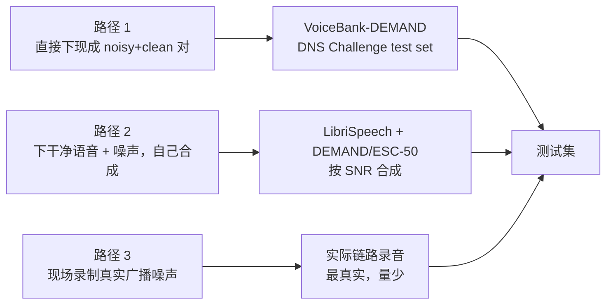

# 含噪测试音频资源清单

> **版本**: v0.1
> **日期**: 2026-07-15
> **用途**: 为降噪 A/B 实验（见 [插件架构文档](denoise-plugin-architecture.md) §7.1）和噪声识别模板录入提供测试音频源
> **关联**: [架构设计](architecture-design.md) §3、[噪声识别调研](noise-identification-research.md)

---

## 0. 资源选择策略

降噪测试需要**成对**的音频：干净参考音 + 含噪混合音，才能计算 PESQ/STOI/SI-SDR。获取路径有三条：



| 路径 | 优势 | 劣势 | 推荐度 |
|------|------|------|--------|
| 1. 现成 noisy-clean 对 | 标准基准，可对比论文结果 | 受数据集限制 | ★★★★★ 首选 |
| 2. 自行合成 | 可控 SNR、噪声类型、混响 | 需处理对齐 | ★★★★ 补充 |
| 3. 现场录制 | 最贴近真实场景 | 量少、无 ground truth | ★★★ 验证用 |

---

## 1. 现成的 noisy-clean 配对数据集（首选）

### 1.1 VoiceBank-DEMAND ⭐⭐⭐⭐⭐（语音降噪标准基准）

学术界最常用的降噪基准，几乎所有降噪论文都用它做对比。

| 项 | 内容 |
|----|------|
| **内容** | 11572 句训练 + 824 句测试，干净语音叠加 DEMAND 噪声，含 noisy + clean 配对 |
| **噪声类型** | 办公室/餐厅/火车站/地铁等真实环境噪声，按 SNR 0/5/10/15 dB 合成 |
| **格式** | 16kHz / 32kHz WAV |
| **许可** | CC-BY-NC-SA 4.0 |
| **获取** | https://datashare.ed.ac.uk/handle/10283/2791 |
| **为什么选它** | 标准基准，PESQ/STOI/SI-SDR 结果可直接和论文对比 |
| **注意** | 16kHz 原生，与 DTLN 匹配；测 RNNoise/DeepFilterNet 需重采样到 48k |

### 1.2 DNS Challenge 测试集 ⭐⭐⭐⭐⭐（微软，行业最大）

DTLN 就是参加这个比赛诞生的，测试集与训练目标完全对齐。

| 项 | 内容 |
|----|------|
| **内容** | 合成的 noisy-clean 配对（`noisyspeech_synthesizer_singleprocess.py` 生成），含 dev testset |
| **数据来源**（DNS 官方 README 列出）： | |
| - 干净语音 | LibriVox（公有领域）、VocalSet（CC-BY 4.0） | |
| - 噪声 | AudioSet（CC-BY 4.0）、Freesound CC0、DEMAND（CC-BY-SA 3.0） | |
| - 房间冲激响应 | OpenSLR26/28 | |
| **格式** | 16kHz WAV |
| **许可** | 各子数据集许可（基本可商用研究） |
| **获取** | https://github.com/microsoft/DNS-Challenge（`datasets_fullband/` 下，含下载脚本） |
| **测试集** | `V5_dev_testset/`（headset/speakerphone 各 track） |
| **为什么选它** | 噪声多样（含干扰说话人、混响），最接近真实通讯场景 |

> DNS Challenge 完整训练数据约 **数百 GB**，测试集小得多。实验只需测试集 + 合成脚本。

### 1.3 DeepFilterNet 样本页 ⭐⭐⭐⭐

DeepFilterNet 官方提供降噪前后对比音频，直接听感评估。

| 项 | 内容 |
|----|------|
| **内容** | 各类噪声场景的 noisy / DeepFilterNet / RNNoise / 样本对比 |
| **格式** | 网页播放 + WAV 下载 |
| **获取** | https://rikorose.github.io/DeepFilterNet-Samples/ |
| **为什么选它** | 快速主观听感对比，无需下载大数据集 |

### 1.4 RNNoise Demo ⭐⭐⭐

| 项 | 内容 |
|----|------|
| **内容** | RNNoise 降噪前后音频样本 |
| **获取** | https://jmvalin.ca/demo/rnnoise/ |
| **用途** | 快速听感验证 |

---

## 2. 干净语音数据集（用于自行合成带噪音频）

自行合成可精确控制 SNR、噪声类型、混响，灵活性最高。合成公式：

```
noisy = clean * gain_speech + noise * gain_noise
其中 gain 调整使 SNR = 10*log10(sum(clean²)/sum(noise²)) 达到目标
```

### 2.1 LibriSpeech（英文干净语音，首选）

| 项 | 内容 |
|----|------|
| **内容** | 1000 小时英文朗读语音，已切分标注 |
| **格式** | 16kHz FLAC |
| **许可** | CC-BY 4.0 |
| **获取** | https://www.openslr.org/12 |
| **HuggingFace 镜像** | https://huggingface.co/datasets/openslr/librispeech_asr |
| **为什么选它** | 降噪领域标准干净语音源，DNS Challenge 也用它 |

### 2.2 AISHELL-1（中文干净语音）⭐⭐⭐⭐

广播场景多为中文，需中文测试音频。

| 项 | 内容 |
|----|------|
| **内容** | 178 小时普通话朗读语音，400 个说话人 |
| **格式** | 16kHz WAV |
| **许可** | Apache 2.0 + 学术研究 |
| **获取** | https://www.openslr.org/33 |
| **为什么选它** | 中文场景必备；广播中文为主 |

### 2.3 TIMIT（经典英文，小而精）

| 项 | 内容 |
|----|------|
| **内容** | 630 说话人，每人 10 句，含音素标注 |
| **格式** | 16kHz WAV |
| **许可** | LDC（需注册，学术免费） |
| **获取** | https://catalog.ldc.upenn.edu/LDC93S1 |
| **为什么选它** | 小巧（~100MB），快速验证算法 |

### 2.4 MUSAN（音乐+语音+噪声三合一）

| 项 | 内容 |
|----|------|
| **内容** | 6 小时音乐 + 60 小时语音 + 6 小时噪声 |
| **格式** | 16kHz WAV |
| **许可** | 自由研究使用 |
| **获取** | https://www.openslr.org/17 |
| **为什么选它** | 噪声分类齐全，一份下载同时拿语音和噪声 |

---

## 3. 噪声样本库（用于合成和模板录入）

### 3.1 DEMAND ⭐⭐⭐⭐⭐（办公/环境噪声，16 通道）

| 项 | 内容 |
|----|------|
| **内容** | 16 通道录音，含办公室/餐厅/公园/公交/火车站等 18 类场景 |
| **格式** | 48kHz WAV（16 通道） |
| **许可** | CC-BY-SA 3.0 |
| **获取** | https://zenodo.org/record/1227121 |
| **为什么选它** | **48kHz 原生**（与 RNNoise/DeepFilterNet 匹配，无需重采样）；VoiceBank-DEMAND 就用它合成 |

### 3.2 ESC-50 ⭐⭐⭐⭐（环境声分类，含噪声类型标签）

噪声识别模板录入的首选--每条都带类型标签。

| 项 | 内容 |
|----|------|
| **内容** | 2000 条 5 秒录音，50 类（含雨声/风声/雷/海浪/火车/键盘/咳嗽等） |
| **格式** | 44.1kHz WAV，5 秒/条 |
| **许可** | CC-BY-NC-SA 3.0 |
| **获取** | https://github.com/karoldvl/ESC-50（单 zip ~600MB） |
| **为什么选它** | **带类别标签**，直接录入噪声识别模板库（见噪声识别调研 §6）；类别清晰 |

### 3.3 AudioSet ⭐⭐⭐⭐（谷歌，527 类，最大）

| 项 | 内容 |
|----|------|
| **内容** | 200 万段 10 秒 YouTube 音频片段，527 类（OSI 层级） |
| **格式** | 特征（128 维 log-mel）+ 原始音频需自行提取 |
| **许可** | CC-BY 4.0 |
| **获取** | https://research.google.com/audioset/ |
| **为什么选它** | 类别最全（含 electrical hum/buzz/white noise 等细分噪声类型）；PANNs/YAMNet 训练数据 |
| **注意** | 原始音频需从 YouTube 抓取，部分可能已失效 |

### 3.4 Freesound（社区噪声样本库）

| 项 | 内容 |
|----|------|
| **内容** | 50 万+ 用户上传音效，可按标签搜（如 "50hz hum"、"white noise"） |
| **许可** | 混合（CC0/CC-BY/CC-BY-NC，需逐条确认） |
| **获取** | https://freesound.org/ （需注册 API key） |
| **为什么选它** | 噪声类型极丰富，适合录入特定噪声模板 |

### 3.5 RNNoise 噪声数据（与 RNNoise 训练同源）

| 项 | 内容 |
|----|------|
| **内容** | background_noise.sw + foreground_noise.sw（含键盘声等瞬态噪声） |
| **格式** | 48kHz 16-bit raw PCM（machine endian，非 WAV） |
| **许可** | 见 RNNoise |
| **获取** | https://media.xiph.org/rnnoise/data/ |
| **为什么选它** | 48kHz 原生；RNNoise 作者精选的噪声；含贡献噪声包 `rnnoise_contributions.tar.gz` |

---

## 4. 50Hz 工频哼声（广播场景特有，需单独处理）

通用数据集少见工频哼声样本，需自行录制或合成：

| 方法 | 说明 |
|------|------|
| **合成** | `hum = 0.1*sin(2π*50t) + 0.05*sin(2π*100t) + 0.025*sin(2π*150t)` 加到干净音频上，可控强度 |
| **Freesound 搜索** | 搜 "mains hum"、"electrical hum"、"50hz" 标签，有真实录音 |
| **现场录制** | 用接地不良的音频链路录制，最真实 |
| **AudioSet 标签** | "Mains hum"（标签 ID `/m/07r6w6_`）类有样本 |

---

## 5. 推荐测试集组合

针对本系统三种应用场景，推荐组合：

### 5.1 语音降噪 A/B 对比（验证 RNNoise vs DTLN vs DeepFilterNet）

| 资源 | 用途 | 优先级 |
|------|------|--------|
| VoiceBank-DEMAND | 标准基准 noisy-clean 对，直接出 PESQ/STOI | 必备 |
| LibriSpeech + DEMAND | 自行合成可控 SNR 测试 | 推荐 |
| AISHELL-1 | 中文场景验证 | 推荐 |

### 5.2 噪声识别模板录入

| 资源 | 用途 | 优先级 |
|------|------|--------|
| ESC-50 | 带标签的环境噪声，直接录入模板库 | 必备 |
| Freesound | 按需搜特定噪声（空调/风扇/哼声） | 推荐 |
| 现场录制 | 实际广播链路噪声，最贴近 | 必备（小量） |

### 5.3 广播主备链路验证

| 资源 | 用途 | 优先级 |
|------|------|--------|
| 自行合成 50Hz 哼声 | 工频干扰场景 | 推荐 |
| 现场录制主备链路 | 真实比对验证 | 必备 |

---

## 6. 许可与使用注意事项

| 数据集 | 许可 | 商用 | 备注 |
|--------|------|------|------|
| VoiceBank-DEMAND | CC-BY-NC-SA 4.0 | ❌ 非商用 | 仅研究/验证，产品不打包 |
| DNS Challenge | 各子集许可 | 多数可研究 | 测试集可研究用 |
| LibriSpeech | CC-BY 4.0 | ✅ | 需署名 |
| AISHELL-1 | Apache 2.0 | ✅ 学术 | 商用需联系 |
| DEMAND | CC-BY-SA 3.0 | ✅ | 需署名+同协议 |
| ESC-50 | CC-BY-NC-SA 3.0 | ❌ 非商用 | 仅研究 |
| AudioSet | CC-BY 4.0 | ✅ | 需署名 |
| Freesound | 混合 | 逐条确认 | 优先选 CC0 |

> **重要**：含 `NC`（非商用）的数据集（VoiceBank-DEMAND、ESC-50）**只能用于研究验证**，不能打包进产品分发。产品部署需用 CC0/CC-BY 数据或自录制。实验期验证无限制。

---

## 7. 快速上手命令

虚拟机验证的最小资源集（无需下载数百 GB）：

```bash
# 1. ESC-50（噪声识别模板，~600MB，单 zip）
wget https://github.com/karoldvl/ESC-50/archive/master.zip

# 2. LibriSpeech dev-clean（干净语音，~340MB）
wget https://www.openslr.org/resources/12/dev-clean.tar.gz

# 3. DEMAND 一个场景（噪声，48kHz，验证主用）
# 从 https://zenodo.org/record/1227121 选 OFFICE 等场景下载

# 4. AISHELL-1（中文语音，需注册同意条款）
# https://www.openslr.org/33

# 5. RNNoise 噪声数据（48kHz，与 RNNoise 同源）
wget https://media.xiph.org/rnnoise/data/background_noise.sw

# 6. 合成 50Hz 哼声（无需下载，用 ffmpeg/sox）
sox -n -r 48000 -c 1 hum50.wav synth 10 sine 50 sine 100 sine 150
```

合成 noisy-clean 对（Python，需 numpy + soundfile）：

```python
import numpy as np, soundfile as sf
clean, sr = sf.read("clean.wav")          # LibriSpeech
noise, _  = sf.read("noise.wav")          # DEMAND
noise = np.resize(noise, clean.shape)     # 对齐长度
target_snr_db = 10
noise_gain = np.sqrt(np.sum(clean**2) / (np.sum(noise**2) * 10**(target_snr_db/10)))
noisy = clean + noise_gain * noise
sf.write("noisy_snr10.wav", noisy, sr)
```

详见 [插件架构文档 §7.1 测试集](denoise-plugin-architecture.md)。
