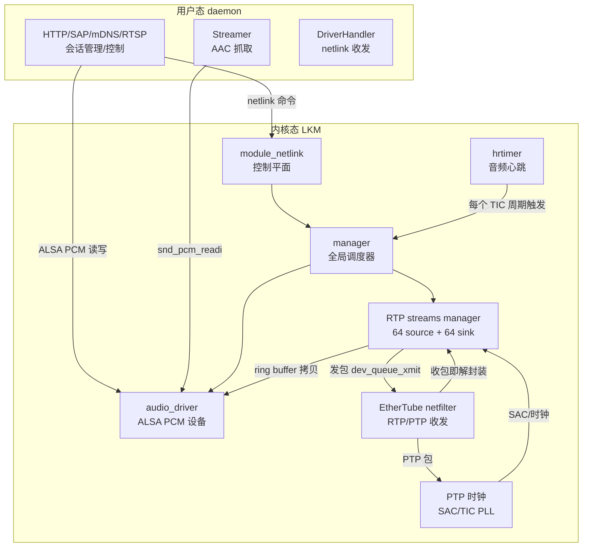
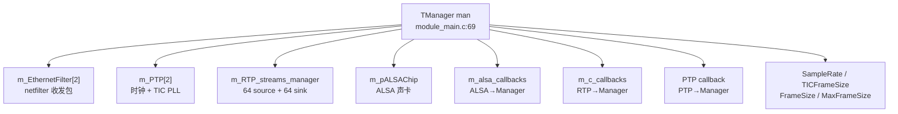
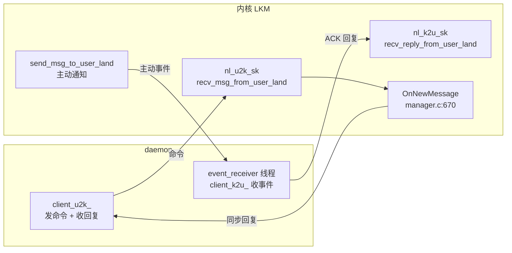
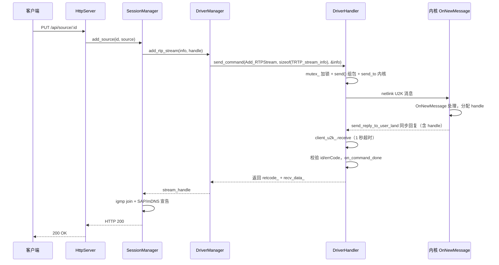
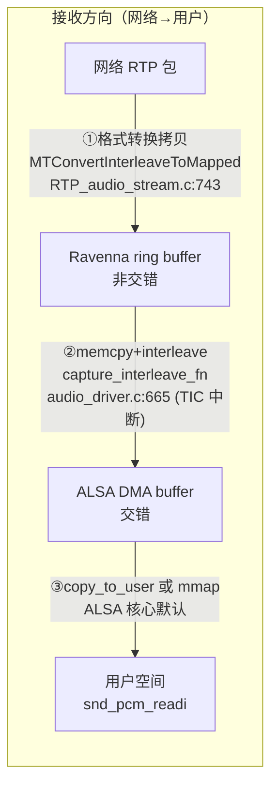
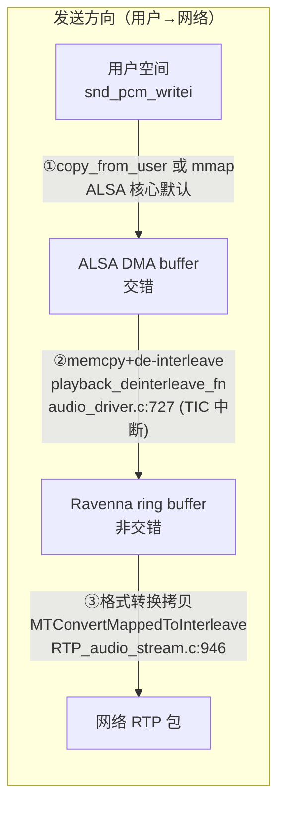
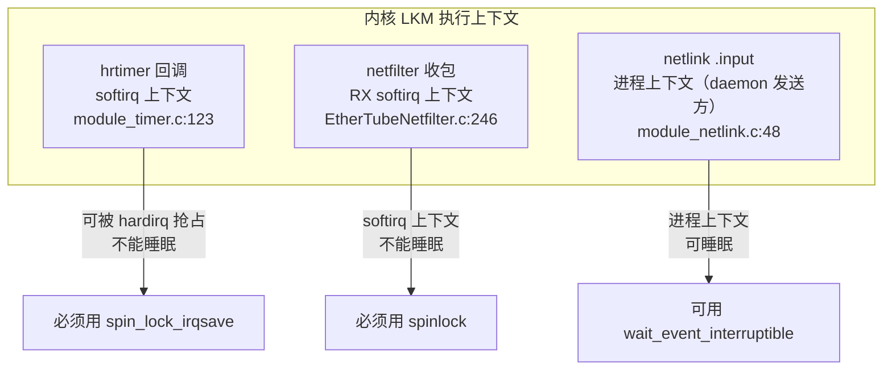
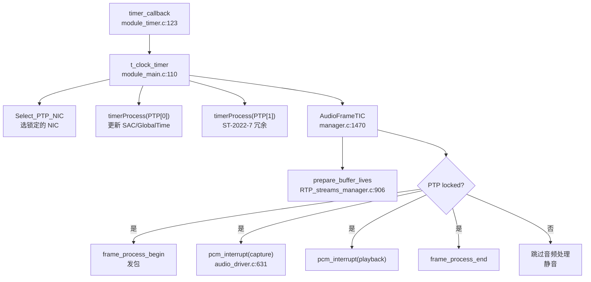
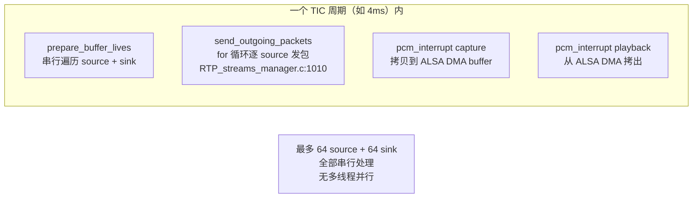

# 驱动层与应用层通讯交互维护手册

> 适用范围：`daemon/` 用户态守护进程 + `3rdparty/ravenna-alsa-lkm/` 内核模块（MergingRavennaALSA.ko）
> 目的：讲清楚「应用层（daemon）与 ALSA 驱动层（LKM）之间如何通讯」——驱动层如何把音频数据交给应用层（共享内存还是数据拷贝）、应用层如何给驱动层下发指令、内核内部的线程模型、以及如何同时收发多路音频。
> 目标读者：对 ALSA 驱动接口不熟悉、需要维护 daemon↔驱动通讯链路的开发者。
> 所有结论均带源码位置（`文件:行号`），便于核对。路径相对仓库根。

---

## 0. 一句话结论（速览）

1. **两条通道、职责分离**：控制走 **netlink**（自定义协议号，非 generic netlink），数据走 **ALSA PCM**（标准 ALSA 子系统）。RTP 网络音频的真正收发在**内核态**完成，daemon 只负责配置/发现/会话管理，不介入音频数据实时路径。

2. **应用层下发指令 = 同步阻塞的 netlink 命令**：daemon 用 `send_command` 加锁后 `send`→`receive`（1 秒超时）串行下发，消息体是自定义二进制结构体 `MT_ALSA_msg` + 紧随其后的 C 结构体 payload（如 `TRTP_stream_info`），**不是 JSON**。

3. **音频数据传输 = mmap 与拷贝并存，但本质非零拷贝**：ALSA DMA buffer 支持 mmap（共享内核内存），但驱动**没有注册** `.copy/.ack/.mmap/.transfer` 回调，依赖 ALSA 核心默认机制。实际存在**两个独立 buffer**——ALSA DMA buffer（交错格式，与用户空间共享）+ Ravenna ring buffer（非交错格式，内核专用），PTP 定时中断在两者间做格式转换拷贝。每个方向经历 **2–3 次拷贝**。

4. **多路并发是串行、不是并行**：一个 TIC 周期内（如 4ms），驱动在单一 softirq 上下文中**串行遍历**最多 64 路 source + 64 路 sink。「同时」靠时间分片——每个周期内把所有流的发包/收包/拷贝依次跑完。接收在 netfilter softirq 中包到达即处理，发送在 TIC 周期内串行。

5. **单一 hrtimer 驱动全局音频心跳，无 kthread/workqueue**：内核侧只有 softirq 上下文（hrtimer + netfilter），netlink 命令在进程上下文。所有锁均为 `spinlock`（softirq 不能睡眠、不能用 mutex）。daemon 侧 7+ 个独立线程均不直接介入实时音频路径。

---

## 1. 总体架构：三明治与双通道

整个系统是一个「三明治」：上层是 daemon 用户态服务（HTTP/SAP/mDNS/RTSP/SDP/IGMP/AAC streamer/OCA），下层是 Linux 网络与 ALSA 子系统，中间夹着 LKM 驱动。LKM 把网络 RTP 包和 ALSA PCM 设备桥接起来。



### 1.1 两条用户态↔内核态通道

| 通道 | 协议 | 方向 | 用途 | daemon 侧封装 |
|------|------|------|------|--------------|
| **Netlink（控制平面）** | 旧式自定义协议族，`NETLINK_U2K_ID=31` / `NETLINK_K2U_ID=29` | 双向 | 下发配置命令、查询状态、驱动主动事件通知 | `DriverHandler` + `DriverManager` |
| **ALSA PCM（数据平面）** | 标准 ALSA `snd_pcm` | 双向 | 音频数据读写（仅 Streamer 用到） | `Streamer` |

### 1.2 内核态 vs 用户态协议边界（关键）

这个边界对维护极其重要——它决定哪些改动需要重编内核模块、哪些只需重编 daemon：

| 协议/功能 | 执行位置 | 证据 |
|----------|---------|------|
| **PTP**（IEEE 1588v2 Sync/FollowUp/Announce/DelayReq） | 内核态 | `PTP.c:229` `process_PTP_packet()` 在 netfilter 收包路径调用；发包 `PTP.c:788` |
| **RTP**（音频包收发） | 内核态 | `manager.c:1243` `DispatchPacket` → `process_UDP_packet`；发送经 `dev_queue_xmit` |
| **SAP**（源发现/宣告） | 用户态 daemon | LKM 无 SAP 代码 |
| **mDNS**（Avahi） | 用户态 daemon | LKM 无 mDNS 代码 |
| **RTSP**（SDP 传输） | 用户态 daemon | LKM 无 RTSP 代码 |
| **HTTP REST** | 用户态 daemon | LKM 无 HTTP 代码 |
| **IGMP**（组播管理） | 用户态 daemon | 组播包由内核 IP 栈处理，驱动只管 RTP 负载 |

> **含义**：修改 SAP/mDNS/RTSP/HTTP 只需重编 daemon；修改 PTP/RTP 收发逻辑或 TIC 定时器必须重编 LKM。

---

## 2. 驱动全景：模块与初始化

### 2.1 单一全局管理器

驱动内只有一个全局单例 `struct TManager man`（`module_main.c:69`），持有所有子系统。不存在多实例、不存在动态分配管理器。



`struct TManager` 定义见 `manager.h:67-108`。

### 2.2 模块加载初始化顺序

`module_interface.c:265` 注册 `merging_alsa_mod_init`（`module_interface.c:223-253`），严格有序：

| 步骤 | 位置 | 做什么 | 失败回滚 |
|------|------|--------|---------|
| 1 | `module_interface.c:228` | 设置 netfilter 回调函数指针 | — |
| 2 | `module_interface.c:229` | `setup_netlink()`：创建 U2K/K2U 两个内核 netlink socket | 跳到 _failed |
| 3 | `module_interface.c:234` | `init_driver()` → `init(&man)`：初始化 manager | `cleanup_netlink()` |
| 4 | `module_interface.c:240` | `init_clock_timer()`：初始化 hrtimer（此时未启动） | `cleanup_netlink()` + `destroy_driver()` |

`init(&man)` 内部（`manager.c:126-219`）：设默认值（SampleRate=44100, TICFrameSizeAt1FS=512, MaxFrameSize=1024, 64in/64out）→ `init_alsa_callbacks()` + `Init_C_Callbacks()` 填充三套回调 vtable → 每个 NIC `InitEtherTube()`（注册 netfilter hook，`NF_INET_PRE_ROUTING`）→ 每个 NIC `init_ptp()` → `init_(&m_RTP_streams_manager)` → `mr_alsa_audio_card_init()`（注册 ALSA 声卡，最后做，因需要回调表完整）。

**依赖关系**：netfilter hook 必须先于 PTP/RTP（收包路径就绪）；ALSA 声卡注册最后（需要回调表完整）；hrtimer 在 manager 之后（timer 回调会调 `t_clock_timer()` → manager）。

### 2.3 三套回调 vtable（松耦合协作）

驱动内部各子系统不直接继承，而通过回调函数指针表协作：

| 回调表 | 定义位置 | 谁填充 | 谁调用 | 方向 |
|--------|---------|--------|--------|------|
| `rtp_audio_stream_ops` | `EtherTubeInterfaces.h:71` | `Init_C_Callbacks()` `manager.c:1593` | RTP streams manager | Manager→RTP：提供 buffer/SAC/frame_size |
| `clock_ptp_ops` | `EtherTubeInterfaces.h:98` | `Init_C_Callbacks()` `manager.c:1612` | PTP | PTP→Manager：AudioFrameTIC 触发 |
| `ravenna_mgr_ops` | `audio_driver.h:43` | ALSA driver（attach 时传入） | Manager | Manager→ALSA：get buffer/pcm_interrupt |
| `struct alsa_ops` | `audio_driver.h:61` | `init_alsa_callbacks()` `manager.c:1952` | ALSA driver | ALSA→Manager：set_sample_rate/start_stop |

### 2.4 模块注销清理顺序

`merging_alsa_mod_exit()`（`module_interface.c:257-263`）严格逆序于初始化：停定时器 → 释放 netlink → `destroy(&man)`（停网络 → 停 IO → 注销 ALSA → 销毁 RTP → 销毁 PTP → 注销 netfilter hook）。这确保音频 IO 先停、再停网络、最后停时钟，避免回调访问已释放资源。

### 2.5 c_wrapper_lib 是什么（易误解点）

`c_wrapper_lib.c` **不是第三条用户态↔内核态通道**，而是 Linux 内核 API 的薄封装层（`c_wrapper_lib.c:55-248`）。此驱动从 Windows(RTX)/macOS(kext) C++ 移植为 Linux C（`manager.c:12` 注释 "C port"），`c_wrapper_lib` 抽象平台特定内核 API（`nf_register_net_hook`、`dev_queue_xmit`、`dev_alloc_skb`、`dev_get_by_name` 等），使核心逻辑平台无关。其中的 `CW_netlink_send_*` 只是转发调用 `module_netlink.c` 的函数，不是独立通道。

---

## 3. 控制平面：应用层如何给驱动层下发指令

### 3.1 netlink 协议选型

**用的是旧式自定义 netlink 协议族，不是 generic netlink（genl）。** 直接基于 `PF_NETLINK` + `SOCK_RAW` + `netlink_kernel_create`，占用两个私有协议号：

```c
// 3rdparty/ravenna-alsa-lkm/common/MT_ALSA_message_defs.h:35-37
#define NETLINK_U2K_ID 31   // daemon → 驱动（命令 + 同步回复）
#define NETLINK_K2U_ID 29   // 驱动 → daemon（主动事件 + ACK）
#define MAX_PAYLOAD 1024
```

这是介于 0–31 的私有协议号，**非** `NETLINK_USERSOCK=2`、**非** `NETLINK_GENERIC=16`。**无 family name、无 multicast group**，全程 `nlmsg_unicast` 单播到对端 PID（`module_netlink.c:135,218`，`dst_group=0`）。

daemon 侧 `nl_protocol` 类（`netlink.hpp:60-77`）：`family()` 返回 `PF_NETLINK`，`type()` 返回 `SOCK_RAW`。

### 3.2 双 socket 通道



- **U2K socket**（命令，daemon→驱动，协议号 31）：daemon 发命令、收同步回复；驱动 `.input = recv_msg_from_user_land`（`module_netlink.c:248,255`）。
- **K2U socket**（事件，驱动→daemon，协议号 29）：驱动主动通知 daemon、收 ACK；驱动 `.input = recv_reply_from_user_land`（`module_netlink.c:249,266`）。

### 3.3 消息格式：自定义二进制结构体

**无 JSON、无 TLV、无 genl attr。** 线上布局为 `[nlmsghdr][MT_ALSA_msg][data payload]`，payload 就是 C 结构体的 `memcpy`。

```c
// MT_ALSA_message_defs.h:78-85
struct MT_ALSA_msg {
    enum MT_ALSA_msg_id id;
    int errCode;
    int dataSize;
    void* data;   // 传输时占位无意义；真正的 data 紧跟结构体之后
};
```

- 组包（`driver_handler.cpp:53-80`）：构造 `MT_ALSA_msg`（`id`/`errCode=0`/`dataSize`），用 `nlmsghdr` 包装（`nlmsg_type=NLMSG_DONE`，`nlmsg_pid=getpid()`），`memcpy(NLMSG_DATA(nlh), &alsa_msg, sizeof(MT_ALSA_msg))` 再把 payload 紧随其后。
- 解包：标准 netlink 宏 `NLMSG_OK`/`NLMSG_NEXT` 遍历，`NLMSG_DATA` 取载荷；payload 内部用 `data_offset = sizeof(struct MT_ALSA_msg)`（`driver_handler.hpp:34-35`）跳过消息头定位 data。
- syscall：经 boost::asio `basic_raw_socket`，底层即 `sendto`/`recvfrom`（`netlink_client.hpp:50-71`）。

### 3.4 命令枚举

`enum MT_ALSA_msg_id`（`MT_ALSA_message_defs.h:40-76`，共 33 个值 0–32）。注释标 `U2K`/`K2U` 方向。主要命令分组：

| 组 | 枚举值 | 名称 | 方向 | payload |
|----|--------|------|------|---------|
| 生命周期/IO | 0–4 | Start/Stop/Reset/StartIO/StopIO | U2K | 无参 |
| 采样率/音频模式 | 5 | SetSampleRate | U2K K2U | uint32 |
| | 6 | GetSampleRate | U2K | uint32 |
| TIC frame | 9 | SetTICFrameSizeAt1FS | U2K | uint64 |
| | 10 | SetMaxTICFrameSize | U2K | uint64 |
| IO 数量 | 11–14 | Set/GetNumberOfInputs/Outputs | U2K | uint32 |
| 接口/流 | 15 | SetInterfaceName | U2K | string（含 `\0`）|
| | 16 | Add_RTPStream | U2K | `TRTP_stream_info` → 返回 handle |
| | 17 | Remove_RTPStream | U2K | handle(uint64) |
| | 18 | Update_RTPStream_Name | U2K | `TRTP_stream_update_name` |
| 连接/NADAC | 20–22 | Hello/Bye/Ping | U2K K2U | 无参 |
| | 23–24 | SetMasterOutputVolume/Switch | U2K K2U | int32（NADAC）|
| 延迟/状态/PTP | 27 | SetPlayoutDelay | U2K | int32 |
| | 28 | SetCaptureDelay | U2K | int32 |
| | 29 | GetRTPStreamStatus | U2K | handle → `TRTP_stream_status` |
| | 30/31/32 | SetPTPConfig/GetPTPConfig/GetPTPStatus | U2K | `TPTPConfig`/`TPTPStatus` |

注释标 `K2U` 的即驱动可主动推送的事件类型。daemon 侧字符串名表 `alsa_msg_str`（`driver_manager.cpp:25-57`）与此 enum 顺序严格一一对应。

### 3.5 下发指令的完整调用链（从 HTTP 到内核）

以「通过 HTTP API 添加一个 RTP source」为例，端到端调用链：



关键编排点（均可在源码核对）：
- `main.cpp:161` `DriverManager::create()`（工厂内部按 `FAKE_DRIVER` 宏在编译期选 real/fake）→ `main.cpp:163` `driver->init(*config)`。
- `main.cpp:174` `SessionManager::create(driver, browser, config)`：session_manager 持有 `driver_` 指针，是所有驱动指令的编排者。
- `session_manager.cpp:663` `driver_->add_rtp_stream(info.stream[0], info.handle[0])`：真正下发驱动的入口。
- `session_manager.cpp:649,651` `driver_->remove_rtp_stream()`；`session_manager.cpp:737` `driver_->get_current_sample_rate()`。

### 3.6 add_rtp_stream 同步往返详解

命令是**同步阻塞**的（非异步回调），命令间串行（mutex）：

1. `DriverManager::add_rtp_stream`（`driver_manager.cpp:172-183`）调 `send_command(MT_ALSA_Msg_Add_RTPStream, sizeof(TRTP_stream_info), &stream_info)`。
2. `DriverHandler::send_command`（`driver_handler.cpp:143-202`）：`mutex_` 加锁（保证一次一条命令，行 146）→ `send()` 组包并 `send_to` 内核（行 156）。
3. 驱动 `recv_msg_from_user_land`（`module_netlink.c:48-103`）收到 → `nl_rx_msg`（`module_main.c:95-98`）→ `OnNewMessage`（`manager.c:670`，大 switch）处理 Add_RTPStream → `send_reply_to_user_land` 把回复（含分配的 handle）经 U2K socket 单播回 daemon。
4. daemon `client_u2k_.receive`（`driver_handler.cpp:167`，1 秒超时 `reply_timeout_secs=1`，`driver_handler.hpp:36`）收回复，`NLMSG_OK` 遍历，校验 `id == palsa_msg->id`（行 185）和 `errCode==0`（行 191）→ `on_command_done`（行 193-195）。
5. `on_command_done`（`driver_manager.cpp:258-265`）：`memcpy(recv_data_, data, size)`，`retcode_=成功`。
6. `add_rtp_stream` 从 `recv_data_` `memcpy` 出 `stream_handle`（`driver_manager.cpp:177-178`），返回 `retcode_`。

### 3.7 启动建连与 Hello 握手

daemon 启动时（`driver_manager.cpp:73-98`）：
1. `DriverHandler::init`（`driver_handler.cpp:36-51`）：打开两个 socket（U2K=31、K2U=29），启动 `event_receiver` 异步线程（行 44）。若失败提示 "Kernel module not loaded?"（行 48）。
2. `hello()`（`driver_manager.cpp:108-111`）→ `send_command(MT_ALSA_Msg_Hello)`。**这是建连关键**：驱动收到 Hello 才记录 `daemon_pid_`（`module_netlink.c:64-74`），之后所有单播才有目标。Hello 前 `daemon_pid_=-1`，`send_reply_to_user_land` 会直接返回 -5（`module_netlink.c:115-116`）。
3. 若 `driver_restart`（来自 `config`，`main.cpp:270`），依次 `start()`→`reset()`→`set_interface_name()`→`set_ptp_config()`→`set_tic_frame_size_at_1fs()`→`set_playout_delay()`→`set_max_tic_frame_size()`（`driver_manager.cpp:88-94`）。

### 3.8 反向通道 K2U（驱动主动通知 daemon）

**驱动→daemon 主动发消息**：`send_msg_to_user_land(tx_msg, rx_msg)`（`module_netlink.c:187-243`）经 K2U socket 单播到 `daemon_pid_`（行 218）。`rx_msg` 非 NULL 时 `wait_event_interruptible_timeout(response_waitqueue, have_response, 1s)`（行 226）**可睡眠**等待 daemon ACK（证明命令在进程上下文）；为 NULL 时不等待。

触发场景（`manager.c`）：采样率变化发 `SetSampleRate`（`rx_msg=NULL` 不等回复，`manager.c:1647-1651`）；NADAC 音量变化发 `SetMasterOutputVolume`（带 `&msgAnswer` 等回复，`manager.c:1822-1828`）；NADAC 开关变化（`manager.c:1842-1848`）；驱动查询 daemon 当前值（`manager.c:1866-1871,1900-1905`）。

daemon 侧：独立 `event_receiver` 线程（`std::async`，`driver_handler.cpp:44,82-131`）在 K2U socket 上 `receive`（1 秒超时循环）。收到后调 `on_event(id, ...)`（`driver_handler.cpp:111-112`）分发（`driver_manager.cpp:274-331`：处理 Hello/Bye、SetMasterOutputVolume/Switch、SetSampleRate、GetMasterOutputVolume/Switch），处理完把 ACK 发回驱动——驱动在 `recv_reply_from_user_land`（`module_netlink.c:145-185`）接收并 `wake_up_all`（行 183-184）唤醒等待。

> **注意**：PTP 状态变化**不是驱动 K2U 推送**，而是 daemon 主动轮询——`SessionManager::worker` 主循环以可配置间隔（`ptp_interval`，默认每轮循环都查）调 `driver_->get_ptp_status()`（`session_manager.cpp:1371-1438`，走 U2K 命令 `GetPTPStatus`/`GetPTPConfig`，行 1376-1377）。

### 3.9 关键 netlink 消息体结构

`add_rtp_stream` 的 payload `TRTP_stream_info`（`RTP_stream_info.h:51-107`，`#pragma pack(push,1)` 紧凑布局）关键字段：`m_ui32CRTP_stream_info_sizeof`（首成员，版本/大小校验）、`m_cName[64]`、`m_ui32FrameSize`、`m_ui32MaxSamplesPerPacket`、`m_ui8DestMAC[6]`、`m_ucDSCP`、`m_ui32DestIP`、`m_usSrcPort`/`m_usDestPort`、`m_byPayloadType`、`m_ui32SSRC`、`m_ui32SamplingRate`、`m_cCodec[10]`、`m_byNbOfChannels`、`m_bSource`、`m_bIsPrimaryPort`（ST-2022-7）、`m_aui32Routing[64]`。返回值是 `uint64_t stream_handle`。

其他：`TPTPConfig`（`audio_streamer_clock_PTP_defs.h:43-47`，`domain`+`dscp`）、`TPTPStatus`（同文件 49-56）、`TRTP_stream_status`（`RTP_stream_info.h:109-124`，位域 flags）、`TRTP_stream_update_name`（`RTP_stream_info.h:144-148`）。

### 3.10 fake_driver_manager（CI 无硬件路径）

切换机制：`driver_interface.hpp:23-27` 用 `#ifdef _USE_FAKE_DRIVER_` 在编译期选择。

`FakeDriverManager`（`fake_driver_manager.hpp` + `.cpp`）：**不继承 `DriverHandler`、完全不涉及 netlink/socket**，所有方法纯内存操作——用 `std::set<uint16_t> handles_` + 静态 `g_handle` 模拟流句柄（`fake_driver_manager.cpp:120-129`），`get_ptp_status` 返回 `PTPLS_UNLOCKED` + 假 GMID（`fake_driver_manager.cpp:104-114`），`get_number_of_inputs/outputs` 返回 0。因此 CI（`buildfake.sh`，`FAKE_DRIVER=ON`）无需加载内核模块即可跑通 `daemon-test` 套件全部驱动接口调用。两者 `init()` 调用序列相同（对比 `driver_manager.cpp:73-98` 与 `fake_driver_manager.cpp:37-58`），上层调用者无感知。

---

## 4. 数据平面：驱动层如何把音频数据给到应用层

### 4.1 核心结论：mmap 与拷贝并存，本质非零拷贝

ALSA DMA buffer **支持** mmap（`runtime->dma_area` 为 vmalloc 内核内存，通过 page fault 映射到用户空间，硬件能力标志含 `SNDRV_PCM_INFO_MMAP | MMAP_VALID`，`audio_driver.c:1215-1221,1252-1258`），但驱动**没有注册** `.copy`/`.ack`/`.mmap`/`.transfer` 回调（`snd_pcm_ops` 见 `audio_driver.c:2126-2157`，只有 open/close/ioctl/hw_params/hw_free/prepare/trigger/pointer/page）。

**含义**：当应用用 `snd_pcm_mmap_begin/commit` 时是零拷贝直接访问；当用 `snd_pcm_writei/readi`（read/write 路径）时，ALSA 核心用 `copy_from_user`/`copy_to_user` 在用户 buffer 和 `runtime->dma_area` 间拷贝。daemon 的 Streamer 用 `snd_pcm_readi`，对它而言是**数据拷贝**。

### 4.2 两个独立 buffer（理解数据平面的钥匙）

内核中存在**两个独立 buffer**，PTP 定时中断在两者间做格式转换拷贝：

| Buffer | 位置 | 格式 | 分配 | 谁读写 |
|--------|------|------|------|--------|
| **ALSA DMA buffer** | `runtime->dma_area`（prepare 中存为 `chip->dma_playback_buffer`/`dma_capture_buffer`，`audio_driver.c:1033,1082`） | **交错**（interleaved） | `snd_pcm_lib_alloc_vmalloc_buffer`（`audio_driver.c:1664`，<6.12）或 `snd_pcm_set_managed_buffer_all`（`audio_driver.c:2296`，≥6.12） | 与用户空间共享（mmap） |
| **Ravenna ring buffer** | `chip->playback_buffer`/`chip->capture_buffer` | **非交错**（per-channel） | `vmalloc()`（`audio_driver.c:2221,2233`） | 内核专用，RTP 层直接读写 |

**关键事实**：RTP 层的 "live_in/live_out jitter buffer" **就是** Ravenna ring buffer 本身——`get_live_in_jitter_buffer()`（`manager.c:1352`）直接返回 `chip->capture_buffer + ulChannelId * bufferLength`，`get_live_out_jitter_buffer()`（`manager.c:1371`）返回 `chip->playback_buffer`。

### 4.3 数据流向与拷贝次数





**每个方向 2–3 次拷贝**。驱动**没有**在内核里直接把 RTP payload 解封装进 ALSA ring buffer——RTP payload 先解封装进 Ravenna ring buffer（非交错），TIC 中断再拷贝到 ALSA DMA buffer（交错），是两次独立拷贝、不同代码路径、不同时机。

### 4.4 ALSA PCM 设备注册

`snd_pcm_new(card, CARD_NAME, 0, 1, 1, &pcm)`（`audio_driver.c:2274`）：**1 个 PCM 设备**，1 个 playback substream + 1 个 capture substream。
- 最大通道数 `MR_ALSA_NB_CHANNELS_MAX = MAX_NUMBEROFINPUTS`：完整构建 128（`MergingRAVENNACommon.h:70`）/ 精简构建 64（`MergingRAVENNACommon.h:65`），运行时默认 64+64（`MergingRAVENNACommon.h:81-82`）。
- 支持格式 S16_LE/S24_LE/S24_3LE/S32_LE；支持采样率 44.1k–384k。
- 通道映射通过 `snd_pcm_add_chmap_ctls` 注册 SMPTE 标准布局（`audio_driver.c:2283`，最大 8 通道）。

### 4.5 buffer/period 配置与 daemon.conf 关系

| daemon.conf 参数 | netlink 命令 | 驱动变量 | 证据 |
|---|---|---|---|
| `tic_frame_size_at_1fs` | `SetTICFrameSizeAt1FS` | `m_TICFrameSizeAt1FS` | `manager.c:862-878`，`driver_manager.cpp:213-214` |
| `max_tic_frame_size` | `SetMaxTICFrameSize` | `m_MaxFrameSize` | `manager.c:880+`，`driver_manager.cpp:219-220` |
| `playout_delay` | `SetPlayoutDelay` | `m_nPlayoutDelay` | `manager.c:1116-1129`，`driver_manager.cpp:225-226` |

- **frame_size 计算**（`manager.c:390`）：`m_ui32FrameSize = m_TICFrameSizeAt1FS * nFS`，nFS 按采样率倍数（48k=1, 96k=2, 192k=4, 384k=8），上限 `MAX_HORUS_SUPPORTED_FRAMESIZE_IN_SAMPLES = 1024`（`MergingRAVENNACommon.h:90`）。
- **frame_size = ALSA period_size**：PTP 定时器每个 frame_size 采样触发一次中断，调 `snd_pcm_period_elapsed()`（`audio_driver.c:704,765`）。
- **RINGBUFFERSIZE（16384 帧，`MergingRAVENNACommon.h:88`）= ALSA buffer_size**（`audio_driver.c:547,551`）= Ravenna ring buffer 大小。
- `playout_delay` 在 prepare 中设为 `runtime->delay`（`audio_driver.c:1001`），告知 ALSA 额外播放延迟。
- ALSA period_size 约束列表基于 AES67 标准尺寸 `{6,12,16,48,64,128,192,384,512}` 乘采样率系数（`audio_driver.c:2047-2056`）。
- `jitter_buffer_multiplier` 模块参数（默认 3，`audio_driver.c:91-94`）控制 jitter buffer 深度，但 `set_jitter_buffer_depth` 回调**未在 manager.c 注册**（`manager.c:1952-1971`），当前为空操作。

### 4.6 多通道映射（map）

`map[stream_channel] = alsa_channel`，即 RTP 流通道到物理 ALSA/Ravenna 通道的映射。
- daemon→驱动传递（`session_manager.cpp:600,922`）：`std::copy(source.map.begin(), source.map.end(), info.stream[0].m_aui32Routing)`。
- 驱动内部（`RTP_stream_info.c:304-309`）：`get_routing(stream_info, channel) → m_aui32Routing[channel]`。
- Sink 接收：`ProcessRTPAudioPacket`（`RTP_audio_stream.c:119,249`）对每个 RTP 通道调 `get_routing()` 取物理通道 ID，再 `get_live_in_jitter_buffer()` 取 `capture_buffer + channelId * RINGBUFFERSIZE * sample_bytelength` 写入。
- Source 发送：`SendRTPAudioPacket`（`RTP_audio_stream.c:128`）同理从 `playback_buffer` 对应通道读。

### 4.7 daemon Streamer 如何读取音频

Streamer（`streamer.cpp`）抓取 ALSA 捕获设备做 AAC 编码，是 daemon 唯一使用 ALSA PCM API 的地方：
- 打开：`snd_pcm_open(&capture_handle_, "plughw:RAVENNA", SND_PCM_STREAM_CAPTURE, SND_PCM_NONBLOCK)`（`streamer.cpp:189-190`）——注意用 `plughw:RAVENNA`（带 plugin 层，可能引入额外格式转换）而非 `hw:RAVENNA`，非阻塞打开。
- 访问模式：`SND_PCM_ACCESS_RW_INTERLEAVED`（`streamer.cpp:211-212`）。
- 读取：`snd_pcm_readi`（`streamer.cpp:160`），非阻塞打开下返回 `-EAGAIN` 时用 `snd_pcm_wait(capture_handle_, 1000)` 等待就绪后重试（`streamer.cpp:161-164`）——**非阻塞打开 + 轮询等待**混合模式。
- 抓取所有配置通道（默认 8，`streamer.cpp:233`），格式 S16_LE（`streamer.hpp:82`），按每个 sink 的 `map` 提取特定通道做 AAC 编码（`streamer.cpp:329-334`）。

> **重要**：常规 RTP source/sink 的音频数据**完全在内核态流转**，不经过 daemon 用户态。Streamer 的 ALSA 读取只用于 HTTP AAC 流推送这个附加功能，不是 RTP 音频的主路径。

---

## 5. 线程模型

### 5.1 内核侧执行上下文



| 执行路径 | 上下文 | 能否睡眠 | 证据 |
|---------|--------|---------|------|
| hrtimer 回调 `timer_callback` | softirq（tasklet 或 soft hrtimer） | **否** | `module_timer.c:123`；<6.15 用 `tasklet_hrtimer`（行 56,219,65,70），≥6.15 用 `HRTIMER_MODE_ABS_SOFT`（行 222-223）；支持 CPU pinning（行 43-45,251） |
| netfilter 收包 `rx_packet` | RX softirq | **否** | `EtherTubeNetfilter.c:246`，hook 在 `NF_INET_PRE_ROUTING`（`c_wrapper_lib.c:60`） |
| netlink `.input` `recv_msg_from_user_land` | 进程上下文（daemon 发送方） | **是** | `module_netlink.c:48`；`send_msg_to_user_land` 调 `wait_event_interruptible_timeout`（行 226）证明可睡眠 |

**无 kthread、无 workqueue**：搜索整个 driver 目录未找到 `kthread`/`workqueue`/`work_struct` 使用。所有实时音频处理在 softirq 串行完成。

### 5.2 单一 hrtimer 驱动全局音频心跳

整个音频引擎只有**一个** hrtimer（CLOCK_MONOTONIC）。每个 TIC 周期触发回调链（`module_timer.c:123-164` `timer_callback`）：



`AudioFrameTIC`（`manager.c:1470-1589`）的 PTP 门控在行 1476：`if (m_bIORunning && m_lastLockStatus[m_Active_PTP_NIC_Idx] == PTPLS_LOCKED)`，未锁定则跳过音频处理。

TIC 周期 = `tic_frame_size × nFS × 1e9 / sample_rate` 纳秒（`module_timer.c:290-297`）。例如 tic_frame_size_at_1fs=192, 48kHz → 4ms。

### 5.3 daemon 侧线程全貌

daemon 进程包含以下线程（均在 `main.cpp` 中创建）：

| 线程 | 创建位置 | 功能 | 与内核 hrtimer 关系 |
|------|---------|------|---------------------|
| Main loop | `main.cpp:256` | IP/配置变更监控，每秒 sleep | 无 |
| HTTP server | `http_server.cpp:479` | `std::async` + `svr_.listen()`，httplib 线程池 | 间接：REST→netlink→内核 |
| SessionManager worker | `session_manager.hpp:124` | `std::async`，PTP 状态轮询、SAP 公告、auto-sink 更新 | 间接：PTP locked 触发音频启停 |
| Browser worker | `browser.hpp:212` | `std::async`，SAP/mDNS 远程源发现 | 无 |
| DriverHandler event_receiver | `driver_handler.cpp:44` | `std::async`，接收内核 K2U netlink 事件并回复 | 间接：响应内核事件请求 |
| Streamer capture | `streamer.cpp:281` | `std::async`，`snd_pcm_readi` 循环 + AAC 编码 | 依赖 `pcm_interrupt` 唤醒；PTP locked 时启动 |
| RTSP server | `rtsp_server.hpp:104` | `std::async` + `io_service_.run()` | 无 |
| MDNS (Avahi) | `mdns_server.cpp:321` | `avahi_threaded_poll_start`，Avahi 内部线程 | 无 |
| OCA server | `main.cpp:233` | `oca_server->start()`，自有 transport 线程 | 无 |

**关键**：daemon 侧**不直接介入音频数据实时路径**。RTP 收发、格式转换、ALSA DMA buffer 拷贝全在内核 softirq 完成。daemon 仅通过 netlink 配置/控制内核，通过 K2U 事件接收异步通知。

### 5.4 用户空间唤醒机制

`pcm_interrupt`（`audio_driver.c:631-770`）在 TIC 周期内把 Ravenna 非交错 ring buffer 拷贝到 ALSA DMA 交错 buffer，累积满一个 period 后调 `snd_pcm_period_elapsed(sub)`（capture 行 704，playback 行 765）唤醒阻塞在 `snd_pcm_readi`/`writei` 的用户空间线程。

---

## 6. 多路并发收发：如何同时收发多路音频

### 6.1 核心结论：串行非并行，时间分片



一个 TIC 周期内，驱动在**单一 softirq 上下文**中**串行遍历**所有活跃 source 和 sink（最多各 64 路，`MAX_SOURCE_STREAMS=64`/`MAX_SINK_STREAMS=64`，`RTP_stream_defs.h:42-43`），逐个处理。**不存在多线程并行、不存在 DMA 通道分离**。「同时」靠时间分片——每个周期内把所有流的发包/收包/拷贝依次跑完。

**收发分离到不同执行路径**：
- **发送**：在 TIC 周期内由 `frame_process_begin` → `send_outgoing_packets`（`RTP_streams_manager.c:990-1071`）串行完成。
- **接收**（RTP 包解封装写入 ring buffer）：**不在 TIC 周期内**，而在 netfilter RX softirq 中**包到达即处理**。TIC 周期内只做 `prepare_buffer_lives`（检查/静音）和 `pcm_interrupt`（拷贝）。

### 6.2 一个 TIC 周期内发生什么

`AudioFrameTIC`（`manager.c:1470-1589`）每周期：

| 步骤 | 函数 | 位置 | 做什么 |
|------|------|------|--------|
| 1 | `prepare_buffer_lives` | `RTP_streams_manager.c:906-960` | source（909-943）+ sink（944-959）各串行遍历，调 `PrepareBufferLives` 检查每流当前帧是否已收到，未收到则静音 |
| 2 | `frame_process_begin` | `RTP_streams_manager.c:963-976` | Linux 下直接调 `send_outgoing_packets`（行 974） |
| 3 | `pcm_interrupt(capture)` | `audio_driver.c:631-705` | ring buffer → ALSA DMA buffer 拷贝 + `snd_pcm_period_elapsed` |
| 4 | `pcm_interrupt(playback)` | `audio_driver.c:706-766` | ALSA DMA buffer → ring buffer 拷贝 + `snd_pcm_period_elapsed` |
| 5 | `frame_process_end` | `RTP_streams_manager.c` | RTP 流结束处理 |

### 6.3 发送方向（逐流串行发包，不合并）

`send_outgoing_packets`（`RTP_streams_manager.c:990-1071`）：`for (ui32SourceStreamIdx = 0; ...; ui32SourceStreamIdx++)` 逐个 source 调 `SendRTPAudioPackets`（行 1014）。

- `SendRTPAudioPackets`（`RTP_audio_stream.c:814-886`）：取当前 TIC 的 frame_size 个 sample，while 循环每次取 `min(max_samples_per_packet, remaining)` 调 `SendRTPAudioPacket`——一个 TIC 周期可能发多个 RTP 包（若 frame_size > max_samples_per_packet）。
- `SendRTPAudioPacket`（`RTP_audio_stream.c:889-1009`）：`AcquireTransmitPacket` 分配 skb（行 915）→ 拷贝 RTP/UDP/IP header 模板（行 933）→ `m_pfnMTConvertMappedToInterleave` 非交错 ring buffer → 交错 RTP payload（行 946/953）→ 计算 IP checksum（行 963）→ `TransmitAcquiredPacket` → `CW_socket_tx_packet` → `dev_queue_xmit`（`c_wrapper_lib.c:130,169`）。
- **ST-2022-7**（行 868-871）：主 NIC 流的 `SendRTPAudioPacket` 同时调备 NIC 流的，同一数据发两个 NIC。
- **每个流各自独立发包，不合并**。发包完全串行。

### 6.4 接收方向（即时解封装 + TIC 静音检查）

接收路径：netfilter hook（softirq）→ `rx_packet`（`EtherTubeNetfilter.c:246`）→ `DispatchPacket`（`manager.c:1243`）→ `process_UDP_packet`（`RTP_streams_manager.c:864-903`）→ `ProcessRTPAudioPacket`（`RTP_audio_stream.c:505-807`）。

- `process_UDP_packet`（行 864-903）：`All_LockSinkRPTStreams()`（`spin_lock_irqsave`，行 890）→ **串行遍历**所有 sink 流，用 `ui64Key`（NIC + DestIP + DestPort）匹配，匹配到调 `ProcessRTPAudioPacket`（行 892-898）→ 解锁（行 900）。
- `ProcessRTPAudioPacket`（`RTP_audio_stream.c:505-807`）：检查 payload type/SSRC/seq（行 570-613）→ 计算 RTP timestamp → 64 位 SAC（行 642-691）+ playout delay（行 694）→ 计算 ring buffer offset（行 723）→ `m_pfnMTConvertInterleaveToMapped` 交错 RTP payload → 非交错 ring buffer（行 743/751），处理回绕两段拷贝。
- **TIC 周期配合**：`PrepareBufferLives`（`RTP_audio_stream.c:1026-1150`）每周期检查当前帧是否已被接收填充（`IsLivesInMustBeMuted`，行 1021），没收到则**静音**（`memset` mute pattern，行 1081）。

### 6.5 jitter buffer 与网络抖动吸收

**jitter buffer 就是 Ravenna ring buffer 本身**。大小由 `jitter_buffer_multiplier`（默认 3× TIC frame size，`audio_driver.c:91-94`）控制。`playout_delay`（`m_ui32PlayOutDelay`）在 RTP timestamp 计算时加上（`RTP_audio_stream.c:694`），使接收方将数据写入**未来位置**，从而吸收网络抖动——延迟换稳定。`audio_driver.c:1001` 把 playout_delay 设为 `runtime->delay` 告知 ALSA。

### 6.6 时间预算与超时保护

**串行处理，无显式时间预算/超时保护**。
- `timer_callback`（`module_timer.c:130-155`）有 overrun 检测代码但 printk 被注释掉（行 160-161）。
- period 范围检查（`min_period_allowed = base/7`，`max_period_allowed = base*10/6`，行 140-148）是防止 timer 异常的保护，非流处理超时保护。
- 估算：64 路 source 各发 1 个 RTP 包（~200 字节），含 checksum + `dev_queue_xmit`，每路 <10us，64 路 <640us，在 4ms 周期内可完成。但若 64 路都是多通道 + 高采样率（192kHz，TIC=192），每周期可能 8 包/流、共 512 包，开销显著增加——这也是 TIC frame 不能设太大的原因。

### 6.7 并发保护与锁（快照模式）

**全部使用 spinlock，无 mutex**（softirq 不能睡眠）。

| 锁 | 保护对象 | 上下文 | 证据 |
|----|---------|--------|------|
| `m_csSourceRTPStreams` | source 流数组 | hrtimer softirq + netlink 进程上下文 | `RTP_streams_manager.c:61-62,177-179` |
| `m_csSinkRTPStreams` | sink 流数组 | netfilter RX softirq + hrtimer + netlink | `RTP_streams_manager.c:58-59,181-183` |
| `netfilterLock_` | EtherTube 启停 + ifname | netfilter softirq + 进程上下文 | `EtherTubeNetfilter.c:174,249` |
| `capture_lock` | capture substream + buffer pos | hrtimer softirq + ALSA 进程上下文 | `audio_driver.c:143,652` |
| `playback_lock` | playback substream + buffer pos | hrtimer softirq + ALSA 进程上下文 | `audio_driver.c:145,714` |
| `chip->lock` | ALSA hw_params/prepare 配置 | ALSA 进程上下文 | `audio_driver.c:139,934` |

**快照模式减少锁持有时间**（`prepare_buffer_lives` `RTP_streams_manager.c:912-924`、`send_outgoing_packets` `RTP_streams_manager.c:996-1009`）：
1. 持锁 → `memcpy` ordered streams 数组到栈上本地数组 + `ReaderEnter`（递增引用计数）→ 解锁。
2. **无锁**遍历本地数组处理（发包/准备 buffer）。
3. 持锁 → `ReaderLeave`（递减引用计数，归零才真正 Destroy）→ 解锁。

这确保 add/remove 流操作不会在遍历中修改数组，同时最小化锁持有时间。`ReaderEnter/ReaderLeave`（`RTP_audio_stream.c:1203-1213`）是计数器，`Cleanup`（行 1222）在引用归零且非 active 时才 `Destroy`。

`spin_lock_irqsave` 用于可能被 hardirq 抢占的场景（RTP_streams_manager），`spin_lock` 用于同 CPU 中断不重入的场景（audio_driver 的 capture/playback_lock）。

---

## 7. PTP 时钟与音频的关系

PTP locked 是音频收发的前提，原因有四：

1. **SAC 依赖 PTP 锁定**：`m_i64TIC_PTPToRTXClockOffset`（`PTP.c:586`，在 `ProcessT1` 中计算 `= T2 - T1`）在 PTP lock 计数器归零后才计算（`PTP.c:584-586`）。未锁定偏移无效，SAC 错误。
2. **AudioFrameTIC 门控**（`manager.c:1476`）：未锁定跳过 `frame_process_begin/end` 和 `pcm_interrupt`，ALSA 收不到周期中断，音频停止。
3. **RTP 时间戳需要 SAC**：RTP 包时间戳基于 SAC（`m_ui64TICSAC = (TIC count - 1) * frameSize`，`PTP.c:955`），接收方按 PTP 时钟对齐播放。无锁定则时间戳错误。
4. **buffer offset 依赖 SAC**：`get_live_out_jitter_buffer_offset()`（`manager.c:1417`）用 SAC 计算 ALSA ring buffer 写入位置。

PTP 状态机（`PTP.c:1121-1132`）：`UNLOCKED`（需连续 4 个 Sync+FollowUp 对，`PTP_LOCK_HYSTERESIS=4`）→ `LOCKING`（TIC PLL 未锁，需 5 次相位收敛，`TIC_LOCK_HYSTERESIS=5`）→ `LOCKED`。TIC PLL 是 `ProcessT1` 中的 PI 控制器（`PTP.c:619-708`），修正 `m_dTIC_CurrentPeriod` 使 TIC 帧边界与 PTP 时钟对齐。

---

## 8. 排错与维护速查

### 8.1 常见问题

| 现象 | 可能原因 | 排查 |
|------|---------|------|
| daemon 启动报 "Kernel module not loaded?" | LKM 未加载或 netlink socket 创建失败 | `lsmod \| grep Merging`；检查 `dmesg` 中 init 阶段 |
| 命令下发无响应（1 秒超时） | Hello 未握手成功（`daemon_pid_=-1`）、驱动 OnNewMessage 崩溃、U2K socket 异常 | `dmesg`；确认 Hello 返回；netlink 命令是同步串行，一个阻塞会卡住后续 |
| PTP 一直 unlocked | `interface_name` 配错（默认 `lo`）、PTP master 不存在、网络不通 | `daemon.conf` 设真实网卡；`/api/ptp/status` 查；PTP 不锁则音频静音（`manager.c:1476`） |
| 音频卡顿/丢包 | TIC frame 过大导致单周期处理不完、网络抖动超 playout_delay | 减小 `tic_frame_size_at_1fs`；增大 `playout_delay`（延迟换稳定）；查 `GetRTPStreamStatus` 的 `rtp_seq_id_error` 等 |
| PulseAudio 抢占 ALSA 设备 | 与 daemon 争 ALSA 设备 | 运行 `daemon/scripts/disable_pulseaudio.sh` |
| 修改 SAP/mDNS/RTSP 不生效 | 误以为这些在内核态 | 它们在**用户态** daemon，只需重编 daemon，不需重编 LKM |
| 修改 RTP 收发不生效 | 误以为在用户态 | RTP 收发在**内核态** LKM，必须重编并 `rmmod`/`insmod` |

### 8.2 关键 sysctl 与运行依赖（真实硬件）

```bash
sudo insmod 3rdparty/ravenna-alsa-lkm/driver/MergingRavennaALSA.ko
# 禁用 PulseAudio（抢占 ALSA 设备）
daemon/scripts/disable_pulseaudio.sh
# 必须 sysctl
sudo sysctl -w kernel.sched_rt_runtime_us=1000000
sudo sysctl -w net.ipv4.igmp_max_memberships=66
sudo sysctl -w kernel.perf_cpu_time_max_percent=0
# daemon.conf 的 interface_name 必须设真实网卡（默认 lo 会导致 PTP 永不锁定）
```

### 8.3 关键文件索引

| 关注点 | 文件 |
|--------|------|
| netlink 契约（协议号/enum/消息结构） | `3rdparty/ravenna-alsa-lkm/common/MT_ALSA_message_defs.h` |
| daemon netlink 收发封装 | `daemon/driver_handler.hpp`、`daemon/driver_handler.cpp`、`daemon/netlink.hpp`、`daemon/netlink_client.hpp` |
| daemon 驱动业务层 | `daemon/driver_manager.hpp`、`daemon/driver_manager.cpp`、`daemon/driver_interface.hpp` |
| daemon 编排链路 | `daemon/session_manager.cpp`（`add_rtp_stream:663`、`remove:649`、`get_sample_rate:737`）、`daemon/main.cpp`（`create:161`、`init:163`、编排:174`） |
| CI 无硬件路径 | `daemon/fake_driver_manager.hpp`、`daemon/fake_driver_manager.cpp` |
| 驱动 netlink 接收 | `3rdparty/ravenna-alsa-lkm/driver/module_netlink.c`、`module_interface.c` |
| 驱动核心调度 | `3rdparty/ravenna-alsa-lkm/driver/manager.c`（`OnNewMessage:670`、`AudioFrameTIC:1470`、`DispatchPacket:1243`） |
| ALSA PCM 设备 | `3rdparty/ravenna-alsa-lkm/driver/audio_driver.c`（ops:2126、interrupt:631、PCM new:2274） |
| RTP 流收发 | `3rdparty/ravenna-alsa-lkm/driver/RTP_audio_stream.c`、`RTP_streams_manager.c`、`RTP_stream_info.h` |
| 定时器/线程 | `3rdparty/ravenna-alsa-lkm/driver/module_timer.c` |
| PTP 时钟 | `3rdparty/ravenna-alsa-lkm/driver/PTP.c` |
| daemon Streamer | `daemon/streamer.cpp`（`snd_pcm_readi:160`） |
| 共享常量 | `3rdparty/ravenna-alsa-lkm/common/MergingRAVENNACommon.h`（`RINGBUFFERSIZE:88`、`MAX_NUMBEROFINPUTS:65-71`） |

### 8.4 调试手段

- **netlink 抓包**：`modinfo MergingRavennaALSA` 确认模块；`dmesg | grep -i ravenna` 看初始化日志；Hello 握手会打印 "Hello Mr RAV ALSA Daemon"（`module_netlink.c:64`）。
- **PTP 状态**：`GET /api/ptp/status`（走 `GetPTPStatus` netlink 命令，`session_manager.cpp:1376-1377`），关注 `status` 字段 `unlocked/locking/locked`。
- **流状态**：`GET /api/sink/status/:id`（走 `GetRTPStreamStatus`，返回 `TRTP_stream_status` 位域 flags，`RTP_stream_info.h:109-124`）。
- **采样率变更**：驱动主动发 `SetSampleRate` K2U 事件（`manager.c:1647-1651`），daemon 的 `event_receiver` 线程接收更新本地 `sample_rate_`（`driver_manager.cpp:274-331`）。
- **FAKE_DRIVER 调试**：`FAKE_DRIVER=ON` 时 `get_ptp_status` 返回 `PTPLS_UNLOCKED` + 假 GMID `0xABAB...`（`fake_driver_manager.cpp:104-114`），可用此区分是否走了真实驱动路径。

---

## 附录 A：两条通道对比总表

| 维度 | 控制平面（netlink） | 数据平面（ALSA PCM） |
|------|---------------------|----------------------|
| 协议 | 自定义 netlink（U2K=31, K2U=29） | 标准 ALSA `snd_pcm` |
| 格式 | 二进制结构体 `MT_ALSA_msg` + C 结构体 | ALSA ring buffer（mmap 或 read/write） |
| 方向 | 双向（命令 + 事件） | 双向（playback + capture） |
| 同步性 | 同步阻塞（1s 超时），命令串行 | 周期性唤醒（`snd_pcm_period_elapsed`） |
| daemon 封装 | `DriverHandler` + `DriverManager` | `Streamer`（仅 AAC 附加功能） |
| 内核侧 | `module_netlink.c` + `manager.c:OnNewMessage` | `audio_driver.c` |
| 执行上下文 | 进程上下文（可睡眠） | softirq（hrtimer） |
| CI 替代 | `FakeDriverManager`（纯内存，绕过 netlink） | 无（需真实声卡，但 CI 路径不触发） |

## 附录 B：术语表

| 术语 | 含义 |
|------|------|
| LKM | Loadable Kernel Module，此处指 `MergingRavennaALSA.ko` |
| TIC | 驱动的音频时钟周期单位，每个周期处理 `frame_size` 个采样 |
| SAC | Sample Audio Count，基于 PTP 时钟的采样计数，用于 RTP 时间戳和 buffer 偏移 |
| ring buffer | Ravenna 非交错环形缓冲（`capture_buffer`/`playback_buffer`），即 jitter buffer |
| jitter buffer | 吸收网络抖动的缓冲，此处即 Ravenna ring buffer + playout_delay |
| ST-2022-7 | SMPTE 标准，主备双网卡冗余；`interface_name` 用逗号分隔两个网卡时启用 |
| FAKE_DRIVER | CMake 选项，编译期切换真实驱动/Fake 驱动，CI 无硬件路径 |
| `map` | source/sink 的通道映射数组，`map[流通道] = 物理 ALSA 通道` |
