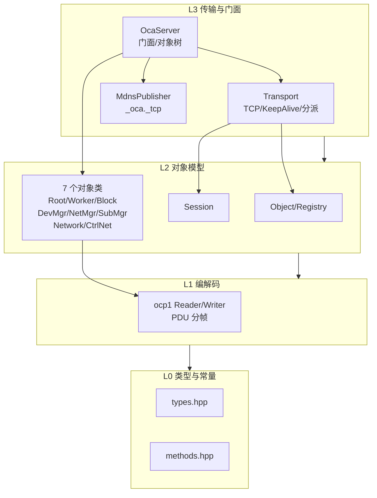
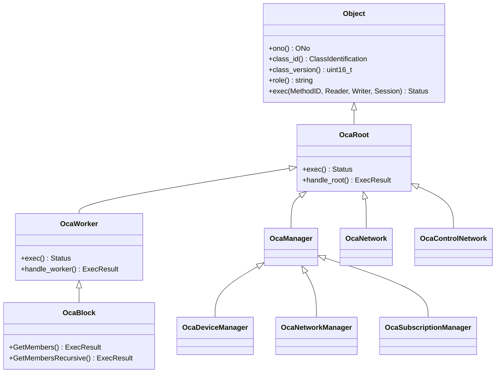
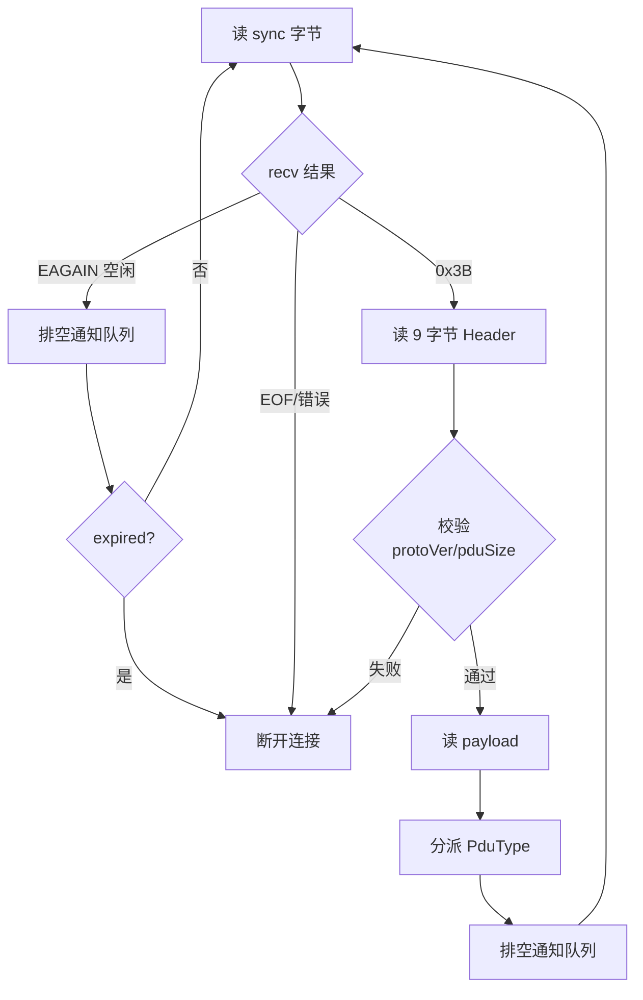

# OCA 设计与维护手册

本手册记录 AES67 daemon 中 AES70/OCA 控制协议实现的设计与维护要点。目标读者：维护 OCA 代码、对接真实 OCA 控制器、或基于此实现做后续 Spec 扩展的开发者。

OCA 代码由 `WITH_OCA` CMake 选项控制（默认 `OFF`），关闭时 daemon 行为零变化。实现隔离在 `daemon/oca/` 目录。

## 总体架构

四层栈，自底向上依赖，层间单向：



| 层 | 文件 | 职责 |
|----|------|------|
| L0 | `types.hpp`、`methods.hpp` | OCC 类型别名、Status/DeviceState 枚举、DefLevel/MethodIndex/PduType/ClassID 常量。纯头，零依赖 |
| L1 | `ocp1.hpp`、`ocp1.cpp` | OCP.1 大端流式编解码 + PDU 分帧/解析，边界检查 |
| L2 基础 | `object.hpp`、`session.hpp/.cpp` | Object 抽象基类 + Registry；每连接 Session（订阅表 + 写队列 + 心跳） |
| L2 对象 | `classes/{root,device_manager,network_manager,subscription_manager,network,control_network}.{hpp,cpp}` | OcaRoot/Worker/Manager/Block/Network 层次 + 7 个具体对象 |
| L3 | `transport.hpp/.cpp`、`oca_server.hpp/.cpp`、`mdns_publisher.hpp/.cpp` | TCP 传输、门面、Avahi mDNS 发布 |

**关键解耦**：`OcaServer` 依赖 POD `OcaServerConfig`（由 main.cpp 从 `Config` 填充），不直接依赖 `Config`。因此 `oca-test` 无需链接 `config.cpp`/`json.cpp`，OCA 栈可独立测试。

## 协议编解码（L1）

### PDU 帧结构

每个 OCP.1 PDU = 1 字节 SyncVal（`0x3B`）+ 9 字节 Header + payload：

| 字段 | 类型 | 字节 | 说明 |
|------|------|------|------|
| SyncVal | u8 | 1 | `0x3B`，前导，不计入 pduSize |
| protocolVersion | u16 | 2 | = 1 |
| pduSize | u32 | 4 | **不含 SyncVal，含 Header（9）+ payload** |
| pduType | u8 | 1 | 见下表 |
| messageCount | u16 | 2 | PDU 内消息数 |

PduType（`methods.hpp`）：Command=0、CommandRrq=1、Ntf1=2（弃用）、Response=3、KeepAlive=4、Ntf2=5（EV2）。

### 消息序列化（`ocp1.cpp` free 函数）

| 消息 | 字段序列 | 固定 size |
|------|---------|-----------|
| `write_command` | commandSize(u32)+handle(u32)+targetONo(u32)+methodID{defLevel u16, methodIndex u16}+paramCount(u8)+params | 17 + paramCount |
| `write_response` | responseSize(u32)+handle(u32)+statusCode(u8)+paramCount(u8)+params | 10 + paramCount |
| `write_notification2` | notificationSize(u32)+emitterONo(u32)+eventID{defLevel u16, eventIndex u16}+notificationType(u8)+dataCount(u16)+data | 15 + dataCount |

所有 `*Size` 字段 = 固定头 + 变长部分，大端字节序。

### 易错点：OcaString 与 OcaBitstring

- **OcaString = Ocp1List\<Utf8CodePoint\>**：`u16` 码点计数 + UTF-8 字节。写时按 UTF-8 首字节高 4 位数码点（1/2/3/4 字节码点），**不是字节数**。中文"音频"= 2 码点 6 字节，emoji"😀"= 1 码点 4 字节。实现见 `ocp1.cpp:69-86`（读）、`147-160`（写）。
- **OcaBitstring**：`u16(numBits)` + `ceil(numBits/8)` 字节，**无独立 nbytes 字段**。这是勘误 #8 修正点（早期实现曾多写一个 nbytes）。见 `ocp1.cpp:96-104`、`168-173`。

### 边界检查

`Reader::check(n)`（`ocp1.cpp:11-15`）：剩余字节不足时抛 `std::runtime_error("ocp1::Reader: buffer underflow")`。每个标量/string/blob/bitstring 读取前调用。**这个异常会被 transport 层的 try/catch 捕获**（见下）。

## 对象模型（L2）

### Object 与 Registry

`Object`（抽象基类，`object.hpp`）：纯虚 `class_id()`/`class_version()`/`exec(MethodID, Reader&, Writer&, Session&)`，虚 `role()`（默认空串），内联 `ono()`。`role()` 置于基类以便 `GetManagers` 通过 `Object*` 取 Role 作描述符 Name。

`ObjectRegistry`（`object.hpp`）：`unordered_map<ONo, unique_ptr<Object>>`。`objects_in_range(from, to)` 是**闭区间线性遍历**（`for o=from..to find(o)`），返回按 ONo 升序。GetMembers/GetManagers 用 `objects_in_range(1, 99)` 取管理器（排除 Root Block 的 ONo 100）。

### 继承层次与 ONo 分配



| 对象 | ONo | ClassID | ClassVersion | role | 来源 |
|------|-----|---------|--------------|------|------|
| OcaDeviceManager | 1 | {1,3,1} | 2 | DeviceManager | Spec1 |
| OcaNetworkManager | 6 | {1,3,6} | 2 | NetworkManager | Spec1 |
| OcaSubscriptionManager | 4 | {1,3,4} | 2 | SubscriptionManager | Spec1 |
| OcaBlock（Root Block） | 100 | {1,1,3} | 2 | Root Block | Spec1 |
| OcaNetwork | 4097 | {1,2,1} | 1 | Network | 阶段三（CM3，2018 弃用） |
| OcaControlNetwork | 4098 | {1,4,1} | 1 | Control Network | 阶段三（CM3） |

> **ClassID 约定**：本实现采用 {1,3,x} 形式（Manager 类）与 {1,1,x}（Worker 类）和 {1,2,1}/{1,4,1}（Network 类）。ocac 2018 参考实现用 {1,3,x} 一律，有差异。真实控制器验收时若 ClassIdentification 不匹配，需在此核对。

> **CM3 网络对象**：OcaNetwork{1,2,1} DeprecatedSince AES70-2018，2023 进一步弃用；OcaControlNetwork{1,4,1} AvailableSince AES70-2018。两者均为 AES70-2018 合规工具（Aes70CompliancyTestTool v2.0.1）的最小强制实例，不回上游（fork 专有）。详见 Spec2 阶段三计划与设计文档。

### exec 分派模式

每个对象的 `exec` 按 `methodID.defLevel` 路由：

1. **命中本类 defLevel**（== classID.fieldCount）：switch `methodIndex` 分派到 handler，未知返回 `BadMethod`
2. **非本类 defLevel**：委托父类（逐级向上直至 OcaRoot，DefLevel 1 的 GetClassIdentification/GetLockable/GetRole/Lock/Unlock）

**关键规则：defLevel == classID.fieldCount**（OCAMicro 全代码库一致）。例如：
- OcaRoot{1} fieldCount=1 → defLevel=1
- OcaWorker{1,1} fieldCount=2 → defLevel=2（`kDefLevelManager`）
- OcaBlock{1,1,3} fieldCount=3 → defLevel=3（`kDefLevelBlock`）
- OcaNetwork{1,2,1} fieldCount=3 → defLevel=3
- OcaControlNetwork{1,4,1} fieldCount=3 → defLevel=3
- OcaApplicationNetwork{1,4} fieldCount=2 → defLevel=2（**不是 3**）

**工具 classID 前缀匹配**：OcaControlNetwork{1,4,1} 的实例同时匹配自身和基类 OcaApplicationNetwork{1,4}。工具对 OcaControlNetwork 实例测 AppNet 的强制方法时，methodID.defLevel=2（OcaApplicationNetwork 的 defLevel）。因此 OcaControlNetwork::exec 必须在 defLevel=2 分派中处理 AppNet 方法（GetServiceID/GetSystemInterfaces）。

### 各对象已实现方法

#### OcaRoot（DefLevel 1）

| 方法 | 索引 | 行为 | 来源 |
|------|------|------|------|
| GetClassIdentification | 1 | 返 ClassID + ClassVersion | Spec1 |
| GetLockable | 2 | 返 u8(0)（不可锁） | Spec1 |
| Lock | 3 | no-op OK | Spec2 |
| Unlock | 4 | no-op OK | Spec2 |
| GetRole | 5 | 返 role() 字符串 | Spec1 |
| LockReadonly | 6 | NotImplemented | — |

#### OcaWorker（DefLevel 2）

| 方法 | 索引 | 行为 | 来源 |
|------|------|------|------|
| GetEnabled | 1 | 返 u8(1)（daemon 始终启用） | 阶段三 |
| SetEnabled | 2 | 读可选 u8，no-op OK | 阶段三 |
| GetPorts | 5 | 返 u16(0)（空 List） | 阶段三 |

> OcaWorker 继承链：OcaBlock → OcaWorker → OcaRoot。阶段三之前 OcaWorker::exec 未覆盖，OcaBlock 不处理 defLevel=2 的请求。test4 对根块测 Worker 强制方法时返回 BadMethod(11)，导致验收失败。

#### OcaBlock（DefLevel 3）

| 方法 | 索引 | 行为 | 来源 |
|------|------|------|------|
| GetMembers | 5 | objects_in_range(1,99) + objects_in_range(4096,65535) → Ocp1List\<OcaObjectIdentification\> | Spec1 + 阶段三扩展 |
| GetMembersRecursive | 6 | 同上范围 + ContainerONo=100 → Ocp1List\<OcaBlockMember\> | 阶段三 |

> **GetMembersRecursive 实装根因**：合规工具 MinimumObjectCompliancyTest.cpp GetObjects 在 GetMembersRecursive 返 NotImplemented 时走 else 回退路径，`outputMembers = members;`（赋值覆盖）丢弃根块 {1,1,3}@100，导致 "Missing mandatory object OcaBlock"。实装后工具走 if 累加分支，根块保留。

#### OcaDeviceManager（DefLevel 3）

| 方法 | 索引 | 行为 | 来源 |
|------|------|------|------|
| GetOcaVersion | 1 | 返 u16(1) | Spec1 |
| GetModelGUID | 2 | 返 u64(0)（8 零字节） | Spec2 |
| GetSerialNumber | 3 | 返 serial_number | Spec1 |
| GetDeviceName | 4 | 返 device_name | Spec1 |
| SetDeviceName | 5 | NotImplemented | — |
| GetModelDescription | 6 | 返 Manufacturer+Name+Version | Spec1 |
| GetEnabled | 11 | 返 u8(1) | Spec2 |
| SetEnabled | 12 | 读可选 u8，no-op OK | Spec2 |
| GetState | 13 | 返 Operational（deprecated v3） | Spec1 |
| GetDeviceRevisionID | 20 | 返 model_version（deprecated v3） | Spec2 |
| GetManagers | 19 | 返 Ocp1List\<OcaManagerDescriptor\> | Spec1 |
| GetManufacturer | 21 | 返 OcaManufacturer（2023 Mandatory G4） | Spec2 |
| GetProduct | 22 | 返 OcaProduct（2023 Mandatory G3） | Spec2 |
| GetOperationalState | 23 | 返 NormalOperation + 空 Details | Spec2 |

#### OcaNetworkManager（DefLevel 3）

| 方法 | 索引 | 行为 | 来源 |
|------|------|------|------|
| GetNetworks | 1 | 返空 List\<ONo\> | Spec1 |
| GetStreamNetworks | 2 | 返空 List\<ONo\> | 阶段三 |
| GetControlNetworks | 3 | 返空 List\<ONo\> | 阶段三 |
| GetMediaTransportNetworks | 4 | 返空 List\<ONo\> | 阶段三 |

#### OcaSubscriptionManager（DefLevel 3）

| 方法 | 索引 | 行为 | 来源 |
|------|------|------|------|
| AddSubscription | 1 | EV1 订阅，返 {OK, 0} | Spec2 |
| RemoveSubscription | 2 | EV1 取消 | Spec2 |
| AddPropertyChangeSubscription | 5 | PropertyChanged EV1 订阅 | Spec2 |
| RemovePropertyChangeSubscription | 6 | PropertyChanged EV1 取消 | Spec2 |
| AddSubscription2 | 8 | EV2 订阅，返 subscriptionID | Spec1 |
| RemoveSubscription2 | 9 | EV2 取消 | Spec1 |
| AddPropertyChangeSubscription2 | 10 | PropertyChanged EV2 订阅 | Spec2 |
| RemovePropertyChangeSubscription2 | 11 | PropertyChanged EV2 取消 | Spec2 |

#### OcaNetwork（DefLevel 3，ONo 4097）

DeprecatedSince AES70-2018 / 2023 弃用；仅为 AES70-2018 合规工具的最小强制实例。

| 方法 | 索引 | 行为 | 来源 |
|------|------|------|------|
| GetLinkType | 1 | 返 u8(1)（EthernetWired） | 阶段三 |
| GetIDAdvertised | 2 | 返空 OcaBlob | 阶段三 |
| GetControlProtocol | 4 | 返 u8(1)（OCP.1） | 阶段三 |
| GetMediaProtocol | 5 | 返 u8(0)（None） | 阶段三 |
| GetSystemInterfaces | 9 | 返空 List | 阶段三 |
| Shutdown | 13 | no-op OK | 阶段三 |

> XML 标注 Shutdown(13) 在 AES70-2018 Mandatory=false，但合规工具日志仍判为 mandatory。实装为 no-op 以合规。

#### OcaControlNetwork（DefLevel 3，ONo 4098）

AvailableSince AES70-2018；无 DeviceType 门。

| defLevel | 方法 | 索引 | 行为 | 来源 |
|----------|------|------|------|------|
| 2（AppNet） | GetServiceID | 4 | 返空 OcaString | 阶段三 |
| 2（AppNet） | GetSystemInterfaces | 6 | 返空 List | 阶段三 |
| 3（自身） | GetControlProtocol | 1 | 返 u8(1)（OCP.1） | 阶段三 |

> OcaControlNetwork{1,4,1} 前缀匹配 OcaApplicationNetwork{1,4}（defLevel=2）。工具对 4098 测 AppNet 强制方法时 methodID.defLevel=2，因此在 OcaControlNetwork::exec 中增加 defLevel=2 分派。这是阶段三 Fix-D 修复的关键问题——最初放在 defLevel=3 导致工具返回 BadMethod(11)。

### Session（每连接）

`session.hpp`：每 TCP 连接一个（栈上，`conn_loop` 内构造）。

- **订阅表**：`add_subscription`（去重，同 emitter+event 只存一份）、`remove_subscription`、`has_subscription`、`subscriptions`。受 `mutex_` 保护。
- **通知写队列**：`enqueue_notification`（PDU 字节）、`take_notification`（FIFO）。受 `mutex_` 保护。
- **心跳**：`set_heartbeat`/`touch`/`expired`。`expired(now)` = `now > last_seen && (now - last_seen) > 3*heartbeat`（严格大于）。
- **registry**：连接的 ObjectRegistry 指针（只读）。

> **不加锁的成员**：`id_`、`registry_`、`heartbeat_sec_`、`last_seen_sec_` 的访问器不加锁。这是 Spec1 的简化：这些字段主要由 conn_loop 单线程访问。`set_heartbeat`/`touch` 的跨线程并发是已知的待加固项（Session TOCTOU）。

### 订阅与事件投递

`OcaSubscriptionManager`：

- `AddSubscription2`：读 `u32 emitter` + `EventID{u16,u16}` + `blob ctx`，生成 `subscriptionID`（atomic 自增），锁内存入 `Entry{id, &sess, emitter, eid}`，调 `sess.add_subscription`。
- `AddSubscription`（EV1）：读更多字段（subscriber ONo/MethodID + context + deliveryMode + networkAddr），同逻辑但返回 {OK, 0}（无 subscriptionID）。
- `AddPropertyChangeSubscription`/`AddPropertyChangeSubscription2`：订阅 PropertyChanged 事件（defLevel=1, eventIndex=1）。
- `trigger_event(emitter, eventID, data, dataCount)`：**锁内收集**匹配的 `Entry`（拷贝），**锁外**对每个 session 调 `write_notification2` + `build_notification2_pdu` + `enqueue_notification`。锁内收集+锁外投递避免持锁调用 Session。
- `remove_session(&sess)`：连接断开时清理该 session 的所有订阅（`erase_remove`）。

> **通知投递时机**：trigger_event 只入队，真正发送由 transport 在**下次 PDU 处理后**排空（见下）。所以测试中触发事件后要发一个 ping 命令让传输层排空，才能收到 Notification2。

## 传输层（L3）

### Transport 生命周期

`Transport(ObjectRegistry* reg, OcaSubscriptionManager* sub_mgr = nullptr)`。

- `start(port)`：socket + SO_REUSEADDR + bind(INADDR_ANY:port, port=0 自动) + listen(backlog=8) + getsockname 取实际端口 + 启动 `accept_thread_`。
- `stop()`：`running_=false` + shutdown/close listen_fd + join accept_thread_ + join 所有 conn_threads_。
- 线程模型：单 accept 线程 + 每连接一个 conn_loop 线程（`conn_threads_` 向量）。

### conn_loop 流程



关键校验与处理：

1. **pduSize 上界**：pduSize 是线上 u32，仅有下界（<9）不够。加 `pduSize > 65536` 上界检查（`transport.cpp`），防恶意 pduSize（如 0xFFFFFFFF）触发超大分配。这是回归用例 `transport_rejects_oversized_pdu` 守护的缺陷。
2. **KeepAlive**：读 u16 heartbeat（payload<2 默认 15），`set_heartbeat`，**回发相同 heartbeat 的 KeepAlive PDU**。
3. **Command/CommandRrq**：`try { parse_commands -> 逐命令 find 对象 -> exec -> write_response } catch(std::exception) { break; }`。**异常被捕获后断开该连接，不崩进程**。这是 `ac9e33a` 修复的缺陷（此前畸形 PDU 的解析异常会逃逸线程 -> `std::terminate` -> daemon SIGABRT）。
4. **单命令异常不断连**：Spec2 修复了空体探测命令的处理——当命令 paramBytes=0（空体）但方法期望参数时，返回 BadFormat(3) 而不断连。此前空体被 Reader 读为 underflow 异常，触发 try/catch 整体断连。修复后每条命令独立 try/catch，异常仅回 BadFormat，继续处理后续命令。
5. **通知排空**：每次 PDU 处理后 `while (sess.take_notification(pdu)) send_pdu(pdu)`。这是事件通知实际发出的时机。
6. **心跳超时**：EAGAIN（1s SO_RCVTIMEO）空闲时，排空通知后检测 `expired()` -> 断开。

### Session 生命周期

conn_loop 内**栈上** `Session sess`。连接断开（循环退出）时 `sub_mgr_->remove_session(&sess)` + `close(fd)`，Session 随栈展开析构。

> **已知限制**：conn_threads_ 只增不减（已结束线程保留至 stop 统一 join），长运行 daemon 会累积线程句柄。

## 门面与集成

### OcaServer

`OcaServer(OcaServerConfig)`：

1. 从 cfg 填 `OcaDeviceIdentity`（空字段回退）：
   - manufacturer 空 -> "AES67-Linux-Daemon"
   - model_name 空 -> daemon_version
   - serial_number 空 -> node_id
   - device_name 空 -> node_id
2. 装配对象树：DeviceManager(1)、NetworkManager(6)、SubscriptionManager(4)、OcaBlock(100)、OcaNetwork(4097)、OcaControlNetwork(4098)，注册到 registry。
3. 构造 `Transport(&registry_, sub_mgr_)`。

`start()`：transport.start(cfg.port) + （AVAHI 且 mdns_enabled 时）MdnsPublisher。`stop()`：mdns.stop + transport.stop。

### Config 集成

6 个 `oca_*` 字段（`config.hpp`）：`oca_enabled`(false)、`oca_port`(65037)、`oca_device_name`、`oca_manufacturer`、`oca_model`、`oca_serial_number`。

- JSON 往返：`config_to_json` 输出（字符串字段经 `escape_json`）、`json_to_config` 解析（字符串字段原样读，不净化）。
- `save` 的 `daemon_restart`：**仅 `oca_enabled` 和 `oca_port` 改动触发 daemon 重启**，4 个字符串字段改动仅写盘。
- `parse`：`oca_port == 0` 时默认 65037。

### main.cpp 接线

`#ifdef _USE_OCA_` 守卫。`oca_enabled` 为真时：从 Config + `get_version()` 填 `OcaServerConfig` 8 字段，构造 OcaServer，start 失败抛异常，成功日志 `main:: OCA server listening on port <port>`。退出时 stop。

### CMake

- `option(WITH_OCA ... OFF)`（`daemon/CMakeLists.txt`）。开启时 `add_definitions(-D_USE_OCA_)` + include 目录 + OCA 源加入 aes67-daemon SOURCES。
- `mdns_publisher.cpp` 仅 `WITH_AVAHI AND WITH_OCA` 时加入（aes67-daemon 与 oca-test 都是此条件）。
- `oca-test` 目标编译 oca_test.cpp + OCA 源，AVAHI 时加 mdns_publisher + avahi 库。

## 构建与测试

### 构建

```bash
cd daemon
# 无硬件/CI 路径（OCA 开，mDNS 关）
cmake -DWITH_OCA=ON -DWITH_AVAHI=OFF -DFAKE_DRIVER=ON -DWITH_STREAMER=OFF .
make oca-test aes67-daemon
```

mDNS 验证需 `WITH_AVAHI=ON`（需 avahi 开发包）。

### 测试

```bash
./tests/oca-test -p          # 全量（26 用例）
./tests/oca-test -p -t oca_e2e_acceptance   # 单跑 E2E
```

26 个用例分布：

| 范畴 | 用例 |
|------|------|
| L0/L1 单测 | types_and_constants、ocp1_scalar_roundtrip、ocp1_reader_bounds、ocp1_string_codepoints、ocp1_blob_and_bitstring、ocp1_list_roundtrip、ocp1_command_pdu_roundtrip、ocp1_response_and_notification2_roundtrip、ocp1_keepalive_pdu、ocp1_fuzz_no_crash |
| L2 单测 | registry_find_and_range、session_subscription_and_queue、session_keepalive_expiry、dispatch_root_block、dispatch_device_manager、dispatch_network_manager、dispatch_subscription_ev2、dispatch_cm3_network_objects |
| L3 集成 | transport_keepalive_and_command、oca_server_facade |
| 验收/回归 | **oca_e2e_acceptance**（端到端）、transport_rejects_oversized_pdu（畸形 PDU 回归）、mdns_publisher_smoke（AVAHI 守卫） |

`oca_e2e_acceptance` 是 Spec1 回归闸门：KeepAlive -> GetOcaVersion=1 -> GetModelDescription -> GetMembers=[1,6,4,4097,4098] -> AddSubscription2 -> trigger_event -> 收 Notification2。

> **daemon-test SAP flaky**：`daemon-test` 套件有既有的 SAP-browser 时序 flaky（间歇"no remote sap sources"），与 OCA 无关（OCA 隔离在 `oca_enabled=false` 后，daemon-test 从不激活 OCA）。判断 OCA 回归只看 `oca-test`。

## Spec 阶段与合规状态

### 已完成阶段

| 阶段 | 目标 | 测试结果 | commit 范围 |
|------|------|---------|-------------|
| Spec1（2/5） | 控制平面最小可用 | oca-test 全绿 | `4b3d1d2`..`4008ef8` |
| Spec2 阶段一（3/5） | 硬证据缺口 G0-G12 | oca-test 全绿 | `2411497`..`eb7afc1` |
| Spec2 阶段二（4/5） | 2018 强制方法 + EV1 订阅 + transport 修复 | oca-test 26/26，test4 仍 Failed | `82e66cd`..`44015c7` |
| Spec2 阶段三（**5/5**） | CM3 对象补齐 + GetMembersRecursive + Worker 分派 | oca-test 26/26，test4 **Passed** | `f3d7f3e`..`51f737d` |

### 合规工具验收（Aes70CompliancyTestTool v2.0.1 AES70-2018）

| # | 测试 | 结果 |
|---|------|------|
| 1 | OCA Service Discovery | ✅ Passed |
| 2 | OCP.1 device reset mechanism | ✅ Passed |
| 3 | OCP.1 KeepAlive mechanism | ✅ Passed |
| 4 | Minimum object compliancy test | ✅ **Passed**（阶段三达成） |
| 5 | OCC Object Compliancy Tests | ❌ Failed（OcaAgent 方法缺口，Spec3 范围） |

### 阶段三四轮迭代

| 轮次 | 修复内容 | 效果 |
|------|---------|------|
| Fix-A | 实现 GetMembersRecursive（Ocp1List\<OcaBlockMember\>） | 消除 "Missing OcaBlock"，工具走非覆盖分支 |
| Fix-B | 实例化 OcaNetwork(4097) + OcaControlNetwork(4098) | 消除 "Missing OcaNetwork/OcaControlNetwork" |
| Fix-C | OcaWorker defLevel-2 分派 + Shutdown + AppNet 方法 | 补 Worker/Network 方法缺口 |
| Fix-D | AppNet 方法移至 defLevel=2（OcaControlNetwork 前缀匹配） | 修正 defLevel 误判，5/5 通过 |

### 阶段三关键知识固化

- **工具 GetObjects 覆盖丢根块**：MinimumObjectCompliancyTest.cpp 回退路径 `outputMembers = members;` 赋值覆盖——实现 GetMembersRecursive 让工具走累加分支即解
- **defLevel == classID.fieldCount**（OCAMicro 全代码库一致）：OcaApplicationNetwork{1,4} fieldCount=2≠3
- **工具 classID 匹配是基类前缀式**：OcaControlNetwork{1,4,1} 既匹配自身也匹配 OcaApplicationNetwork{1,4}，两类型的强制方法都须在实例上实装
- **CheckMethods 判据**：mandatory 方法 status 非 (BadMethod\|BadONo\|NotImplemented) 即过；返回 OK 最安全

## 后续规划

### Spec3：test5 OCC Object Compliancy

test5 对所有已报告对象检查全部类层次的方法，比 test4 更严格。当前失败原因：OcaAgent{1,2} 的 GetLabel/SetLabel/GetOwner/GetPath 在 ONo 4097 返回 BadMethod(11)。这些方法 2018 非 mandatory，但 OCC test5 更严格地检查。

**拆分路径**：

1. **OcaAgent defLevel-2 方法**（OcaNetwork{1,2,1} 继承 OcaAgent{1,2}）：GetLabel(3)/SetLabel(4)/GetOwner(6)/GetPath(7)。可在 OcaNetwork::exec 中增加 defLevel=2 分派（类似 OcaControlNetwork 处理 AppNet 的模式），或引入 OcaAgent 中间类让 OcaNetwork/OcaControlNetwork 继承。
2. **OcaWorker 更多方法**：AddPort(3)/DeletePort(4)/GetPortName(6)/GetLabel(3)/SetLabel(4)/GetOwner(6)/GetLatency(7)/SetLatency(8)。test5 仅信息性报"may return not implemented"，但实装可改善合规评分。
3. **OcaApplicationNetwork 更多方法**：SetServiceID(5)/SetSystemInterfaces(7)/GetState(8)/GetErrorCode(9)/Control(10)/GetPath(7)。同上，信息性。
4. **验证**：oca-test 加 Agent 方法用例；Win 重跑 test5 确认改善。

### Spec4：PropertyChanged 通知投递

EV1/EV2 AddSubscription 返回 OK 已过"事件已实现"判定，但实际 PropertyChanged 通知投递未验证。2018 客户端 type-5 解析未验证。

**拆分路径**：

1. 在关键属性变化点（如 DeviceManager 的 State/OperationalState）触发 `sub_mgr_->trigger_event()`
2. oca-test 验证 Notification2 实际到达（需在 trigger 后发 ping 排空队列）
3. oca-probe 扩展验证

### Spec5：media 桥接主线

MediaClock/StreamConnector/SessionManager（真正音频控制功能，非合规）——独立 Spec，需要深入理解 AES67 daemon 的音频流管理。

### 上游同步

feature/aes70-oca 合并 master 前跑 buildfake + daemon-test；CM3 对象属 fork 专有不回上游。

## 维护指南

### 新增一个 OCA 对象类

1. 继承 `OcaManager`（管理器）或 `OcaWorker`/`OcaBlock`（块成员）或 `OcaRoot`（独立网络对象），`#include "oca/classes/root.hpp"`。
2. 实现 `class_id()`（static ClassIdentification）、`class_version()`、`role()`、`exec()`。
3. 在 `OcaServer` 构造中 `new` + `register_object`（oca_server.cpp），分配 ONo：
   - 管理器：ONo 在 [1,99]（`objects_in_range(1,99)` 范围，出现在 GetManagers）
   - 块成员：ONo >= 4096（`objects_in_range(4096,65535)`，出现在 GetMembers/GetMembersRecursive）
4. **注意 classID 前缀匹配**：如果新类的 classID 是已有类的子类（如 {1,4,1} 是 {1,4} 的子类），工具会对实例测基类的强制方法。在 exec 中按 defLevel 分别处理。
5. 在 `daemon/CMakeLists.txt` 与 `daemon/tests/CMakeLists.txt` 确认新 .cpp 加入对应目标。

### 给现有对象加方法

1. `methods.hpp` 加方法索引常量（标注来源：OCAMicro/sphinx/ReferenceOCCMembers）。
2. 对象 .cpp 的 exec switch 加 case 分派到 handler。
3. handler 用 `Reader& req` 读参数、`Writer& rsp` 写响应，返回 `Status`。
4. 参考 `device_manager.cpp:18-41` 或 `control_network.cpp`（多 defLevel 分派模式）。

### 给网络对象加基类方法（前缀匹配）

当工具对某实例测基类方法时（classID 前缀匹配），需要在该实例的 exec 中增加对应 defLevel 分派：

1. 确认基类的 defLevel（== 基类 classID.fieldCount）
2. 在实例 exec 中加 `if (m.defLevel == 基类defLevel)` 分支
3. switch 基类方法索引，处理强制方法
4. 参考 `control_network.cpp` 的 AppNet defLevel=2 分派模式

### 加事件/订阅触发

1. `methods.hpp` 加 EventIndex 常量（参考 `kEventOperationalState`）。
2. 调 `sub_mgr_->trigger_event(emitterONo, {defLevel, eventIndex}, data, dataCount)`。`sub_mgr_` 从 `OcaServer::subscription_manager()` 获取。
3. trigger_event 自动遍历订阅者投递 Notification2。传输层在下次 PDU 后或 EAGAIN 空闲排空。

### 加 PduType 处理

在 `Transport::conn_loop` 分派 if-else 链加 `else if (hdr->pduType == methods::kPduXxx)`。注意异常安全（置于 try/catch 内或单独保护）。

### 真实控制器验收失败

methods.hpp 单行常量修改。候选值（EV2 订阅索引、GetNetworks 索引等）在 `methods.hpp`，标注来源（OCAMicro/sphinx/ReferenceOCCMembers）。控制器返回 `NotImplemented`/`BadMethod` 时，对照 AES70-2-2023 Annex A XMI 修正这些常量，exec 分派引用常量名故无需改其他文件，重跑 E2E 验证。

## 已知限制与待办

**Spec3 范围外**（未实现，符合当前预期）：

- OcaAgent 方法（GetLabel/SetLabel/GetOwner/GetPath）——test5 失败根因
- OcaWorker 更多方法（AddPort/DeletePort/GetPortName/GetLatency/SetLatency）——test5 信息性
- PropertyChanged 实际通知投递——订阅 OK 但触发未验证
- TLS、UDP、WebSocket 传输
- Dataset 序列化
- 媒体类（OcaAudioSource/Sink/MediaClock）

**待加固项**：

| 项 | 说明 | 风险 |
|----|------|------|
| Session TOCTOU | `set_heartbeat`/`touch`/`expired` 不加锁；trigger_event 持 raw `Session*` | 生产事件触发接入后变真实 UAF |
| conn_threads_ 增长 | 已结束线程保留至 stop | 长运行累积线程句柄/内存 |
| EINTR 未处理 | send_all/recv_exact 不检查 EINTR | 信号中断被当 EOF/错误，连接误断 |
| send_all 忽略 | send_pdu 不检查 send_all 返回 | 发送失败静默，通知可能丢失 |
| KeepAlive Option2 | 仅 Option1(u16 秒)，未实现 Option2(u32 ms) | Option2 控制器心跳值错乱 |
| write_response 截断 | `static_cast<uint8_t>(params.size())` | 响应 >255 字节被截断（当前响应均远小于 255） |
| 通知投递延迟 | 依赖读循环排空（命令后或 1s 空闲） | 无独立写线程，事件不即时推送 |

**已修复的健壮性缺陷**：

- `c6ad36c`：conn_loop 首个 PDU 前初始化 Session 心跳，避免误超时断连。
- `ac9e33a`：conn_loop 命令处理 try/catch，畸形 PDU 异常不再崩 daemon。
- `4008ef8`/回归用例：conn_loop pduSize 上界（65536），防超大分配 DoS。
- Spec2：空体探测命令返回 BadFormat(3) 而不断连（单命令 try/catch）。
- 阶段三：OcaWorker defLevel-2 分派，补 GetEnabled/SetEnabled/GetPorts。

## 参考资源

- 设计文档：`docs/superpowers/specs/aes70-oca-spec1-design.md` `docs/superpowers/specs/aes70-oca-spec2-design.md`（权威设计，含 Spec1-Spec2 全阶段）
- Spec2 阶段三计划：`docs/superpowers/plans/aes70-oca-spec2-phase3-plan.md`
- AES70-2023 规范文本（AES70-2 OCC 数据类型、AES70-3 OCP.1 传输）
- ocac 参考实现（C99，2018）：`/home/Share/GitHub/ocac`，方法索引来源（注意其 ClassID 用 {1,3,x}，与本项目 Manager 类一致但 Worker/Network 类不同）
- OCAMicro 参考实现（C++）：defLevel==fieldCount 规则来源、方法索引来源
- Fork 维护规范：`.claude/rules/fork-maintenance.md`
- 验证基线：oca-test 26/26（Spec2 终态）、Aes70CompliancyTestTool v2.0.1 AES70-2018 **5/5**（阶段三终态）
- 抓包工具链：tcpdump 旁路 + `daemon/oca/tools/oca-parse-pcap.py`（零依赖）
- daemon 构建路径注意：`oca-dev.sh` 用 out-of-source `daemon/build/` 二进制
