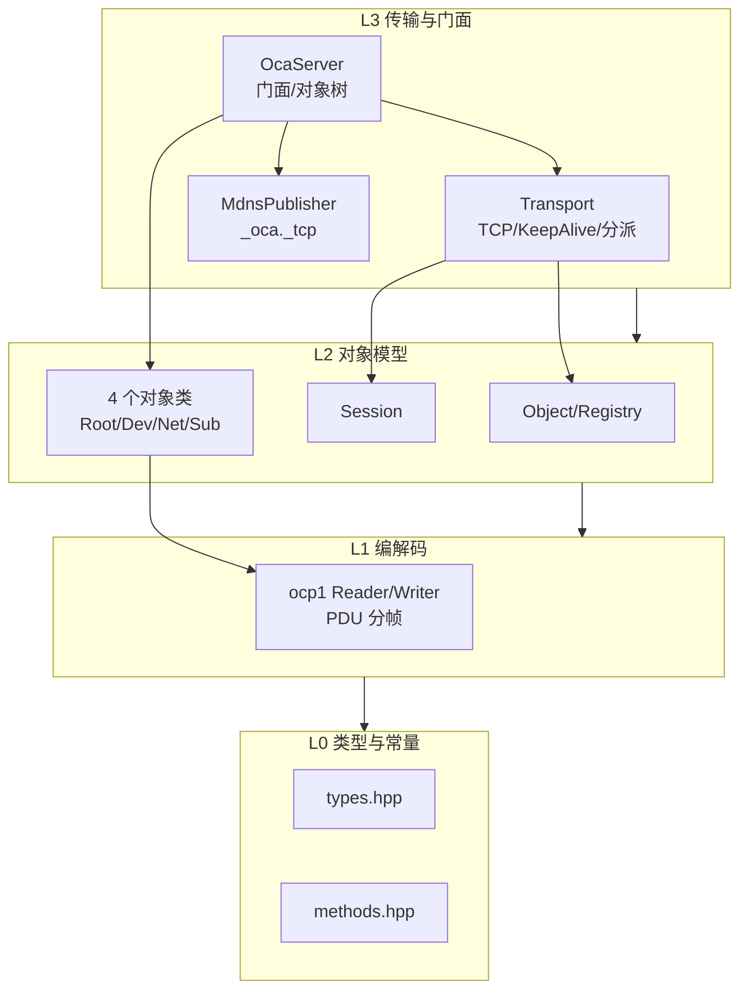
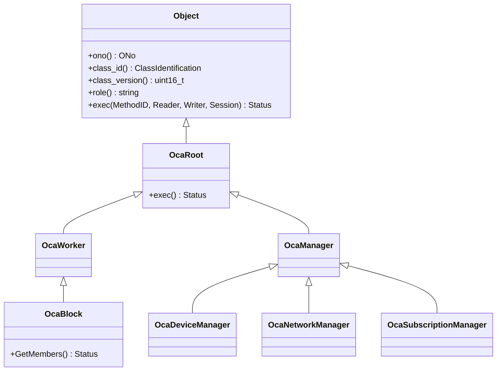
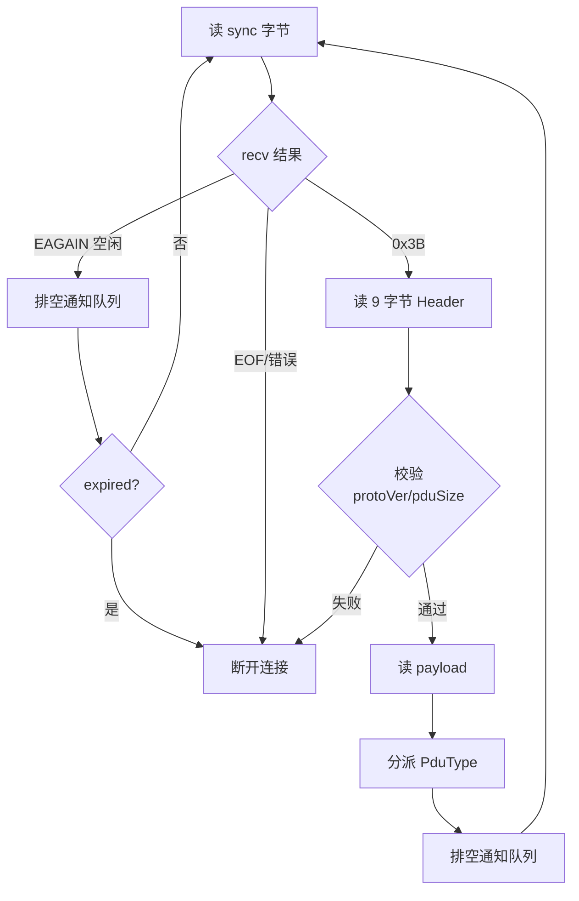

# OCA 设计与维护手册

本手册记录 AES67 daemon 中 AES70/OCA 控制协议实现的设计与维护要点。目标读者:维护 OCA 代码、对接真实 OCA 控制器、或基于此实现做 Spec2 扩展的开发者。

OCA 代码由 `WITH_OCA` CMake 选项控制(默认 `OFF`),关闭时 daemon 行为零变化。实现隔离在 `daemon/oca/` 目录。

## 总体架构

四层栈,自底向上依赖,层间单向:



| 层 | 文件 | 职责 |
|----|------|------|
| L0 | `types.hpp`、`methods.hpp` | OCC 类型别名、Status/DeviceState 枚举、DefLevel/MethodIndex/PduType/ClassID 常量。纯头,零依赖 |
| L1 | `ocp1.hpp`、`ocp1.cpp` | OCP.1 大端流式编解码 + PDU 分帧/解析,边界检查 |
| L2 基础 | `object.hpp`、`session.hpp/.cpp` | Object 抽象基类 + Registry;每连接 Session(订阅表 + 写队列 + 心跳) |
| L2 对象 | `classes/{root,device_manager,network_manager,subscription_manager}.{hpp,cpp}` | OcaRoot/Worker/Manager/Block 层次 + 4 个具体对象 |
| L3 | `transport.hpp/.cpp`、`oca_server.hpp/.cpp`、`mdns_publisher.hpp/.cpp` | TCP 传输、门面、Avahi mDNS 发布 |

**关键解耦**:`OcaServer` 依赖 POD `OcaServerConfig`(由 main.cpp 从 `Config` 填充),不直接依赖 `Config`。因此 `oca-test` 无需链接 `config.cpp`/`json.cpp`,OCA 栈可独立测试。

## 协议编解码(L1)

### PDU 帧结构

每个 OCP.1 PDU = 1 字节 SyncVal(`0x3B`)+ 9 字节 Header + payload:

| 字段 | 类型 | 字节 | 说明 |
|------|------|------|------|
| SyncVal | u8 | 1 | `0x3B`,前导,不计入 pduSize |
| protocolVersion | u16 | 2 | = 1 |
| pduSize | u32 | 4 | **不含 SyncVal,含 Header(9)+ payload** |
| pduType | u8 | 1 | 见下表 |
| messageCount | u16 | 2 | PDU 内消息数 |

PduType(`methods.hpp`):Command=0、CommandRrq=1、Ntf1=2(弃用)、Response=3、KeepAlive=4、Ntf2=5(EV2)。

### 消息序列化(`ocp1.cpp` free 函数)

| 消息 | 字段序列 | 固定 size |
|------|---------|-----------|
| `write_command` | commandSize(u32)+handle(u32)+targetONo(u32)+methodID{defLevel u16, methodIndex u16}+paramCount(u8)+params | 17 + paramCount |
| `write_response` | responseSize(u32)+handle(u32)+statusCode(u8)+paramCount(u8)+params | 10 + paramCount |
| `write_notification2` | notificationSize(u32)+emitterONo(u32)+eventID{defLevel u16, eventIndex u16}+notificationType(u8)+dataCount(u16)+data | 15 + dataCount |

所有 `*Size` 字段 = 固定头 + 变长部分,大端字节序。

### 易错点:OcaString 与 OcaBitstring

- **OcaString = Ocp1List<Utf8CodePoint>**:`u16` 码点计数 + UTF-8 字节。写时按 UTF-8 首字节高 4 位数码点(1/2/3/4 字节码点),**不是字节数**。中文"音频"= 2 码点 6 字节,emoji"😀"= 1 码点 4 字节。实现见 `ocp1.cpp:69-86`(读)、`147-160`(写)。
- **OcaBitstring**:`u16(numBits)` + `ceil(numBits/8)` 字节,**无独立 nbytes 字段**。这是勘误 #8 修正点(早期实现曾多写一个 nbytes)。见 `ocp1.cpp:96-104`、`168-173`。

### 边界检查

`Reader::check(n)`(`ocp1.cpp:11-15`):剩余字节不足时抛 `std::runtime_error("ocp1::Reader: buffer underflow")`。每个标量/string/blob/bitstring 读取前调用。**这个异常会被 transport 层的 try/catch 捕获**(见下)。

## 对象模型(L2)

### Object 与 Registry

`Object`(抽象基类,`object.hpp`):纯虚 `class_id()`/`class_version()`/`exec(MethodID, Reader&, Writer&, Session&)`,虚 `role()`(默认空串),内联 `ono()`。`role()` 置于基类以便 `GetManagers` 通过 `Object*` 取 Role 作描述符 Name。

`ObjectRegistry`(`object.hpp`):`unordered_map<ONo, unique_ptr<Object>>`。`objects_in_range(from, to)` 是**闭区间线性遍历**(`for o=from..to find(o)`),返回按 ONo 升序。GetMembers/GetManagers 用 `objects_in_range(1, 99)` 取管理器(排除 Root Block 的 ONo 100)。

### 继承层次与 ONo 分配



| 对象 | ONo | ClassID | ClassVersion | role |
|------|-----|---------|--------------|------|
| OcaDeviceManager | 1 | {1,2,1} | 4 | DeviceManager |
| OcaNetworkManager | 2 | {1,2,3} | 3 | NetworkManager |
| OcaSubscriptionManager | 4 | {1,2,4} | 2 | SubscriptionManager |
| OcaBlock(Root Block) | 100 | {1,1,3} | 2 | Root Block |

> **ClassID 约定**:本实现采用 {1,2,x} 形式(2023 规范)。ocac 2018 参考实现用 {1,3,x},有差异。真实控制器验收时若 ClassIdentification 不匹配,需在此核对。

### exec 分派模式

每个对象的 `exec` 按 `methodID.defLevel` 路由:

- 命中本类 DefLevel(如 DeviceManager 的 3):switch `methodIndex` 分派到 handler,未知返回 `BadMethod`
- 非本类 DefLevel:委托父类(`OcaManager` -> `OcaRoot`,DefLevel 1 的 GetClassIdentification/GetLockable/GetRole)

### 各对象已实现方法

| 对象 | 方法(索引) | 行为 |
|------|------------|------|
| OcaRoot(DefLevel 1) | GetClassIdentification(1)、GetLockable(2)、GetRole(5) | 类标识/不可锁/角色 |
| OcaDeviceManager(DefLevel 3) | GetOcaVersion(1)、GetSerialNumber(3)、GetDeviceName(4)、GetModelDescription(6)、GetState(13)、GetManagers(19) | 设备身份;GetManagers 返回 Ocp1List<OcaManagerDescriptor>={ONo, Name(=role), ClassID, ClassVersion} |
| OcaBlock(DefLevel 3) | GetMembers(5) | objects_in_range(1,99) -> [1,2,4] |
| OcaNetworkManager(DefLevel 3) | GetNetworks(1) | 空 Ocp1List<u16>(0) |
| OcaSubscriptionManager(DefLevel 3) | AddSubscription2(1)、RemoveSubscription2(2) | EV2 订阅;PropertyChange 变体未实现 |

方法索引中,`kRoot*`/`kDev*`/`kBlock*` 标注"ocac 核对";`kNetGetNetworks`、`kSub*Subscription2` 标注"**候选值,需 XMI 校验**"。

### Session(每连接)

`session.hpp`:每 TCP 连接一个(栈上,`conn_loop` 内构造)。

- **订阅表**:`add_subscription`(去重,同 emitter+event 只存一份)、`remove_subscription`、`has_subscription`、`subscriptions`。受 `mutex_` 保护。
- **通知写队列**:`enqueue_notification`(PDU 字节)、`take_notification`(FIFO)。受 `mutex_` 保护。
- **心跳**:`set_heartbeat`/`touch`/`expired`。`expired(now)` = `now > last_seen && (now - last_seen) > 3*heartbeat`(严格大于)。
- **registry**:连接的 ObjectRegistry 指针(只读)。

> **不加锁的成员**:`id_`、`registry_`、`heartbeat_sec_`、`last_seen_sec_` 的访问器不加锁。这是 Spec1 的简化:这些字段主要由 conn_loop 单线程访问。`set_heartbeat`/`touch` 的跨线程并发是已知的 Spec2 待加固项(Session TOCTOU)。

### 订阅与事件投递

`OcaSubscriptionManager`:

- `AddSubscription2`:读 `u32 emitter` + `EventID{u16,u16}` + `blob ctx`,生成 `subscriptionID`(atomic 自增),锁内存入 `Entry{id, &sess, emitter, eid}`,调 `sess.add_subscription`。
- `trigger_event(emitter, eventID, data, dataCount)`:**锁内收集**匹配的 `Entry`(拷贝),**锁外**对每个 session 调 `write_notification2` + `build_notification2_pdu` + `enqueue_notification`。锁内收集+锁外投递避免持锁调用 Session。
- `remove_session(&sess)`:连接断开时清理该 session 的所有订阅(`erase_remove`)。

> **通知投递时机**:trigger_event 只入队,真正发送由 transport 在**下次 PDU 处理后**排空(见下)。所以测试中触发事件后要发一个 ping 命令让传输层排空,才能收到 Notification2。

## 传输层(L3)

### Transport 生命周期

`Transport(ObjectRegistry* reg, OcaSubscriptionManager* sub_mgr = nullptr)`。

- `start(port)`:socket + SO_REUSEADDR + bind(INADDR_ANY:port,port=0 自动)+ listen(backlog=8)+ getsockname 取实际端口 + 启动 `accept_thread_`。
- `stop()`:`running_=false` + shutdown/close listen_fd + join accept_thread_ + join 所有 conn_threads_。
- 线程模型:单 accept 线程 + 每连接一个 conn_loop 线程(`conn_threads_` 向量)。

### conn_loop 流程



关键校验与处理:

1. **pduSize 上界**:pduSize 是线上 u32,仅有下界(<9)不够。加 `pduSize > 65536` 上界检查(`transport.cpp`),防恶意 pduSize(如 0xFFFFFFFF)触发超大分配。这是回归用例 `transport_rejects_oversized_pdu` 守护的缺陷。
2. **KeepAlive**:读 u16 heartbeat(payload<2 默认 15),`set_heartbeat`,**回发相同 heartbeat 的 KeepAlive PDU**。
3. **Command/CommandRrq**:`try { parse_commands -> 逐命令 find 对象 -> exec -> write_response } catch(std::exception) { break; }`。**异常被捕获后断开该连接,不崩进程**。这是 `ac9e33a` 修复的缺陷(此前畸形 PDU 的解析异常会逃逸线程 -> `std::terminate` -> daemon SIGABRT)。
4. **通知排空**:每次 PDU 处理后 `while (sess.take_notification(pdu)) send_pdu(pdu)`。这是事件通知实际发出的时机。
5. **心跳超时**:EAGAIN(1s SO_RCVTIMEO)空闲时,排空通知后检测 `expired()` -> 断开。

### Session 生命周期

conn_loop 内**栈上** `Session sess`。连接断开(循环退出)时 `sub_mgr_->remove_session(&sess)` + `close(fd)`,Session 随栈展开析构。

> **Spec2 待办**:conn_threads_ 只增不减(已结束线程保留至 stop 统一 join),长运行 daemon 会累积线程句柄。Spec2 应用 detach + 计数或定期 join。

## 门面与集成

### OcaServer

`OcaServer(OcaServerConfig)`:

1. 从 cfg 填 `OcaDeviceIdentity`(空字段回退):
   - manufacturer 空 -> "AES67-Linux-Daemon"
   - model_name 空 -> daemon_version
   - serial_number 空 -> node_id
   - device_name 空 -> node_id
2. 装配对象树:DeviceManager(1)、NetworkManager(2)、SubscriptionManager(4)、OcaBlock(100),注册到 registry。
3. 构造 `Transport(&registry_, sub_mgr_)`。

`start()`:transport.start(cfg.port) + (AVAHI 且 mdns_enabled 时)MdnsPublisher。`stop()`:mdns.stop + transport.stop。

### Config 集成

6 个 `oca_*` 字段(`config.hpp`):`oca_enabled`(false)、`oca_port`(65037)、`oca_device_name`、`oca_manufacturer`、`oca_model`、`oca_serial_number`。

- JSON 往返:`config_to_json` 输出(字符串字段经 `escape_json`)、`json_to_config` 解析(字符串字段原样读,不净化)。
- `save` 的 `daemon_restart`:**仅 `oca_enabled` 和 `oca_port` 改动触发 daemon 重启**,4 个字符串字段改动仅写盘。
- `parse`:`oca_port == 0` 时默认 65037。

### main.cpp 接线

`#ifdef _USE_OCA_` 守卫。`oca_enabled` 为真时:从 Config + `get_version()` 填 `OcaServerConfig` 8 字段,构造 OcaServer,start 失败抛异常,成功日志 `main:: OCA server listening on port <port>`。退出时 stop。

### CMake

- `option(WITH_OCA ... OFF)`(`daemon/CMakeLists.txt`)。开启时 `add_definitions(-D_USE_OCA_)` + include 目录 + 8 个 OCA 源加入 aes67-daemon SOURCES。
- `mdns_publisher.cpp` 仅 `WITH_AVAHI AND WITH_OCA` 时加入(aes67-daemon 与 oca-test 都是此条件)。
- `oca-test` 目标编译 oca_test.cpp + 8 个 OCA 源,AVAHI 时加 mdns_publisher + avahi 库。

## 构建与测试

### 构建

```bash
cd daemon
# 无硬件/CI 路径(OCA 开,mDNS 关)
cmake -DWITH_OCA=ON -DWITH_AVAHI=OFF -DFAKE_DRIVER=ON -DWITH_STREAMER=OFF .
make oca-test aes67-daemon
```

mDNS 验证需 `WITH_AVAHI=ON`(需 avahi 开发包)。

### 测试

```bash
./tests/oca-test -p          # 全量(22 用例)
./tests/oca-test -p -t oca_e2e_acceptance   # 单跑 E2E
```

22 个用例分布:

| 范畴 | 用例 |
|------|------|
| L0/L1 单测 | types_and_constants、ocp1_scalar_roundtrip、ocp1_reader_bounds、ocp1_string_codepoints、ocp1_blob_and_bitstring、ocp1_list_roundtrip、ocp1_command_pdu_roundtrip、ocp1_response_and_notification2_roundtrip、ocp1_keepalive_pdu、ocp1_fuzz_no_crash |
| L2 单测 | registry_find_and_range、session_subscription_and_queue、session_keepalive_expiry、dispatch_root_block、dispatch_device_manager、dispatch_network_manager、dispatch_subscription_ev2 |
| L3 集成 | transport_keepalive_and_command、oca_server_facade |
| 验收/回归 | **oca_e2e_acceptance**(端到端)、transport_rejects_oversized_pdu(畸形 PDU 回归)、mdns_publisher_smoke(AVAHI 守卫) |

`oca_e2e_acceptance` 是 Spec1 回归闸门:KeepAlive -> GetOcaVersion=1 -> GetModelDescription -> GetMembers=[1,2,4] -> AddSubscription2 -> trigger_event -> 收 Notification2。

> **daemon-test SAP flaky**:`daemon-test` 套件有既有的 SAP-browser 时序 flaky(间歇"no remote sap sources"),与 OCA 无关(OCA 隔离在 `oca_enabled=false` 后,daemon-test 从不激活 OCA)。判断 OCA 回归只看 `oca-test`。

## 维护指南

### 新增一个 OCA 对象类

1. 继承 `OcaManager`(管理器)或 `OcaWorker`/`OcaBlock`(块成员),`#include "oca/classes/root.hpp"`。
2. 实现 `class_id()`(static ClassIdentification)、`class_version()`、`role()`、`exec()`。
3. 在 `OcaServer` 构造中 `new` + `register_object`(oca_server.cpp:27-35),分配 ONo(避开 1/2/4/100)。
4. 欲出现在 GetMembers/GetManagers 列表,ONo 须在 [1,99](objects_in_range(1,99) 范围)。
5. 在 tests/CMakeLists.txt 与 daemon/CMakeLists.txt 确认新 .cpp 加入对应目标。

### 给现有对象加方法

1. `methods.hpp` 加方法索引常量(候选值标注"需 XMI 校验")。
2. 对象 .cpp 的 exec switch 加 case 分派到 handler。
3. handler 用 `Reader& req` 读参数、`Writer& rsp` 写响应,返回 `Status`。
4. 参考 `device_manager.cpp:18-41` 的分派模式。

### 加事件/订阅触发

1. `methods.hpp` 加 EventIndex 常量(参考 `kEventOperationalState`)。
2. 调 `sub_mgr_->trigger_event(emitterONo, {defLevel, eventIndex}, data, dataCount)`。`sub_mgr_` 从 `OcaServer::subscription_manager()` 获取。
3. trigger_event 自动遍历订阅者投递 Notification2。传输层在下次 PDU 后或 EAGAIN 空闲排空。

### 加 PduType 处理

在 `Transport::conn_loop` 分派 if-else 链加 `else if (hdr->pduType == methods::kPduXxx)`。注意异常安全(置于 try/catch 内或单独保护)。

### 真实控制器验收失败

methods.hpp 单行常量修改。候选值(EV2 订阅索引、GetNetworks 索引)在 `methods.hpp:51-57`,标注"候选值,需 XMI 校验"。控制器返回 `NotImplemented`/`BadMethod` 时,对照 AES70-2-2023 Annex A XMI 修正这些常量,exec 分派引用常量名故无需改其他文件,重跑 E2E 验证。

## 已知限制与 Spec2 待办

**Spec1 范围外**(未实现,符合预期):EV1 通知、TLS、UDP、WebSocket 传输、Dataset 序列化、媒体类(OcaAudioSource/Sink/MediaClock)、OcaBlock.GetControlObjects(用 GetMembers 替代)。

**候选值待校验**:`kNetGetNetworks`、`kSub*Subscription2`(methods.hpp:51-57),需真实控制器 XMI 验收。

**Spec2 加固项**:

| 项 | 说明 | 风险 |
|----|------|------|
| Session TOCTOU | `set_heartbeat`/`touch`/`expired` 不加锁;trigger_event 持 raw `Session*` | Spec1 中 trigger_event 仅测试调用,生产事件触发接入后变真实 UAF |
| conn_threads_ 增长 | 已结束线程保留至 stop | 长运行累积线程句柄/内存 |
| EINTR 未处理 | send_all/recv_exact 不检查 EINTR | 信号中断被当 EOF/错误,连接误断 |
| send_all 忽略 | send_pdu 不检查 send_all 返回 | 发送失败静默,通知可能丢失 |
| KeepAlive Option2 | 仅 Option1(u16 秒),未实现 Option2(u32 ms) | Option2 控制器心跳值错乱 |
| write_response 截断 | `static_cast<uint8_t>(params.size())` | 响应 >255 字节被截断(Spec1 响应均远小于 255) |
| 通知投递延迟 | 依赖读循环排空(命令后或 1s 空闲) | 无独立写线程,事件不即时推送 |

**已修复的健壮性缺陷**(Spec1 期间):

- `c6ad36c`:conn_loop 首个 PDU 前初始化 Session 心跳,避免误超时断连。
- `ac9e33a`:conn_loop 命令处理 try/catch,畸形 PDU 异常不再崩 daemon。
- `4008ef8`/回归用例:conn_loop pduSize 上界(65536),防超大分配 DoS。

## 参考资源

- 规范计划:`docs/superpowers/plans/aes70-oca-spec1-plan.md`
- AES70-2023 规范文本(AES70-2 OCC 数据类型、AES70-3 OCP.1 传输)
- ocac 参考实现(C99,2018):`/home/Share/GitHub/ocac`,方法索引来源(注意其 ClassID 用 {1,3,x},与本项目 {1,2,x} 不同)
- Fork 维护规范:`.claude/rules/fork-maintenance.md`
