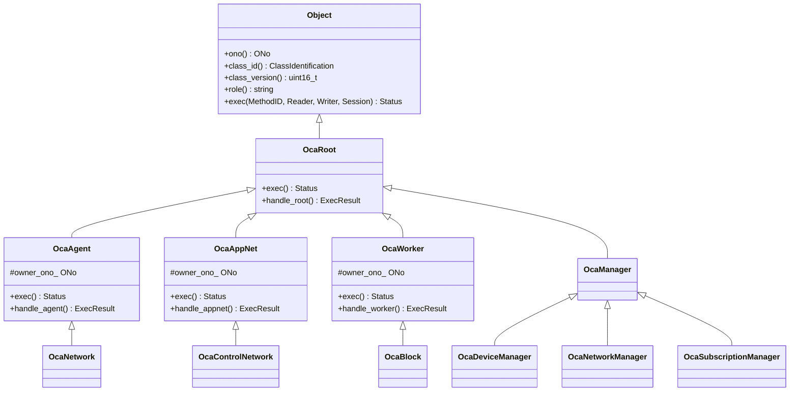
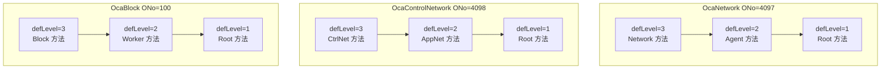

# Spec3 设计：OcaAgent/OcaApplicationNetwork 中间类 + OcaWorker 方法补齐

**版本**：2026-07-13
**状态**：草案
**前置**：Spec2 阶段三已完成（test4 5/5 PASSED，oca-test 28/28）

## 目标

1. test5 OCC Object Compliancy 通过或显著改善（当前失败：OcaAgent 方法返回 BadMethod）
2. C++ 类层次与 AES70 标准及 OCAMicro 参考实现同构
3. oca-test 新增用例覆盖所有新增方法

## 问题根因

test5 对所有已报告对象检查**完整类层次**的方法。当前两个 defLevel=2 缺口导致 BadMethod：

| 对象 | 缺失 defLevel | 缺失方法 | 当前返回 |
|------|-------------|---------|---------|
| OcaNetwork {1,2,1} (ONo 4097) | 2（OcaAgent{1,2}） | GetLabel(1)/SetLabel(2)/GetOwner(3)/GetPath(4) | BadMethod(11) |
| OcaControlNetwork {1,4,1} (ONo 4098) | 2（OcaAppNet{1,4}） | GetLabel(1)/SetLabel(2)/GetOwner(3)/GetPath(10) | BadMethod(11) |
| OcaBlock {1,1,3} (ONo 100) | 2（OcaWorker{1,1}） | GetLabel(8)/SetLabel(9)/GetOwner(10)/GetPath(13) | NotImplemented（可接受但非最优） |

合规工具判据：mandatory 方法 status 非 (BadMethod|BadONo|NotImplemented) 即过。NotImplemented 可接受，但 OK 更安全且对真实控制器更友好。

## 设计决策

### 决策 1：引入 OcaAgent 中间类（而非内联 defLevel 分派）

**理由**（按优先级）：

1. **AES70 规范符合性**：OcaNetwork{1,2,1} extends OcaAgent{1,2} extends OcaRoot{1} 是 AES70 标准定义的类层次。C++ 继承应反映这一关系。
2. **长期维护性**：exec 委托链即继承链，自文档化。对照 OCAMicro 时零认知负担。新增 OcaAgent 子类时自动继承 Agent 方法。
3. **与参考实现同构**：OCAMicro 用 `OcaLiteAgent : OcaLiteRoot`，我们的 `OcaAgent : OcaRoot` 完全对应。

内联分派虽改动更小，但"协议行为正确而结构不正确"——不反映规范意图。

### 决策 2：同步引入 OcaApplicationNetwork 中间类

**理由**：OcaControlNetwork{1,4,1} extends OcaApplicationNetwork{1,4} 是 AES70-2018 的明确定义。OcaApplicationNetwork 非 deprecated（AvailableSince AES70-2018）。GetServiceID/GetSystemInterfaces 本就属于 AppNet 层，移入父类更合理。

### 决策 3：实现范围（中等覆盖）

- OcaAgent 四方法：GetLabel/SetLabel/GetOwner/GetPath
- OcaApplicationNetwork 六方法：GetLabel/SetLabel/GetOwner/GetServiceID/GetSystemInterfaces/GetPath
- OcaWorker 四方法：GetLabel(8)/SetLabel(9)/GetOwner(10)/GetPath(13)

不包含：Worker 端口/延迟方法（AddPort/DeletePort/GetPortName/GetLatency/SetLatency）、AppNet 状态/控制方法（SetServiceID/GetState/GetErrorCode/Control）。这些 test5 仅信息性报，留后续。

### 决策 4：方法返回值

| 方法 | 返回值 | 理由 |
|------|--------|------|
| GetLabel | `role()` 字符串 → OK | 控制器可读，比 NotImplemented 更友好 |
| SetLabel | 读可选 OcaString，no-op → OK | 与 SetEnabled 模式一致 |
| GetOwner | `owner_ono_` (u32) → OK | 控制器需要对象归属；Network/CtrlNet=100, Block=0 |
| GetPath | NotImplemented | OcaPath 结构复杂（OcaPathStep 列表），YAGNI |

## 类层次变化



**Before → After**：

| 类 | Before | After |
|----|--------|-------|
| OcaNetwork | : OcaRoot | : **OcaAgent** |
| OcaControlNetwork | : OcaRoot | : **OcaApplicationNetwork** |
| OcaWorker | 无 owner_ono_ | + **owner_ono_** 成员 |

## 新增类详细设计

### OcaAgent : OcaRoot {1,2} v2

ClassID = {1,2}，classVersion = 2（OCAMicro OcaLiteAgent: OcaLiteRoot v2 + CLASS_VERSION_INCREMENT=0）。

```cpp
// classes/agent.hpp
class OcaAgent : public OcaRoot {
 public:
  explicit OcaAgent(ONo ono, ONo owner_ono = 0)
      : OcaRoot(ono), owner_ono_(owner_ono) {}
  ExecResult exec(MethodID m, ocp1::Reader& req,
                  ocp1::Writer& rsp, Session& sess) override;

 protected:
  ExecResult handle_agent(uint16_t methodIndex,
                          ocp1::Reader& req, ocp1::Writer& rsp);
  ONo owner_ono_;
};
```

> **注意**：OcaAgent 是抽象类（AES70 语义），但 C++ 层不设纯虚方法——与 OcaWorker/OcaManager 同模式，由 OcaServer 控制不直接实例化。

exec 委托链：
```
OcaAgent::exec:
  defLevel==2 → handle_agent (GetLabel/SetLabel/GetOwner/GetPath)
  else → OcaRoot::exec (defLevel==1 → Root 方法)
```

handle_agent 分派：

| 方法 | 索引 | 行为 |
|------|------|------|
| GetLabel | 1 | `rsp.string(role())` → {OK, 1} |
| SetLabel | 2 | 读可选 OcaString（remaining≥2 时跳过），no-op → {OK, 0} |
| GetOwner | 3 | `rsp.u32(owner_ono_)` → {OK, 1} |
| GetPath | 4 | NotImplemented |
| default | — | NotImplemented |

### OcaApplicationNetwork : OcaRoot {1,4} v1

ClassID = {1,4}，classVersion = 1（OCAMicro OcaLiteApplicationNetwork: OcaLiteRoot v2 + CLASS_VERSION_INCREMENT=-1，即 v1）。

```cpp
// classes/application_network.hpp
class OcaApplicationNetwork : public OcaRoot {
 public:
  explicit OcaApplicationNetwork(ONo ono, ONo owner_ono = 0)
      : OcaRoot(ono), owner_ono_(owner_ono) {}
  ExecResult exec(MethodID m, ocp1::Reader& req,
                  ocp1::Writer& rsp, Session& sess) override;

 protected:
  ExecResult handle_appnet(uint16_t methodIndex,
                           ocp1::Reader& req, ocp1::Writer& rsp);
  ONo owner_ono_;
};
```

exec 委托链：
```
OcaApplicationNetwork::exec:
  defLevel==2 → handle_appnet
  else → OcaRoot::exec
```

handle_appnet 分派：

| 方法 | 索引 | 行为 | 来源 |
|------|------|------|------|
| GetLabel | 1 | `rsp.string(role())` → {OK, 1} | 新增 |
| SetLabel | 2 | 读可选 OcaString，no-op → {OK, 0} | 新增 |
| GetOwner | 3 | `rsp.u32(owner_ono_)` → {OK, 1} | 新增 |
| GetServiceID | 4 | `rsp.string("")` → {OK, 1} | 从 OcaControlNetwork 移入 |
| GetSystemInterfaces | 6 | `rsp.u16(0)` → {OK, 1} | 从 OcaControlNetwork 移入 |
| GetPath | 10 | NotImplemented | 新增 |
| default | — | NotImplemented | — |

> **注意**：GetServiceID(4) 和 GetSystemInterfaces(6) 从 OcaControlNetwork 的内联分派移入 OcaApplicationNetwork::handle_appnet。OcaControlNetwork 不再直接处理 defLevel=2。

## 修改类详细设计

### OcaNetwork : OcaAgent

```cpp
// 修改前
class OcaNetwork : public OcaRoot {
  explicit OcaNetwork(ONo ono) : OcaRoot(ono) {}
  // exec: defLevel==3 → 自身, else → OcaRoot::exec
};

// 修改后
class OcaNetwork : public OcaAgent {
  explicit OcaNetwork(ONo ono, ONo owner_ono = 0)
      : OcaAgent(ono, owner_ono) {}
  // exec: defLevel==3 → 自身, else → OcaAgent::exec
};
```

network.cpp exec 变化：
```cpp
// Before:
ExecResult OcaNetwork::exec(...) {
  if (m.defLevel == methods::kDefLevelBlock) { /* Network 方法 */ }
  return OcaRoot::exec(m, req, rsp, sess);  // 直接委托 OcaRoot
}

// After:
ExecResult OcaNetwork::exec(...) {
  if (m.defLevel == methods::kDefLevelBlock) { /* Network 方法 */ }
  return OcaAgent::exec(m, req, rsp, sess);  // 委托 OcaAgent（自动处理 defLevel 2+1）
}
```

### OcaControlNetwork : OcaApplicationNetwork

```cpp
// 修改前
class OcaControlNetwork : public OcaRoot {
  explicit OcaControlNetwork(ONo ono) : OcaRoot(ono) {}
  // exec: defLevel==2 → AppNet 内联, defLevel==3 → 自身, else → OcaRoot::exec
};

// 修改后
class OcaControlNetwork : public OcaApplicationNetwork {
  explicit OcaControlNetwork(ONo ono, ONo owner_ono = 0)
      : OcaApplicationNetwork(ono, owner_ono) {}
  // exec: defLevel==3 → 自身, else → OcaApplicationNetwork::exec
};
```

control_network.cpp exec 变化：
```cpp
// Before:
ExecResult OcaControlNetwork::exec(...) {
  if (m.defLevel == methods::kDefLevelManager) {
    // 内联 AppNet 方法: GetServiceID, GetSystemInterfaces
  }
  if (m.defLevel == methods::kDefLevelBlock) {
    // CtrlNet 方法: GetControlProtocol
  }
  return OcaRoot::exec(m, req, rsp, sess);
}

// After:
ExecResult OcaControlNetwork::exec(...) {
  if (m.defLevel == methods::kDefLevelBlock) {
    // CtrlNet 方法: GetControlProtocol
  }
  return OcaApplicationNetwork::exec(m, req, rsp, sess);
  // AppNet defLevel=2 方法由父类自动处理
}
```

### OcaWorker — 增加 GetLabel/SetLabel/GetOwner/GetPath

root.hpp 变化：
```cpp
class OcaWorker : public OcaRoot {
 public:
  explicit OcaWorker(ONo ono, ONo owner_ono = 0)
      : OcaRoot(ono), owner_ono_(owner_ono) {}
  // ... existing ...
 protected:
  ONo owner_ono_ = 0;  // 新增
};
```

> **注意**：OcaWorker 构造函数签名变化。OcaBlock 需适配：
> `OcaBlock(ONo ono, ONo owner_ono = 0) : OcaWorker(ono, owner_ono) {}`

handle_worker 新增 case：

| 方法 | 索引 | 行为 |
|------|------|------|
| GetLabel | 8 | `rsp.string(role())` → {OK, 1} |
| SetLabel | 9 | 读可选 OcaString，no-op → {OK, 0} |
| GetOwner | 10 | `rsp.u32(owner_ono_)` → {OK, 1} |
| GetPath | 13 | NotImplemented |

## methods.hpp 新增常量

```cpp
// OcaAgent methods (DefLevel 2, classID{1,2}) - OCAMicro OcaLiteAgent
constexpr uint16_t kAgentGetLabel = 1;   // OCAMicro
constexpr uint16_t kAgentSetLabel = 2;   // OCAMicro
constexpr uint16_t kAgentGetOwner = 3;   // OCAMicro
constexpr uint16_t kAgentGetPath = 4;    // OCAMicro

// OcaWorker additional methods (DefLevel 2, classID{1,1}) - OCAMicro OcaLiteWorker
constexpr uint16_t kWorkerGetLabel = 8;    // OCAMicro
constexpr uint16_t kWorkerSetLabel = 9;    // OCAMicro
constexpr uint16_t kWorkerGetOwner = 10;   // OCAMicro
constexpr uint16_t kWorkerGetPath = 13;    // OCAMicro

// OcaApplicationNetwork additional methods (DefLevel 2, classID{1,4})
// GetServiceID(4)/GetSystemInterfaces(6) 已存在
constexpr uint16_t kAppNetGetLabel = 1;    // OCAMicro
constexpr uint16_t kAppNetSetLabel = 2;    // OCAMicro
constexpr uint16_t kAppNetGetOwner = 3;    // OCAMicro
constexpr uint16_t kAppNetGetPath = 10;    // OCAMicro
```

> **注意索引差异**：OcaAgent GetLabel=1, OcaWorker GetLabel=8, OcaAppNet GetLabel=1。三者语义相同但协议层方法索引不同（不同 classID 的 defLevel 内独立编号）。

## OcaServer 变更

```cpp
// Before:
auto* net2 = new OcaNetwork(4097);
auto* ctrl_net = new OcaControlNetwork(4098);

// After:
auto* net2 = new OcaNetwork(4097, 100);      // owner = Root Block
auto* ctrl_net = new OcaControlNetwork(4098, 100);  // owner = Root Block
```

OcaBlock 构造不变（`new OcaBlock(100)`，owner_ono 默认 0，根块无 owner）。

## 文件变更清单

| 操作 | 文件 | 内容 |
|------|------|------|
| **新增** | `classes/agent.hpp` | OcaAgent 类声明 |
| **新增** | `classes/agent.cpp` | OcaAgent::exec + handle_agent |
| **新增** | `classes/application_network.hpp` | OcaApplicationNetwork 类声明 |
| **新增** | `classes/application_network.cpp` | OcaApplicationNetwork::exec + handle_appnet |
| 修改 | `classes/network.hpp` | 继承 OcaAgent，构造加 owner_ono |
| 修改 | `classes/network.cpp` | exec 委托改为 OcaAgent::exec |
| 修改 | `classes/control_network.hpp` | 继承 OcaApplicationNetwork，构造加 owner_ono |
| 修改 | `classes/control_network.cpp` | 删除内联 AppNet 分派，委托改为 OcaApplicationNetwork::exec |
| 修改 | `classes/root.hpp` | OcaWorker 加 owner_ono_ + 构造参数，OcaBlock 适配 |
| 修改 | `classes/root.cpp` | handle_worker 增加 4 个 case |
| 修改 | `methods.hpp` | 新增 Agent/Worker/AppNet 方法索引常量 |
| 修改 | `oca_server.cpp` | 构造传 owner_ono=100 |
| 修改 | `CMakeLists.txt` | SOURCES 加 agent.cpp/application_network.cpp |
| 修改 | `tests/CMakeLists.txt` | oca-test 加 agent.cpp/application_network.cpp |
| 修改 | `oca_test.cpp` | 新增 3 个 dispatch 测试用例 |

## 测试用例

### 新增用例

#### dispatch_agent_methods

测试 OcaAgent defLevel=2 方法在 OcaNetwork(4097) 上的分派：

| 命令 | 期望 |
|------|------|
| GetLabel (defLevel=2, methodIndex=1) | OK, "Network" |
| SetLabel (defLevel=2, methodIndex=2) | OK |
| GetOwner (defLevel=2, methodIndex=3) | OK, 100 |
| GetPath (defLevel=2, methodIndex=4) | NotImplemented |
| 未知方法 (defLevel=2, methodIndex=99) | NotImplemented |

同时验证 defLevel=1 委托到 OcaRoot 仍正常（GetClassIdentification, GetRole）。

#### dispatch_appnet_methods

测试 OcaApplicationNetwork defLevel=2 方法在 OcaControlNetwork(4098) 上的分派：

| 命令 | 期望 |
|------|------|
| GetLabel (defLevel=2, methodIndex=1) | OK, "Control Network" |
| SetLabel (defLevel=2, methodIndex=2) | OK |
| GetOwner (defLevel=2, methodIndex=3) | OK, 100 |
| GetServiceID (defLevel=2, methodIndex=4) | OK, "" |
| GetSystemInterfaces (defLevel=2, methodIndex=6) | OK, 空 List |
| GetPath (defLevel=2, methodIndex=10) | NotImplemented |

#### dispatch_worker_label_owner

测试 OcaWorker defLevel=2 新增方法在 OcaBlock(100) 上的分派：

| 命令 | 期望 |
|------|------|
| GetLabel (defLevel=2, methodIndex=8) | OK, "Root Block" |
| SetLabel (defLevel=2, methodIndex=9) | OK |
| GetOwner (defLevel=2, methodIndex=10) | OK, 0 |
| GetPath (defLevel=2, methodIndex=13) | NotImplemented |

同时验证已有 Worker 方法不受影响（GetEnabled, SetEnabled, GetPorts）。

### 验证计划

1. **构建**：`./buildfake.sh` 成功
2. **单元测试**：oca-test 31/31 通过（28 现有 + 3 新增）
3. **合规工具**：重跑 Aes70CompliancyTestTool v2.0.1 AES70-2018 test5，确认改善
4. **回归**：test4 仍 5/5 PASSED

## exec 委托链完整图



## 与 AES70 标准类层次对照

| AES70 标准层次 | 本实现（After） | 一致性 |
|---------------|----------------|--------|
| OcaRoot {1} | OcaRoot | ✅ |
| OcaAgent {1,2} : OcaRoot | OcaAgent : OcaRoot | ✅ 新增 |
| OcaNetwork {1,2,1} : OcaAgent | OcaNetwork : OcaAgent | ✅ 修正 |
| OcaWorker {1,1} : OcaRoot | OcaWorker : OcaRoot | ✅ |
| OcaBlock {1,1,3} : OcaWorker | OcaBlock : OcaWorker | ✅ |
| OcaManager {1,3} : OcaRoot | OcaManager : OcaRoot | ✅ |
| OcaApplicationNetwork {1,4} : OcaRoot | OcaApplicationNetwork : OcaRoot | ✅ 新增 |
| OcaControlNetwork {1,4,1} : OcaApplicationNetwork | OcaControlNetwork : OcaApplicationNetwork | ✅ 修正 |

## 风险与缓解

| 风险 | 缓解 |
|------|------|
| OcaWorker 构造签名变化影响 OcaBlock | owner_ono 默认值 0，OcaBlock 现有构造 `OcaBlock(100)` 仍合法（默认参数） |
| OcaNetwork/OcaControlNetwork 构造签名变化 | owner_ono 默认值 0，但 OcaServer 需显式传 100 |
| 移除 OcaControlNetwork 内联 AppNet 分派可能影响现有测试 | dispatch_cm3_network_objects 用例已覆盖 GetServiceID/GetSystemInterfaces，移入父类后行为不变 |
| test5 可能仍有其他方法缺口（Worker 端口/延迟、AppNet 状态/控制） | 这些返回 NotImplemented 可接受（test5 信息性），后续 Spec 按需实装 |

## 后续

本 Spec3 完成后：
- **Spec3 验收**：test5 改善确认
- **Spec4**：PropertyChanged 通知投递验证
- **Spec5**：media 桥接主线
