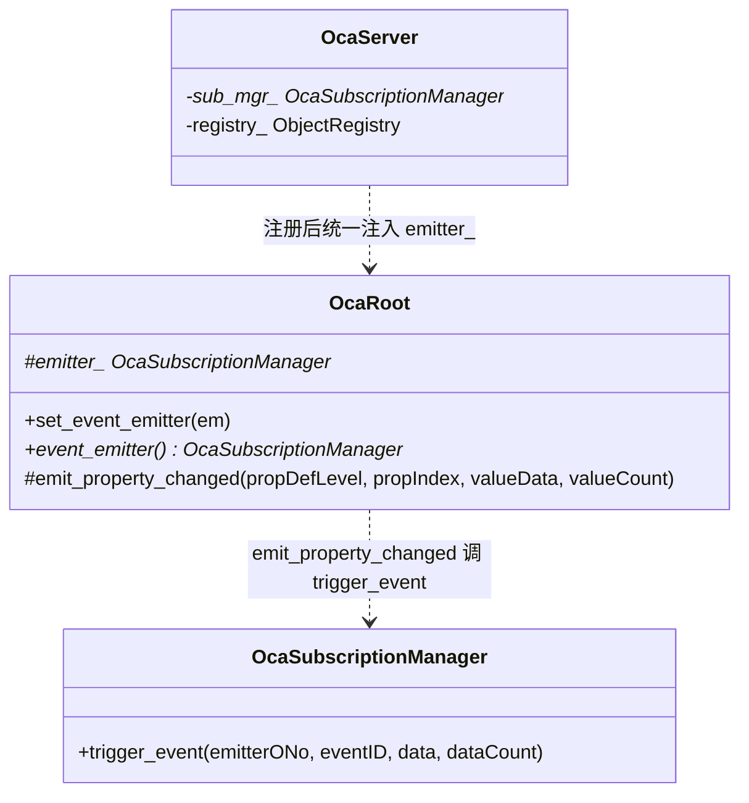
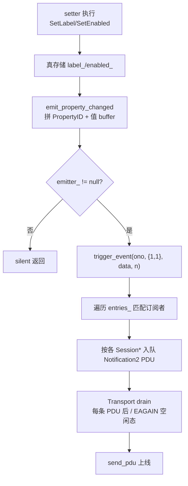

# Spec4 设计：PropertyChanged 通知发射与端到端投递验证

**版本**：2026-07-13
**状态**：草案
**前置**：Spec3 已完成(test5 5/5 PASSED，设备 COMPLIANT to AES70-2018，oca-test 31/31)

## 目标

把 daemon 从"订阅能成功但永不发通知"补全为"attributable setter 真触发 PropertyChanged，且端到端可验证"：

1. 打通"对象 → SubscriptionManager"可达性：OcaRoot 持有事件总线引用，**发射 session 无关**，为将来 daemon 自发事件(PTP/链路)留通路。
2. SetLabel（OcaAgent / OcaWorker / OcaApplicationNetwork 三类）+ OcaDeviceManager.SetEnabled 从 no-op 改为真存储 + 真 trigger PropertyChanged，负载含完整 PropertyID + 新值。
3. oca-test 新增端到端用例，验证"订阅 → setter → 收 Notification2 → 解析 PropertyID + 新值正确"。
4. oca-probe 扩展：作为客户端发起 AddPropertyChangeSubscription2，触发 setter（经 SetLabel 命令），接收并打印 Notification2，供人工/脚本二次核验。**不接真实控制器**(本 Spec 边界)。

## 验收

- 构建：`oca-dev.sh` 成功
- 单元/端到端：oca-test 全绿(31 现有 + 3 新增 = 34)
- oca-probe：新增"PropertyChanged 订阅与投递"探测段输出 `[OK]` 且能打印收到的新 label 值
- 回归：Spec1~3 既有断言不破

## 不在 Spec4 范围

- 真实 Windows controller 联调(留 Spec5 前的独立动作)
- 属性元数据发现接口(GetPropertyIdentifier 类)：YAGNI
- daemon 自发事件(PTP locked 等)：留 Spec5 media 桥接

## 问题根因

合规判定已认定"事件已实现"(AddSubscription 返回 OK)，但实际 PropertyChanged 通知**从未端到端验证过**：

- `trigger_event` 全部调用点都在 `tests/oca_test.cpp`(3 处)，**零生产调用点**。
- `device_manager.cpp::SetEnabled` 是 no-op，不 trigger；`agent.cpp`/`root.cpp`/`application_network.cpp` 的 SetLabel 是 no-op，不 trigger。
- 既有 `oca_e2e_acceptance` 用 `server.subscription_manager()->trigger_event(...)` **测试代码直接伸手**触发，绕过生产路径，只证明"队列 + drain"通，**未证明"某 setter 真触发通知"**。
- oca-probe 的订阅段代码注释明确写"`本探测不触发`"。

投递管线本身已完整(encode → enqueue → drain → wire)，缺口在**发射点**。

## 设计决策

### 决策 1：对象可达性——OcaRoot 注入事件总线（方案 C）

**AES70 语义区分**：发射(emission)是对象内部语义事件，与是否有控制连接无关；投递(delivery) 沿订阅者 TCP 连接送达，必然 session 绑定。规范要求两者解耦——否则 daemon 自发状态变化(PTP locked、链路掉线、后台线程改属性)将永远发不出来。

三方案对比：

| 方案 | 发射是否依赖 session | AES70 一致性 |
|------|--------------------|-------------|
| A: Session 持有 sub_mgr | 是——对象经 `sess.sub_mgr()` 才能触发 | ❌ 关死自发事件通路 |
| B: Registry 持有 sub_mgr | 取决于对象如何拿 registry | ⚠️ 仍 session 绑定 |
| C: OcaRoot 持有 emitter | 否——对象成员，随时可发 | ✅ 发射/投递解耦 |

**选方案 C**。OcaRoot 是所有对象共同基类，一处注入即覆盖全部对象，不改 9 个构造签名。发射经对象成员 `emitter_` 调用，session 无关；投递仍由 `trigger_event` 内部按各订阅者 `Session*` 入队（继承现有实现）。

线程安全：`trigger_event` 已自带 `mutex_`，各 `Session` 写队列自带 `mutex_`，setter 在任意线程调用 `emit` 均安全。Spec4 内仍只从 exec 线程触发，无新增线程。

### 决策 2：发射点选 SetLabel(三类) + SetEnabled

将 Spec3 已实现且返回 OK 的 4 个 no-op setter 改为真存储 + emit：

| setter | 所在类 / 方法索引 | 存储字段 | PropertyID | 值编码 |
|--------|------------------|---------|-----------|--------|
| Agent.SetLabel | OcaAgent handle_agent@2 | `OcaAgent::label_` | {2,1} | OcaString |
| Worker.SetLabel | OcaWorker handle_worker@9 | `OcaWorker::label_` | {2,1} | OcaString |
| AppNet.SetLabel | OcaAppNet handle_appnet@2 | `OcaAppNet::label_` | {2,1} | OcaString |
| DeviceManager.SetEnabled | OcaDeviceManager exec@12 | `OcaDeviceManager::enabled_` | {3,1} | OcaBoolean(u8) |

**兼容性**：GetLabel 改为 `label_.empty() ? role() : label_`，SetLabel 空体探测保护保留(剩余字节 < 最小长度则 no-op 返回 OK，不读不存不发)。spec3 单元测试发空体且不经 OcaServer(emitter=nullptr)，断言不破；GetEnabled 改返 `enabled_`(默认 true 仍返 1)。

### 决策 3：通知负载 = 完整 PropertyID + 属性值

AES70 `OcaPropertyChangedNotification2` 的 data 字段定义为 `[ PropertyID{u16,u16} + propertyValue(参数化编码) ]`。本 Spec 采用完整负载：客户端可直接从通知取新值，端到端验证闭环；不用客户端二次 Get。

### 决策 4：PropertyID 按规范定义（声明类 defLevel + 该类属性表 propertyIndex）

**AES70 规范**：`OcaPropertyID = { defLevel : 声明该属性的类层次层级, propertyIndex : 该属性在声明类属性表中的下标 }`。`propertyIndex` 与 `methodIndex` 是**两个独立命名空间**，不得混用——故不复用 SetLabel 的 methodIndex(2/9)作为 propertyIndex。

各属性归属与编号：

| 属性 | 引入它的类 | ClassID | defLevel | propertyIndex |
|------|-----------|---------|----------|--------------|
| Label | OcaAgent | {1,2} | 2 | 1(首个可报变属性) |
| Label | OcaWorker | {1,1} | 2 | 1 |
| Label | OcaApplicationNetwork | {1,4} | 2 | 1 |
| Enabled | OcaDeviceManager | {1,3,1} | 3 | 1 |

> Agent 与 Worker 各自独立声明 Label(defLevel 都是 2 但分属不同类)，这是 AES70 现实。新增 `methods.hpp` 常量 `kPropLabel=1`、`kPropEnabled=1`（语义=各类属性表第 1 个可报变属性，自文档化）。

## 架构

### 对象可达性与发射链示意



### 发射 → 投递数据流



## OcaRoot 注入与 emit helper

```cpp
// classes/root.hpp —— OcaRoot 修改
class OcaRoot : public Object {
 public:
  // ... 既有 ...
  // Spec4:注入事件总线(PropertyChanged 发射用)。默认 nullptr，
  // setter 在真存储属性后经此触发；为空时该对象不发通知。
  void set_event_emitter(OcaSubscriptionManager* em) { emitter_ = em; }
  OcaSubscriptionManager* event_emitter() const { return emitter_; }

 protected:
  // ... 既有 ...
  // 编码并触发 PropertyChanged 通知。data 负载 = PropertyID{u16,u16}
  // + 已编码属性值。emitter_ 为空时静默(只读对象 / 未注入)。
  void emit_property_changed(uint16_t prop_def_level, uint16_t prop_index,
                             const uint8_t* value_data, uint16_t value_count);
  OcaSubscriptionManager* emitter_ = nullptr;  // 新增
};
```

```cpp
// classes/root.cpp
void OcaRoot::emit_property_changed(uint16_t prop_def_level,
                                    uint16_t prop_index,
                                    const uint8_t* value_data,
                                    uint16_t value_count) {
  if (!emitter_)
    return;
  oca::ocp1::Writer w;
  w.u16(prop_def_level);
  w.u16(prop_index);
  for (uint16_t i = 0; i < value_count; ++i)
    w.u8(value_data[i]);
  emitter_->trigger_event(ono(),
                          {methods::kDefLevelRoot, methods::kEventPropertyChanged},
                          w.data(), static_cast<uint16_t>(w.size()));
}
```

OcaServer 注册完所有对象后统一注入：

```cpp
// oca_server.cpp(五对象 register_object 之后)
// Spec4:为所有对象注入事件总线，使 attributable setter 能触发 PropertyChanged。
for (auto* obj : registry_.objects_in_range(1, 9999))
  obj->set_event_emitter(sub_mgr_);
```

> `objects_in_range(1, 9999)` 覆盖全部已注册对象(管理器 1~99、根块 100、网络对象 4097/4098)，比硬编码具体 ONo 更稳。

## setter 改造细节

### SetLabel（以 OcaAgent 为例，Worker/AppNet 同模式）

```cpp
// classes/agent.cpp handle_agent
case methods::kAgentSetLabel: {
  // 空体探测(无完整 OcaString)：no-op 返回 OK，不破坏 Spec1 回归
  if (req.remaining() < 2)  // Ocp1List 最少长度 2 字节
    return {Status::OK, 0};
  std::string v = req.string();        // OcaString = Ocp1List<Utf8CodePoint>
  label_ = v;
  oca::ocp1::Writer vw;
  vw.string(v);
  emit_property_changed(2 /*Agent 引入级*/, 1 /*kPropLabel*/, vw.data(),
                         static_cast<uint16_t>(vw.size()));
  return {Status::OK, 0};
}
case methods::kAgentGetLabel: {
  rsp.string(label_.empty() ? role() : label_);
  return {Status::OK, 1};
}
...
```

### DeviceManager.SetEnabled

```cpp
// classes/device_manager.cpp
ExecResult OcaDeviceManager::SetEnabled(ocp1::Reader& req) {
  if (req.remaining() >= 1) {
    uint8_t v = req.u8();        // OcaBoolean
    enabled_ = (v != 0);
    emit_property_changed(3 /*DevMgr 引入级*/, 1 /*kPropEnabled*/, &v, 1);
  }
  return {Status::OK, 0};
}
ExecResult OcaDeviceManager::GetEnabled(ocp1::Writer& rsp) {
  rsp.u8(enabled_ ? 1 : 0);
  return {Status::OK, 1};
}
```

### methods.hpp 新增常量

```cpp
// Spec4:PropertyChanged 通知负载中的 PropertyID.propertyIndex
// 按声明类属性表编号。Label/Enabled 均为各类首个可报变属性。
constexpr uint16_t kPropLabel = 1;      // OcaAgent/OcaWorker/OcaAppNet
constexpr uint16_t kPropEnabled = 1;    // OcaDeviceManager
```

## 测试用例

### 新增用例 1：dispatch_property_changed_label_emit（单元级 + 真实发射）

验证对象级发射链。构造 OcaNetwork(4097) + 真实 OcaSubscriptionManager，单元内手动注入 emitter：

1. `OcaSubscriptionManager sm(4); OcaNetwork net(4097, 100); net.set_event_emitter(&sm);`
2. 建 Session + `AddPropertyChangeSubscription2(emitter=4097, PropertyID{2,1})`
3. `net.exec(SetLabel{kAgentSetLabel=2}, "hello")` → 真存 + emit
4. `sess.take_notification(ntf)` → 解析 Notification2：
   - emitterONo == 4097
   - eventID == {kDefLevelRoot, kEventPropertyChanged}
   - data 解析：PropertyID{2,1} + OcaString == "hello"
5. 回读 `GetLabel{kAgentGetLabel=1}` → 返回 "hello"
6. SetLabel 走 emitter=nullptr 时 silent，无 ntf

### 新增用例 2：oca_e2e_property_changed（全真实 socket 端到端）

模仿 `oca_e2e_acceptance` 模式，经真实 SetLabel 命令触发(不伸手 trigger_event)：

1. OcaServer start + connect + KeepAlive 握手
2. `AddPropertyChangeSubscription2(target=4, emitter=4097, PropertyID{2,1})` → subId
3. 发 SetLabel 命令(target=4097, kAgentSetLabel=2, OcaString="world") → Response OK + 0 参
4. 发 GetOcaVersion ping → 触发 transport drain
5. `recvPdu` → kPduNtf2：emitterONo=4097, eventID={1,1}, data=PropertyID{2,1}+OcaString=="world"
6. 再发 GetLabel(4097, kAgentGetLabel=1) → Response data == "world"

> 里程碑验收：不经任何测试代码直接调 trigger_event，而是真实命令 → 真实发射 → 真实 drain → 真实 wire → 真实解析，证明端到端闭环。

### 新增用例 3：dispatch_property_changed_enabled_emit（对称验证 DeviceManager）

emitter=1(OcaDeviceManager ONo)，PropertyID{3,1} + OcaBoolean，对称于用例 1。

### oca-probe 扩展

新增探测段"PropertyChanged 订阅与投递"(放在现有 EV2 订阅段之后)：

1. `probe.cmd(4, AddPropertyChangeSubscription2, emitter=4097, PropertyID{2,1})` → 期望 OK
2. `probe.cmd(4097, SetLabel{kAgentSetLabel=2}, OcaString="oca-probe-test")` → 期望 OK + 0 参
3. `probe.cmd(1, GetOcaVersion)` ping → 触发 drain
4. 等待读 socket，期望 kPduNtf2：emitterONo=4097, eventID={1,1}, data=PropertyID{2,1}+OcaString
5. 打印 `[OK] 收到 PropertyChanged, emitter=4097, newLabel="oca-probe-test"`
6. `probe.cmd(4097, GetLabel{kAgentGetLabel=1})` 回读确认 == "oca-probe-test"
7. 未收到 Ntf2 或内容不符 → failures++

新增参数 `--no-pc`(默认开)控制是否跑该段，与现有 `--no-sub` 同模式。

## 文件变更清单

| 操作 | 文件 | 内容 |
|------|------|------|
| 修改 | `classes/root.hpp` | OcaRoot 新增 `emitter_` 成员 + `set_event_emitter`/`event_emitter` + protected `emit_property_changed` 声明；OcaWorker 新增 `label_` 成员 |
| 修改 | `classes/root.cpp` | `emit_property_changed` 实现；handle_worker: SetLabel@9 真存+emit，GetLabel@8 改 `label_.empty()?role():label_` |
| 修改 | `classes/agent.hpp` | OcaAgent 新增 `label_` 成员 |
| 修改 | `classes/agent.cpp` | handle_agent: SetLabel@2 真存+emit，GetLabel@1 同上 |
| 修改 | `classes/application_network.hpp` | OcaAppNet 新增 `label_` 成员 |
| 修改 | `classes/application_network.cpp` | handle_appnet: SetLabel@2 真存+emit，GetLabel@1 同上 |
| 修改 | `classes/device_manager.hpp` | OcaDeviceManager 新增 `enabled_`(默认 true) |
| 修改 | `classes/device_manager.cpp` | SetEnabled 真存+emit(PropertyID{3,1}+OcaBoolean)；GetEnabled 返 enabled_ |
| 修改 | `methods.hpp` | 新增 `kPropLabel=1`、`kPropEnabled=1` |
| 修改 | `oca_server.cpp` | 注册完对象后统一 `set_event_emitter(sub_mgr_)` 注入 |
| 修改 | `tests/oca_test.cpp` | 新增 3 个用例 |
| 修改 | `tools/oca_probe.cpp` | 新增 PropertyChanged 探测段 + `--no-pc` 参数 |
| 不改 | CMakeLists.txt | 无新源文件 |

## 风险与缓解

| 风险 | 缓解 |
|------|------|
| 真存 SetLabel 破坏 Spec3 GetLabel/角色名断言 | `label_` 默认空，GetLabel 走 `label_.empty()?role():label_`；spec3 单元测试 emitter=nullptr 且发空体，断言不变 |
| SetLabel 单元测试不经 OcaServer 直接 new 对象 → emitter_=nullptr → 不 emit | 预期 silent；端到端闭环由用例 2 承担 |
| emit 在非 exec 线程调用(将来 daemon 自发事件) | trigger_event + Session 队列均自带 mutex，已线程安全；Spec4 内仍只从 exec 线程触发，无新增线程 |
| 真控制器无法解析 PropertyID(无元数据发现) | 已接受边界(YAGNI)；propertyIndex=1 是惯例，留 Spec5 后按需补 |
| 改 OcaRoot 影响所有子类 | 只加新成员 + 新 protected 方法，不改既有 exec/role；Spec3 委托链不动 |
| DeviceManager GetEnabled 原硬编码 1 → 改 enabled_ | 默认 true 仍返 1；Spec1 e2e GetEnabled 断言不变 |

## 与既有 Spec 关系

- **Spec1**：SetEnabled 空体保护保留，emitter=nullptr 时 silent — 兼容
- **Spec2**：`oca_e2e_acceptance` OperationalState 投递保留 — 互补
- **Spec3**：SetLabel 空体保护 + GetLabel 角色名兼容，委托链不动 — 兼容
- **Spec4**：本 Spec 补全"发射点从无到有 + 完整负载 + 端到端闭环"

## 后续

本 Spec4 完成后：
- **Spec4 验收**：oca-test 34/34，oca-probe PropertyChanged 段 [OK]
- **Spec5**：media 桥接主线(RTP source/sink 经 OCA 暴露 + PTP 状态自发 PropertyChanged)