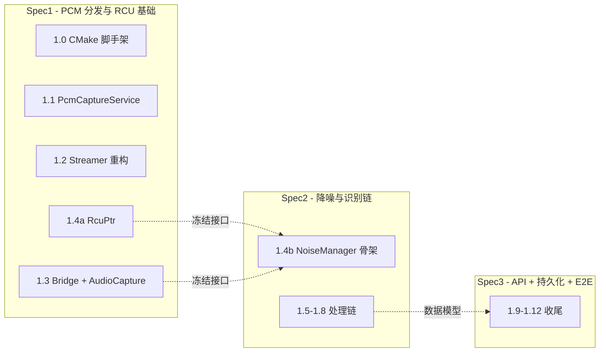
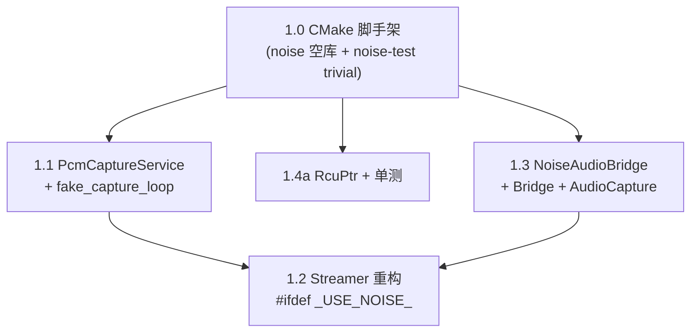

# Noise Spec1 设计文档 - PCM 分发与 RCU 基础

> **版本**: 2026-07-20
> **范围**: Spec1 = PCM 分发基础设施 + RCU 同步原语（架构文档 §10 步骤 1.0–1.4a）
> **产出**: `WITH_NOISE=ON` 下 daemon 经 `PcmCaptureService` 独占 ALSA capture 并向消费者分发帧；Streamer 重构在 `#ifdef _USE_NOISE_` 守卫下零回归；`RcuPtr<T>` 自实现 RCU 原语独立单测全过；为 Spec2（降噪+识别链）冻结对外稳定接口
> **基于**: `docs/noise/architecture-design.md` v0.2-draft（feature/noise 分支）+ OCA spec/plan 流程先例（`docs/ops/aes70-oca-spec1-design.md`）
> **下一步**: Spec2 = 降噪与噪声识别链（NoiseManager 骨架 + NoiseDetector + DenoiseProcessor + NoiseAnalyzer + TemplateDB，步骤 1.4b–1.8）

---

## 决策记录

| # | 决策 | 选定 | 理由 |
|---|------|------|------|
| 1 | Phase 1 spec 拆分 | 3 个 spec | Spec1=PCM 分发+RCU 基础(1.0–1.4a)、Spec2=降噪+识别链(1.4b–1.8)、Spec3=API+持久化+E2E(1.9–1.12)。每个 spec 一个可独立验证的闭环；切缝沿已存在于架构文档的稳定 API（§3.1 `FrameCallback` / §3.8 `RcuPtr` / §4.1 `NoiseAudioBridge`），不凭空造跨 spec 活跃设计接口 |
| 2 | 1.2 回归门槛 | stub-FrameProvider 单测，留在 Spec1 | `daemon-test` 仅测 streamer config 往返（`daemon/tests/daemon_test.cpp:429-468`），无 AAC 功能测试。1.2 是重构，"重构后仍能从 FrameProvider 拿帧产出 AAC"的正确性应在所属 spec 内闭环，不跨 spec 借 Spec3 的 E2E |
| 3 | noise-test 脚手架时机 | 1.0 即建 noise-test trivial target | 让 1.0 的"构建验证"门槛能跑通 `noise-test`；1.4a 填首个真测试（RcuPtr）；`noise_test.conf`（48kHz/HTTP 9998）推迟到 Spec3 的 1.12 E2E 才需要，1.4a RcuPtr 是纯单测不需 conf |
| 4 | AudioCapture 下游解耦 | `std::function` callback | §3.1 已是 `FrameCallback = std::function`；period 生命周期同理用 `PeriodBeginCallback`/`PeriodEndCallback`。Spec2 的 NoiseManager 注册自身为这些 callback。Spec1 用 stub callback 单测，不引入对 NoiseManager 的前向编译依赖 |
| 5 | `daemon/noise/CMakeLists.txt` | 随 spec 渐进追加源码 | 不一次性写 §8.2 全量 `NOISE_SOURCES`（引用未实现 `.cpp` 致编译失败）。Spec1 终态仅 `audio_capture.cpp`；`rcu_ptr.hpp` 是 header-only template 不入 SOURCES。每个 spec 在自己范围内追加，Phase 1 终态对齐 §8.2 |
| 6 | spec/plan 文档位置 | `docs/superpowers/specs/` + `docs/superpowers/plans/` | 按 `.claude/rules/skills.md` 约定统一归档，与 OCA 早先放 `docs/ops/` 不同（noise 起改用 superpowers 路径）；架构设计文档（`docs/noise/architecture-design.md` 等）是跨切面设计非 spec/plan，留在 `docs/noise/` |
| - | JSON 库 / FFT / VAD 降级 | 见 arch doc §11.1 D1/D2/D3 | D1=boost::property_tree、D2=kiss_fft、D3=RNNoise VAD 为主。影响步骤在 Spec2/3（1.5–1.10），Spec1 不涉及 |

---

## §A 范围与边界

### §A.1 步骤映射

| 步骤 | 产出 | arch 文档依据 |
|------|------|--------------|
| 1.0 | CMake 脚手架：`option(WITH_NOISE)` + SOURCES 追加（`pcm_capture_service.cpp`、`noise_session_manager_bridge.cpp`，须在 `add_executable` 前）+ `add_subdirectory(noise)` + `noise-dev.sh` build 加 `-DWITH_NOISE=ON` + 空 `noise` 库 + `noise-test` trivial target | §8.2 |
| 1.1 | `PcmCaptureService`：独占 ALSA capture + FrameProvider 分发 + PTP observer + FAKE_DRIVER `fake_capture_loop` | §4.3, §11 风险19/21 |
| 1.2 | Streamer 重构：`#ifdef _USE_NOISE_` 切走 `snd_pcm_open/readi`，改从 PcmCaptureService 注册 FrameProvider 拿帧；上游路径逐字节保留 | §4.3 Taste决策2, §4.4 |
| 1.3 | `NoiseAudioBridge` 纯虚接口（§4.1）+ `NoiseSessionManagerBridge` 实现（§4.2）+ `AudioCapture`（§3.1，下游 stub callback） | §3.1, §4.1, §4.2 |
| 1.4a | `RcuPtr<T>` 自实现 RCU 原语 + 独立单测（含 `const T` 支持） | §3.8, §11 风险11/22 |

### §A.2 显式 out-of-scope（留给 Spec2/3，避免越界）

- NoiseManager 骨架 / ①②③④ 处理链 / 各处理组件（Spec2 1.4b–1.8）
- HTTP `/api/noise/*` 路由、数据持久化、`main.cpp` 装配、Streamer 三路 AAC、端到端 E2E（Spec3 1.9–1.12）
- `daemon/noise/CMakeLists.txt` 全量 `NOISE_SOURCES`（§8.2 终态）--Spec1 仅含 `audio_capture.cpp`，其余随 Spec2/3 渐进追加
- `noise_test.conf`（Spec3 1.12 才需要）
- 入口重采样 `resampler.hpp`（Phase 1 限定 48kHz，原生即 48kHz，重采样为直通；Phase ≥2 才需，见 §11 风险1）

### §A.3 Spec1 在 Phase 1 中的位置

Spec1 冻结的接口（虚线）是 Spec2 的直接依赖，Spec1 内实现后不得随意改签名。

---

## §B 验收标准

### §B.1 Spec1 整体 gate

1. `./noise-dev.sh build`（FAKE_DRIVER=ON, WITH_NOISE=ON, **WITH_STREAMER=OFF**）通过，`daemon/compile_commands.json` 生成且路径指向本 worktree（`.claude/rules/build.md`）。此构建覆盖 1.1/1.3/1.4a 的噪声模块代码，**不覆盖 1.2**（Streamer 未编译）
2. `noise-test` 全过：RcuPtr 单测（1.4a）+ PcmCaptureService `fake_capture_loop` 单测（1.1）+ Bridge 格式转换/通道解复用单测（1.3）
3. **Streamer 零回归**：`cmake -DFAKE_DRIVER=ON -DWITH_NOISE=OFF .` 通过 + 现有 `daemon-test` 全过（Streamer 路径逐字节不变，`daemon_test.cpp` 仅 config 往返测试不受影响）
4. 1.2 stub-FrameProvider 单测：注入 stub FrameProvider 喂已知 PCM，Streamer 产出非空 AAC 帧（见 §D.1 决策2）。**需 `WITH_STREAMER=ON -DWITH_NOISE=ON` 单独构建**（§D.1 构建配置），gate 1 的 `noise-dev.sh build` 不覆盖
5. 1.2 编译验证：`WITH_STREAMER=ON -DWITH_NOISE=ON -DFAKE_DRIVER=ON` 构建通过（`#ifdef _USE_NOISE_` 守卫下 Streamer 改走 PcmCaptureService 路径编译就绪）

### §B.2 逐步验收

| 步骤 | 验证 |
|------|------|
| 1.0 | `./noise-dev.sh build` 通过；`cmake -DFAKE_DRIVER=ON -DWITH_NOISE=OFF .` 通过且 daemon 行为零变化；`noise-test` trivial test 通过 |
| 1.1 | 单元测试：帧回调触发；FAKE_DRIVER 模式 `frame_count==6144`、channels/sample_rate 正确；PTP unlock 触发 `stop_flag_` 退出 |
| 1.2 | 回归测试：`WITH_NOISE=OFF` 时 AAC 流功能不变（现有 `daemon-test`）；stub-FrameProvider 单测产出非空 AAC |
| 1.3 | 单元测试：Bridge 帧回调触发；uint8_t->float 转换精度；多通道交错->单通道解复用正确；`convert_buffer_` 容量断言 |
| 1.4a | 单元测试：`publish`/`load` 正确性；2-epoch 后旧值可释放；裸指针 period 内有效、跨 period 无效；`const T` 支持 |

---

## §C 对外稳定接口契约（Spec2 依赖）

Spec2 的 1.4b NoiseManager 骨架直接消费以下 API。**Spec1 实现后不得随意改签名**（改了须同步 Spec2）；签名以架构文档对应章节为准，本节仅做冻结登记。

| 接口 | arch 文档 | 关键签名要点 | Spec2 用途 |
|------|----------|------------|-----------|
| `PcmCaptureService` provider 注册 | §4.3 L1097-1098 | `ProviderToken register_provider(FrameProvider)` / `void unregister_provider(ProviderToken)`；`FrameProvider = std::function<void(const uint8_t*, size_t, uint8_t, uint32_t)>` | `NoiseSessionManagerBridge` 委托 |
| `PcmCaptureService` 状态查询 | §4.3 L1101-1106 | `is_sink_receiving` / `get_sample_rate` / `get_sink_channel_count` / `is_capturing` | NoiseManager 决策 |
| `RcuPtr<T>` | §3.8 L870-926 | `publish(shared_ptr<T>)->旧 shared_ptr` / `load()->裸 T*`（acquire）/ `advance_epoch()` / `epoch()`；2-epoch retire 契约；永不为空（构造即 publish） | NoiseManager `sensor_table_` + DenoiseProcessor 插件切换 |
| `NoiseAudioBridge` 纯虚 | §4.1 L960-991 | `register_frame_provider(sink_id, channel_map, FrameProvider)` / `unregister_frame_provider` / `is_sink_receiving` / `get_sample_rate` / `get_sink_channel_count` / `set_ptp_status_callback` / `set_sink_add_callback` / `set_sink_remove_callback` | NoiseManager 注册回调 |
| `AudioCapture` 帧分发 | §3.1 L360-385 | `FrameCallback = std::function<void(const float*, size_t, uint8_t)>` / `start(sink_id, NoiseAudioBridge&)` / `stop()` / `register_callback(FrameCallback)` / `on_period_begin()` / `on_period_end()` | NoiseManager 注册为帧消费者 + period 驱动 RcuPtr pin/unpin |

> **`DenoiseOutput` 不在本表**：三路输出（`original`/`denoised`/`noise`，§3.4）由 DenoiseProcessor（Spec2 1.6）产生，是 Spec2 内部 / Spec3（Streamer 三路 AAC）依赖的接口，不是 Spec1 产生给 Spec2 的契约。形状契约在架构文档 §3.4 + §11 风险23（`gsl::span<const float>`）已定，Spec2 实现时遵循，无需 Spec1 冻结。

> **接口稳定性纪律**：Spec1 内若实现过程中发现某签名需调整，须在 PR 描述中标注"接口变更"并同步评估对 Spec2 的影响。能不改则不改；必改则记入决策记录追加行。

---

## §D 切片级决策

### §D.1 决策2 - 1.2 回归门槛

**背景**：`daemon/tests/daemon_test.cpp` 的 streamer 相关测试（429-468 行）只验证 `streamer_enabled`/`streamer_channels` 等 config 字段经 JSON 往返一致，不验证 AAC 编码产出。1.2 删除 Streamer 的 `snd_pcm_open/readi` 改走 FrameProvider 后，"重构后仍能正确产出 AAC"这一正确性无现成测试覆盖。

**选定**：1.2 在 Spec1 内加一个 stub-FrameProvider 单测：
- 构造 stub `FrameProvider`（或 stub `PcmCaptureService`），向 Streamer 注册并喂入已知 PCM（如正弦波 + 静音段）
- 断言 Streamer 的产出端拿到非空 AAC 帧，且通道数与注册时一致
- 隔离 ALSA 真实设备（FAKE_DRIVER 下即可跑）

**构建配置**：`noise-dev.sh` 默认 `WITH_STREAMER=OFF`（§8.3 L1868），不编译 Streamer，故 §B.1.1 的 `noise-dev.sh build` gate 覆盖不到 1.2。1.2 需额外用 `WITH_STREAMER=ON -DWITH_NOISE=ON -DFAKE_DRIVER=ON` 构建。落地方式二选一（plan 阶段定）：(a) 给 `noise-dev.sh` 加 `--with-streamer` 选项开 `WITH_STREAMER=ON`；(b) 文档记录手动 `cmake -DWITH_STREAMER=ON -DWITH_NOISE=ON -DFAKE_DRIVER=ON .` 命令。倾向 (a)，与 `noise-dev.sh` 已封装构建的定位一致。

**测试挂载点（plan 阶段决）**：`noise-test` 只链 `$<TARGET_OBJECTS:noise>` + Boost（§8.2 L1803），不含 Streamer。Streamer 的 stub 单测要把 `streamer.cpp` 纳入测试链接。三选一（plan 阶段定）：(a) 给 `noise-test` 追加 `streamer.cpp` 对象 + faac 链接；(b) 把该测试放进 `daemon-test`（已链 daemon 源码，但 44100Hz/HTTP 9999 配置与 noise 48kHz 不一致，需隔离 test_case）；(c) 新建独立 `streamer-noise-test` target。倾向 (a)，与 noise-test 的 48kHz 隔离口径一致，但须确认 faac 在 FAKE_DRIVER 构建下可链。

**不选**：把 AAC 正确性验证全推到 Spec3 的 1.11/1.12 E2E。理由：1.2 是 Spec1 的重构步骤，其正确性应在所属 spec 内可验证；跨 spec 借 E2E 会让 1.2 的回归风险在 Spec1 内不可见，违反"每个 spec 一个可独立验证闭环"。

**AAC 三路（原始/降噪/噪声）+ 全链路 E2E** 仍留 Spec3（1.11 三路 AAC、1.12 E2E），那时才有 `fake_pcm_source` 完整链路和 DenoiseProcessor（Spec2 产出）。

**降级条款**：若 plan 阶段判定 stub 单测挂载成本过高（Streamer 对 faac/session_manager 的依赖过重），1.2 的 Spec1 验收降级为"WITH_NOISE=OFF 零回归 + WITH_NOISE=ON+WITH_STREAMER=ON 编译通过 + 代码 review 核对 `#ifdef _USE_NOISE_` 守卫全覆盖"，AAC 产出正确性延到 Spec3 1.11 验证。降级须在 plan 中显式记录并更新本节。

### §D.2 决策3 - noise-test 脚手架时机

**选定**：1.0 即在 `daemon/CMakeLists.txt` 建 `noise-test` target（§8.2 L1798-1808）+ `daemon/noise/tests/noise_test.cpp` 放一个 trivial passing test（如 `BOOST_AUTO_TEST_CASE(placeholder) { BOOST_CHECK(true); }`）。1.0 的构建验证门槛包含 `noise-test` 通过。

**1.4a** 在 `noise_test.cpp` 填首个真测试（RcuPtr）。1.1/1.3 的单测也陆续加进同一文件（或拆 `noise_test_rcu.cpp`/`noise_test_pcm.cpp`，由 writing-plans 决定）。

**`noise_test.conf`**（48kHz/HTTP 9998/FAKE_DRIVER，§8.2 L1800-1802 说明现有 `daemon/tests/daemon.conf` 是 44100Hz 不可复用）推迟到 Spec3 1.12 E2E 才创建--1.4a RcuPtr 是纯单测不需 daemon 配置。

### §D.3 决策4 - AudioCapture 下游解耦

**选定**：`AudioCapture` 不直接持有 `NoiseManager` 引用。下游经 `std::function` callback 解耦：
- 帧分发：`FrameCallback = std::function<void(const float*, size_t, uint8_t)>`（§3.1 L362 已定义）
- period 生命周期：`PeriodBeginCallback` / `PeriodEndCallback`（本 Spec1 在 `audio_capture.hpp` 补充定义，§3.1 未显式给出回调类型，仅给出 `on_period_begin/end` 方法--Spec1 把"转发给下游"实现为调注册的 callback）

Spec2 的 NoiseManager 把 `on_frame`/`on_period_begin`/`on_period_end` 注册为这些 callback。Spec1 用 stub callback 单测 `AudioCapture` 的帧分发与 period 钩子触发，**不引入对 `NoiseManager` 的前向编译依赖**（`AudioCapture` 不 include `noise_manager.hpp`）。

**与 §3.1 的偏差登记**：§3.1 L371-376 注释说 `on_period_begin/end` 转发给 `NoiseManager.on_period_begin/end`。Spec1 实现为"转发给注册的 callback"而非"直接调 NoiseManager"--语义等价（NoiseManager 注册自身为 callback），但解耦了编译依赖。记入决策记录备查。

### §D.4 决策5 - daemon/noise/CMakeLists.txt 渐进策略

**选定**：`daemon/noise/CMakeLists.txt` 随 spec 渐进追加源码，**不一次性写 §8.2 全量 `NOISE_SOURCES`**。各 spec 终态：

| spec | NOISE_SOURCES 终态 |
|------|-------------------|
| Spec1 | `audio_capture.cpp` |
| Spec2 | + `noise_detector.cpp` / `noise_analyzer.cpp` / `denoise_processor.cpp` / `denoise_plugin_factory.cpp` / `noise_manager.cpp`（+ RNNoise adapter） |
| Spec3 | + `noise_metrics.cpp`（+ `ref_comparator.cpp` 推迟到 Phase 2） |

`rcu_ptr.hpp`、`noise_audio_bridge.hpp`、`audio_capture.hpp` 等 header-only 不入 SOURCES。Phase 1 终态对齐 §8.2。

各 spec 在自己范围内追加，避免引用未实现 `.cpp` 致编译失败。降级插件选项（`NOISE_PLUGIN_DTLN`/`NOISE_PLUGIN_DEEPFILTER`）在 §8.2 已默认 OFF，Spec1 不动。

---

## §E 测试策略

| 步骤 | 测试内容 | 框架/位置 |
|------|---------|----------|
| 1.0 | `noise-test` trivial test 通过；`WITH_NOISE=OFF` build 通过；`WITH_NOISE=ON` build 通过且 `compile_commands.json` 路径正确 | Boost.Test / `daemon/noise/tests/` |
| 1.1 | `fake_capture_loop`：注册 stub provider，断言帧回调触发、`frame_count==6144`、channels/sample_rate 正确；PTP unlock 触发 `stop_flag_` 使 loop 退出；`fake_pcm_source` 未指定时投静音帧 | Boost.Test |
| 1.2 | stub-FrameProvider 注入 -> Streamer 产出非空 AAC（决策2）；`WITH_NOISE=OFF` 现有 `daemon-test` 全过 | Boost.Test |
| 1.3 | Bridge：uint8_t->float 转换精度（含边界值 0/满幅）；多通道交错->单通道解复用正确；`convert_buffer_` 容量断言（`frame_count × channels ≤ capacity`，§11 风险18）；stub `AudioCapture` callback 触发 + period 钩子顺序 | Boost.Test |
| 1.4a | RcuPtr：`publish`/`load` 正确性；2-epoch 后旧值释放（mock deleter 计数验证）；裸指针 period 内有效、`advance_epoch` 后跨 period 持有预期失效；`const T` 支持（`RcuPtr<const SensorTable>` 合法）；永不为空（构造即 publish） | Boost.Test |

**真实 ALSA 路径**（`capture_loop` + `snd_pcm_drop`/`snd_pcm_close` 中断阻塞读取，§11 风险19）不单测，留 `./noise-dev.sh run-real -i <iface>` 真机验证（与 fork-maintenance 真机验证口径一致）。FAKE_DRIVER 下用 `fake_capture_loop` 的 `stop_flag_` 退出模拟 PTP unlock 中断语义。

**测试隔离**：`noise-test` 与现有 `daemon-test`（`daemon/tests/`，HTTP 9999/44100Hz）隔离，用 HTTP 9998 + 独立 48kHz 配置（Spec3 创建 `noise_test.conf`，§8.2 L1800-1802）。

---

## §F 风险

引用架构文档 §11 风险表的 Spec1 相关条目，标注本 spec 的缓解落点：

| §11 风险# | 风险 | Spec1 缓解落点 |
|-----------|------|---------------|
| 7 | Streamer 重构回归 | 决策2 stub-FrameProvider 单测 + 零回归门槛（§B.1.3） |
| 11 | RT 路径同步原语非无锁 | 1.4a `RcuPtr` 自实现 + 独立单测（裸指针 period 生命周期契约） |
| 18 | `convert_buffer_` 裸指针无边界 | 1.3 容量断言（`frame_count × channels ≤ capacity`）+ 构造时按 `6144×8×4B=192KB` 分配 |
| 19 | PTP 失锁阻塞 `snd_pcm_readi` | 1.1 控制线程 `snd_pcm_drop()`+`snd_pcm_close()` 中断 + `stop_flag_` 退出（FAKE_DRIVER 下用 `fake_capture_loop` 模拟） |
| 21 | `fake_capture_loop` 无节拍/period/采样率规格 | 1.1 按 §4.3 注释三规格落地：①`sleep_until(next_period_time)` 实时节拍；②每次投递恰好 `kPeriodSamples=6144`；③WAV 采样率 ≠ daemon 配置时拒绝启动并告警 |
| 22 | RcuPtr epoch 假设单 RT 线程 | 1.4a 单测验证单读者语义；Phase 3 多线程不改 RcuPtr（capture 线程唯一读者，§3.8 L925） |

**Spec1 内部新增风险**：

| # | 风险 | 缓解 |
|---|------|------|
| S1-R1 | Streamer `#ifdef _USE_NOISE_` 守卫若漏切某条路径，`WITH_NOISE=ON` 时 PcmCaptureService 与 Streamer 争抢 ALSA open | 1.2 代码 review 逐路径核对 + stub 单测；`WITH_NOISE=OFF` 零回归门槛保证上游路径完整 |
| S1-R2 | `daemon/noise/CMakeLists.txt` 误写全量 SOURCES 致引用未实现 `.cpp` 编译失败 | 决策5 渐进追加约定；1.0 建空 `noise` 库后每步按需追加 |
| S1-R3 | `AudioCapture` period 回调类型（`PeriodBeginCallback`/`PeriodEndCallback`）§3.1 未显式定义，Spec1 自行补定义可能偏 NoiseManager（Spec2）预期 | 决策3 登记"语义等价但解耦编译依赖"；Spec2 1.4b 接入时若类型不符，Spec2 范围内调整 NoiseManager 适配（不改 Spec1 已冻结的 `FrameCallback`） |
| S1-R4 | 1.2 stub-FrameProvider 单测挂载成本过高（Streamer 依赖 faac/session_manager，`noise-test` 默认不链 Streamer），无法在 Spec1 内闭环 | 决策2 已列三选一挂载方案 + 降级条款（降为"零回归 + 编译通过 + review"，AAC 正确性延 Spec3 1.11）；plan 阶段先评估挂载成本再定是否降级 |

---

## §G 实现顺序与依赖预览

详细 task 拆解留给 writing-plans。本节仅给出依赖顺序骨架，供 plan 阶段展开：

- **1.0 是硬前置**：所有后续步骤依赖 CMake 脚手架能编译进 daemon
- **1.1 / 1.4a / 1.3 可并行起步**（都只依赖 1.0），但 1.3 的 Bridge 单测需 1.1 的 PcmCaptureService（或 stub）--plan 阶段决定是否拆 1.3 为"接口+stub 单测"与"集成 PcmCaptureService"两半
- **1.2 依赖 1.1 + 1.3**：Streamer 要从 PcmCaptureService 注册 FrameProvider（1.1），且 `#ifdef _USE_NOISE_` 守卫与 Bridge 路径协调（1.3 的接口定义）
- **1.4a 独立**：RcuPtr 是 header-only + 纯单测，与 1.1/1.2/1.3 无编译耦合，可最早做（plan 阶段可排到 1.0 之后立即）

**预计工期**：约 1 周（Phase 1 总计 3-4 周的约 1/3，与 Spec1 步骤数 5/13 匹配）

---

## 附录：参考文档

- `docs/noise/architecture-design.md` v0.2-draft - 跨切面架构设计（Spec1 引用 §3.1/§3.8/§4.1/§4.2/§4.3/§4.4/§6.2/§8.2/§10/§11）
- `docs/noise/denoise-plugin-architecture.md` - 降噪插件细节（Spec2 主体，Spec1 仅参考 §4.2 DenoiseOutput 三路形状）
- `docs/ops/aes70-oca-spec1-design.md` - OCA spec/plan 流程先例（格式参照）
- `.claude/rules/git-workflow.md` - spec/plan 提交规范（独立成笔，先于实现）
- `.claude/rules/build.md` - worktree 编译数据库约定（`compile_commands.json` 须带 `-DCMAKE_EXPORT_COMPILE_COMMANDS=ON`）
- `.claude/rules/fork-maintenance.md` - `#ifdef _USE_NOISE_` 上游 sync 笔记要求
