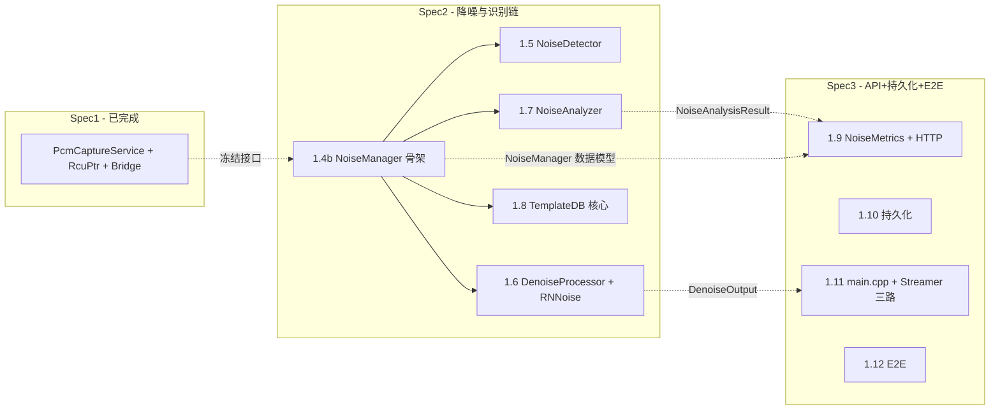
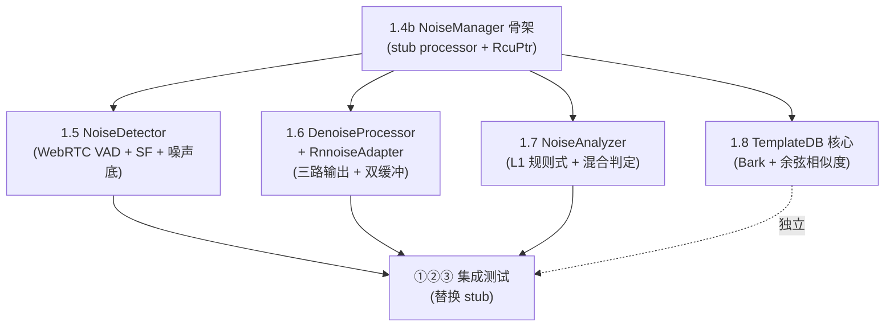

# Noise Spec2 设计文档 - 降噪与噪声识别链

> **版本**: 2026-07-20
> **范围**: Spec2 = 降噪与噪声识别链（架构文档 §10 步骤 1.4b–1.8）
> **产出**: NoiseManager 骨架（真实 ①②③ 接入，④NoiseMetrics stub 占位）+ NoiseDetector + DenoiseProcessor+RnnoiseAdapter + NoiseAnalyzer + NoiseTemplateDB 核心；为 Spec3 冻结接口（NoiseManager 数据模型 + DenoiseOutput + NoiseAnalysisResult + NoiseDetectionResult）
> **基于**: `docs/noise/architecture-design.md` v0.2-draft（feature/noise 分支，HEAD 34e7ac1，Spec1 已完成）+ `docs/superpowers/specs/noise-spec1-design.md`
> **下一步**: Spec3 = HTTP API + 持久化 + main.cpp 装配 + E2E（步骤 1.9–1.12）

---

## 决策记录

| # | 决策 | 选定 | 理由 |
|---|------|------|------|
| 1 | 1.8 HTTP+持久化范围 | 挪 Spec3 | Spec1 §A.2 已把 HTTP `/api/noise/*` + 持久化归 Spec3（1.9-1.12）。Spec2 的 1.8 = TemplateDB 核心（Bark 特征 + 余弦相似度 + 内存 store + L2 匹配逻辑），unit tested。HTTP CRUD + 磁盘持久化（templates.json + WAV）+ main.cpp 装配留 Spec3。Spec2 保持"处理组件 + 单测 + 无外部 I/O + 无 main.cpp"自洽边界，与 Spec1 一致 |
| 2 | ①②③ 接入 NoiseManager | 替换 1.4b stub，Spec2 跑真实 ①②③ | 架构文档 §10 步骤 1.4b 用 stub processor 是**临时**验证帧路由 + RcuPtr 机制（1.4b 阶段真实组件未建）。1.5-1.8 建真实组件时各自接入 NoiseManager（替换 stub）。Spec2 终态 NoiseManager 跑真实 ①DenoiseProcessor -> ②NoiseDetector -> ③NoiseAnalyzer；④NoiseMetrics 用 stub 占位（Spec3 1.9 实装）。Spec2 §B.3 集成测试验证 ①②③ 链路。**解决 arch §10 "真实集成验证留到 1.9" 与 Spec1 "①②③④ 链路跑通" 的歧义**：①②③ 在 Spec2 接入+验证，④留 Spec3 |
| 3 | WebRTC VAD 来源 | standalone C 封装，FetchContent 引入 | §3.2 推荐 WebRTC VAD（C，BSD）via "独立提取版本 webrtc-vad C 封装"。用 GitHub standalone 提取版（如 `shimat/webrtc_vad` 或类似），不从 Chromium 树自行提取（工作量大） |
| 4 | RNNoise 集成 | FetchContent from gitlab.xiph.org | §8.2 `FetchContent_Declare(rnnoise GIT_REPOSITORY https://gitlab.xiph.org/xiph/rnnoise.git GIT_TAG master)`。`RnnoiseAdapter` 实现 `IDenoisePlugin`，封装 `rnnoise_create`/`rnnoise_process_frame`。风险 S2-R2：网络可达性 |
| 5 | 测试用合成帧 | 不用 WAV 文件 | Spec2 无 main.cpp 装配，无法跑 daemon 喂 WAV。单测 + 集成测试用程序合成帧（白噪/粉噪/哼声/脉冲/语音/静音），精确控制特征，分类断言更可靠。真实 WAV 喂入（fake_pcm_source）留 Spec3 1.12 E2E |
| 6 | PTP-unlock reset 协调 | NoiseManager housekeeper 安全延迟 | §3.7 Taste决策3：on_ptp_unlocked 置 `ptp_locked_=false`+`reset_pending_=true`（atomic）；plugin reset 须在 capture 线程静止后执行。Spec2 实现问题（S2-R1）：NoiseManager 如何得知 PcmCaptureService（Spec1）已 join？用控制线程 housekeeper 周期检查 `reset_pending_` + 安全延迟（PTP unlock 后 ~200ms 确保 capture 停止）执行 reset |
| 7 | spec/plan 位置 | `docs/superpowers/specs/` + `plans/` | 与 Spec1 一致（.claude/rules/skills.md） |
| - | JSON 库 / FFT / VAD 降级 | 见 arch §11.1 D1/D2/D3 | D1 boost::property_tree（1.8 不持久化，Spec3 1.10 用）；D2 kiss_fft 复用 RNNoise 内嵌（1.5/1.7 用）；D3 RNNoise VAD 为主、WebRTC VAD 交叉验证（1.5/1.6） |

---

## §A 范围与边界

### §A.1 步骤映射

| 步骤 | 产出 | arch 依据 |
|------|------|----------|
| 1.4b | NoiseManager 骨架：`RcuPtr<const SensorTable>` COW + on_frame 按 sink_id 路由 + on_period_begin/end 驱动 RcuPtr pin/unpin + DenoiseProcessor front/back swap + PTP-unlock 联动（`ptp_locked_`/`reset_pending_` + housekeeper reset） | §3.7 |
| 1.5 | NoiseDetector：WebRTC VAD + 频谱平坦度（SF）+ 噪声底估计（最小统计法）。监测角色，非门控；`NoiseDetectionResult` | §3.2 |
| 1.6 | DenoiseProcessor + RnnoiseAdapter：`IDenoisePlugin` 纯虚 + `DenoisePluginRegistry` 单例 + RNNoise 集成 + 三路输出（original/denoised/noise）+ front/back 双缓冲 + 准热切换 + dry/wet。**始终执行** | §3.4, 插件文档 §4.2 |
| 1.7 | NoiseAnalyzer：L1 规则式分类（白/粉红/哼声/脉冲/宽带/数字）+ 连续置信度 + 混合噪声判定 + 分析输入源自动选择（降噪开->NoisePCM+RNNoise VAD；关->OriginalPCM+Detector VAD）；`NoiseAnalysisResult` | §3.3 |
| 1.8 | NoiseTemplateDB 核心：Bark 32 频带特征提取 + 余弦相似度匹配 + 内存 store + L2 匹配逻辑（无 HTTP/磁盘持久化） | §3.3.5, 调研 §6 |

### §A.2 显式 out-of-scope（留 Spec3 / Phase 2+）

- ④NoiseMetrics 指标聚合（1.9）-> Spec2 stub/no-op 占位
- HTTP `/api/noise/*` 路由（sensor CRUD + metrics + template CRUD/导入导出/回听）（1.9 + 1.8 的 HTTP 部分）
- 数据持久化（noise_status.json + templates.json + 原始 WAV）（1.10）
- main.cpp 装配（NoiseManager 构造 + http_server 路由注册）（1.11）
- Streamer 三路 AAC、端到端 E2E（1.12）
- RefComparator 参考音比对（Phase 2，2.1）
- DTLN / DeepFilterNet 插件（Phase 3，3.2）- Spec2 仅 RNNoise（`NOISE_PLUGIN_RNNOISE=ON` 默认，其余 OFF）
- 入口重采样 `resampler.hpp`（Phase 1 限定 48kHz，§11 风险1）

### §A.3 Spec2 在 Phase 1 中的位置

Spec1 冻结的接口（虚线）是 Spec2 的直接依赖；Spec2 冻结的接口是 Spec3 的依赖。

---

## §B 验收标准

### §B.1 Spec2 整体 gate

1. `./noise-dev.sh build`（WITH_NOISE=ON）通过；`./noise-dev.sh build --no-noise`（WITH_NOISE=OFF）零回归 + daemon-test 全过
2. noise-test 全过：NoiseManager 帧路由（stub）+ RcuPtr pin/unpin；NoiseDetector VAD/SF/噪声底；DenoiseProcessor 降噪量>10dB + noise=original-denoised + 插件切换静音窗口；NoiseAnalyzer 分类 + 混合判定；TemplateDB 录入+匹配
3. **①②③ 链路集成测试**（决策2）：NoiseManager 路由真实 ①②③（替换 1.4b stub），合成白噪帧跑通 ①DenoiseProcessor->②NoiseDetector->③NoiseAnalyzer，断言降噪量>10dB + 噪声分类=white
4. RNNoise FetchContent 构建通过（决策4）

### §B.2 逐步验收

| 步骤 | 验证 |
|------|------|
| 1.4b | 单元测试：多 sensor 路由；sensor 增删不阻塞帧处理（COW 原子换）；period 钩子驱动 RcuPtr pin/unpin；PTP unlock 置 `ptp_locked_=false` 后 process 跳过 |
| 1.5 | 单元测试：白噪/语音/静音 VAD；SF 白噪>0.7；噪声底估计（最小统计法）收敛 |
| 1.6 | 单元测试：合成含噪帧降噪量>10dB；noise = original - denoised（逐样本）；插件切换静音窗口 ~50-90ms；dry/wet 混合 `output = dry_wet×denoised + (1-dry_wet)×input` |
| 1.7 | 单元测试：白噪/哼声（50Hz 倍频）/脉冲（能量突变>6σ）/宽带分类；混合噪声判定（次高置信度>0.3）；输入源切换（降噪开->NoisePCM，关->OriginalPCM） |
| 1.8 | 单元测试：合成模板录入 + 匹配（相似度>0.75）+ 删除 + 内存 store 往返 |

---

## §C 对外稳定接口契约（Spec3 依赖）

Spec3 的 1.9-1.12 直接消费以下 API。**Spec2 实现后不得随意改签名**（改了须同步 Spec3）；签名以架构文档对应章节为准。

| 接口 | arch 依据 | 关键签名要点 | Spec3 用途 |
|------|----------|------------|-----------|
| `NoiseManager` 传感器生命周期 + 配置路由 | §3.7 L800-812 | `add_sensor(id, sink_id, NoiseSensorConfig)` / `remove_sensor` / `enable_sensor` / `switch_plugin(id, name)` / `set_dry_wet` / `set_param` | HTTP API sensor CRUD（1.9） |
| `NoiseSensorConfig` 数据模型 | §3.7 | sensor 配置（sink_id + 降噪开关 + 插件名 + dry_wet + 灵敏度等） | 持久化（1.10）+ HTTP（1.9） |
| `NoiseManager::on_frame`/`on_period_begin`/`on_period_end` | §3.7 L817-828 | `on_frame(sink_id, const float*, size_t)`；period 顶部 pin + period 结尾 swap+advance_epoch | AudioCapture 注册（Spec1 已冻结 FrameCallback/PeriodCallback） |
| `NoiseManager::get_denoise_output(sink_id)` | §4.4 L1173 | 返回 front 缓冲 `DenoiseOutput*`（acquire 序，与 swap release 配对） | Streamer `/denoised`/`/noise` 路由（1.11） |
| `DenoiseOutput` 三路 | §3.4 L652-657 | `original`/`denoised`/`noise`（`const float*` + `frame_count`，§3.4 实际结构）；§11 风险23 建议升级 `gsl::span<const float>` 防越界 - **plan 阶段定**：若项目已引入 GSL 用 span，否则保持 `const float* + frame_count`（DenoiseOutput 已携带 frame_count，span 收益边际）。period 内有效，跨 period 持有需拷贝 | Streamer 三路 AAC（1.11） |
| `NoiseAnalysisResult` | §3.3 L559-579 | `primary_type` + `primary_confidence` + `candidates[]` + `is_mixed` + 量化指标（noise_level_dbfs/spectral_centroid/spectral_flatness/hum_strength/impulse_count/band_energy[32]） | NoiseMetrics 聚合（1.9）+ HTTP metrics（1.9） |
| `NoiseDetectionResult` | §3.2 L441-447 | `is_noisy`/`confidence`/`spectral_flatness`/`estimated_snr_db`/`is_speech` | NoiseMetrics 聚合（1.9）+ HTTP（1.9） |
| `NoiseType` enum | §3.3 L548 | `Clean/White/Pink/Hum50Hz/Hum60Hz/Impulse/Broadband/Digital/Unknown` | HTTP metrics（1.9） |
| `NoiseTemplateDB` 内存 API | §3.3.5 | `add_template(name, bark_features) -> template_id` / `match(bark_spectrum) -> (template_id, similarity)` / `remove_template(id)` / `list_templates()`。**Spec2 仅内存 store**（无 wav_path - WAV 留存是 Spec3 1.8 HTTP+持久化） | Spec3 加 HTTP CRUD（1.8 HTTP 部分）+ 磁盘持久化（1.10） |

> **接口稳定性纪律**：Spec2 内若实现中发现某签名需调整，须 PR 标注"接口变更"并同步评估 Spec3。能不改则不改；必改则记入决策记录追加行。

---

## §D 切片级决策

### §D.1 决策2 - ①②③ 接入 NoiseManager（替换 1.4b stub）

**背景**：架构文档 §10 步骤 1.4b 说"用 stub processor 跑通帧路由"+"①->②->③->④ 真实集成验证留到 1.9"；但 Spec1 设计文档 Spec2 交付物写"①②③④ 链路跑通"。两者对 Spec2 是否接入真实 ①②③ 说法不一致。

**选定**：1.4b 先用 stub processor 验证 NoiseManager 帧路由 + RcuPtr pin/unpin 机制（1.4b 阶段真实组件未建）。1.5-1.8 建真实组件时**各自接入 NoiseManager**（替换 stub，incrementally）。Spec2 终态 NoiseManager 跑真实 ①②③；④NoiseMetrics 用 stub/no-op 占位（Spec3 1.9 实装）。Spec2 §B.3 集成测试验证 ①②③ 链路（合成白噪帧 -> 降噪量>10dB + 分类=white）。

**不选**：全 stub 到 Spec3 才接入真实 ①②③。理由：Spec2 建了 4 个真实组件（1.5-1.8）却不接入 NoiseManager，集成风险全压到 Spec3；Spec2 有真实集成验证更早暴露 ①②③ 接口不匹配。

### §D.2 决策3 - WebRTC VAD 来源

**选定**：用 standalone `webrtc-vad` C 封装（GitHub 提取版，FetchContent 或 submodule 引入），不从 Chromium 树自行提取。BSD 许可须在 `LICENSE_NOTICES.MD` 标注（S2-R3）。

**SpeexDSP VAD 不选**：arch §3.2 未推荐为主（SpeexDSP 是 DTLN 的重采样依赖，Phase 3 才引入）。

### §D.3 决策4 - RNNoise 集成

**选定**：按 §8.2 `FetchContent_Declare(rnnoise GIT_REPOSITORY https://gitlab.xiph.org/xiph/rnnoise.git GIT_TAG master)`。`RnnoiseAdapter` 实现 `IDenoisePlugin`，封装 `rnnoise_create`/`rnnoise_process_frame`（返回 VAD 概率，§3.2 RNNoise VAD 复用）。kiss_fft 复用 RNNoise 内嵌（D2）。

**风险 S2-R2**：gitlab.xiph.org 网络可达性。缓解：若 CI/构建环境无法访问，缓存或镜像 rnnoise 到 `3rdparty/rnnoise`（submodule）。

### §D.4 决策5 - 测试用合成帧

**选定**：Spec2 单测 + 集成测试用程序合成帧（白噪/粉噪/哼声/脉冲/语音/静音），不依赖 WAV 文件。合成帧精确控制频谱特征，分类断言可靠。

**真实 WAV 喂入**（fake_pcm_source）留 Spec3 1.12 E2E（那时才有 main.cpp + fake_capture_loop WAV 读取）。

### §D.5 决策6 - PTP-unlock reset 协调

**背景**：§3.7 Taste决策3 - plugin reset 须在 capture 线程静止后执行（避免与 RT process() 竞态）。PcmCaptureService（Spec1）在 PTP unlock 时 join capture 线程做 ALSA teardown；NoiseManager（Spec2）是独立 PTP observer，如何得知 PcmCaptureService 已 join？

**选定**：NoiseManager.on_ptp_unlocked() 置 `ptp_locked_=false`+`reset_pending_=true`（atomic，无锁）。控制线程 housekeeper（周期检查或延迟任务）在 `reset_pending_` 置位后**安全延迟 ~200ms**（确保 PcmCaptureService 已 stop_capture + join capture）执行 `plugin->reset()` 并清 `reset_pending_`。process() 周期入口检查 `ptp_locked_`，false 时跳过（直通/静音）。

**风险 S2-R1**：housekeeper 安全延迟若不足（PcmCaptureService join 慢于 200ms），reset 可能与停滞 process 竞态。实现时验证 PcmCaptureService stop_capture 时序；若不可靠，改用 PcmCaptureService 显式通知 NoiseManager（需 Spec1 PcmCaptureService 加回调，跨 spec 改动）。

---

## §E 测试策略

| 步骤 | 测试内容 | 框架/位置 |
|------|---------|----------|
| 1.4b | NoiseManager stub processor：多 sensor 路由；sensor 增删不阻塞帧（COW）；on_period_begin/end 驱动 RcuPtr pin/unpin；PTP unlock 置 `ptp_locked_=false` 后 process 跳过 | Boost.Test / `daemon/noise/tests/` |
| 1.5 | NoiseDetector：白噪/语音/静音 VAD；SF 白噪>0.7、语音<0.3；噪声底估计（最小统计法）在静音段收敛 | Boost.Test |
| 1.6 | DenoiseProcessor：合成含噪帧（信号+白噪）-> 降噪量>10dB；noise = original - denoised（逐样本验证）；插件切换静音窗口；dry/wet 混合 | Boost.Test（需链 rnnoise lib，S2-R4） |
| 1.7 | NoiseAnalyzer：白噪/哼声（50Hz+倍频）/脉冲（能量突变>6σ）/宽带分类 + 置信度；混合噪声判定（次高>0.3）；输入源切换（降噪开/关） | Boost.Test |
| 1.8 | TemplateDB：合成 Bark 特征模板录入 + 匹配（相似度>0.75）+ 删除 + 内存 store 往返 | Boost.Test |
| ①②③ 集成 | NoiseManager 路由真实 ①②③（替换 stub），合成白噪帧 -> 降噪量>10dB + NoiseAnalyzer 分类=white + NoiseDetector is_noisy=true | Boost.Test |

**测试隔离**：noise-test 与 daemon-test 隔离（HTTP 9998 + 48kHz，Spec1 已建）。RNNoise 推理在 noise-test 中跑（链 rnnoise lib，构建配置同 Spec1 Task 3 教训 - SOURCES/链接）。

**真实 ALSA / 真机**：留 `./noise-dev.sh run-real`（fork-maintenance 口径），Spec2 不单测真实 ALSA。

---

## §F 风险

引用架构文档 §11 风险表的 Spec2 相关条目 + Spec2 内部新增：

| 风险源 | # | 风险 | Spec2 缓解落点 |
|--------|---|------|---------------|
| §11 | 5 | 多 Sink CPU 占用 | Spec2 单线程逐帧（8 路 RNNoise ~5.6ms/period < 10ms 预算）；`noise_max_sensors` 软上限预防（Spec3） |
| §11 | 6 | RNNoise 对音乐过度抑制 | dry/wet 混合控制（决策4 dry/wet）；音乐场景建议仅检测 |
| §11 | 11/22 | RcuPtr RT 同步 | 复用 Spec1 RcuPtr（已验证）；NoiseManager `sensor_table_` + DenoiseProcessor 插件切换用同一原语 |
| §11 | 23 | DenoiseOutput 裸指针无生命周期标注 | plan 阶段定：项目已引入 GSL 则用 `gsl::span<const float>`；否则保持 §3.4 的 `const float* + frame_count`（DenoiseOutput 已携带 frame_count，span 防越界收益边际）+ period 内有效注释 + 编译期断言长度 |
| Spec2 | S2-R1 | PTP-unlock reset 时序（决策6） | housekeeper 安全延迟 ~200ms；实现时验证 PcmCaptureService join 时序；不可靠则加显式通知（跨 spec） |
| Spec2 | S2-R2 | RNNoise gitlab.xiph.org 网络可达（决策4） | 缓存/镜像到 3rdparty/rnnoise submodule |
| Spec2 | S2-R3 | WebRTC VAD 许可/提取（决策3） | standalone 封装 BSD 许可标注 LICENSE_NOTICES |
| Spec2 | S2-R4 | ①②③ 集成测试需链 rnnoise lib | noise-test CMake 加 rnnoise 链接（Spec1 Task 3 教训：SOURCES 位置 + 链接） |
| Spec2 | S2-R5 | 1.4b stub -> 真实 ①②③ 切换的接口不匹配 | 决策2 incremental 接入（1.5-1.8 各自接入时暴露接口问题，不积压到 Spec3） |

---

## §G 实现顺序与依赖预览

详细 task 拆解留给 writing-plans。本节给出依赖顺序骨架：

- **1.4b 是硬前置**：NoiseManager 骨架 + RcuPtr pin/unpin 机制先跑通（stub processor）
- **1.5/1.6/1.7/1.8 可并行起步**（都只依赖 1.4b 的 NoiseManager 接口）：1.5 NoiseDetector / 1.6 DenoiseProcessor+RNNoise / 1.7 NoiseAnalyzer / 1.8 TemplateDB
- **1.6 是最大最复杂**（RNNoise 集成 + 三路输出 + 双缓冲 + 准热切换），可能 plan 阶段拆为 1.6a（IDenoisePlugin+Registry+三路输出+双缓冲，stub 插件）+ 1.6b（RnnoiseAdapter 真实插件 + 接入）
- **1.8 最独立**（TemplateDB 不依赖 ①②③，只依赖 Bark 特征提取，可与 1.7 共享 FFT/频带代码）
- **①②③ 集成测试在 1.5/1.6/1.7 完成后**：替换 1.4b stub，验证链路（决策2）

**预计工期**：约 1.5-2 周（Phase 1 总 3-4 周的约 1/2，与 Spec2 步骤数 5/13 + 复杂度匹配；1.6 RNNoise 集成是最大不确定项）

---

## 附录：参考文档

- `docs/noise/architecture-design.md` v0.2-draft - 跨切面架构设计（Spec2 引用 §3.2/§3.3/§3.4/§3.7/§4.4/§8.2/§10/§11）
- `docs/noise/denoise-plugin-architecture.md` - 降噪插件细节（Spec2 1.6 主体：§2 IDenoisePlugin / §3 Adapters / §4.1 Registry / §4.2 DenoiseProcessor 准热切换 / §4.3 dry-wet / §4.4 set_param）
- `docs/noise/noise-identification-research.md` - 噪声识别调研（Spec2 1.7/1.8 引用 §6 模板匹配）
- `docs/superpowers/specs/noise-spec1-design.md` - Spec1 设计（冻结接口 §C 是 Spec2 直接依赖）
- `.claude/rules/git-workflow.md` - spec/plan 提交规范
- `.claude/rules/build.md` - worktree 编译数据库
- `.claude/rules/fork-maintenance.md` - 上游 sync（RNNoise/WebRTC VAD 第三方引入须记 LICENSE_NOTICES）
