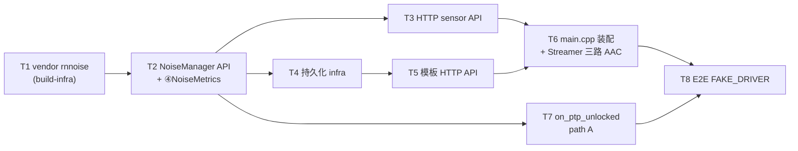

# Noise Spec3 设计文档 - API + 持久化 + 装配 + E2E

> **状态**: 初稿，待审核（未提交）。Spec2 已完成（HEAD `9f29904`），本 spec 继续 `feature/noise` 分支。
> **依据**: `docs/noise/architecture-design.md` §5（HTTP API）/§7（持久化）/§4.4（Streamer 三路）/§3.7（NoiseManager）/§10（步骤 1.9-1.12）+ `docs/noise/denoise-plugin-architecture.md`。
> **前置**: Spec2 冻结接口（NoiseManager/NoiseSensorConfig/DenoiseOutput/NoiseAnalysisResult/NoiseDetectionResult/NoiseType/NoiseTemplateDB）+ Spec2 final review defer 项。

## §A 产出与范围

**Goal**: `WITH_NOISE=ON` 下完成噪声模块的对外 API + 数据持久化 + main.cpp 装配 + 端到端验证，使 daemon 可通过 HTTP 管理 sensor/模板、Streamer 输出三路 AAC、FAKE_DRIVER 跑通全链路 E2E。**Spec3 是 noise Phase 1 的收尾**（1.9-1.12 + 1.8 defer 的 template API/持久化 + Spec2 defer 的 NoiseManager API/path A + build-infra）。

### §A.1 Task 分解（8 个）

| Task | 对应 §10 | 交付 | 验证 |
|------|---------|------|------|
| T1 build-infra | - | FetchContent_Populate -> vendor `3rdparty/rnnoise` submodule + 薄 CMake wrapper（本地 CMake 3.30.5 弃用警告修复） | RNNoise 仍 55.8dB；noise-test 25/25；daemon + --no-noise 零回归；CMake 3.30 无弃用警告 |
| T2 NoiseManager API + ④NoiseMetrics | 1.9a | NoiseManager `remove_sensor`/`enable_sensor`/`set_dry_wet`/`set_param` + ④NoiseMetrics 真聚合（collect ①②③ + noise_reduction_db + is_alerting 基础阈值） | 单测：API 方法；④聚合字段；告警触发 |
| T3 HTTP sensor API | 1.9b | `/api/noise/sensors`、`/api/noise/sensor/:id`（GET/PUT/DELETE）、`/metrics`、`/history`（内存近期 60s 环形）。boost::property_tree JSON（D1）。路由注册 | 集成测试：HTTP 响应；CRUD 往返；metrics/history 返回 |
| T4 持久化 infra | 1.10 | `noise_status.json`（sensors）+ `noise_templates/`（templates.json + WAV）+ Config 三字段（`noise_status_file`/`noise_template_dir`/`fake_pcm_source`）+ 原子写（tmp+rename）+ 启动加载/变更即写/退出保存。`json.cpp` Config 序列化 | 集成测试：重启恢复 sensors+模板；崩溃无半写；WITH_NOISE=OFF 零残留 |
| T5 模板 HTTP API | 1.8 defer §5.3 | `/api/noise/templates`（GET）、`/template`（POST multipart WAV+label）、`/template/:id`（GET/DELETE/PUT）、`/template/:id/test`、`/template/:id/wav`、`/templates/export`、`/templates/import`。WAV 上传 + Bark 提取（复用 NoiseAnalyzer Bark）+ 经 T4 持久化 | 集成测试：模板录入+匹配+删除+回听+导入导出 |
| T6 main.cpp 装配 + Streamer 三路 AAC | 1.11 | main.cpp 注入 `PcmCaptureService::create` + `NoiseSessionManagerBridge` + `NoiseManager` + 注册 `/api/noise/*` 路由 + Streamer 三路 AAC（`/api/streamer/stream/:sinkId` + `/denoised` + `/noise`，AAC）+ `#ifdef _USE_NOISE_` 守卫 | 集成测试：三路 AAC 可访问；buildfake.sh 通过；WITH_NOISE=OFF daemon 行为零变化 |
| T7 on_ptp_unlocked path A | correctness | 真实 `plugin->reset()` after PcmCaptureService join（arch §3.7 L862 path A）。替换 Spec2 的 `std::async` 延迟清标志 stub。PcmCaptureService PTP unlock 时 `snd_pcm_drop`+`close`+join capture 线程 -> NoiseManager reset plugins | 单测：PTP unlock -> capture 线程静止 -> plugin reset 调用；无与 process 竞态 |
| T8 E2E FAKE_DRIVER | 1.12 | `FAKE_DRIVER=ON -DWITH_NOISE=ON` 启动 daemon，`fake_pcm_source` 喂含噪 WAV（白噪+语音），断言 `/api/noise/sensor/0` 返回 `noise_type=white`、`/api/streamer/stream/0/denoised` 返回非空 AAC。全链路 fake_capture_loop->PcmCaptureService->Bridge->AudioCapture->NoiseManager->①②③④->metrics->HTTP | E2E 通过；全链路无丢帧 |

### §A.2 显式 out-of-scope（留 Phase 2/3）

- **Phase 2**: SSE 实时推送（§5.1 `/denoised`/`/noise` SSE base64 PCM，2.3）、完整告警引擎（可配置阈值+级别+去抖+历史+SSE，2.4）、RefComparator 参考比对（2.1）、持久化健壮性（损坏降级+并发写安全+WAV 索引一致性，2.2）。
- **Phase 3**: 入口重采样（3.1，48kHz-only 限制）、DTLN/DeepFilterNet 插件+自定义 RNNoise 模型（3.2）、L3 ML 分类（3.3）、降噪回注 ALSA（3.4）、指标历史长期持久化+时序查询（3.5，区别于 1.9 内存近期 /history）、多 Sink 并行+CPU 过载降级+RT heap allocs pre-alloc（3.6）。
- **Streamer PCM 直通**（§5.2 `?format=pcm`）留 Phase 2（arch 1.11 = AAC only）。

## §B 设计决策

- **D-S3.1 单 Spec3，8 task**（用户确认）：与 Spec2 同构（7 task 一 spec），subagent-driven 执行，spec/plan 一次写一次审。
- **D-S3.2 FetchContent->vendor submodule 并入 T1**（用户确认）：本地 CMake 3.30.5 已触发 `FetchContent_Populate` 弃用警告。改 vendor `3rdparty/rnnoise` submodule（pin `70f1d256`）+ 薄 CMakeLists.txt wrapper（手动 add_library 编译 .c 源码，保留 Spec2 Task4 验证过的源码列表）。58MB model tarball 一并处理（随 submodule 或独立缓存，CI 缓存）。
- **D-S3.3 on_ptp_unlocked path A 并入 T7**（用户确认）：Spec2 用 `std::async` 延迟清 `reset_pending_` 是 stub。Spec3 实装 arch §3.7 L862 单 path A：PcmCaptureService PTP unlock 时 `snd_pcm_drop`+`snd_pcm_close` 中断阻塞读 + join capture 线程 -> capture 静止后控制线程 `plugin->reset()` + 清 `reset_pending_`。不设 path B（housekeeper 确认无 process 在飞，arch L862 论证 SCHED_OTHER 下或 livelock 或与停滞 process 竞态）。
- **D-S3.4 SSE + 完整告警引擎 = Phase 2**（arch §10 2.3/2.4）：Spec3 ④NoiseMetrics 只做基础 `is_alerting`（per-sensor `alert_threshold_dbfs`，`noise_level_dbfs > threshold` OR `hum_strength_db > threshold` 触发）。可配置阈值+级别+去抖+历史+SSE 留 Phase 2.4。
- **D-S3.5 /history = 内存近期环形**：60s 窗口、1s 间隔的 in-memory ring（arch §5.1 `?duration=60&interval=1`）。**非** Phase 3.5 长期持久化时序存储。
- **D-S3.6 JSON = boost::property_tree**（arch §11.1 D1）：与 daemon `config.cpp`/`json.cpp` 既有模式一致（Boost 已 REQUIRED），照搬 ptree 数组遍历。不引入 nlohmann（避免单一二进制并存两套 JSON 库）。
- **D-S3.7 模板 API + 持久化从 1.8 defer 捡回**（Spec2 决策1）：Spec2 Task6 只做内存 TemplateDB。Spec3 T4（持久化 infra）+ T5（模板 HTTP API §5.3）补齐。T5 复用 NoiseAnalyzer 的 Bark 提取（§3.3.3）做 WAV -> 32 维特征。
- **D-S3.8 Streamer 三路 = AAC only**（arch 1.11）：`/api/streamer/stream/:sinkId` + `/denoised` + `/noise`（AAC，`Accept: audio/aac` 默认）。PCM 直通（`?format=pcm`）留 Phase 2。降噪/噪声流仅在该 Sink 已启用 noise sensor 且 denoise 开启时可用，否则 404（arch §5.2）。
- **D-S3.9 ④NoiseMetrics 聚合**：`collect(①DenoiseResult, ②NoiseDetectionResult, ③NoiseAnalysisResult)` 合并为 per-sensor `NoiseMetricsSnapshot`（noise_reduction_db from ①、is_noisy/estimated_snr_db from ②、noise_type/primary_confidence/candidates/is_mixed/band_energy from ③ + noise_level_dbfs/spectral_centroid_hz/spectral_flatness/hum_strength_db）。`is_alerting` 基础判定（D-S3.4）。`/api/noise/sensor/:id/metrics` 返回此快照。
- **D-S3.10 E2E(1.12) 用 fake_pcm_source WAV**（Config 字段，T4 加）：合成白噪+语音 WAV，喂 fake_capture_loop，断言 `noise_type=white` + `/api/streamer/stream/0/denoised` 非空 AAC。作为 noise-test 或 daemon-test 的 test_case（FAKE_DRIVER）。
- **D-S3.11 RT heap allocs 留 Phase 3.6**：NoiseDetector/NoiseAnalyzer per-call `std::vector`（Spec2 final review Minor）Phase 1 单线程可接受，Phase 3 RT 并行时 pre-alloc `std::array` 成员。Spec3 不动。
- **D-S3.12 HTTP 路由注册**：照搬 daemon `http_server.cpp` 既有 `/api/*` 路由模式（`svr->Get/Post/Delete` + lambda handler + JSON body parse）。noise 路由在 `#ifdef _USE_NOISE_` 内注册（T6 main.cpp 装配时），或 noise 模块自带 `register_noise_routes(http_server&, noise_manager&)` 函数。

## §C 对外稳定接口契约（Phase 1 收尾冻结）

Spec3 是 noise Phase 1 最后一个 spec，冻结对外契约（后续 Phase 2/3 不破坏）：

- **HTTP API**（§5）：`/api/noise/sensors`（GET）、`/api/noise/sensor/:id`（GET/PUT/DELETE）、`/api/noise/sensor/:id/metrics`（GET）、`/api/noise/sensor/:id/history`（GET）、`/api/noise/templates`（GET）、`/api/noise/template`（POST）、`/api/noise/template/:id`（GET/PUT/DELETE）、`/api/noise/template/:id/test`（POST）、`/api/noise/template/:id/wav`（GET）、`/api/noise/templates/export`（GET）、`/api/noise/templates/import`（POST）。Streamer 三路 AAC：`/api/streamer/stream/:sinkId` + `/denoised` + `/noise`。
- **JSON 字段约定**（§5.4）：`NoiseType` 小写蛇形（`clean`/`white`/`pink`/`hum_50hz`/...）；`denoise_dry_wet`（非 `denoise_level`）；`noise_type_confidence`（分类置信度）vs `noise_confidence`（检测置信度）；`AnalysisSource`/`ProcessStatus` 仅内部不序列化。
- **持久化格式**：`noise_status.json`（§7.4：sensors 数组 + global）、`noise_templates/templates.json`（§7.5：templates 数组含 bark_spectrum[32] + wav_file）、`noise_templates/*.wav`。
- **Config 字段**（§7.3）：`noise_status_file`（默认 `./noise_status.json`）、`noise_template_dir`（默认 `./noise_templates`）、`fake_pcm_source`（FAKE_DRIVER 专用，默认空）。
- **NoiseManager API**（arch §3.7 L800-812 完整）：`add_sensor`/`remove_sensor`/`enable_sensor`/`switch_plugin`/`set_dry_wet`/`set_param` + `on_frame`/`on_period_begin`/`on_period_end`/`on_ptp_unlocked` + `load_status`/`save_status`/`save_status_on_exit`。

## §D 测试策略

- **TDD**：每个 task 先写失败测试（合成帧 / HTTP 请求 / 持久化往返），再实现。
- **HTTP API 测试**（T3/T5）：用 cpp-httplib 客户端或直接调 http_server handler，断言 JSON 响应字段。FAKE_DRIVER + WITH_NOISE=ON。
- **持久化测试**（T4）：写 -> 重启 load -> 断言恢复；写中途模拟崩溃（tmp 文件残留）-> 断言无半写。
- **Streamer 三路测试**（T6）：`/api/streamer/stream/:sinkId/denoised` 返回非空 AAC（Content-Type `audio/aac`）；denoise 关闭时 404。
- **E2E**（T8）：FAKE_DRIVER daemon + fake_pcm_source WAV -> curl `/api/noise/sensor/0` + `/api/streamer/stream/0/denoised`。
- **零回归**：每个 task `./noise-dev.sh build --no-noise` 通过（WITH_NOISE=OFF 隔离）；T6 main.cpp `#ifdef _USE_NOISE_` 守卫 objdump 验证 daemon 二进制零变化（Spec1 Task5 先例）。

## §E 风险与缓解

- **R-S3.1 main.cpp 装配动公共路径**（T6）：main.cpp 是 daemon 入口，`#ifdef _USE_NOISE_` 守卫须严格，WITH_NOISE=OFF 时二进制零变化（objdump 验证）。PcmCaptureService::create 注入顺序在 session_manager 之后（arch 1.11）。
- **R-S3.2 Streamer 三路重构动既有 AAC 流**（T6）：`/api/streamer/stream/:sinkId`（原始）必须 byte-for-byte 兼容（Spec1 Task5 Streamer #ifdef 先例）。`/denoised`/`/noise` 是新增路径，不影响原始流。
- **R-S3.3 multipart WAV 上传**（T5）：cpp-httplib multipart 解析 + WAV 读取（重采样到 48kHz + Bark 提取）。WAV 格式校验（拒绝非 PCM WAV）。
- **R-S3.4 path A 跨组件时序**（T7）：PcmCaptureService join + NoiseManager reset 的 observer 顺序无保证（arch §3.7 L862 论证：reset 永远在 capture 线程静止后执行，顺序问题消解）。需测试 PTP unlock -> reset 正确触发且无 process 竞态。
- **R-S3.5 vendor submodule**（T1）：`3rdparty/rnnoise` submodule 需 `.gitmodules` + `git submodule update --init`。build.sh/buildfake.sh 同步。submodule 含 58MB model？否--model tarball 仍需下载或 vendor 为 LFS（D-S3.2 一并处理）。
- **R-S3.6 持久化并发**（T4）：control thread 写 + HTTP thread 读。atomic write（tmp+rename）保证文件完整；内存对象用 mutex 或 RCU（NoiseTemplateDB 已无锁 Spec2，Spec3 加 mutex 给 HTTP 访问）。Phase 2.2 加并发写安全。

## §F Task 依赖与执行顺序

T1 先（build-infra）；T2（API+metrics）为 T3/T4/T7 前置；T4 持久化为 T5 前置；T3+T5+T7 汇入 T6（main.cpp 装配）；T8 收尾 E2E。subagent-driven 顺序执行（无并行 implementer，避免 noise_test.cpp/CMakeLists 冲突）。

## §G 依据来源

- arch §5（HTTP API L1195-1314）、§7（持久化 L1538-1648）、§4.4（Streamer 三路）、§3.7（NoiseManager L798-862）、§10（步骤 1.9-1.12 L1953-1956 + Phase 2/3 边界 L1960-1982）。
- denoise-plugin-architecture §4.4（Streamer 三路数据通路）。
- Spec2 spec §A.2（defer 到 Spec3 项）、Spec2 final review（defer 项：remove_sensor 等、path A、FetchContent_Populate、RT heap allocs）。
- arch §11.1 D1（boost::property_tree）、D2（kiss_fft 复用）、D3（VAD 优先级）。
