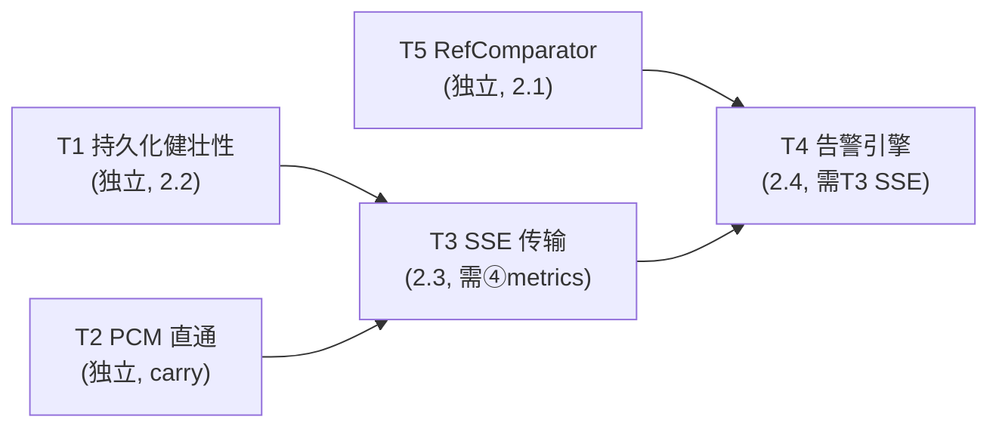

# Noise Spec4 设计文档 - Phase 2：SSE + 告警引擎 + RefComparator + 持久化健壮性 + PCM 直通

> **状态**: 初稿，待审核（未提交）。Spec1/2/3 已完成并合入 master（HEAD `9a3251e`）。本 spec 在 `feature/noise` 分支继续。
> **依据**: `docs/noise/architecture-design.md` §3.5（RefComparator）/§3.6（NoiseMetrics 告警规则表）/§5.1-5.2（HTTP/SSE/PCM 直通）/§6.3.2（RefComparator 线程位置）/§7（持久化）/§11 风险 9/12/14/15/17/20 + `docs/noise/denoise-plugin-architecture.md`（RefComparator 自适应滤波参考）。
> **前置**: Spec3 §C 冻结契约（NoiseManager API / noise_http 路由 / NoiseMetricsSnapshot / 持久化格式 / Config 字段）。

## §A 产出与范围

**Goal**: `WITH_NOISE=ON` 下完成 Phase 2 四步 + Spec3 carry-over 的 Streamer PCM 直通：HTTP SSE 实时推送（指标快照 + 告警事件 + 降噪/噪声 PCM 流）、完整告警规则引擎（可配置阈值 + 三级 + 去抖 + 历史）、RefComparator 主备链路参考音比对、持久化健壮性（损坏降级 + 并发写安全 + WAV/索引一致性）、Streamer 三路 PCM 直通。**所有改动 additive，不破坏 Spec3 §C 冻结契约。**

### §A.1 Task 分解（5 个）

| Task | 对应 §10 | 交付 | 验证 |
|------|---------|------|------|
| T1 持久化健壮性 | 2.2 | `load_status` 损坏降级补全（parse 失败 -> 空配置启动 + 告警，不阻塞 daemon）+ `save_status` 并发写安全（control 写 + HTTP 读 mutex）+ `NoiseTemplateDB::load` WAV/索引一致性（逐条检查 WAV 存在，缺失标记 invalid + 告警，特征向量保留） | 集成测试：损坏文件降级恢复；并发读写无丢失；WAV 缺失告警且模板特征仍可匹配 |
| T2 Streamer PCM 直通 | D-S3.8 carry | 三路 `?format=pcm`（原始/降噪/噪声），`Content-Type: audio/pcm`，16-bit signed LE interleaved，48kHz。跳过 faac。降噪/噪声 PCM 取 `DenoiseOutput`（48k）。denoise 关闭时降噪/噪声路 404 | 集成测试：三路 PCM 可访问；原始路 byte-for-byte 兼容既有 AAC 路的 PCM 等价；WITH_NOISE=OFF 零回归 |
| T3 SSE 传输 | 2.3 | `/api/noise/sensor/:id/metrics/sse`（指标快照 ~1s/event）+ `/api/noise/sensor/:id/denoised`（PCM base64 SSE）+ `/api/noise/sensor/:id/noise`（PCM base64 SSE，arch §5.1 已定义端点）+ `/api/noise/alerts/sse`（告警事件）。cpp-httplib chunked `text/event-stream`。每订阅者 lock-free SPSC 队列，capture 线程 `on_period_end` push（memcpy 快），SSE handler 线程 drain + base64 + write。背压：队列满 drop oldest，不阻塞 RT | 集成测试：SSE 事件到达；PCM base64 解码还原；慢订阅者不阻塞 daemon；多订阅者并发 |
| T4 告警规则引擎 | 2.4 | 替换 Spec3 基础 `is_alerting` 为完整引擎：可配置阈值（per-sensor `alert_threshold_dbfs`/`hum_alert_threshold_db` 已存在 + 新增 `snr_alert_threshold_db`/`ref_similarity_threshold`）+ 三级（Info/Warning/Critical，§3.6 规则表）+ 去抖（sustained N periods 才 raise/clear）+ 告警历史 ring（in-memory，区别 Phase 3.5 长期持久化）+ 经 T3 SSE push。`is_alerting` 字段语义升级（bool "是否告警中"不变，调用方无需改） | 集成测试：阈值触发各级告警；去抖抑制抖动；告警历史可查；SSE 推送告警事件 |
| T5 RefComparator | 2.1 | `NoiseManager::add_ref_comparator(ref_sink, cmp_sink)` + `remove_ref_comparator` + `RefComparator` 类（双路环形缓冲 2×period ~128ms + 时间戳对齐 + MFCC 互相关延时搜索 ≤1ms + NLMS 自适应滤波残差 -> 加性噪声 dB）。`on_frame` 路由 stub 补实（帧写 ring buffer，capture 线程 memcpy 快）。process() 在独立 comparison 线程 drain 对齐对，结果写 `NoiseMetricsSnapshot` 新增 `ref_similarity`/`ref_noise_db`/`ref_delay_ms` 字段。独立于主链路不阻塞。`delay_anomaly` 告警（延时差 >10ms，风险 12/20） | 单元测试：延时估计精度；残差噪声分析；双路缓冲溢出处理；一路暂停恢复重置对齐；结果进 metrics 快照 |

### §A.2 显式 out-of-scope（留 Phase 3 / 后续）

- **Phase 3（spec5/spec6，已定结构）**：spec5 = 3.1 入口重采样 + 3.2 DTLN/DeepFilterNet 插件 + 3.3 L3 ML 分类；spec6 = 3.5 指标历史长期持久化 + 3.6 多 Sink 并行/CPU 降级/RT heap pre-alloc/seqlock。
- **3.4 降噪回注 ALSA 播放**：延后单列（触 LKM，上游拥有区域，fork-maintenance 风险）。
- **SSE WebSocket binary 替代**：arch §5.1 注 Phase 2 考虑，但本 spec 仍用 SSE（base64 PCM）。WebSocket 需 Web UI 同步升级，留后续。
- **告警历史长期持久化**：T4 只做 in-memory ring；长期存储 + 时序查询留 Phase 3.5。
- **RefComparator 自适应滤波器阶数/收敛参数的自动整定**：本 spec 用经验默认值（参考 `噪声比对监测实现说明.docx` 既有算法参数）；自动整定留后续。

## §B 设计决策

- **D-S4.1 SSE 传输机制 = chunked + per-订阅者 SPSC 队列**（arch §5.1 + 风险 9/17）：cpp-httplib `Response::set_chunked_content_provider`，`Content-Type: text/event-stream`。RT 不阻塞--capture 线程在 `on_period_end`（与 denoise swap 同一静止点）将 metrics 快照 / PCM chunk memcpy 进每订阅者的 lock-free SPSC 队列；SSE handler 线程 drain 队列 + base64 编码 + 写 socket。背压：SPSC 满则 drop oldest 事件（计数告警），绝不阻塞 capture 线程。与 Streamer 双缓冲 swap + 消费者线程模式同构（风险 17）。**T3 须先验证 cpp-httplib chunked provider 在长连接下的稳定性**（R-S4.2）。

- **D-S4.2 告警引擎评估时机 = capture 线程 period_end，推送延后**：告警规则评估（阈值比较 + 去抖计数）轻量，在 `on_period_end` ④NoiseMetrics 更新后、同线程评估，产出 `is_alerting` + 级别 + 去抖状态。告警事件入 SPSC 队列由 T3 SSE handler 异步推送，不在 RT 路径做 socket I/O。`is_alerting` 字段语义从 Spec3 "基础阈值 OR" 升级为 "引擎评估结果"，bool 语义不变，调用方无需改（契约兼容）。

- **D-S4.3 RefComparator 线程模型 = ring 写在 capture 线程，process() 在独立 comparison 线程**（风险 9/12 + §6.3.2）：`on_frame` 内按 `sink_id` 路由（Phase 1 stub 已存在）将帧 memcpy 进 RefComparator 双路 ring buffer（快，不计入 RT 重活）。`process()`（MFCC + NLMS + 延时搜索，~2s 窗）在 NoiseManager 持有的独立 comparison 线程 drain 对齐对后执行，结果写 `NoiseMetricsSnapshot.ref_*`。**绝不在 capture 线程内联 process()**--MFCC/NLMS 成本非确定性，威胁 xrun。comparison 线程 = SCHED_OTHER，与 housekeeper 同级。结果经 mutex 写入 snapshot（低频，~每 2s 一次，可接受）。

- **D-S4.4 RefComparator 对齐与漂移**（风险 12/20）：双路 ring buffer 容量 2×period 样本（~128ms @48k）；时间戳对齐按 PTP 帧序号换算（同一 PTP 域，对齐精度 <1ms，与既有算法 MFCC 互相关一致）；延时差 >10ms 置 `delay_anomaly=true` 上报告警但不丢数据；一路暂停后恢复（ring 溢出/超时）重置对齐状态，要求两路都活跃后重做完整 MFCC 互相关搜索。滑动窗口 ~2s 输出 `RefCompareResult{delay_ms, similarity, noise_db, channel_distortion}`。

- **D-S4.5 SSE 端点集**（arch §5.1 + 新增）：`/denoised`、`/noise` PCM base64 SSE 是 arch §5.1 已定义端点（Spec3 未实现，本 T3 落地）；新增 `/api/noise/sensor/:id/metrics/sse`（指标快照）+ `/api/noise/alerts/sse`（告警事件，T4 用）。metrics SSE ~1s/event（复用 `kHistorySampleIntervalFrames` 节拍）；PCM SSE 每 period 一 chunk。

- **D-S4.6 PCM 直通 = 48k-only，统一三路（WITH_NOISE=ON-only）**（arch §5.2 + 风险 1）：三路 `?format=pcm` 统一经 `DenoiseOutput`（48k）取帧--原始路取 `DenoiseOutput.original`、降噪路取 `denoised`、噪声路取 `noise`（arch §3.4 L649 统一三路接口）。Phase 1 的 48kHz 限制延续至 PCM 直通；非原生 48kHz 的回采留 Phase 3.1（resampler.hpp）。因统一经 `DenoiseOutput`（依赖 `noise_manager_` 与已注册 sensor），**三路 PCM 直通均为 WITH_NOISE=ON-only**（PCM 直通作为 noise 特性）；WITH_NOISE=OFF 时原始路 `?format=pcm` 走既有 AAC 默认路径（query 被忽略，不回归），denoised/noise 路 WITH_NOISE=OFF 时不编译。AAC 默认路径（无 `?format=pcm`）byte-for-byte 不变（D-S4.8）。

- **D-S4.7 持久化健壮性 = 补全既有降级 + 新增一致性**：`load_status` 已有 `json_parser_error`/`std::exception` catch（noise_manager.cpp:601-606）并日志，T1 补全"parse 失败后以空配置继续启动不阻塞"的显式语义 + 单测覆盖；`save_status` 加 mutex（control 写 + HTTP 经 `get_metrics_snapshot` 读已 RCU/mutex，持久化写需独立锁防与变更即写并发）；`NoiseTemplateDB::load` 逐条检查 WAV 文件存在（风险 15），缺失标记 `wav_available=false` + 告警，bark 特征向量保留可匹配，仅回听不可用。

- **D-S4.8 契约 additive，不破坏 Spec3 §C**：`add_ref_comparator`/`remove_ref_comparator` 是 NoiseManager 新增方法；`ref_similarity`/`ref_noise_db`/`ref_delay_ms` 是 NoiseMetricsSnapshot 新增字段（arch §3.6 已设计，Spec2/3 未实现，本 T5 落地）；SSE/PCM 路由全新增；告警引擎扩展现有 `is_alerting` 语义（bool 不变）。既有路由/字段语义零变化。

- **D-S4.9 JSON 仍 boost::property_tree**（Spec3 D-S3.6 / arch D1）：SSE 事件 JSON、告警配置 JSON、RefComparator 配置序列化均照搬 daemon 既有 ptree 模式 + 手写 `escape_json`（noise_status.hpp 既有），不引入新库。

- **D-S4.10 顺序执行，无并行 implementer**（同 Spec3）：5 task 串行 subagent-driven，避免 noise_http.cpp/noise_metrics.hpp/CMakeLists 冲突。

## §C 对外接口契约（Phase 2 additive 增量）

本 spec 是 Phase 2 第一个 spec，**增量冻结**以下契约（后续 Phase 3 不破坏）：

- **新增 HTTP 路由**（§5.1 + 新）：`/api/noise/sensor/:id/metrics/sse`（GET SSE）、`/api/noise/sensor/:id/denoised`（GET SSE PCM）、`/api/noise/sensor/:id/noise`（GET SSE PCM）、`/api/noise/alerts/sse`（GET SSE）。Streamer 三路 `?format=pcm`（`/api/streamer/stream/:sinkId[/:fileId][/denoised|/noise]?format=pcm`，`audio/pcm`）。
- **新增 NoiseManager API**：`add_ref_comparator(uint8_t ref_sink, uint8_t cmp_sink) -> uint8_t comparator_id`、`remove_ref_comparator(uint8_t comparator_id) -> bool`、`list_ref_comparators() -> vector<RefComparatorInfo>`。
- **新增 NoiseMetricsSnapshot 字段**：`ref_similarity{0.0f}`、`ref_noise_db{-100.0f}`、`ref_delay_ms{0.0f}`（T5 落地，未配置 RefComparator 时保持默认/未评估）。
- **新增告警配置字段**（sensor 配置）：`snr_alert_threshold_db{10.0f}`、`ref_similarity_threshold{0.8f}`、`alert_debounce_periods{3}`。既有 `alert_threshold_dbfs`/`hum_alert_threshold_db` 复用。`is_alerting` bool 语义升级（D-S4.2）。
- **新增告警事件 JSON**（SSE + `/api/noise/alerts` 查询）：`{sensor_id, level: "info|warning|critical", rule, message, raised_at_ms, is_active}`。
- **持久化格式增量**：`noise_status.json` sensors 项加 `ref_comparators` 数组（`{id, ref_sink, cmp_sink}`）；告警历史 in-memory only（Phase 3.5 才持久化）。`templates.json` 项加 `wav_available: bool`。

## §D 测试策略

- **TDD**：每个 task 先写失败测试（损坏文件 / SSE 客户端 / 告警触发 / 双路帧对齐 / PCM 解码），再实现。
- **T1 持久化**：写损坏 `noise_status.json` -> daemon 启动降级空配置 + 日志告警；并发 `save_status` + `get_metrics_snapshot` 无数据竞争（ThreadSanitizer）；`NoiseTemplateDB::load` 缺失 WAV -> `wav_available=false` + 特征仍可匹配。
- **T2 PCM 直通**：curl `?format=pcm` 三路，断言 `Content-Type: audio/pcm` + 16-bit LE + 解码回 float 等价 `DenoiseOutput`；原始路与既有 AAC 路的 PCM 等价；denoise 关闭降噪/噪声路 404。
- **T3 SSE**：cpp-httplib 客户端或 `EventSource` 等价，断言事件到达（metrics ~1s、PCM 每 period、告警事件）；慢订阅者（不 drain）-> daemon 不阻塞（drop oldest 计数）；多订阅者并发互不串扰。
- **T4 告警**：合成帧触发各级（noise_level > -20 Critical / > -30 Warning；SNR < 10；hum > -40 Info；ref_similarity < 0.8 需 T5）；去抖（持续 N period 才 raise，恢复才 clear）；告警历史 ring 查询；SSE 收到告警事件。
- **T5 RefComparator**：合成双路帧（已知延时 + 加性噪声）-> 断言 `delay_ms` 精度 ≤1ms、`noise_db` 估计合理、`similarity` 区间；一路暂停恢复 -> 重置对齐 + `delay_anomaly` 告警；ring 溢出 drop oldest + 计数；结果进 `get_metrics_snapshot` 的 `ref_*`。
- **零回归**：每 task `./noise-dev.sh build` + `--no-noise` 通过（WITH_NOISE=OFF 隔离）；T2/T3 动 Streamer/http 路由，`#ifdef _USE_NOISE_` 守卫 + objdump 验证 daemon 二进制零变化（WITH_NOISE=OFF）。noise-test + daemon-test 全绿。

## §E 风险与缓解

- **R-S4.1 RefComparator 算法实现量**（风险 4）：MFCC + NLMS + 互相关延时搜索是成熟算法但 C++ 实现量大。缓解：参考 `噪声比对监测实现说明.docx` 既有产品算法参数；先以简化版（固定阶数 NLMS + 粗粒度延时搜索）跑通端到端，再迭代精度。MFCC 复用 NoiseAnalyzer 既有 Bark/FFT 基础设施（kiss_fft，D2）。
- **R-S4.2 cpp-httplib chunked SSE 稳定性**（D-S4.1）：长连接 chunked provider 在慢客户端/断连下的行为需验证。缓解：T3 先写最小 SSE echo 验证 chunked provider + 客户端断连清理（handler 退出即 stop drain）；背压 drop oldest 保证 daemon 不阻塞。
- **R-S4.3 SSE base64 PCM 带宽**（arch §5.1）：~260 KB/s/路，多路并发带宽显著。缓解：本 spec 接受（SSE 实现简单 + 浏览器原生 EventSource）；多路监听限并发订阅数；WebSocket 留后续。
- **R-S4.4 告警引擎动 NoiseMetrics period 路径**（T4）：在 `on_period_end` 评估告警，与 denoise swap/metrics collect 同点。缓解：评估轻量（比较 + 计数），无 socket I/O（推送经 SPSC 队列）；单测验证不增加 period 预算。
- **R-S4.5 RefComparator 跨 Sink 帧时序**（风险 12/20）：两路 Sink 帧回调时机/帧数可能不同。缓解：双路 ring buffer + 时间戳对齐 + delay_anomaly 检测 + 暂停恢复重置；单测覆盖一路静默场景。
- **R-S4.6 T2 PCM 直通动 Streamer 公共路径**（D-S4.6）：原始 AAC 路 byte-for-byte 兼容是硬约束。缓解：`?format=pcm` 是 query 参数分支，不改 AAC 默认路径；objdump + 既有 Streamer 回归测试。
- **R-S4.7 comparison 线程生命周期**（D-S4.3）：独立线程的启停须与 PTP unlock/capture join 联动（避免 capture 静止后 comparison 线程仍访问 ring buffer）。缓解：comparison 线程在 `on_ptp_unlocked`/`on_capture_thread_joined` 暂停 drain，`on_ptp_locked` 恢复；析构时 join。

## §F Task 依赖与执行顺序

**顺序**：T1 -> T2 -> T5 -> T3 -> T4（subagent-driven 串行）。
- T1/T2 独立、低风险先行，落地可复用基建。
- T5 RefComparator 在 T3 前：其结果字段 `ref_*` 先就位，T4 告警引擎可直接纳入 `ref_similarity < 0.8` 规则（§3.6 规则表），避免 T4 后补。
- T3 SSE 传输先于 T4 告警引擎：SSE 是传输层，告警引擎是生产者，引擎产出的告警事件经 SSE 推送。
- T4 最后：可读取全部 snapshot 字段（含 T5 的 `ref_*`）评估，产出告警事件经 T3 SSE 推送。

> T5 的 comparison 线程与 PTP 联动（R-S4.7）复用 Spec3 path A 的 `on_ptp_unlocked`/`on_capture_thread_joined` 既有钩子，不新增 PTP observer。
