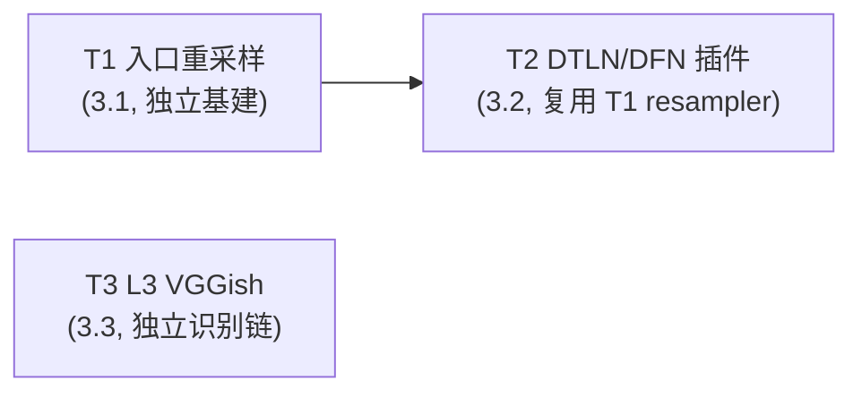

# Noise Spec5 设计文档 - Phase 3：入口重采样 + 多降噪插件 + L3 ML 分类

> **状态**: 初稿，待审核（未提交）。Spec1/2/3/4 已完成并合入 master（HEAD `b7dd4f9`）。本 spec 在 `feature/noise` 分支继续。
> **依据**: `docs/noise/architecture-design.md` §3.4（DenoiseProcessor）/§3.3（NoiseAnalyzer L3）/§11 风险 1（重采样）+ `docs/noise/denoise-plugin-architecture.md` v0.2（DTLN/DFN adapter §2-§5/§9）+ `docs/noise/noise-identification-research.md` v0.1（L3 ML 路线 C §4/§10）。
> **前置**: Spec4 §C 增量契约（additive 不破坏）+ IDenoisePlugin 接口（Spec2 冻结）+ DenoisePluginRegistry（Spec2）。

## §A 产出与范围

**Goal**: `WITH_NOISE=ON` 下完成 Phase 3 的三步：①入口重采样（native↔48k，解除 Phase 1 的 48kHz 限制）；②DTLN + DeepFilterNet 降噪插件适配器（ONNX Runtime 统一后端）+ 自定义 RNNoise 模型加载；③L3 ML 噪声分类（VGGish 嵌入）。**所有改动 additive，不破坏 Spec4 §C 增量契约。**

### §A.1 Task 分解（3 个）

| Task | 对应 §10 | 交付 | 验证 |
|------|---------|------|------|
| T1 入口重采样 | 3.1 | `noise/resampler.hpp/cpp`（SpeexDSP，native↔48k 双向）+ AudioCapture 入口调用（原生采样率非 48k 时启用）+ PcmCaptureService 保持原生分发。解 Phase 1 48kHz 限制（44.1k/96k 可运行） | 单测：44.1k/96k 重采样精度（SNR > 60dB）；E2E：96k daemon + RNNoise 降噪正常 |
| T2 DTLN + DFN 插件 + 自定义 RNNoise 模型 | 3.2 | `model-adapters/dtln/`（双 ONNX 模型串联 + LSTM 状态跨帧 + 48k↔16k 重采样 + overlap-add hop=128/frame=512）+ `model-adapters/deepfilternet/`（三子图 enc/df_dec/erb_dec ONNX 编排 + STFT + df_lookahead=2）+ RnnoiseAdapter 支持 `model_path` 自定义模型 + DenoisePluginRegistry 注册 + ONNX 推理失败降级协议（§9.2）+ WebRTC VAD 补缺（DTLN/DFN 无 VAD） | 单测：各插件降噪量 > 8dB；A/B 对比实验；RT 不抛异常（try/catch 降级）；ONNX 析构延迟到 housekeeper |
| T3 L3 ML 分类（VGGish） | 3.3 | `noise/ml_classifier.hpp/cpp`（VGGish ONNX 嵌入 128 维 + kNN/余弦相似度检索模板库）+ NoiseAnalyzer L3 层（L1 规则式 + L2 模板匹配未识别时调 L3）+ 模板库存储 VGGish 嵌入（区别于 L2 的 Bark 频谱）+ HTTP API（`/api/noise/template` 录入支持 `feature_type: bark|vggish`） | 单测：已知噪声 VGGish 嵌入匹配；L1+L2 未识别触发 L3；嵌入检索精度 |

### §A.2 显式 out-of-scope（留 spec6 / 后续）

- **spec6（已定结构）**：3.5 指标历史长期持久化 + 时序查询 + 3.6 多 Sink 并行（per-sink 线程池）+ CPU 过载降级 + RT heap pre-alloc（`std::array`）+ mutex->seqlock 无锁 RT。
- **3.4 降噪回注 ALSA 播放**：延后单列（触 LKM，上游拥有区域，fork-maintenance 风险）。
- **完整 L3 分类模型**：T3 仅做 VGGish 嵌入 + 检索，不做 PANNs/YAMNet 527 类直接分类（identification §10 决策5 选 VGGish 嵌入最灵活，分类逻辑在嵌入之上做 kNN）。
- **DFN Rust libDF 路径**：不实现（denoise-plugin §10 决策2 选 ONNX 统一后端，规避 Rust 工具链）。
- **DTLN 音乐场景**：DTLN 原生 16kHz 带宽不足（denoise-plugin §5），音乐场景禁用 DTLN（文档化，不强制）。
- **ONNX Runtime GPU 加速**：仅 CPU EP（嵌入式/服务器通用），GPU/ TensorRT 留后续。

## §B 设计决策

- **D-S5.1 ONNX Runtime 统一后端**（denoise-plugin §10 决策2）：DTLN + DFN 均走 ONNX Runtime（C++ API）。单一 ONNX 依赖，规避 Rust 工具链（libDF）。`Ort::Env` 进程级单例（main() 生命周期，析构晚于所有 Session）；per-sensor adapter 独占 Session（仅 capture 线程调 Run()，无并发）；Session 析构延迟到 housekeeper 静止点（denoise-plugin §9.1）。
- **D-S5.2 重采样 = SpeexDSP**（denoise-plugin §10 决策3）：`noise/resampler.hpp` 封装 speex_resampler（低延迟、嵌入式友好）。两层重采样：①入口 native↔48k（T1，AudioCapture，解 Phase 1 限制）②DTLN 内 48k↔16k（T2，DTLN 原生 16k）。DFN 原生 48k 无需重采样。
- **D-S5.3 DTLN adapter**（denoise-plugin §3.2）：双 ONNX 模型串联（model_1 幅度谱掩蔽 + model_2 时域增强），LSTM 状态跨帧传递（两状态张量存下帧喂回），hop=128 < frame=512 overlap-add。model_2 路径从 model_1 推导（同目录，文件名 `_1`->`_2`），不在 PluginConfig 加 model_path_model2 字段。原生 16k，48k 输入需 48k↔16k 重采样（复用 T1 resampler）。
- **D-S5.4 DFN adapter**（denoise-plugin §3.3）：三子图 ONNX 编排（enc/df_dec/erb_dec），hop=480，STFT + df_lookahead=2（缓冲 2 未来 hop），postfilter 可选（PluginConfig params）。原生 48k 全频带，无需重采样。lsnr 输出复用为 SNR 估计（DenoiseResult.estimated_snr_db）。
- **D-S5.5 ONNX 推理失败降级**（denoise-plugin §9.2）：adapter RT 线程 process() 绝不抛异常（所有 Run() try/catch）。单帧失败 -> memcpy 直通 + `DenoiseResult.status=kBypass`；连续 N=10 帧降级 -> `kError`，NoiseManager 切 PassthroughPlugin + HTTP 告警（复用 Spec4 告警引擎）。数值清洗（NaN/Inf 替换 0，能量突增 >100× 直通）。
- **D-S5.6 WebRTC VAD 补缺**（denoise-plugin §10 决策4）：DTLN/DFN 无 VAD。复用 Spec2 NoiseDetector 的 WebRTC VAD（已有），不依赖降噪插件产出 VAD。DFN 的 lsnr 复用为 SNR（D-S5.4）。分析源选择（arch §3.3.1）不变：降噪开启 -> 噪声 PCM + VAD；降噪关闭 -> 原始 PCM + VAD。
- **D-S5.7 自定义 RNNoise 模型**（arch 附录 A）：RnnoiseAdapter 支持 `PluginConfig.model_path` 非空时 `rnnoise_model_from_filename` 加载自定义 .bin 模型（空=默认模型）。既有 Spec2 RnnoiseAdapter 加 model_path 支持。
- **D-S5.8 L3 VGGish 嵌入 + kNN 检索**（identification §10 决策5）：VGGish ONNX（0.96s log-mel 输入 -> 128 维嵌入）。L3 层在 L1 规则式 + L2 模板匹配**均未识别**（置信度低）时触发：提取 VGGish 嵌入 -> kNN/余弦相似度检索模板库（存 VGGish 嵌入的模板）-> 返回最佳匹配类型 + 相似度。模板库区分 Bark（L2）与 VGGish（L3）特征。
- **D-S5.9 准热切换**（denoise-plugin §10 决策5）：插件切换走准热切换（静音过渡，Spec2 既有 DenoiseProcessor::switch_plugin 实现）。无缝 crossfade 留后续（实时直播监听再升级）。
- **D-S5.10 契约 additive**：新增 resampler/adapter/ml_classifier 文件 + DenoisePluginRegistry 注册 dtln/deepfilternet + NoiseAnalyzer L3 层 + 模板 API 增 `feature_type`。既有 IDenoisePlugin 接口 / Spec4 §C 增量契约不破坏。RnnoiseAdapter 加 model_path 是向后兼容（空=默认）。
- **D-S5.11 依赖引入**（arch §11 风险1 + fork-maintenance）：`debian-packages.sh` 加 `libonnxruntime-dev`（或 vendored ONNX Runtime）+ `libspeexdsp-dev`。`LICENSE_NOTICES.MD` 更新（ONNX Runtime MIT、SpeexDSP BSD）。WITH_NOISE=OFF 时这些依赖不引入（additive，上游 sync 友好）。
- **D-S5.12 顺序执行，无并行 implementer**（同 Spec3/4）：3 task 串行 subagent-driven，避免 CMakeLists/noise_manager/CMake 冲突。

## §C 对外接口契约（Phase 3 additive 增量）

- **新增 DenoisePluginRegistry 注册**：`dtln`、`deepfilternet`（`create("dtln")` / `create("deepfilternet")`）。RnnoiseAdapter 支持 `model_path`。
- **新增 Config 字段**（additive）：`onnx_model_dir`（ONNX 模型目录，默认 `./noise_models`）、`ml_model_path`（VGGish 模型路径）。既有 `noise_*` 字段不变。
- **新增 HTTP API**：`/api/noise/template` POST 支持 `feature_type: "bark"|"vggish"`（L2 vs L3 模板）。`/api/noise/sensor/:id` 响应增 `noise_type_source: "l1"|"l2"|"l3"`（识别层级，可追溯）。既有路由/字段不变。
- **新增 NoiseAnalyzer L3 层**：`analyze()` 在 L1+L2 未识别（primary_confidence < 阈值）时调 `ml_classifier_->classify(pcm)`，合并 L3 结果。NoiseAnalysisResult 增 `l3_match_type` + `l3_similarity`（additive，默认空/0）。
- **入口重采样**：`AudioCapture` 在 native≠48k 时用 `Resampler` 转 48k 再分发下游；PcmCaptureService 保持原生分发（arch §11 风险1）。Streamer 降噪/噪声 PCM 为 48k，非原生时回采到原生喂 faac。
- **持久化增量**：`noise_status.json` sensors 项 `plugin` 支持 `dtln`/`deepfilternet`（既有 `rnnoise`/`passthrough`）。模板库 templates.json 增 `feature_type` 字段（默认 bark 向后兼容）。

## §D 测试策略

- **TDD**：每 task 先写失败测试（重采样精度 / ONNX 降噪量 / VGGish 嵌入匹配），再实现。
- **T1 重采样**：合成 44.1k/96k 正弦+噪声 -> Resampler 转 48k -> 断言 SNR > 60dB（与参考重采样对比）。E2E：96k daemon.conf + fake_pcm_source 96k WAV + RNNoise 降噪正常（noise_level_dbfs 合理）。
- **T2 插件**：各 adapter 单测降噪量（DTLN 语音场景 > 8dB、DFN 非平稳噪声 > 8dB）；ONNX 失败注入（mock Session Run 抛异常）-> 降级 kError + 切 Passthrough；A/B 对比实验（DTLN vs RNNoise vs DFN 同测试集）。RT 不抛异常验证。
- **T3 ML 分类**：VGGish 嵌入已知噪声（白噪/键盘声）匹配；L1+L2 未识别场景触发 L3；嵌入检索精度（k=5 最近邻）。`feature_type=vggish` 模板录入 + 检索往返。
- **零回归**：每 task `./noise-dev.sh build --no-noise` 通过（WITH_NOISE=OFF 不引入 ONNX/SpeexDSP）；objdump 验证 daemon 二进制零变化。noise-test + daemon-test 全绿。

## §E 风险与缓解

- **R-S5.1 ONNX Runtime 构建依赖重**：引入 libonnxruntime-dev 或 vendored。缓解：debian-packages.sh 加 + CMake find_package(ONNXRuntime) 或 vendored 路径；WITH_NOISE=OFF 不引入；CI 缓存模型文件（DTLN/DFN/VGGish 模型 tarball）。模型文件不进 git（LFS 或下载脚本）。
- **R-S5.2 ONNX RT 线程安全**（denoise-plugin §9.1）：Env 单例 + per-sensor Session 独占 + 析构延迟。缓解：RcuPtr retire 队列回收旧 Session（Spec2 既有），housekeeper 控制线程析构。
- **R-S5.3 DTLN/DFN 算法实现量大**：DTLN 双模型编排 + DFN 三子图 STFT 编排复杂。缓解：参考 denoise-plugin §3.2/§3.3 详细设计 + 仓库 `real_time_processing_onnx.py` / `libDF`；先跑通端到端再迭代精度。DFN 可先用简化版（跳 postfilter）。
- **R-S5.4 重采样延迟**（denoise-plugin §5）：DTLN 16k↔48k 引入 ~1-2ms。缓解：计入 `algorithmic_latency_samples()`；入口 48k↔native 延迟 <<1ms。
- **R-S5.5 L3 触发频率与成本**：VGGish 推理 ~ms 级。缓解：L3 仅在 L1+L2 未识别时触发（低频），非每帧。嵌入缓存。
- **R-S5.6 模型许可合规**：ONNX Runtime (MIT)、SpeexDSP (BSD)、VGGish (Apache-2.0)、DTLN/DFN 模型（各自许可）。缓解：LICENSE_NOTICES.MD 更新 + 模型来源记录。
- **R-S5.7 upstream sync 友好**（fork-maintenance）：ONNX/Speex 依赖在 WITH_NOISE=OFF 时不引入；新文件在 daemon/noise/ additive；debian-packages.sh + CMake 选项隔离。上游拥有的 daemon/*.cpp 用 #ifdef _USE_NOISE_ 守卫（T2 Streamer PCM 已先例）。

## §F Task 依赖与执行顺序

**顺序**：T1 -> T2 -> T3（subagent-driven 串行）。
- T1 先：resampler.hpp 是 T2 DTLN 48k↔16k 的基建（D-S5.3 复用）。
- T2 次：降噪插件是核心功能，DTLN 内重采样复用 T1。
- T3 最后：L3 ML 分类独立于降噪链，复用 T1 重采样后的 48k PCM。

> T1 的 resampler 须设计为可复用（既支持 native↔48k 也支持 48k↔16k，参数化采样率对），T2 DTLN 直接调。
